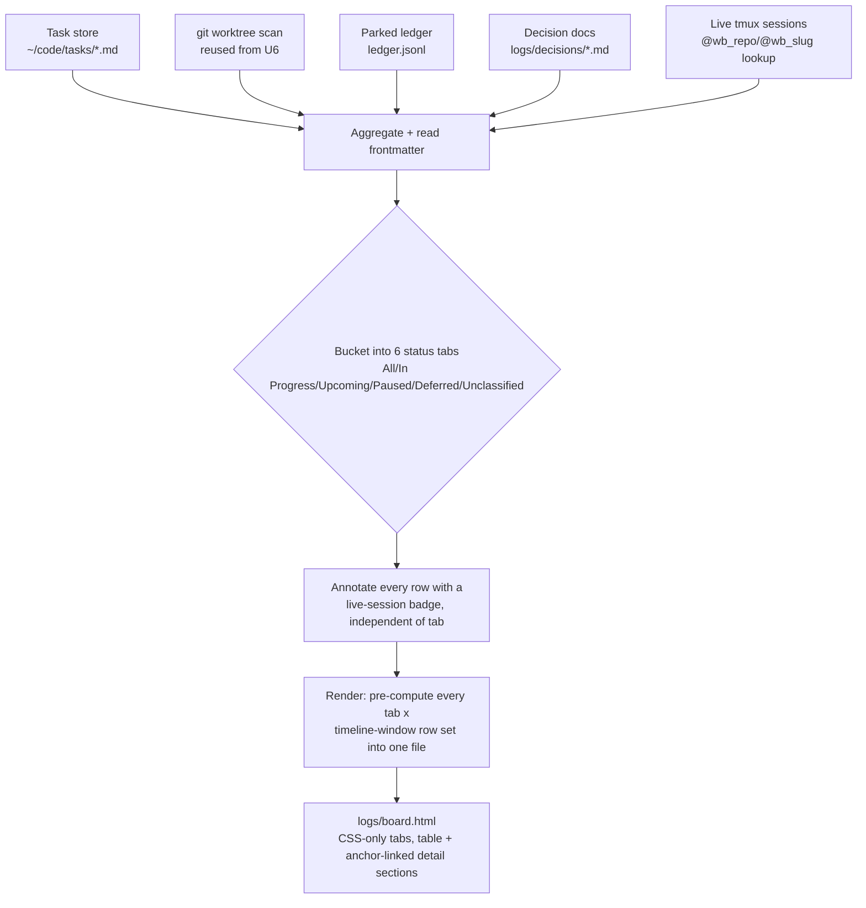
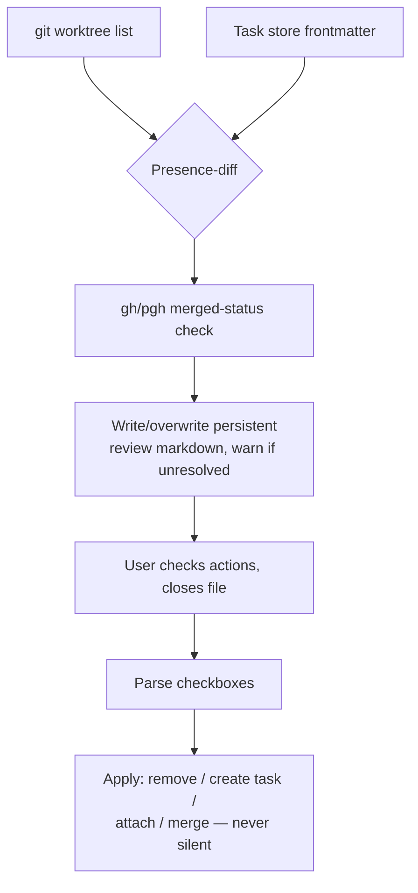

# wb workbench extensions: wb resume, wb pause, /board, wb reconcile

## Summary

PR #1 for the personal workbench: four features extending
`scripts/.config/scripts/tmux/wb.sh`, all fully scoped via decision-buffer
rounds this session. This plan translates already-ratified design into
sequenced, testable Implementation Units — no product behavior is invented
here.

## Problem Frame

The workbench (`wb`) covers task creation, the live picker, and wind-down,
but four gaps remain: no way to bring a task's environment back after a
crash/reboot without retyping `<repo> <slug>` (`wb resume`); no way to
mark a task inactive without destroying its worktree (`wb pause`); no
single view of live + deferred + parked work beyond the interim
plain-text `wb board` (`/board`); and no detection when the task store
silently drifts from actual git state (`wb reconcile`). All four were
scoped this session via decision-buffer rounds, grounded in real evidence
(a drift scan of `be--monorepo` found 4 orphaned worktrees, one a likely
duplicate).

---

## Requirements

**Schema (foundation for wb pause and /board):**
- R1. The task-store status enum includes `paused` alongside
  `planned | doing | review | done`, documented in the schema.
- R2. A task's frontmatter gains a `closed:` field, stamped with the
  current date the moment its status flips to `done`.

**`wb pause`:**
- R3. `wb pause [<session>]` flips a task's status to `paused` without
  removing its worktree and without killing its tmux session (mirrors `wb
  done`'s session resolution, skips teardown and skips the session kill).
- R4. The picker gains a keybind (`p`) that pauses the selected task row.
- R5. `wb done` also stops killing the tmux session on wind-down — a
  direct instruction ("I don't want windows or sessions to disappear"),
  not an inference, and a change to already-shipped behavior rather than
  new surface. `wb done` still removes the worktree and flips status to
  `done`; only the `tmux kill-session` call goes away.

**`wb resume`:**
- R6. `wb resume <task>` fuzzy-matches a task by slug against the task
  store, then recreates its worktree/session via the same logic `wb new`
  already uses for an existing task (idempotent either way).

**`/board` (`wb board --html`):**
- R7. `wb board --html` writes one gitignored file, `logs/board.html`,
  regenerated fresh on every invocation.
- R8. Six status-based tabs, in this order: **All**, **In Progress**,
  **Upcoming**, **Paused**, **Deferred**, **Unclassified**. Each tab is
  literally "is this task in the set this tab represents" — no composable
  cross-axis filter algorithm. `In Progress` = `{doing, review}`.
  `Upcoming` = `planned`. `Paused` = `paused`. `Deferred` is reserved for a
  future `pending`-style status once `/park` items become task-store
  entries in their own right (not this PR — see Scope Boundaries); the tab
  exists now and renders empty rather than being added later as a template
  rework. `done` has no tab of its own — a closed task surfaces only via
  the timeline window below.
- R9. `Unclassified` is a catch-all, not a fixed status mapping: it shows
  (a) any task whose status doesn't match one of the other five tabs'
  definitions (structurally empty today, ready for future status values),
  and (b) — the concrete case that matters today — a git worktree that
  exists on disk with **no task file pointing at it at all**, detected via
  the same worktree-scan U6 already built (`wb_repo_worktrees`,
  `wb_reconcile_repos`). A worktree with zero task-store presence has no
  status to check against any other tab, so it lands here by construction.
- R10. The timeline filter (Today / This week) narrows every tab by
  whether the task was **created, updated, or closed** within the window —
  broader than a closed-only check, and applied uniformly (no tab is
  timeline-exempt the way the old "in-progress always shows" rule was).
- R11. Every row — in every tab — carries a live-session badge: an icon
  plus the tmux session name when a live session currently exists for that
  task's `repo:`/`branch:`, using the same `@wb_repo`/`@wb_slug`
  session-scoped lookup the picker's `wb_live_session_row` already does
  (`wb.sh:627-653`). This is an annotation on top of the status-based
  tabs, not a tab-splitting criterion — a task can be `In Progress` with or
  without a live badge.
- R12. The page is a compact table (one row per task) whose task-name
  cell is an in-page anchor link; clicking it jumps down to that task's
  full detail section (prose, cross-referenced parked-ledger entries, and
  linked artifacts — decision docs plus any open/merged PR for the task's
  branch) in a dedicated area below the table — no page navigation, no
  inline row-expansion. Each tab gets its own table AND its own detail
  sections (view-scoped anchor ids), so tab switching moves both together.
- R13. Sourced from the task store + parked ledger + decision docs. No
  Jira. No transcript matching (deferred — see Scope Boundaries).

**`wb reconcile`:**
- R14. Detects two drift categories: a worktree/branch with no matching
  task file, and a task file whose `worktree:` no longer exists on disk.
- R15. For each candidate orphan/stale branch, checks GitHub merged status
  (`gh`/`pgh`) to distinguish "shipped, never cleaned up" from "genuinely
  abandoned."
- R16. Never auto-applies a correction. Always writes a report of
  everything possibly diverged, including low-confidence cases — biased
  toward over-reporting.
- R17. The report is one persistent markdown file (not dated snapshots);
  re-running with a prior unresolved report warns before overwriting.
- R18. Each finding gets six checkbox actions: do nothing / remove /
  discuss / create a task / attach to task / merge with task. Closing the
  file is the answer, reusing the decision-buffer convention.
- R19. "Create a task" seeds `status: doing` (not the template default
  `planned`) since the work it represents is already in progress.
- R20. "Merge with task" shows the survivor choice as two paired
  sub-checkboxes (one per candidate file), with an automatic pick
  (most-recently-active) **pre-checked** as the default — explicit and
  visible, not a silent algorithm and not free text to type correctly.

---

## Key Technical Decisions

- **`/board` is six status-based tabs, not a composable 2-axis filter.**
  My original synthesis (default = `{doing,review}` always ∪ closed-in-
  window, explicit filter = status ∩ mtime-window) was rejected outright:
  each tab is simply "is this task's status in the set this tab
  represents" (R8-R9). `Unclassified` resolved to a genuine catch-all
  (R9) after a round of back-and-forth — the first framing considered was
  "in-progress work with no task file" specifically, but the chosen
  framing is broader and subsumes that case for free (an untracked
  worktree has no status to match anything else, so it falls to the
  catch-all by construction rather than needing a special case).
- **Live-session state is a per-row badge, not a tab axis.** A late
  addition once `Unclassified`'s scope was settled: rather than splitting
  `doing` tasks into "has a live session" vs. not (a real option that was
  considered and rejected — see the closed
  `logs/decisions/2026-07-08-pr1-board-status-model.md`), live-session
  presence renders as an icon + session name on every row regardless of
  tab, reusing the picker's existing `wb_live_session_row` lookup
  (`wb.sh:627-653`). Keeps `/board`'s tab semantics pure status-reads while
  still surfacing "is anyone actually looking at this."
- **`wb pause` does NOT kill the tmux session** — reversing my original
  inference. Only worktree teardown is skipped; the session stays live.
- **`wb done` also stops killing the tmux session** — this is a deliberate
  change to already-shipped behavior ("I don't want windows or sessions to
  disappear"), not new-feature scope creep. Called out explicitly here
  because it touches code with no other reason to change in this PR.
- **`/board`'s tabs are client-side, no JS.** A single generated file with
  no backend can't re-invoke the shell per click, so status/timeline
  switching uses the radio-input + CSS-sibling-selector tabs pattern
  (render every filter combination's rows into the page, toggle visibility
  via CSS). Zero JavaScript, consistent with the "simple bash-generated
  HTML" bar the rest of this feature set holds to.
- **Layout: compact table, not cards or kanban** — chosen from three
  working mockups (`logs/decisions/2026-07-08-board-visual-layout.md`,
  closed) for consistency with `docs/roadmap.md`'s existing table
  convention and because it's the only option that doesn't reopen the
  already-negotiated composable filter model. **Drill-down is an anchor
  jump-link to a detail section below the table, not inline `<details>`
  expansion** — a late refinement on top of the chosen mockup, made after
  seeing it rendered: keeps the table itself dense and scannable, with
  full detail always reachable by link rather than toggled per row.
- **"Last updated" signal is filesystem mtime**, accepted with a known
  limitation: it does not survive a future `git clone` once `~/code/tasks`
  gets a remote. Revisit then; a code comment should point back at this
  decision.
- **`wb pause` skips the dirty-worktree check `wb done` has.** `wb done`
  checks dirty because worktree *removal* would destroy uncommitted work;
  `wb pause` never removes the worktree, so nothing is at risk — the check
  would be safety theater here.
- **Every GitHub call in this PR is mocked in tests**, not hit live —
  both `wb reconcile`'s merged-status check (U6) and `/board`'s
  linked-PR lookup (U4) share this; every existing test in this codebase
  (`scripts/.config/scripts/tmux/tests/wb-board.test.sh`) already avoids
  network/auth dependencies. Inject a fake `gh` via `PATH` that emits
  canned JSON for each test's fixture branches.
- **"Merge with task" survivor rule is explicit-and-defaulted, not
  silent.** My original "earlier `created:` wins, silently" inference was
  rejected ("have a clear way in the doc to indicate it"). The resolved
  mechanism: two paired sub-checkboxes under the checked "merge with task"
  action, one per candidate file, with a most-recently-active heuristic
  **pre-checked** as the default (R20). This was itself a synthesis of two
  rejected extremes — pure free text (typo-prone) and a fully automatic
  pick (repeats the original silent-guess problem) — landing on "visible,
  clickable, pre-filled, one click to override."

---

## High-Level Technical Design

**`/board`'s data flow:**



**`wb reconcile`'s pipeline:**



---

## Scope Boundaries

### Deferred to Follow-Up Work

- Per-task HTML files for `/board` (single file only, this PR).
- Transcript-to-task matching for `/board`'s drill-down.
- Parent/sub-task artifact rollup in `/board`'s detail sections (a parent
  task showing its own artifacts by default, expandable to include
  everything tied to its children) — blocked on the sub-task/parent-child
  relationship itself not existing in the schema yet
  (`docs/roadmap-handoff.md`'s surfaced gap, its own decision-buffer round,
  sequenced after Hub v0). Mocked up for reference only:
  `logs/decisions/2026-07-08-board-mockup-a-table.html`'s speculative
  section.
- `wb reconcile`'s same-commit duplicate-flagging tier (report-only, later
  addition).
- Task-store schema migration/reconciliation for pre-existing task files
  — tied to the later Hub v0 launch, not per-field here.
- `wb reconcile`'s "instruct an existing agent directly" follow-up (this
  PR's `/handoff`-adjacent work stays out — `/handoff` itself is a
  separate, not-yet-planned roadmap item).
- A `pending`-style task-store status for `/park`-derived items, and the
  work to make `/park` write task-store entries instead of (or alongside)
  `~/.claude/parked-items/ledger.jsonl`. `/board`'s `Deferred` tab is built
  now and reserved for this, but renders empty until that status exists.

---

## Implementation Units

### U1. Task schema: `paused` status + `closed:` field

**Goal:** extend the task-store schema with the `paused` status value and
a `closed:` frontmatter field, plus the `wb.sh` plumbing that keeps both
correct — the foundation `wb pause` and `/board` both build on.

**Requirements:** R1, R2

**Dependencies:** none

**Files:**
- `~/code/tasks/README.md` (schema doc, `status:` comment)
- `~/code/tasks/TEMPLATE.md` (schema comment: `planned | doing | review | done | paused`)
- `scripts/.config/scripts/tmux/wb.sh` (`cmd_done`: stamp `closed:` alongside
  the existing `status: done` write; `cmd_board`'s rank function: give
  `paused` an explicit sort position rather than falling into the
  "anything else" bucket)
- `scripts/.config/scripts/tmux/tests/wb-schema.test.sh` (new)

**Approach:** `wb_set_frontmatter` already exists as the single
frontmatter-write chokepoint (`wb.sh:60-68`) — reuse it for the new
`closed:` stamp in `cmd_done`, right next to the existing
`wb_set_frontmatter "$task_file" status done` call (`wb.sh:532`). For
sort order, `paused` should rank after `review` and before `planned` in
`cmd_board`'s existing rank expression (`wb.sh:404-407`) — a paused task
is less urgent than active work but still more relevant than something
not yet started.

**Patterns to follow:** `wb_set_frontmatter` (`wb.sh:59-68`),
`cmd_board`'s existing rank-then-sort pipeline (`wb.sh:400-408`).

**Test scenarios:**
- Happy path: a task flipped to `done` via `wb done` gets both
  `status: done` and `closed: <today's date>` written.
- Happy path: `wb board`'s plain-text output sorts a `paused` task between
  `review` and `planned` rows.
- Edge case: a task file with `closed:` already set (re-closing an
  already-done task) — overwrite with the new date, don't duplicate the
  field.

**Verification:** `bash scripts/.config/scripts/tmux/tests/wb-schema.test.sh`
passes; a manual `wb done` on a fixture task shows `closed:` in the
resulting frontmatter.

---

### U2. `wb pause` subcommand + picker keybind + `wb done` session-kill removal

**Goal:** mark a task paused — status flips, worktree survives, session
**stays live** — via both a direct subcommand and a picker keybind. Also
remove `wb done`'s session-kill so neither wind-down path ever destroys a
tmux session/window.

**Requirements:** R3, R4, R5

**Dependencies:** U1

**Files:**
- `scripts/.config/scripts/tmux/wb.sh` (new `cmd_pause`; picker keybind
  wiring for `p`; `_ctrl_x`-style dispatch extension; remove `cmd_done`'s
  `tmux kill-session` call, `wb.sh:533`)
- `scripts/.config/scripts/tmux/tests/wb-pause.test.sh` (new)
- `scripts/.config/scripts/tmux/tests/wb-schema.test.sh` (extend: assert
  `cmd_done` no longer kills the session)

**Approach:** mirror `cmd_done`'s session-resolution block
(`wb.sh:411-424` — resolve `$session`, read `@wb_repo`/`@wb_slug`) but
skip the dirty-check, the `## Sweep` buffer flow, and the `git worktree
remove` step entirely — `wb pause` does exactly one thing:
`wb_set_frontmatter "$task_file" status paused`. No `tmux kill-session`
call at all (this reverses the plan's original inference — see Key
Technical Decisions). Wire the picker's `p` key the same way `x`/`r`/`b`
are already bound (`wb.sh:936-938`), executing `"$SELF" _pause {8}` (task
file ref) via `execute-silent` + `reload-sync`+`refresh-preview`, matching
the existing keybind pattern. Separately, delete `cmd_done`'s
`tmux kill-session -t "=$session" 2>/dev/null || true` line (`wb.sh:533`)
— a direct instruction, not an inference, and the one place in this unit
that changes already-shipped behavior rather than adding new surface.

**Patterns to follow:** `cmd_done`'s session-resolution
(`wb.sh:411-424`), the picker's existing keybind wiring
(`wb.sh:936-942`), `_ctrl_x`'s per-kind dispatch (`wb.sh:880-887`).

**Test scenarios:**
- Happy path: `wb pause <session>` on a live `doing` task session — status
  becomes `paused`, worktree directory still exists, tmux session is still
  live.
- Happy path: `wb pause` with no argument, run inside the target session
  (mirrors `cmd_done`'s no-arg resolution) — same result.
- Error path: `wb pause` on a session with no `@wb_repo`/`@wb_slug` (not a
  wb task session) — clear error, no mutation.
- Edge case: `wb pause` on a task with uncommitted worktree changes —
  succeeds (no dirty-check), worktree keeps the uncommitted changes intact.
- Regression: `wb done` on a live session — worktree is removed and status
  flips to `done` as before, but the tmux session is still live afterward
  (was previously killed).

**Verification:** `bash scripts/.config/scripts/tmux/tests/wb-pause.test.sh`
passes; manually pause a fixture session, confirm the worktree directory
still exists on disk and the tmux session is still attached; manually run
`wb done` on a fixture session and confirm the session survives wind-down.

---

### U3. `wb resume <task>`

**Goal:** bring a task's worktree/session back by fuzzy-matching its slug,
without retyping `<repo> <slug>`.

**Requirements:** R6

**Dependencies:** none

**Files:**
- `scripts/.config/scripts/tmux/wb.sh` (new `cmd_resume`)
- `scripts/.config/scripts/tmux/tests/wb-resume.test.sh` (new)

**Approach:** case-insensitive substring match of `<task>` against each
task file's basename (minus `.md`) via `wb_task_files` (`wb.sh:99-108`).
Zero matches: clear error naming the input. Multiple matches: print the
candidate list and exit — ask the user to narrow, don't guess. Exactly one
match: read `repo:`/`branch:` frontmatter and call `cmd_new "$repo"
"$slug"` directly, relying entirely on its existing idempotency
(`wb.sh:222-279` — no-ops the worktree/task-seed steps when they already
exist, always ensures the session).

**Patterns to follow:** `wb_task_files` (`wb.sh:99-108`),
`wb_get_frontmatter` (`wb.sh:51-57`), `cmd_new`'s existing idempotent body
(`wb.sh:222-279`).

**Test scenarios:**
- Happy path: `wb resume` on a slug substring matching exactly one task
  with an existing worktree and no live session — session gets created,
  worktree untouched.
- Happy path: `wb resume` on a task whose worktree was removed by hand —
  worktree gets recreated via `cmd_new`'s existing branch-exists path.
- Edge case: substring matches two or more task files — prints candidates,
  exits non-zero, creates nothing.
- Edge case: no task file matches — clear error, exits non-zero.
- Integration: `wb resume` on a task that already has a live session —
  focuses the existing session rather than erroring or duplicating it
  (exercises `cmd_new`'s existing `tmux_focus` path).

**Verification:** `bash scripts/.config/scripts/tmux/tests/wb-resume.test.sh`
passes; manually remove a fixture worktree, run `wb resume` on a slug
fragment, confirm the worktree and session both come back.

---

### U4. `/board` — data aggregation, tab bucketing, live-session badges

**Goal:** extend `cmd_board` to aggregate task store + parked ledger +
decision docs + untracked worktrees, bucket every row into exactly one of
the six status tabs, and annotate every row with live-session presence.

**Requirements:** R8, R9, R10, R11, R13

**Dependencies:** U1, U6 (reuses `wb_repo_worktrees`/`wb_reconcile_repos`
for untracked-worktree detection)

**Files:**
- `scripts/.config/scripts/tmux/wb.sh` (extend `cmd_board` with a
  `--html` flag and the tab-bucketing pipeline; new helper functions for
  ledger/decision-doc aggregation and live-session lookup)
- `scripts/.config/scripts/tmux/tests/wb-board-html.test.sh` (new,
  fixture-based like the existing `wb-board.test.sh`)

**Approach:** reuse `wb_task_files`/`wb_read_task`/`wb_task_title`
(`wb.sh:70-108`) as the task-side data source. Bucket each task by a
direct status→tab mapping (R8): `doing`/`review` → In Progress, `planned`
→ Upcoming, `paused` → Paused, anything else → Unclassified (structurally
unreachable today, ready for a future `pending` status). Separately, run
U6's `wb_reconcile_repos`/`wb_repo_worktrees` scan and diff against every
task's `worktree:` field exactly as `cmd_reconcile` does — any worktree
with no matching task file becomes a synthetic Unclassified row (R9),
carrying just repo/branch/worktree-path (no title, no Plan/Done prose,
since there's no task file to read one from). For the live-session badge
(R11), cross-reference each row's `repo:`/`branch:` (or, for a synthetic
untracked-worktree row, its raw branch name) against live tmux sessions
using the same `@wb_repo`/`@wb_slug` lookup `wb_live_session_row` already
does (`wb.sh:627-653`) — this runs once per `wb board --html` invocation,
same live-state-snapshot tradeoff the picker already accepts. Add a ledger
reader (`jq -c 'select(.status=="open")'` against
`~/.claude/parked-items/ledger.jsonl`, matched to a task by `cwd`/`branch`),
a decision-doc lister (`logs/decisions/*.md`, linked from a task's own
`## Decisions` section — no automatic content matching beyond what the
task file already links), and a linked-PR lookup reusing U6's
`gh pr list --head "$branch"` pattern (any status, not just merged — this
is a read for display, not a drift signal) so a task's detail section can
show an open/merged/closed PR if one exists for its branch. The timeline
window (R10) filters every tab uniformly by created/updated/closed-in-
window — no tab is timeline-exempt. `--html` triggers U5's render step, no
flag falls back to the existing plain-text `wb board` behavior unchanged.

**Patterns to follow:** `cmd_board`'s existing structure
(`wb.sh:371-409`), `cmd_reconcile`'s worktree-scan and presence-diff
(`wb.sh` — `wb_reconcile_repos`/`wb_repo_worktrees`, built in U6),
`wb_live_session_row` (`wb.sh:627-653`) for the live-session lookup, the
existing plain-text output as the "no flag" fallback that must keep
working.

**Test scenarios:**
- Happy path: a `doing` task and a `planned` task — the first buckets to
  In Progress, the second to Upcoming.
- Happy path: a worktree with no task file at all — appears as a synthetic
  row under Unclassified with repo/branch/worktree-path, no crash from a
  missing title/Plan/Done section.
- Happy path: a task with a live tmux session — its row carries the
  live-session badge with the correct session name; a task with no live
  session shows no badge, in any tab.
- Happy path: timeline=today with a task closed 2 days ago — excluded;
  timeline=week — included (created/updated/closed-in-window applies
  uniformly, not just to one tab).
- Edge case: empty task store AND no worktrees anywhere — today's
  plain-text "no tasks" message equivalent for the `--html` path (an
  empty-state row, not a blank page).
- Edge case: a task with no matching ledger entries or decision docs —
  drill-down shows just its own prose, no empty cross-reference sections.
- Integration: a ledger entry whose `cwd` matches a task's worktree path
  shows up under that task's drill-down, not under an unrelated one.
- Integration: a task whose branch has a stubbed open PR shows that PR's
  number/state in its detail data; a task with no matching PR shows none
  (not an error, not a placeholder).

**Verification:** `bash scripts/.config/scripts/tmux/tests/wb-board-html.test.sh`
passes; run `wb board --html` against the real task store, confirm the
per-tab counts match a manual read of the store plus a manual `wb
reconcile` run for the untracked-worktree rows.

---

### U5. `/board` — HTML rendering

**Goal:** render U4's bucketed data as a compact table with CSS-only tab
switching across the six tabs, live-session badges per row, where each
task name jump-links to its full detail section further down the same
page.

**Requirements:** R7, R12

**Dependencies:** U4

**Files:**
- `scripts/.config/scripts/tmux/wb.sh` (new render function, writes
  `logs/board.html`)
- `scripts/.config/scripts/tmux/tests/wb-board-html.test.sh` (extend U4's
  file with rendering-specific assertions)

**Approach:** pre-compute each of the 6 tabs' row sets (already narrowed
by the timeline window in U4) into the page, and use the radio-input +
CSS-sibling-selector pattern for tab switching, in the fixed order All / In
Progress / Upcoming / Paused / Deferred / Unclassified — no JavaScript.
Structure: one table per tab (matching mockup A, updated for the 6-tab
order: `logs/decisions/2026-07-08-board-mockup-a-table.html`), status
shown as a colored pill, a live-session badge (icon + session name) next
to any row U4 flagged as live, task name cell rendered as
`<a href="#t-<repo>--<slug>">` (a synthetic Unclassified row from an
untracked worktree instead links to a lighter section showing just
repo/branch/worktree-path — no Plan/Done/Follow-ups to render since no
task file exists); below the table(s), one `<section id="t-<repo>--
<slug>">` per task currently in view, containing its `## Plan`/`##
Done`/`## Follow-ups`/`## Decisions` prose plus any matched ledger entries
from U4 — always present in the DOM (not toggled), so the anchor link
always has something to land on, and the page is also readable by
scrolling straight through. Match the Catppuccin light/dark inline
`<style>` block already established in `docs/wb-guide.html` for visual
consistency with the rest of this project's generated docs, adapted for a
bash heredoc rather than Go template output.

**Patterns to follow:** `docs/wb-guide.html`'s inline `<style>` block
(palette + type tokens) — same visual language, different generator;
`logs/decisions/2026-07-08-board-mockup-a-table.html` for the chosen
table structure (drill-down mechanism in the mockup itself is stale —
it used `<details>` — the anchor-link approach here supersedes it).

**Test scenarios:**
- Happy path: generated file is valid HTML with all 6 tab tables present
  in the fixed order (All, In Progress, Upcoming, Paused, Deferred,
  Unclassified) and only one visible by default (All).
- Happy path: a task row's name links to `#t-<repo>--<slug>`, and a
  section with that exact id exists further down the page containing its
  actual Plan/Done/Follow-ups/Decisions text, not a placeholder.
- Happy path: a synthetic Unclassified row (untracked worktree) renders
  with repo/branch/worktree-path and links to a section with no
  Plan/Done/Follow-ups content, without erroring on the missing task file.
- Happy path: a row with a live session shows the badge with the correct
  session name; a row without one shows no badge — verified in more than
  one tab, confirming the badge is tab-independent.
- Edge case: a task title containing HTML-special characters (`<`, `&`) —
  properly escaped in both the table cell and the anchor id/section, not
  broken markup.
- Edge case: two tasks whose `repo--slug` combination could theoretically
  collide in the anchor id — confirm the id is built from the actual
  unique task filename, not a lossy re-derivation.
- Edge case: the Deferred tab with zero tasks (expected — no `pending`
  status exists yet) — renders its empty-state row rather than a broken
  or missing table.
- Verification (manual, since this is visual): open `logs/board.html` in
  a browser, click each of the 6 tabs, then click a task name and confirm
  the page jumps to the right detail section with no JS errors in the
  console and no flash of unstyled content.

**Verification:** automated test asserts on the generated HTML's
structure (row counts per filter combination, presence of matching
anchor/section id pairs); manual open-in-browser check for the visual/
interactive parts per the last test scenario above.

---

### U6. `wb reconcile` — drift detection

**Goal:** detect worktrees/branches with no matching task file, task
files whose worktree no longer exists, and merged-but-uncleaned branches.

**Requirements:** R14, R15, R16

**Dependencies:** none

**Files:**
- `scripts/.config/scripts/tmux/wb.sh` (new `cmd_reconcile` detection
  logic)
- `scripts/.config/scripts/tmux/tests/wb-reconcile.test.sh` (new, with a
  fake `gh` stub injected via `PATH`)

**Approach:** presence-diff via `comm -23` between `git worktree list
--porcelain` output and task-store `worktree:` values (pattern already
sketched in `logs/decisions/2026-07-08-wb-reconcile-scoping.md`); the
mirror case (task claims `doing`/`review` but `worktree:` path doesn't
exist) is a simple `[ -d ... ]` check per task file. For each orphan/stale
candidate, shell out to `gh pr list --head "$branch" --state merged --json
number,mergedAt` (or `pgh` per the repo-owner branching rule) to
distinguish merged-and-abandoned from genuinely-stale. Every finding —
including ones the merged-status check can't resolve confidently — goes
into the report; nothing gets silently dropped (R14).

**Patterns to follow:** `pr-review-session`'s `gh_json` helper
(`claude/.claude/skills/pr-review-session/driver.py:130`) for the
`gh`/`pgh` call pattern; the repo-owner branching rule (`gh` vs `pgh`)
from `~/.claude/CLAUDE.md`.

**Test scenarios:**
- Happy path: a worktree with no task file — detected, reported.
- Happy path: a task file with `worktree:` pointing at a removed
  directory — detected, reported.
- Happy path: a candidate branch whose stubbed `gh` response shows merged
  — reported as "merged, safe to clean up," distinct from a plain orphan.
- Edge case: `gh`/`pgh` call fails or times out (simulate via the stub) —
  candidate still gets reported, flagged as "merge status unknown" rather
  than silently dropped (R14's over-report bias).
- Edge case: no drift at all — report says so explicitly, doesn't error.

**Verification:** `bash scripts/.config/scripts/tmux/tests/wb-reconcile.test.sh`
passes with the fake `gh` stub; run against a real fixture worktree tree
with one deliberately-orphaned worktree, confirm it's detected.

---

### U7. `wb reconcile` — review doc and action execution

**Goal:** turn U6's findings into the persistent, decision-buffer-shaped
review file, then parse the closed file and apply exactly the checked
actions.

**Requirements:** R17, R18, R19, R20

**Dependencies:** U6

**Files:**
- `scripts/.config/scripts/tmux/wb.sh` (report generation, checkbox
  parsing, action execution)
- `scripts/.config/scripts/tmux/tests/wb-reconcile.test.sh` (extend U6's
  file with review-doc and action-parsing tests)

**Approach:** one persistent file (path convention consistent with this
project's other gitignored live-generated docs, e.g. `logs/reconcile.md`);
before overwriting, scan the existing file for any unchecked action lines
and warn rather than silently clobber (R17). Each finding renders as one
section with six checkboxes: do nothing / remove / discuss / create a
task / attach to task / merge with task. Checking "merge with task" reveals
two indented sub-checkboxes, one naming each candidate file (the new
finding vs. the existing matched task); the report-generation step
pre-checks whichever candidate is most-recently-active (by mtime) as the
default survivor — visible and overridable with one click, never a silent
pick (R20):

```markdown
- [x] merge with task
  - [ ] survivor: this finding (new stub)
  - [x] survivor: `be--monorepo--sfb-988.md` (existing)   <!-- pre-checked default -->
```

On re-invocation with `--apply` (or equivalent), parse checked boxes and
execute: *remove* → `git worktree remove --force` (+ branch delete);
*create a task* → `wb_seed_task`-equivalent flow, forcing `status: doing`
(R19) instead of the template default; *attach to task* →
`wb_set_frontmatter` the matched task's `worktree:` field; *merge with
task* → whichever sub-checkbox is checked survives (validate exactly one
is checked — zero or both is a malformed finding, skip with a warning
rather than guess), the other's `## Plan`/`## Done`/`## Follow-ups`
content gets appended to the survivor's matching sections, then the loser
file is deleted. *Discuss* and *do nothing* take no action — they exist so
a finding can be explicitly acknowledged without either fixing or hiding
it.

**Patterns to follow:** the decision-buffer convention itself
(`claude/.claude/skills/decision-buffer/SKILL.md`) for the review file's
shape and checkbox-parsing approach; `wb_seed_task` (`wb.sh:173-205`) for
the "create a task" action's frontmatter seeding.

**Test scenarios:**
- Happy path: a report with one "remove" checked — the target worktree
  and branch are gone after applying, nothing else touched.
- Happy path: a report with one "create a task" checked — a new task file
  appears with `status: doing`, correct `repo:`/`branch:`/`worktree:`.
- Happy path: "attach to task" checked against an existing task — that
  task's `worktree:` field updates, no new file created.
- Happy path: a freshly generated "merge with task" section has the
  most-recently-active candidate's sub-checkbox pre-checked.
- Happy path: "merge with task" applied with the pre-checked default
  left as-is — that candidate survives with both files' Plan/Done/
  Follow-ups content, the other is deleted.
- Happy path: "merge with task" applied after the user re-checks the
  *other* sub-checkbox — the override is honored, not the pre-checked
  default.
- Edge case: "merge with task" checked but zero or both sub-checkboxes are
  checked at apply time — that finding is skipped with a warning, no
  guess made, rest of the batch proceeds.
- Edge case: re-running `wb reconcile` while a prior report has unchecked
  items — warns before overwriting, per R17.
- Edge case: "do nothing" or "discuss" checked — file regenerates cleanly
  on the next run with no residual action attempted.
- Error path: an action references a task/worktree that no longer exists
  by the time it's applied (race between report generation and action) —
  clear error for that one finding, does not abort the rest of the batch.

**Verification:** `bash scripts/.config/scripts/tmux/tests/wb-reconcile.test.sh`
passes (full suite, detection + review + actions); manually run the full
cycle once against the real `be--monorepo` fixtures found this session
(`fix/sfb-1046-byid-gates`, `refactor/state-management`,
`fix/sfb-985-pitch-map-regression`, `fix/sfb-988-af-sprints`) and confirm
the report matches the findings already documented in
`docs/roadmap-wb-reconcile.md`.

---

## Sources & Research

- `scripts/.config/scripts/tmux/wb.sh` — full read this session; all line
  references above verified against the current file.
- `scripts/.config/scripts/tmux/tests/wb-board.test.sh` — the exact
  plain-bash-assertion test convention every new test file in this plan
  follows.
- `~/code/tasks/README.md`, `~/code/tasks/TEMPLATE.md` — current schema,
  verified before proposing the `paused`/`closed:` additions.
- `claude/.claude/skills/pr-review-session/driver.py:130` — `gh_json`
  pattern reused for `wb reconcile`'s merged-status check.
- `docs/wb-guide.html` — visual language source for `/board`'s rendering.
- `docs/roadmap-board.md`, `docs/roadmap-wb-reconcile.md`,
  `docs/roadmap-day-bookends.md` — the ratified design each unit above
  traces back to.
- `logs/decisions/2026-07-08-board-scoping.md`,
  `logs/decisions/2026-07-08-wb-reconcile-scoping.md` (closed) — full
  option/tradeoff record behind the Key Technical Decisions.
