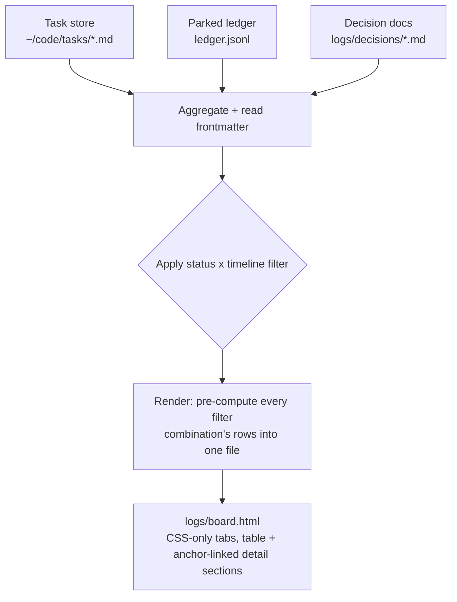
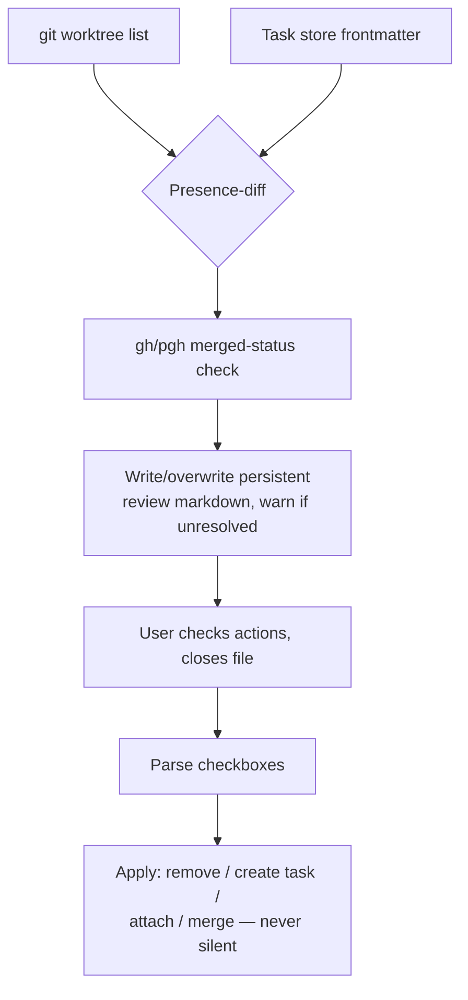

# wb workbench extensions: wb resume, wb pause, /board, wb reconcile

## Summary

PR #1 for the personal workbench: four features extending
`scripts/.config/scripts/tmux/wb.sh`, all fully scoped via decision-buffer
rounds this session. This plan translates already-ratified design into
sequenced, testable Implementation Units — no product behavior is invented
here.

## Problem Frame

The workbench (`wb`) covers task creation, the live picker, and wind-down,
but four gaps remain: no way to bring a task's environment back after a
crash/reboot without retyping `<repo> <slug>` (`wb resume`); no way to
mark a task inactive without destroying its worktree (`wb pause`); no
single view of live + deferred + parked work beyond the interim
plain-text `wb board` (`/board`); and no detection when the task store
silently drifts from actual git state (`wb reconcile`). All four were
scoped this session via decision-buffer rounds, grounded in real evidence
(a drift scan of `be--monorepo` found 4 orphaned worktrees, one a likely
duplicate).

---

## Requirements

**Schema (foundation for wb pause and /board):**
- R1. The task-store status enum includes `paused` alongside
  `planned | doing | review | done`, documented in the schema.
- R2. A task's frontmatter gains a `closed:` field, stamped with the
  current date the moment its status flips to `done`.

**`wb pause`:**
- R3. `wb pause [<session>]` flips a task's status to `paused` without
  removing its worktree (mirrors `wb done`'s session resolution, skips
  teardown).
- R4. The picker gains a keybind (`p`) that pauses the selected task row.

**`wb resume`:**
- R5. `wb resume <task>` fuzzy-matches a task by slug against the task
  store, then recreates its worktree/session via the same logic `wb new`
  already uses for an existing task (idempotent either way).

**`/board` (`wb board --html`):**
- R6. `wb board --html` writes one gitignored file, `logs/board.html`,
  regenerated fresh on every invocation.
- R7. A status filter — All / Upcoming (`planned`) / Paused / the
  unlabeled default (in-progress: `doing`/`review`) — and a timeline
  filter — Today / This week — apply together, not as mutually exclusive
  views.
- R8. Under the default status view, in-progress tasks always show
  regardless of timeline; the timeline filter additionally includes tasks
  whose `closed:` date falls in the window.
- R9. Under an explicit status filter (All/Upcoming/Paused), the timeline
  filter narrows by last-touched (mtime), so all four filter combinations
  are meaningful, not just the default.
- R10. The page is a compact table (one row per task) whose task-name
  cell is an in-page anchor link; clicking it jumps down to that task's
  full detail section (prose, cross-referenced parked-ledger entries, and
  linked artifacts — decision docs plus any open/merged PR for the task's
  branch) in a dedicated area below the table — no page navigation, no
  inline row-expansion. Each timeline/status combination gets its own
  table AND its own detail sections (view-scoped anchor ids), so tab
  switching moves both together.
- R11. Sourced from the task store + parked ledger + decision docs. No
  Jira. No transcript matching (deferred — see Scope Boundaries).

**`wb reconcile`:**
- R12. Detects two drift categories: a worktree/branch with no matching
  task file, and a task file whose `worktree:` no longer exists on disk.
- R13. For each candidate orphan/stale branch, checks GitHub merged status
  (`gh`/`pgh`) to distinguish "shipped, never cleaned up" from "genuinely
  abandoned."
- R14. Never auto-applies a correction. Always writes a report of
  everything possibly diverged, including low-confidence cases — biased
  toward over-reporting.
- R15. The report is one persistent markdown file (not dated snapshots);
  re-running with a prior unresolved report warns before overwriting.
- R16. Each finding gets six checkbox actions: do nothing / remove /
  discuss / create a task / attach to task / merge with task. Closing the
  file is the answer, reusing the decision-buffer convention.
- R17. "Create a task" seeds `status: doing` (not the template default
  `planned`) since the work it represents is already in progress.

---

## Key Technical Decisions

- **`/board`'s filter algorithm, synthesized from several rounds of
  decisions into one concrete rule (flagged for review — this exact
  algorithm was never written as a single spec anywhere):**
  when the status filter is the unlabeled default, the result set is
  `{doing, review} ∪ {tasks with closed: in the timeline window}`; when
  an explicit status filter (All/Upcoming/Paused) is active, the result
  set is that status's tasks intersected with "touched (mtime) within the
  timeline window." This is the only reading that satisfies both "in-
  progress always shows" (R8) and "status and timeline are separate,
  composable axes" (R9) at once — confirm before `ce-work` builds it.
- **`/board`'s tabs are client-side, no JS.** A single generated file with
  no backend can't re-invoke the shell per click, so status/timeline
  switching uses the radio-input + CSS-sibling-selector tabs pattern
  (render every filter combination's rows into the page, toggle visibility
  via CSS). Zero JavaScript, consistent with the "simple bash-generated
  HTML" bar the rest of this feature set holds to.
- **Layout: compact table, not cards or kanban** — chosen from three
  working mockups (`logs/decisions/2026-07-08-board-visual-layout.md`,
  closed) for consistency with `docs/roadmap.md`'s existing table
  convention and because it's the only option that doesn't reopen the
  already-negotiated composable filter model. **Drill-down is an anchor
  jump-link to a detail section below the table, not inline `
`
  expansion** — a late refinement on top of the chosen mockup, made after
  seeing it rendered: keeps the table itself dense and scannable, with
  full detail always reachable by link rather than toggled per row.
- **"Last updated" signal is filesystem mtime**, accepted with a known
  limitation: it does not survive a future `git clone` once `~/code/tasks`
  gets a remote. Revisit then; a code comment should point back at this
  decision.
- **`wb pause` kills the tmux session but keeps the worktree** — an
  inference beyond what was explicitly ratified (the decision said "skip
  worktree teardown," not what happens to the live session). Killing the
  session matches the existing memory-management principle behind `wb
  done`; keeping the worktree is what "paused, not abandoned" means.
  Confirm this reading before `ce-work` builds it.
- **`wb pause` skips the dirty-worktree check `wb done` has.** `wb done`
  checks dirty because worktree *removal* would destroy uncommitted work;
  `wb pause` never removes the worktree, so nothing is at risk — the check
  would be safety theater here.
- **Every GitHub call in this PR is mocked in tests**, not hit live —
  both `wb reconcile`'s merged-status check (U6) and `/board`'s
  linked-PR lookup (U4) share this; every existing test in this codebase
  (`scripts/.config/scripts/tmux/tests/wb-board.test.sh`) already avoids
  network/auth dependencies. Inject a fake `gh` via `PATH` that emits
  canned JSON for each test's fixture branches.
- **"Merge with task" needs a survivor rule** the original scoping didn't
  pin down: the task with the earlier `created:` date survives: the other's
  `## Plan`/`## Done`/`## Follow-ups` content gets appended to the
  survivor's matching sections, then the losing file is deleted. Flagged
  as an inference, not a ratified decision — reasonable default, but
  worth a second look.

---

## High-Level Technical Design

**`/board`'s data flow:**

**`wb reconcile`'s pipeline:**

---

## Scope Boundaries

### Deferred to Follow-Up Work

- Per-task HTML files for `/board` (single file only, this PR).
- Transcript-to-task matching for `/board`'s drill-down.
- Parent/sub-task artifact rollup in `/board`'s detail sections (a parent
  task showing its own artifacts by default, expandable to include
  everything tied to its children) — blocked on the sub-task/parent-child
  relationship itself not existing in the schema yet
  (`docs/roadmap-handoff.md`'s surfaced gap, its own decision-buffer round,
  sequenced after Hub v0). Mocked up for reference only:
  `logs/decisions/2026-07-08-board-mockup-a-table.html`'s speculative
  section.
- `wb reconcile`'s same-commit duplicate-flagging tier (report-only, later
  addition).
- Task-store schema migration/reconciliation for pre-existing task files
  — tied to the later Hub v0 launch, not per-field here.
- `wb reconcile`'s "instruct an existing agent directly" follow-up (this
  PR's `/handoff`-adjacent work stays out — `/handoff` itself is a
  separate, not-yet-planned roadmap item).

---

## Implementation Units

### U1. Task schema: `paused` status + `closed:` field

**Goal:** extend the task-store schema with the `paused` status value and
a `closed:` frontmatter field, plus the `wb.sh` plumbing that keeps both
correct — the foundation `wb pause` and `/board` both build on.

**Requirements:** R1, R2

**Dependencies:** none

**Files:**
- `~/code/tasks/README.md` (schema doc, `status:` comment)
- `~/code/tasks/TEMPLATE.md` (schema comment: `planned | doing | review | done | paused`)
- `scripts/.config/scripts/tmux/wb.sh` (`cmd_done`: stamp `closed:` alongside
  the existing `status: done` write; `cmd_board`'s rank function: give
  `paused` an explicit sort position rather than falling into the
  "anything else" bucket)
- `scripts/.config/scripts/tmux/tests/wb-schema.test.sh` (new)

**Approach:** `wb_set_frontmatter` already exists as the single
frontmatter-write chokepoint (`wb.sh:60-68`) — reuse it for the new
`closed:` stamp in `cmd_done`, right next to the existing
`wb_set_frontmatter "$task_file" status done` call (`wb.sh:532`). For
sort order, `paused` should rank after `review` and before `planned` in
`cmd_board`'s existing rank expression (`wb.sh:404-407`) — a paused task
is less urgent than active work but still more relevant than something
not yet started.

**Patterns to follow:** `wb_set_frontmatter` (`wb.sh:59-68`),
`cmd_board`'s existing rank-then-sort pipeline (`wb.sh:400-408`).

**Test scenarios:**
- Happy path: a task flipped to `done` via `wb done` gets both
  `status: done` and `closed: <today's date>` written.
- Happy path: `wb board`'s plain-text output sorts a `paused` task between
  `review` and `planned` rows.
- Edge case: a task file with `closed:` already set (re-closing an
  already-done task) — overwrite with the new date, don't duplicate the
  field.

**Verification:** `bash scripts/.config/scripts/tmux/tests/wb-schema.test.sh`
passes; a manual `wb done` on a fixture task shows `closed:` in the
resulting frontmatter.

---

### U2. `wb pause` subcommand + picker keybind

**Goal:** mark a task paused — status flips, worktree survives, session
winds down — via both a direct subcommand and a picker keybind.

**Requirements:** R3, R4

**Dependencies:** U1

**Files:**
- `scripts/.config/scripts/tmux/wb.sh` (new `cmd_pause`; picker keybind
  wiring for `p`; `_ctrl_x`-style dispatch extension)
- `scripts/.config/scripts/tmux/tests/wb-pause.test.sh` (new)

**Approach:** mirror `cmd_done`'s session-resolution block
(`wb.sh:411-424` — resolve `$session`, read `@wb_repo`/`@wb_slug`) but
skip the dirty-check, the `## Sweep` buffer flow, and the `git worktree
remove` step entirely — `wb pause` only does two things: `tmux kill-session`
(same call `cmd_done` makes, `wb.sh:533`) and
`wb_set_frontmatter "$task_file" status paused`. Wire the picker's `p` key
the same way `x`/`r`/`b` are already bound (`wb.sh:936-938`), executing
`"$SELF" _pause {8}` (task file ref) via `execute-silent` +
`reload-sync`+`refresh-preview`, matching the existing keybind pattern.

**Patterns to follow:** `cmd_done`'s session-resolution
(`wb.sh:411-424`), the picker's existing keybind wiring
(`wb.sh:936-942`), `_ctrl_x`'s per-kind dispatch (`wb.sh:880-887`).

**Test scenarios:**
- Happy path: `wb pause <session>` on a live `doing` task session — status
  becomes `paused`, worktree directory still exists, tmux session is gone.
- Happy path: `wb pause` with no argument, run inside the target session
  (mirrors `cmd_done`'s no-arg resolution) — same result.
- Error path: `wb pause` on a session with no `@wb_repo`/`@wb_slug` (not a
  wb task session) — clear error, no mutation.
- Edge case: `wb pause` on a task with uncommitted worktree changes —
  succeeds (no dirty-check), worktree keeps the uncommitted changes intact.

**Verification:** `bash scripts/.config/scripts/tmux/tests/wb-pause.test.sh`
passes; manually pause a fixture session, confirm the worktree directory
still exists on disk and the tmux session is gone.

---

### U3. `wb resume <task>`

**Goal:** bring a task's worktree/session back by fuzzy-matching its slug,
without retyping `<repo> <slug>`.

**Requirements:** R5

**Dependencies:** none

**Files:**
- `scripts/.config/scripts/tmux/wb.sh` (new `cmd_resume`)
- `scripts/.config/scripts/tmux/tests/wb-resume.test.sh` (new)

**Approach:** case-insensitive substring match of `<task>` against each
task file's basename (minus `.md`) via `wb_task_files` (`wb.sh:99-108`).
Zero matches: clear error naming the input. Multiple matches: print the
candidate list and exit — ask the user to narrow, don't guess. Exactly one
match: read `repo:`/`branch:` frontmatter and call `cmd_new "$repo"
"$slug"` directly, relying entirely on its existing idempotency
(`wb.sh:222-279` — no-ops the worktree/task-seed steps when they already
exist, always ensures the session).

**Patterns to follow:** `wb_task_files` (`wb.sh:99-108`),
`wb_get_frontmatter` (`wb.sh:51-57`), `cmd_new`'s existing idempotent body
(`wb.sh:222-279`).

**Test scenarios:**
- Happy path: `wb resume` on a slug substring matching exactly one task
  with an existing worktree and no live session — session gets created,
  worktree untouched.
- Happy path: `wb resume` on a task whose worktree was removed by hand —
  worktree gets recreated via `cmd_new`'s existing branch-exists path.
- Edge case: substring matches two or more task files — prints candidates,
  exits non-zero, creates nothing.
- Edge case: no task file matches — clear error, exits non-zero.
- Integration: `wb resume` on a task that already has a live session —
  focuses the existing session rather than erroring or duplicating it
  (exercises `cmd_new`'s existing `tmux_focus` path).

**Verification:** `bash scripts/.config/scripts/tmux/tests/wb-resume.test.sh`
passes; manually remove a fixture worktree, run `wb resume` on a slug
fragment, confirm the worktree and session both come back.

---

### U4. `/board` — data aggregation and composable filtering

**Goal:** extend `cmd_board` to aggregate task store + parked ledger +
decision docs and apply the status x timeline filter algorithm (see Key
Technical Decisions).

**Requirements:** R7, R8, R9, R11

**Dependencies:** U1

**Files:**
- `scripts/.config/scripts/tmux/wb.sh` (extend `cmd_board` with a
  `--html` flag and the filtering pipeline; new helper functions for
  ledger/decision-doc aggregation)
- `scripts/.config/scripts/tmux/tests/wb-board-html.test.sh` (new,
  fixture-based like the existing `wb-board.test.sh`)

**Approach:** reuse `wb_task_files`/`wb_read_task`/`wb_task_title`
(`wb.sh:70-108`) as the task-side data source. Add a ledger reader
(`jq -c 'select(.status=="open")'` against
`~/.claude/parked-items/ledger.jsonl`, matched to a task by `cwd`/`branch`),
a decision-doc lister (`logs/decisions/*.md`, linked from a task's own
`## Decisions` section — no automatic content matching beyond what the
task file already links), and a linked-PR lookup reusing U6's
`gh pr list --head "$branch"` pattern (any status, not just merged — this
is a read for display, not a drift signal) so a task's detail section can
show an open/merged/closed PR if one exists for its branch. Compute both
filter axes per the KTD's exact algorithm; `--html` triggers U5's render
step, no flag falls back to the existing plain-text `wb board` behavior
unchanged.

**Patterns to follow:** `cmd_board`'s existing structure
(`wb.sh:371-409`), the existing plain-text output as the "no flag"
fallback that must keep working.

**Test scenarios:**
- Happy path: default status view with one `doing` task and one `done`
  task closed 2 days ago, timeline=today — only the `doing` task appears.
- Happy path: same fixture, timeline=week — both appear (in-progress
  always shows; closed-this-week task now falls in window).
- Happy path: status=Upcoming, timeline=today — only `planned` tasks
  touched (mtime) today appear.
- Happy path: status=All, timeline=week — every task touched this week
  appears regardless of status.
- Edge case: empty task store — today's plain-text "no tasks" message
  equivalent for the `--html` path (an empty-state row, not a blank page).
- Edge case: a task with no matching ledger entries or decision docs —
  drill-down shows just its own prose, no empty cross-reference sections.
- Integration: a ledger entry whose `cwd` matches a task's worktree path
  shows up under that task's drill-down, not under an unrelated one.
- Integration: a task whose branch has a stubbed open PR shows that PR's
  number/state in its detail data; a task with no matching PR shows none
  (not an error, not a placeholder).

**Verification:** `bash scripts/.config/scripts/tmux/tests/wb-board-html.test.sh`
passes; run `wb board --html` against the real task store, confirm the
filtered counts match a manual read of the store.

---

### U5. `/board` — HTML rendering

**Goal:** render U4's filtered data as a compact table with CSS-only tab
switching, where each task name jump-links to its full detail section
further down the same page.

**Requirements:** R6, R10

**Dependencies:** U4

**Files:**
- `scripts/.config/scripts/tmux/wb.sh` (new render function, writes
  `logs/board.html`)
- `scripts/.config/scripts/tmux/tests/wb-board-html.test.sh` (extend U4's
  file with rendering-specific assertions)

**Approach:** pre-compute every filter combination's row set (4 status x
2 timeline = 8 sets, small at today's scale) into the page, and use the
radio-input + CSS-sibling-selector pattern for tab switching — no
JavaScript. Structure: one table per filter combination (matching mockup
A, `logs/decisions/2026-07-08-board-mockup-a-table.html`), status shown
as a colored pill, task name cell rendered as `<a href="#t-<repo>--<slug>">`;
below the table(s), one `<section id="t-<repo>--<slug>">` per task
currently in view, containing its `## Plan`/`## Done`/`## Follow-ups`/
`## Decisions` prose plus any matched ledger entries from U4 — always
present in the DOM (not toggled), so the anchor link always has something
to land on, and the page is also readable by scrolling straight through.
Match the Catppuccin light/dark inline `<style>` block already established
in `docs/wb-guide.html` for visual consistency with the rest of this
project's generated docs, adapted for a bash heredoc rather than Go
template output.

**Patterns to follow:** `docs/wb-guide.html`'s inline `<style>` block
(palette + type tokens) — same visual language, different generator;
`logs/decisions/2026-07-08-board-mockup-a-table.html` for the chosen
table structure (drill-down mechanism in the mockup itself is stale —
it used `
` — the anchor-link approach here supersedes it).

**Test scenarios:**
- Happy path: generated file is valid HTML with all 8 filter-combination
  tables present and only one visible by default (today + default
  status).
- Happy path: a task row's name links to `#t-<repo>--<slug>`, and a
  section with that exact id exists further down the page containing its
  actual Plan/Done/Follow-ups/Decisions text, not a placeholder.
- Edge case: a task title containing HTML-special characters (`<`, `&`) —
  properly escaped in both the table cell and the anchor id/section, not
  broken markup.
- Edge case: two tasks whose `repo--slug` combination could theoretically
  collide in the anchor id — confirm the id is built from the actual
  unique task filename, not a lossy re-derivation.
- Verification (manual, since this is visual): open `logs/board.html` in
  a browser, click each tab, then click a task name and confirm the page
  jumps to the right detail section with no JS errors in the console and
  no flash of unstyled content.

**Verification:** automated test asserts on the generated HTML's
structure (row counts per filter combination, presence of matching
anchor/section id pairs); manual open-in-browser check for the visual/
interactive parts per the last test scenario above.

---

### U6. `wb reconcile` — drift detection

**Goal:** detect worktrees/branches with no matching task file, task
files whose worktree no longer exists, and merged-but-uncleaned branches.

**Requirements:** R12, R13, R14

**Dependencies:** none

**Files:**
- `scripts/.config/scripts/tmux/wb.sh` (new `cmd_reconcile` detection
  logic)
- `scripts/.config/scripts/tmux/tests/wb-reconcile.test.sh` (new, with a
  fake `gh` stub injected via `PATH`)

**Approach:** presence-diff via `comm -23` between `git worktree list
--porcelain` output and task-store `worktree:` values (pattern already
sketched in `logs/decisions/2026-07-08-wb-reconcile-scoping.md`); the
mirror case (task claims `doing`/`review` but `worktree:` path doesn't
exist) is a simple `[ -d ... ]` check per task file. For each orphan/stale
candidate, shell out to `gh pr list --head "$branch" --state merged --json
number,mergedAt` (or `pgh` per the repo-owner branching rule) to
distinguish merged-and-abandoned from genuinely-stale. Every finding —
including ones the merged-status check can't resolve confidently — goes
into the report; nothing gets silently dropped (R14).

**Patterns to follow:** `pr-review-session`'s `gh_json` helper
(`claude/.claude/skills/pr-review-session/driver.py:130`) for the
`gh`/`pgh` call pattern; the repo-owner branching rule (`gh` vs `pgh`)
from `~/.claude/CLAUDE.md`.

**Test scenarios:**
- Happy path: a worktree with no task file — detected, reported.
- Happy path: a task file with `worktree:` pointing at a removed
  directory — detected, reported.
- Happy path: a candidate branch whose stubbed `gh` response shows merged
  — reported as "merged, safe to clean up," distinct from a plain orphan.
- Edge case: `gh`/`pgh` call fails or times out (simulate via the stub) —
  candidate still gets reported, flagged as "merge status unknown" rather
  than silently dropped (R14's over-report bias).
- Edge case: no drift at all — report says so explicitly, doesn't error.

**Verification:** `bash scripts/.config/scripts/tmux/tests/wb-reconcile.test.sh`
passes with the fake `gh` stub; run against a real fixture worktree tree
with one deliberately-orphaned worktree, confirm it's detected.

---

### U7. `wb reconcile` — review doc and action execution

**Goal:** turn U6's findings into the persistent, decision-buffer-shaped
review file, then parse the closed file and apply exactly the checked
actions.

**Requirements:** R15, R16, R17

**Dependencies:** U6

**Files:**
- `scripts/.config/scripts/tmux/wb.sh` (report generation, checkbox
  parsing, action execution)
- `scripts/.config/scripts/tmux/tests/wb-reconcile.test.sh` (extend U6's
  file with review-doc and action-parsing tests)

**Approach:** one persistent file (path convention consistent with this
project's other gitignored live-generated docs, e.g. `logs/reconcile.md`);
before overwriting, scan the existing file for any unchecked action lines
and warn rather than silently clobber (R15). Each finding renders as one
section with six checkboxes: do nothing / remove / discuss / create a
task / attach to task / merge with task. On re-invocation with
`--apply` (or equivalent), parse checked boxes and execute: *remove* →
`git worktree remove --force` (+ branch delete); *create a task* →
`wb_seed_task`-equivalent flow, forcing `status: doing` (R17) instead of
the template default; *attach to task* → `wb_set_frontmatter` the
matched task's `worktree:` field; *merge with task* → apply the
survivor rule from Key Technical Decisions (earlier `created:` wins,
append the loser's Plan/Done/Follow-ups content, delete the loser file).
*Discuss* and *do nothing* take no action — they exist so a finding can be
explicitly acknowledged without either fixing or hiding it.

**Patterns to follow:** the decision-buffer convention itself
(`claude/.claude/skills/decision-buffer/SKILL.md`) for the review file's
shape and checkbox-parsing approach; `wb_seed_task` (`wb.sh:173-205`) for
the "create a task" action's frontmatter seeding.

**Test scenarios:**
- Happy path: a report with one "remove" checked — the target worktree
  and branch are gone after applying, nothing else touched.
- Happy path: a report with one "create a task" checked — a new task file
  appears with `status: doing`, correct `repo:`/`branch:`/`worktree:`.
- Happy path: "attach to task" checked against an existing task — that
  task's `worktree:` field updates, no new file created.
- Happy path: "merge with task" checked between two tasks with different
  `created:` dates — the earlier-created survives with both files' Plan/
  Done/Follow-ups content, the later one is deleted.
- Edge case: re-running `wb reconcile` while a prior report has unchecked
  items — warns before overwriting, per R15.
- Edge case: "do nothing" or "discuss" checked — file regenerates cleanly
  on the next run with no residual action attempted.
- Error path: an action references a task/worktree that no longer exists
  by the time it's applied (race between report generation and action) —
  clear error for that one finding, does not abort the rest of the batch.

**Verification:** `bash scripts/.config/scripts/tmux/tests/wb-reconcile.test.sh`
passes (full suite, detection + review + actions); manually run the full
cycle once against the real `be--monorepo` fixtures found this session
(`fix/sfb-1046-byid-gates`, `refactor/state-management`,
`fix/sfb-985-pitch-map-regression`, `fix/sfb-988-af-sprints`) and confirm
the report matches the findings already documented in
`docs/roadmap-wb-reconcile.md`.

---

## Sources & Research

- `scripts/.config/scripts/tmux/wb.sh` — full read this session; all line
  references above verified against the current file.
- `scripts/.config/scripts/tmux/tests/wb-board.test.sh` — the exact
  plain-bash-assertion test convention every new test file in this plan
  follows.
- `~/code/tasks/README.md`, `~/code/tasks/TEMPLATE.md` — current schema,
  verified before proposing the `paused`/`closed:` additions.
- `claude/.claude/skills/pr-review-session/driver.py:130` — `gh_json`
  pattern reused for `wb reconcile`'s merged-status check.
- `docs/wb-guide.html` — visual language source for `/board`'s rendering.
- `docs/roadmap-board.md`, `docs/roadmap-wb-reconcile.md`,
  `docs/roadmap-day-bookends.md` — the ratified design each unit above
  traces back to.
- `logs/decisions/2026-07-08-board-scoping.md`,
  `logs/decisions/2026-07-08-wb-reconcile-scoping.md` (closed) — full
  option/tradeoff record behind the Key Technical Decisions.
