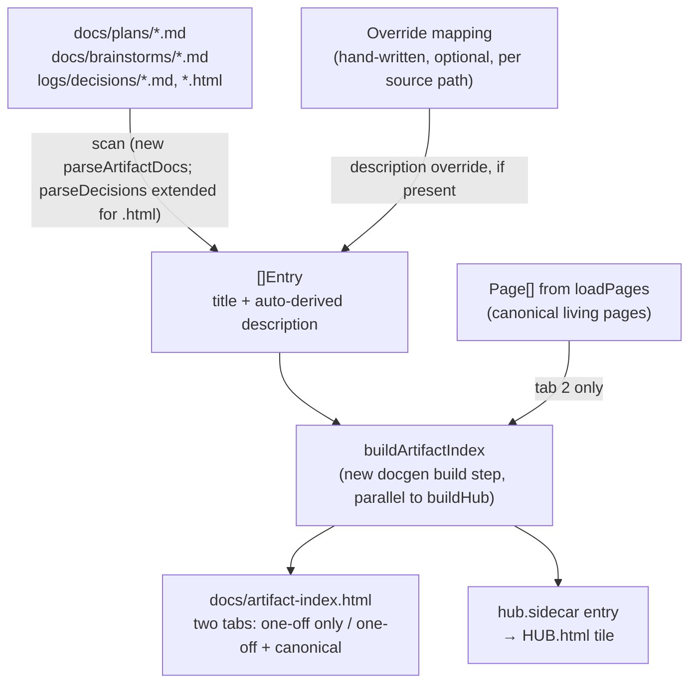

# Hub v0: meta-documentation bundle

**Target repos:** `dotfiles` (primary — this plan's home) and the sibling
`~/code/docgen` (for U5 only). Paths below are repo-relative to whichever
repo the unit targets; docgen-repo paths are written as `docgen/<file>`
(e.g. `docgen/index.go`), everything else is dotfiles-repo-relative.

## Summary

**Revised 2026-07-10** (calibration round —
`logs/decisions/2026-07-10-workflow-calibration.md`): **plan paused;
resumes after the task parent/child build.** Scope trimmed to five pieces
of meta-documentation on top of the existing docgen/Hub pipeline: a
glossary, a curated limitations page, a standalone ceremonies page, a
`/board` Hub tile, and a **fully reshaped roadmap page** (stage—impediment
status grammar, waits-on links, Up-next queue, parked pool, Not-doing
lane, shipped ledger — per the 2026-07-10 ideation round,
`docs/ideation/2026-07-10-hub-v0-roadmap-section-ideation.html`). The
auto-scanned artifact index (U5/U6 — the one unit extending the sibling
docgen tool) is **deferred**: revisit when a one-off doc actually goes
un-findable, or post-parent/child. All remaining units are dotfiles-only
content/config work; this plan no longer touches the docgen repo.

## Problem Frame

Jargon gets re-explained inline every time it comes up instead of being
defined once; one-off generated docs (decision-buffer companions, PR
recaps, brainstorm/plan outputs) have no central index; known gaps and
caveats are scattered across recap pages and `docs/roadmap-open-questions.md`
with no single browsable view; the roadmap's Overview table conflates
"needs a slot" follow-ups with "parked at the end" deferred items because
that distinction lives only in prose judgment; the already-shipped `wb
board --html` output isn't reachable from the Hub; the roadmap's dated
clocks require asking what they mean instead of reading it; and docgen
structurally cannot detect staleness for sources living outside this
repo's git tree. Full detail and scoping dialogue: `docs/brainstorms/2026-07-09-hub-v0-requirements.md`
and `logs/decisions/2026-07-09-hub-v0-scoping.md`.

---

## Requirements

**Glossary**
- R1. One page renders a canonical explanation per recurring term
  (frontmatter, transcript, ledger, worktree, task store, tile, sidecar,
  INDEX entry, decision buffer, etc.), seeded from a sweep of current docs.
- R2. The page uses the sticky-table-of-contents layout so individual
  terms are directly jump-to-able.

**Artifact index**
- R3. One page lists one-off generated docs (decision-buffer companions,
  brainstorm/plan outputs) each with a link, a description, and why it was
  generated, newest-first by source date. Discovery is automatic;
  descriptions are auto-derived from each file's own content by default,
  with an optional per-artifact hand-written override.
- R4. A second view additionally includes canonical living pages already
  reachable via their own Hub tile.
- R5. The default view excludes canonical living pages.

**Limitations**
- R6. One page lists standing, by-design properties of the workflow that
  explain otherwise-surprising behavior.
- R7. The personal/employer boundary rule gets a one-line pointer into
  this page; its full writeup stays on its existing dedicated page.
- R8. The page notes the task parent/child relationship is designed but
  not yet built, for the interim before that follow-on PR lands.

**Roadmap** *(reshaped 2026-07-10 — calibration Decision 3, Option C;
supersedes the original R9-R12. Full option cards:
`docs/ideation/2026-07-10-hub-v0-roadmap-section-ideation.html`)*
- R9. `docs/roadmap.md` is genuinely reworked in one pass into: an
  "Up next" queue (max 3 — carries all delivery intent), a live table
  (~8-10 rows), a parked pool (every entry names its revisit trigger — a
  date or an event), a compact "Not doing" lane (considered-and-killed
  items with one-line reasons), and a shipped ledger (Done rows leave the
  table; the "N shipped" chip links to the recap pages). Same Hub tile.
- R10. Statuses use the stage — impediment grammar: a small fixed stage
  word (shipped / shakedown / active / queued / proposed / parked) plus a
  free-prose impediment clause. Ordering claims are written as waits-on
  links — `needs: <item>`, `clock: <date>`, or `after: <item> — chosen` —
  never a bare "blocked". No maintained dependency view; it derives from
  the links on demand.
- R11 *(amended 2026-07-10)*. The Overview table is deliberately
  restructured — the original "rendered content unchanged, including Done
  rows" requirement is consciously reopened by calibration Decision 3.
  Verification changes from byte-diff to content review.
- R12. Visual nodes are anchor links with permanent `#detail-<slug>` ids
  (the future join key for roadmap generation). Task Recall and "Unify
  copy/paste" placement resolves via the grammar itself: Task Recall =
  queued — `needs: boundary-rule`; Unify copy/paste = parked, with a
  revisit trigger.

**`/board` tile and staleness banner**
- R13. The Hub gets one tile linking to the already-shipped `wb board
  --html` output, with tile text setting the expectation that the file is
  generated on demand.
- R16. The Hub carries a static note that sources living outside this
  repo's git tree (memory, task store, notes-tui/replay-tui READMEs)
  aren't auto-indexed by the pre-commit hook, naming the command to run
  after editing them.

**Ceremonies**
- R14. A new standalone page tracks the three existing dated clocks (with
  their rationale) and has room for future recurring reviews.
- R15. When a dated clock's date passes and gets resolved, it moves to a
  compact "resolved" sub-list rather than being deleted.

---

## Key Technical Decisions

- **Roadmap visual is hand-authored, not docgen-generated.** Most current
  roadmap rows have no corresponding task-store file (retrospective
  groupings, unstarted proposals) — generating from the task store today
  would silently drop most of the table. Full generation is real future
  work once the task parent/child relationship and a `/board`-driven
  roadmap view exist (`docs/roadmap-handoff.md`). This keeps the roadmap
  unit entirely within the dotfiles repo.
- **Artifact index is auto-scanned, extending existing docgen parsers —
  but neither existing parser can be reused unmodified.** `parseDecisions`
  (`docgen/index.go:498-531`) only scans `.md` (decision-buffer companion
  `.html` files are invisible to it), and `parseDocFile`
  (`docgen/index.go:465-494`) is documented and built for "a standalone
  markdown doc (no frontmatter schema)" — it breaks on the first
  non-blank/non-heading/non-blockquote/non-fence line, so on a
  frontmatter-carrying file (every `docs/plans/*.md` and
  `docs/brainstorms/*.md`) it grabs a raw YAML line as the description
  before ever reaching the real content. U5 introduces one new scanner
  (`parseArtifactDocs`) that splits frontmatter via the existing
  `splitFrontmatter` helper (`docgen/frontmatter.go`) before extracting
  title/description, so the auto-derivation is correct for both existing
  and new sources. `Config.Artifacts` gets its own `ArtifactSource` type
  rather than reusing `IndexSource` because it needs an `Overrides` field
  `IndexSource` has no equivalent for, and carries none of `IndexSource`'s
  `Tags`/`Name`/`Invoke`/`Guide` fields, which don't apply here.
- **Auto-derived description with optional override, never required.**
  A newly-discovered artifact always renders with its auto-derived
  one-liner; a hand-written override in a small mapping wins when
  present. Nothing blocks a build waiting for a human to supply a reason —
  matches "it just needs to consistently be up to date" over "it must
  always read perfectly."
- **Limitations selectively promotes, doesn't mirror.** Three of
  `docs/roadmap-open-questions.md`'s five entries (GPaste/Sway coupling,
  warn-only credential guard, GPaste's no-expiry history) move in as
  standing constraints; the other two (a re-confirmed notes-corpus
  decision, a fully-resolved trace) stay as process record, not
  limitations.
- **`/board` tile and staleness banner are static hints via existing
  config surfaces.** `hub.sidecar` (`docgen/config.go:57-65`) and
  `hub.intro` (`docgen/config.go:35`) already exist and need no docgen
  code change — both are pure `docgen.json` edits.
- **Ceremonies is a standalone page**, not folded into `roadmap.md`, so it
  has room to grow into future recurring reviews beyond today's three
  dated clocks.
- **Task parent/child relationship is out of scope for this plan.** Fully
  designed (`docs/roadmap-handoff.md`, `logs/decisions/2026-07-09-hub-v0-scoping.md`
  Decisions 9–12) but ships as its own, immediately-following PR.

---

## High-Level Technical Design

The artifact index (U5, U6) is the one unit with real cross-repo,
multi-stage shape — worth a diagram; the other six units are direct
content/config application and aren't diagrammed.



Tracked-vs-gitignored matters for freshness: `docs/plans/*.md` and
`docs/brainstorms/*.md` are tracked (ride the existing `.githooks/pre-commit`
regen cycle once added to its trigger list); `logs/decisions/*.md`/`*.html`
are gitignored (carry the same "needs a manual `docgen.sh index`" caveat
already established for cross-repo sources, R16).

---

## Implementation Units

### U1. Glossary page

**Goal:** one page explaining recurring workflow jargon, jump-to-able by
term.
**Requirements:** R1, R2.
**Dependencies:** none.
**Files:**
- `docs/glossary.md` (new)

**Approach:** `kind: guide` frontmatter (sticky TOC, one `h2` per term).
The sticky-TOC nav only renders `Level == 2` headings
(`docgen/_templates/layout.html`'s `kind/guide` sub-template) — `docs/wb-guide.html`'s
own real h3 subheadings are confirmed absent from its rendered nav, so
each term must be its own `h2` section, not an `h3`, to actually appear in
the TOC. Seed the term list from a sweep of current docs (`docs/docgen.md`,
`docs/roadmap*.md`, `~/code/tasks/README.md`, `docs/pr1-wb-workbench-recap.md`)
— minimum viable set: frontmatter, transcript, ledger, worktree, task
store, tile, sidecar, INDEX entry, decision buffer. Group `group:
personal-workflow` (existing Hub group, per `docs/docgen.json`).

**Patterns to follow:** `docs/docgen.md`'s own frontmatter + prose shape
(each of its own sections is an `h2`, e.g. `## The pipeline`);
`docs/wb-guide.html`'s sticky-TOC rendering for `kind: guide`
(`docgen/_templates/layout.html`'s `kind/guide` sub-template, which filters
its nav to `{{if eq .Level 2}}`).

**Test scenarios:**
Test expectation: none -- static content page. Verification below covers
the render.

**Verification:** `docgen.sh build` succeeds; `docs/glossary.html` renders
with a sticky TOC listing every `h2` term; a HUB tile appears under
"Personal workflow."

---

### U2. Limitations page

**Goal:** one page listing standing, by-design workflow constraints.
**Requirements:** R6, R7, R8.
**Dependencies:** none (independent of U3/U7, though R8's exact wording
about the parent/child relationship should match U7's roadmap-page
phrasing for consistency — no hard ordering requirement).
**Files:**
- `docs/limitations.md` (new)
- `docs/roadmap-open-questions.md` (edit — trim the 3 promoted items)

**Approach:** Promote 3 of the 5 entries from `docs/roadmap-open-questions.md`
(GPaste/Sway coupling, warn-only/filename-only credential guard, GPaste's
no-expiry clipboard history) into `docs/limitations.md` as one-line-summary
+ revisit-trigger entries. Leave the other 2 (notes-corpus-split,
"(F4)" trace) on `roadmap-open-questions.md` — they're process record, not
standing limitations. The personal/employer boundary rule gets a one-line
pointer into `limitations.md`; its full writeup stays put. Add the
parent/child-relationship-designed-not-built note (R8).

**Patterns to follow:** `docs/roadmap-open-questions.md`'s existing
one-item-per-section shape (source for what's being promoted); table shape
from `docs/pr1-wb-workbench-recap.md`'s "What's NOT done yet" section for
formatting precedent.

**Test scenarios:**
Test expectation: none -- static content page. Verify cross-links resolve
(see Verification).

**Verification:** `docgen.sh build` succeeds; the 3 promoted entries read
correctly on `docs/limitations.md` with working links back to their source
pages; `docs/roadmap-open-questions.md` still renders with its remaining 2
entries and no dangling references to the promoted ones.

---

### U3. Ceremonies page

**Goal:** one standalone page tracking dated clocks and future recurring
reviews.
**Requirements:** R14, R15.
**Dependencies:** none. U7 (roadmap rework) depends on this unit —
`roadmap.md`'s "Dated clocks" section content moves here first.
**Files:**
- `docs/ceremonies.md` (new)
- `docs/roadmap.md` (edit — remove "Dated clocks" section content, leave a
  pointer; full rework happens in U7)

**Approach:** Move the 3 existing dated clocks (`tmux_pane_awaiting_input`
deletion, 4a capture-window verdict, push-vs-weekly-ritual check-in) with
their full rationale prose, verbatim, from `docs/roadmap.md`'s "Dated
clocks" section into the new page. Structure: an "Active" section (current
shape) and a "Resolved" heading, omitted entirely at launch rather than
rendered empty — added the first time an entry actually lands (whenever
`tmux_pane_awaiting_input` is actually deleted per its own ~2026-07-13
check-in). `kind: page`, `group: personal-workflow`.

**Patterns to follow:** `docs/roadmap.md:68-85`'s existing dated-clocks
prose (source content, moved not rewritten); this very plan's own
`## Decisions made`-style summary shape (in the round-4 decision doc) as
the model for how a "resolved" entry should read once one exists.

**Test scenarios:**
Test expectation: none -- static content page, moved verbatim.

**Verification:** `docgen.sh build` succeeds; `docs/ceremonies.html`
carries all 3 dated clocks with their original rationale intact;
`docs/roadmap.md` no longer duplicates that content.

*(Post-calibration note: the 4a clock resolved early on 2026-07-10 —
unused — so the "Resolved" sub-list gets its first entry at build time,
and the ~07-20 clock is now the combined calibration ceremony; see
`docs/roadmap.md`'s current Dated clocks section for the live wording.)*

---

### U4. `/board` Hub tile and cross-repo staleness banner

**Goal:** surface the already-shipped `/board` output on the Hub, and
name the sources docgen can't auto-track.
**Requirements:** R13, R16.
**Dependencies:** none.
**Files:**
- `docs/docgen.json` (edit — `hub.sidecar` entry + `hub.intro` addition)

**Approach:** Add one `hub.sidecar` entry (existing mechanism,
`docgen/config.go:57-65`, currently unused — empty array today) pointing
`href`/`path` at `../logs/board.html`, tile text naming `wb board --html`
as the regenerate command. Append one sentence to the existing
`hub.intro` string naming memory/task-store/notes-tui-and-replay-tui
READMEs as not auto-indexed, and the `docgen.sh index` command to run
after editing them.

**Patterns to follow:** `docgen/config.go`'s `SidecarTile` struct shape;
the existing `hub.intro` string in `docs/docgen.json` for tone/format
match.

**Test scenarios:**
Test expectation: none -- config-only change, no new code path.

**Verification:** `docgen.sh build` succeeds (JSON still validates against
`Config`'s `DisallowUnknownFields`); the `/board` tile appears on
`HUB.html` under "Personal workflow"; clicking it opens `logs/board.html`
if `wb board --html` has been run, or 404s with the tile's own hint text
otherwise (expected, per the brainstorm's Decision 5).

---

### U5. docgen: artifact-index scan-and-render capability — DEFERRED 2026-07-10

**Deferred** (calibration Decision 2): parked with trigger "revisit when a
one-off doc actually goes un-findable, or post-parent/child." The design
below is kept as the record to resume from.

**Goal:** extend docgen's existing scan-and-derive discovery to drive a
real, dedicated rendered page instead of only `INDEX.md`.
**Requirements:** R3, R4, R5 (discovery, auto-derived description +
override mechanism, and the two-tab split).
**Dependencies:** none.
**Files:**
- `docgen/config.go` (edit — new `Artifacts` config section)
- `docgen/artifacts.go` (new — scan + render, parallel to `docgen/hub.go`)
- `docgen/artifacts_test.go` (new)
- `docgen/_templates/artifact-index.html` (new — `{{define "artifact-index"}}`,
  alongside `hub.html`'s `{{define "hub"}}`)
- `docgen/main.go` (edit — wire the new build step into `build`/`all`)

**Approach:** New `Config.Artifacts` struct (`Out string`, `Sources
[]ArtifactSource` — `Kind`/`Path` only, no `Tags`/`Name`/`Invoke`/`Guide`,
since those don't apply here — `Overrides map[string]string` keyed by
source-relative path). Neither existing scan function can be reused
unmodified (see Key Technical Decisions): `parseDecisions`
(`docgen/index.go:498-531`) only scans `.md`, so a decision's paired
`.html` companion is invisible to it — fixed here by preferring the
`.html` sibling as the entry's link when one exists, mirroring the
"prefer rendered `.html` over `.md` source" convention `docs/pr1-wb-workbench-recap.md`
already established for linked-doc chips (one entry per decision, not
two). `parseDocFile` (`docgen/index.go:465-494`) assumes no frontmatter
and breaks on the first non-skip line, so on `docs/plans/*.md` and
`docs/brainstorms/*.md` (every file starts with a YAML block) it would
grab a raw frontmatter line as the description — fixed here with a new
`parseArtifactDocs` scanner that calls the existing `splitFrontmatter`
helper (`docgen/frontmatter.go`) first, deriving title from a frontmatter
`title:` key when present (plans have one) or the body's first `#`
heading otherwise, and description from the body's first prose line
(`firstProse`, `docgen/index.go`) — run only against the post-frontmatter
body, so a frontmatter content line can never be mistaken for prose.
`parseArtifactDocs` iterates a whole directory (`docs/plans/`,
`docs/brainstorms/`), unlike `parseDocFile`'s existing single-file caller.
For each entry, check `Overrides` for a match on `Entry.Source`; use the
override's description if present, else the auto-derived one — a missing
`Overrides` entry is never a build failure (Key Technical Decisions).
Render two tabs via the same CSS-only radio-input pattern already used by
`wb board --html`'s tabs (no JS): tab 1 = scanned entries only (labeled
"Generated docs"), tab 2 = tab 1 entries plus every canonical `Page` (from
`loadPages`, already computed once per build and passed to `buildHub`) not
already present in tab 1 (labeled "All docs"). A tab with zero entries
renders a one-line "No artifacts found yet" placeholder instead of an
empty table.

**Technical design** (directional, not implementation-literal):

```go
type ArtifactsConfig struct {
    Out       string            `json:"out"`
    Sources   []ArtifactSource  `json:"sources"`
    Overrides map[string]string `json:"overrides"` // source path -> hand-written description
}

func parseArtifactDocs(absDir, relDir string) ([]Entry, error) {
    // one entry per *.md file: splitFrontmatter first, then derive
    // title (frontmatter `title:` else first `# heading`) and
    // description (firstProse over the BODY only) from what's left.
}

func buildArtifactIndex(root string, cfg Config, tmpl *template.Template, pages []Page) error {
    var oneOff []Entry
    for _, src := range cfg.Artifacts.Sources {
        entries := scanBySourceKind(src) // parseArtifactDocs, or parseDecisions
                                          // extended to prefer a .html sibling link
        for i := range entries {
            if override, ok := cfg.Artifacts.Overrides[entries[i].Source]; ok {
                entries[i].Oneliner = override
            }
        }
        oneOff = append(oneOff, entries...)
    }
    everything := append(append([]Entry{}, oneOff...), entriesFromPages(pages)...)
    // render both tabs from oneOff and everything; empty tab -> placeholder row
}
```

**Patterns to follow:** `docgen/hub.go:41-105`'s `buildHub` (aggregation +
single-template render shape); `docgen/index.go:74-101`'s per-source-kind
dispatch (`switch src.Kind`); `docgen/frontmatter.go`'s `splitFrontmatter`
(frontmatter/body separation, already used by both the page pipeline and
skill-metadata parsing — reused here for a third caller); `docgen/config.go`'s
existing `DisallowUnknownFields` validation (new `Artifacts` key must
round-trip cleanly); `docgen/page.go:57-62`'s `goldmark.WithUnsafe`
precedent for embedding the CSS-only tab markup; `docs/pr1-wb-workbench-recap.md`'s
"preferring the rendered `.html` over its `.md` source" convention for the
decision-companion link preference.

**Test scenarios:**
- Happy path: given a fixture repo with 2 plans and 1 brainstorm doc (no
  overrides), `buildArtifactIndex` produces entries for all 3 with titles
  and descriptions derived from each file's post-frontmatter body — not
  from any frontmatter line.
- Happy path: given the same fixture plus one `Overrides` entry matching
  a scanned file's source path, that entry's rendered description is the
  override text, not the auto-derived one.
- Happy path: a decision with both a `.md` and a sibling `.html` produces
  one entry linking to the `.html`; a decision with only a `.md` links to
  the `.md`.
- Edge case: a source directory with zero matching files renders the
  "No artifacts found yet" placeholder, not an error (mirrors `index.go`'s
  existing "no entries" tolerance).
- Edge case: an `Overrides` entry whose key matches no scanned source is
  ignored silently (an override is a hint, not a contract — matches the
  "never blocks a build" Key Technical Decision).
- Error path (`TestArtifactsFailsLoudlyOnMissingSourceRoot`): a declared
  `ArtifactSource.Path` that doesn't exist is a hard build failure naming
  the missing path, mirroring `TestIndexFailsLoudlyOnMissingRoot`-style
  coverage already in `docgen/index_test.go`.
- Integration: tab 2's entry set is tab 1's entries plus every `Page` not
  already present in tab 1, with no duplicates — exercises the join
  between scanned entries and `loadPages`' `Page` list together, not
  either alone.

**Verification:** `go test ./...` passes in `~/code/docgen`; a second
`docgen.sh build` run against the same fixture is byte-identical
(idempotency, matching `TestBuildIsIdempotent`'s existing precedent).

---

### U6. Artifact index page (dotfiles-side wiring) — DEFERRED 2026-07-10

**Deferred** with U5 (calibration Decision 2) — same trigger.

**Goal:** wire U5's new docgen capability into this repo's actual sources
and config.
**Requirements:** R3, R4, R5.
**Dependencies:** U5.
**Files:**
- `docs/docgen.json` (edit — new `artifacts` config block)

**Approach:** Declare `artifacts.sources` pointing at `docs/plans`,
`docs/brainstorms`, and `logs/decisions` (kinds mirroring the scan logic
U5 built); `artifacts.out` = `docs/artifact-index.html`. Populate
`artifacts.overrides` with hand-written descriptions only where the
auto-derived one reads awkwardly (expect this to matter most for
brainstorm docs, whose `## Summary` is prose, not a one-liner — per U5's
Key Technical Decision). No `docs/artifact-index.md` markdown source is
needed — the page is generated directly by U5's new build step, the same
way `HUB.html` has no `.md` source either.

**Patterns to follow:** `docs/docgen.json`'s existing `index.sources`
array shape for `Sources` entries; `docs/docgen.json`'s `hub.groups`
declaration for where the artifact-index tile lands (`group:
personal-workflow`, via a `hub.sidecar` entry since this page has no
frontmatter of its own to drive a normal tile).

**Test scenarios:**
Test expectation: none -- config + generated output, covered by U5's
tests and this unit's own verification.

**Verification:** `docgen.sh build` produces `docs/artifact-index.html`;
tab 1 lists exactly this session's decision docs, the Hub v0 brainstorm,
and this plan, each with a sensible description; tab 2 additionally shows
canonical pages (`roadmap.html`, `wb-guide.html`, etc.); a Hub tile links
to the page.

---

### U7. Roadmap rework: left-to-right visual + page restructure

**Goal:** rework `docs/roadmap.md` to house a hand-authored left-to-right
visual well, resolve the Follow-up/Deferred distinction per item, and
place the currently-unplaced items.
**Requirements:** R9, R10, R11, R12.
**Dependencies:** U3 (ceremonies content must be moved out first).
**Files:**
- `docs/roadmap.md` (edit — restructure)

**Approach** *(rewritten 2026-07-10 per calibration Decision 3, Option C,
and the ideation round's surviving directions):* one full restructure of
the page. (1) Page skeleton per the amended R9: Up-next queue (max 3) →
live table → parked pool → Not-doing lane → shipped-ledger link; Done
rows move out to the recap pages most already link to. (2) Every
remaining row's status is rewritten in the stage — impediment grammar
with waits-on links (amended R10) — e.g. `queued — needs: boundary-rule`,
`parked — clock: resolved 2026-07-10, unused`, `queued — after: Hub v0
(chosen, PR scope)`. (3) The left-to-right visual (raw HTML/CSS block,
goldmark renders it unsafe-as-written per `docgen/page.go:57-62`) derives
its zones from the same stage vocabulary, and every node is an anchor
link with a permanent `#detail-<slug>` id (amended R12) — resolving the
earlier non-interactive-steps wording in favor of the liked mockup
direction. (4) No maintained dependency view: the ~5 waits-on links carry
that information; a depth view can be re-derived on demand as a dated
audit artifact.

**Technical design** (directional):

```html
<div class="roadmap-timeline">
  <div class="step done">Docs platform</div>
  <div class="step done">wb core + PR #1</div>
  <div class="step active">Hub v0</div>
  <div class="step followup">Task parent/child relationship</div>
  <div class="step followup">/handoff</div>
  <div class="step deferred">Personal/employer boundary rule</div>
</div>
```

**Patterns to follow:** `logs/decisions/2026-07-09-hub-v0-scoping.html`'s
`.timeline-viz` CSS (already sketched and styled during scoping — reuse
directly rather than redesigning, renaming its `.planned` class to
`.followup` to match R10's category names exactly); `docs/_templates/head.html`'s
shared Catppuccin palette for color consistency with every other generated
page.

**Test scenarios:**
Test expectation: none -- static content restructure.

**Verification** *(revised with the amended R11):* `docgen.sh build`
succeeds; every live item appears exactly once across
queue/live/parked/not-doing; every visual node's anchor resolves to a
detail entry; no bare "blocked" appears without a `needs:`/`clock:` link;
Done rows are reachable only via the shipped-ledger links.

---

## Scope Boundaries

**Deferred to Follow-Up Work:**
- The artifact index (U5 docgen capability + U6 wiring) — deferred
  2026-07-10 by the calibration round (Decision 2); revisit when a
  one-off doc actually goes un-findable, or post-parent/child.
- The task parent/child relationship build (schema, `wb.sh` session
  handling, picker + `/board` rendering) — fully designed, ships as its
  own immediately-following PR. `logs/decisions/2026-07-09-hub-v0-scoping.md`
  Decisions 9–12.
- `wb reconcile --glossary` (auto-detecting glossary gaps) — a `wb.sh`
  feature, not a docgen/Hub one.
- Computed staleness detection and an existence-aware `/board` tile —
  traded for the static versions in U4.
- Generating the roadmap from the task store — real future work once
  every piece of work always has a task file and `/board` grows a roadmap
  view.
- A full audit of every page/tile on the Hub as it stands today — parked
  separately (parked-items ledger, 2026-07-09), not this plan.

---

## Sequencing

*(revised 2026-07-10)* The plan is paused until the task parent/child
build ships. On resume: U1, U2, U4 have no dependencies — landable in any
order, in parallel. U3 before U7 (ceremonies content must move out of
`roadmap.md` before the roadmap rework touches that same page). U5/U6 are
deferred out of this plan entirely.

```
U1 ∥ U2 ∥ U4
U3 → U7 (needs U3's content move first)
U5 → U6 — deferred (parked, revisit trigger in Scope Boundaries)
```

---

## Sources / Research

- `docs/brainstorms/2026-07-09-hub-v0-requirements.md` — origin document.
- `logs/decisions/2026-07-09-hub-v0-scoping.md` (+ companion `.html`) —
  full decision record (14 decisions across 5 rounds) this plan executes.
- `docgen/config.go`, `docgen/frontmatter.go`, `docgen/hub.go`,
  `docgen/index.go`, `docgen/page.go` — verified directly for every
  docgen mechanism this plan relies on or extends.
- `docgen/build_test.go`, `docgen/index_test.go`, `docgen/frontmatter_test.go` —
  existing test conventions U5 mirrors (inline-fixture, `byName`-map
  assertions, `TestXFailsLoudlyOnY` naming, `t.TempDir()` fixture repos).
- `docs/plans/2026-07-08-001-feat-wb-workbench-extensions-plan.md` — most
  current plan-format precedent in this repo, mirrored here (flat
  R-list, per-unit Requirements/Dependencies/Files/Approach/Patterns to
  follow/labeled test scenarios).
- `docs/roadmap-handoff.md`, `~/code/tasks/README.md` — task-store schema
  and the parent/child relationship this plan explicitly excludes.

> Re-instated 2026-07-10 (evening) after the deletion incident: this is
> the plan's exact post-calibration state (original text + the same-day
> revision edits), reproduced from a session that had read the original in
> full and authored every revision. The original commit `d2fa8f9` was
> never pushed and did not survive the reclone. One addition beyond the
> original: U3's post-calibration note about the 4a clock.
