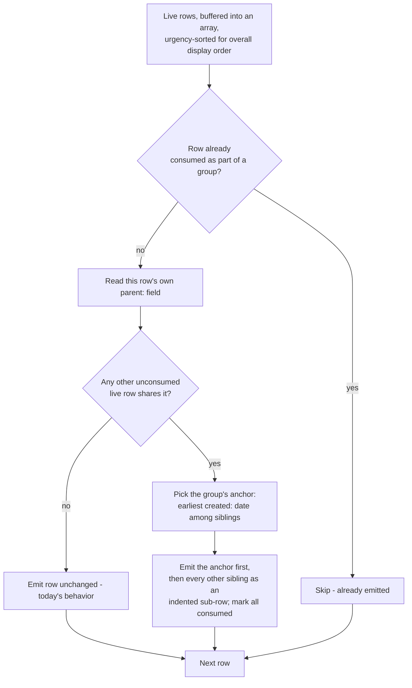

# Task Parent/Child Relationship

**Target repos:** `dotfiles` (primary — this plan's home) and the central task
store `~/code/tasks` (a separate git repo). Paths below are dotfiles-repo-relative
unless prefixed `tasks/`, which is `~/code/tasks`-repo-relative (that repo has no
directory named `tasks`, so the prefix is unambiguous).

## Goal Capsule

- **Objective:** add a `parent: <repo>--<slug>` frontmatter field linking child
  tasks to a coordinating parent, wire it through `wb new`, and surface it in
  the live picker and `/board`'s HTML view — without changing session topology.
- **Authority hierarchy:** this plan sequences a build whose design is already
  settled by `logs/decisions/2026-07-09-hub-v0-scoping.md` (D9-D12) and
  `docs/roadmap-handoff.md`. Where this plan makes a call the decision records
  left open (picker grouping mechanics, migration mechanism), it says so
  explicitly rather than re-opening the settled parts.
- **Stop conditions:** stop and ask before touching `/handoff` mechanics (boot
  polling, tmux injection, the permission handshake) or introducing sibling-task
  ties — both are explicitly out of scope for this build.
- **Execution profile:** code, Standard depth, four independent-ish units, no
  phased milestones needed.
- **Tail ownership:** the implementer runs the six `*.test.sh` suites in the
  Verification Contract and smoke-checks `wb board --html` before calling
  U2/U3 done. U4's migration is verified by manual diff review, not an
  automated suite — it edits a separate repo's content files, not reusable
  `wb.sh` logic.

---

## Product Contract

### Summary

Add a `parent:` frontmatter field to the central task store's schema, let `wb new`
set it at creation time, group live sibling sessions in the `wb` picker, and make
real the parent/children rollup already mocked up in `/board`'s HTML detail
cards. A one-time pass brings every existing task file up to the settled schema
(`closed:`, `parent:`) alongside a `README.md`/`TEMPLATE.md` doc update.

### Problem Frame

Nothing in the task-store schema represents "this task is a piece of that task"
today — `tags:` is documented as free cross-project grouping, not a relationship.
`/handoff`'s dry run (`docs/roadmap-handoff.md`, finding 5) hit this directly: a
discussion that splits into several related pieces (three flaky tests, a
cross-repo FE+BE pair) has no way to be represented as one coordinated unit, and
the picker/`/board` have no way to show that grouping even once the field exists.

### Requirements

**Schema and wiring**
- R1. A task's frontmatter can carry a `parent: <repo>--<slug>` field naming its
  coordinating parent's filename stem.
- R2. A parent task's own `repo:` is a placeholder — it coordinates rather than
  does the work — so same-repo and cross-repo (full-stack FE+BE) parents share
  one representation with no special-casing.
- R3. `wb new` can set a child's `parent:` at creation time via a `--parent`
  flag, validated against an existing parent task file, failing loudly on a
  missing or malformed reference (same tone as `wb resume`'s no-match error).
  `wb reconcile --apply`'s create-task action gets the same optional
  capability, so a task created from a reconcile finding can also be linked
  to a parent at creation time, not just tasks created via `wb new`.
- R4. Session topology is unchanged: one tmux session per repo via the existing
  `cmd_new`. Parent/child linkage never implies a shared or multi-worktree
  session — this is what keeps the "one worktree = one agent's cwd" assumption
  the attention-pipeline hooks, credential guard, and `wb reconcile` rely on.

**Picker rendering**
- R5. The picker visually groups live sibling sessions that share a `parent:`
  field, without inventing a session (or a row) for the parent itself, since the
  parent never has one.

**Board rendering**
- R6. `/board`'s HTML view shows a parent task's own linked artifacts by default
  and rolls up every child's artifacts behind an explicit, zero-JavaScript
  toggle (native `
` disclosure, matching the board's existing R8/R10
  CSS-only decision).

**Migration and docs**
- R7. Every file in the central task store is brought up to the settled schema
  (`closed:`, `parent:`) in one pass, and `tasks/README.md`/`tasks/TEMPLATE.md`
  document `parent:`.

### Scope Boundaries

- Sibling ties between tasks — the north star mentions "siblings or
  parent/child," but only parent/child ships here.
- `/handoff` itself (task-file-as-payload, boot-readiness polling, the
  permission handshake, first-action selection, the multi-target fan-out loop)
  — builds after this lands and consumes `parent:`; this build only makes sure
  the field/lookup shape doesn't foreclose it.
- Plain-text `wb board` (no `--html`) stays exactly as it is today — the
  resolved design calls out the picker and the HTML board specifically, not the
  plain-text table.
- `--parent`'s value is an exact `<repo>--<slug>` stem, not a fuzzy substring
  match like `wb resume` — deliberately simpler than adding a second matching
  path.
- U2's grouping has no organic trigger yet: only exact-match `wb new
  --parent` invocations can produce two live siblings today, since
  `/handoff`'s multi-target fan-out loop (the routine source of real
  sibling sessions) is out of scope here. U2 ships validated against
  synthetic fixtures only; revisit real dogfood coverage once `/handoff`
  lands.

#### Deferred to Follow-Up Work

- A durable `wb`-level migration/reconciliation subcommand. U4 is a one-time
  pass, not new permanent surface — a repeatable command would be scope beyond
  what a settled, one-time schema catch-up needs.
- A `wb breakdown` command that takes a goal or Jira task and decomposes it
  into work items, creating the `parent:` relationships automatically. This
  would be a more elegant answer to "who authors the first parent task
  file" than U1's interim hand-authored-from-`TEMPLATE.md` convention — a
  real idea, but its own build, not this one.

### Acceptance Examples

- AE1. Given two live sessions in different repos whose task files share a
  `parent:` value, when the picker renders in combined mode, then one becomes
  the anchor row and the other renders as an indented sub-row beneath it, each
  still showing its own live status. Covers R5.
- AE2. Given a parent task with three children but only one currently has a
  live session, when the picker renders, then that child shows as a normal
  top-level row — no grouping UI, since it has no live sibling — and the parent
  itself never appears as a row. Covers R5.
- AE3. Given a parent task whose children's files each reference `docs/plans`
  or `logs/decisions` paths, when `/board`'s HTML detail card for that parent
  is viewed, then the card shows the parent's own linked docs by default and an
  explicit toggle reveals the deduplicated union of every child's linked docs.
  Covers R6.

---

## Planning Contract

### Key Technical Decisions

- **Picker grouping reuses a live sibling as the anchor, never a synthetic row.**
  A parent task is session-less by design (placeholder `repo:`, never `wb
  new`'d), so there is nothing live to anchor a group on. Live siblings
  sharing a `parent:` value nest together — one anchor, the rest as indented
  sub-rows — same convention `wb_agent_subrows` already established. The
  parent stays reachable only via `/board` or its file, never the live
  picker — consistent with the picker's existing presence-only philosophy
  (wb.sh:1453-1456), which this design doesn't bend.
- **The anchor is the earliest-`created:` sibling, not the live-urgency-sorted
  first one.** Urgency rank is derived from each session's most-urgent
  `claude` pane status, which cycles continuously
  (`wb_status_icon`/`wb_session_urgency`, wb.sh:1485-1513) — anchoring on it
  would flip which sibling is "anchor" vs. "indented sub-row" between the
  picker's own auto-refreshes, the normal case for two actively-worked
  siblings, not an edge case. `created:` is a stable, already-read field
  (`wb_board_collect_rows` reads it today) with an intuitive story: the
  sibling that's been around longest anchors the group.
- **Sibling sub-rows carry their own discriminator, not `kind=="agent"`.**
  The indent/blank-repo-cell logic in `wb_format_for_display` is gated on a
  literal `kind=="agent"` check (wb.sh:1613-1657) — a sibling sub-row is an
  independently live *task* session (`kind="task"`), so reusing that gate as
  written would silently skip the indent entirely. Reusing `kind=="agent"`
  itself instead (forcing the value) was considered and rejected: it makes
  `kind` lie for display while dispatch code still needs the real value, and
  it would wrongly blank the repo cell for what's explicitly a cross-repo
  relationship (R2). `wb_parent_subrows` and `wb_format_for_display` instead
  gain a dedicated marker with its own connector (distinct from agent panes'
  `" > "`), and sibling sub-rows keep their own repo cell visible.
- **`collect_combined_rows` buffers rows into an array before grouping.** The
  function is a single-pass streaming loop today; deciding a group's anchor
  by `created:` date (not by scan order) requires seeing every live sibling
  before emitting any of them, the same reason `wb_board_render_html` already
  buffers its own `ROWS=()` rather than streaming.
- **`wb new` gains `--parent`, mirroring the existing `--agent` flag; `wb
  reconcile --apply`'s create-task action gains the same capability.**
  Without a way to set the field at creation time, it would only ever be
  reachable by hand-editing a task file — inert for `/handoff`'s later
  fan-out loop. Both flags validate the reference exists rather than
  accepting an arbitrary string, matching `wb resume`'s
  fail-loud-on-no-match convention.
- **Migration cannot reuse `wb_set_frontmatter`.** That helper only overwrites
  a line that already matches `^key:` — it has no insert path for a key that
  isn't present at all (wb.sh:63-71). Every real task file today lacks
  `parent:` entirely, and 11 of 13 lack `closed:`, so the one-time migration
  pass needs its own insert-missing-lines logic, not a call to the existing
  helper. This also means `--parent`/`wb_seed_task`'s use of
  `wb_set_frontmatter` on existing files only works once the migration (or the
  template, for brand-new files) has already put the blank line in place.
- **Migration is a one-time cross-repo pass, not new `wb.sh` surface.** It
  edits `~/code/tasks`, a separate git repo — it lands as its own commit there,
  not inside the dotfiles branch this plan otherwise targets.
- **`wb_seed_task` defaults its new parameter, rather than updating its
  second call site.** `wb_reconcile_action_create_task` (wb.sh:579) also
  calls `wb_seed_task` with the pre-existing 3 args; under `set -euo
  pipefail`, referencing an unguarded 4th parameter would break that
  call site. `wb_seed_task` takes the parent ref as `"${4:-}"` and only
  writes `parent:` when it's non-empty, so that call site needs no edit of
  its own for the default (no-parent) path — the parent-aware path (below)
  is additive on top of this default.
- **`wb_parent_subrows`'s / `wb_board_render_html`'s children-lookup both
  skip a task that names itself as its own parent.** Mirrors U2's own
  explicit self-reference guard on the picker side — without it, a
  self-referencing task's `/board` card would render nested inside itself.
- **Plain-text `cmd_board` stays untouched.** Only the picker and the HTML board
  gain parent/child rendering, per the resolved design's explicit scope.
- **New dedicated test file for picker row-collection.** `collect_combined_rows`,
  `wb_live_session_row`, and `wb_agent_subrows` have zero existing test coverage
  today (confirmed: no test file references them). Rather than wedging picker
  coverage into `wb-schema.test.sh`, a new `wb-parent-child.test.sh` follows the
  established one-file-per-feature convention (`wb-pause.test.sh`,
  `wb-resume.test.sh`), using real throwaway tmux sessions the way
  `wb-pause.test.sh` already does.

### High-Level Technical Design

The picker's grouping pass has enough branching to warrant a sketch — the rest
of this plan's units are direct pattern applications of existing conventions.

Buffering (not streaming) is required here: deciding the anchor by
`created:` date means the group's chosen anchor may not be the specific row
the scan is currently on, so every sibling must already be visible before
any of the group emits — the same reason `wb_board_render_html` buffers its
own `ROWS=()` rather than streaming.

`/board`'s rollup (U3) builds a parent-stem -> child-files map once per render
(one pass over `wb_task_files`), then looks it up per row — a direct
application of the existing per-task lookup pattern `wb_board_collect_rows`
already uses, not diagrammed separately.

### Sequencing

U1 has no code dependency on the others but defines the schema semantics U2-U4
build on, so it lands first. U2 and U3 are independent of each other and of
U4's separate-repo change; U4 should still land after U1 in review order so the
backfilled field position matches the template.

---

## Implementation Units

### U1. Schema: `parent:` field + `wb new --parent` wiring

**Goal:** introduce `parent:` across the schema surface (template, docs) and
let `wb new` set it on a child task at creation time, validated against an
existing parent task file.

**Requirements:** R1, R2, R3, R7 (template/README half; U4 covers the backfill).

**Dependencies:** none.

**Files:**
- `scripts/.config/scripts/tmux/wb.sh`
- `scripts/.config/scripts/tmux/tests/wb-schema.test.sh`
- `scripts/.config/scripts/tmux/tests/wb-reconcile.test.sh`
- `scripts/.config/scripts/tmux/tests/wb-reconcile-review.test.sh`
- `tasks/TEMPLATE.md`
- `tasks/README.md`

**Approach:** add a `parent:` line to `tasks/TEMPLATE.md` right after
`worktree:` (before `tags:`), with an inline comment naming the
`<repo>--<slug>` shape — same style as the existing `status:`/`closed:`
inline guidance. Document the same field and the placeholder-`repo:` note in
`tasks/README.md`'s schema block, including the interim convention that a
parent task file is hand-authored from `TEMPLATE.md` (no `wb` command
creates one yet — a future `wb breakdown` command is a real idea but its
own build, not this one) with `repo:`/`worktree:` left blank per the
template's existing "empty if none" convention.

In `wb.sh`, restructure `cmd_new`'s flag handling: today's loop
(wb.sh:231-237) is a single-token `for` built only for boolean flags, which
can detect `--parent` as a literal but has no way to consume its value as a
separate following argument. Rewrite it as an index/shift `case`-based
parser (matching how `case` is already used elsewhere in this file, e.g.
`wb_status_icon`, `cmd_reconcile`) so `--parent <ref>` and the existing
`--agent` both parse correctly in one pass. Resolve `<ref>` the same way
`wb_task_file` already builds a store path, and fail loudly if no such file
exists — before any worktree or task file is touched.

Thread the validated ref into `wb_seed_task` as a new, defaulted 4th
parameter (`local parent="${4:-}"`), setting `parent:` via
`wb_set_frontmatter` only when non-empty, on both the new-file and
existing-file branches. Defaulting (rather than updating every call site)
matters because `wb_seed_task` has a second caller,
`wb_reconcile_action_create_task` (wb.sh:579), which calls it with the
pre-existing 3 args — under `set -euo pipefail` an unguarded 4th-parameter
reference would break that call site. On top of the safe default, extend
the reconcile review-doc's create-task action to optionally carry a
`parent: <ref>` annotation on its action line, which `wb_reconcile_apply`
reads and passes through to `wb_seed_task`'s new parameter — so a task
created from a reconcile finding can be linked to a parent at creation
time too, not only tasks created via `wb new`.

**Test scenarios:**
- Happy path: `cmd_new --parent dotfiles--parent-x <repo> <slug>` creates a new
  task file whose `parent:` value is `dotfiles--parent-x`.
- Happy path: the same flag against an existing task file (blank `parent:`
  line already present) fills it in without disturbing any other field.
- Edge case: `--parent` names a task file that doesn't exist in `$TASKS_DIR` —
  `cmd_new` exits non-zero with a clear error and makes no worktree or task
  file change.
- Edge case: no `--parent` given — behavior is identical to today (field stays
  blank), no regression.
- Integration: `--parent` and `--agent` together in one invocation both take
  effect; neither flag's parsing interferes with the other's.
- Regression: `wb_reconcile_action_create_task`'s pre-existing 3-arg call to
  `wb_seed_task` still succeeds unmodified (no unbound-variable error) and
  still creates a task with a blank `parent:`.
- Happy path: a reconcile review doc's create-task action carrying a
  `parent:` annotation produces a task file whose `parent:` matches it.

**Verification:** `bash scripts/.config/scripts/tmux/tests/wb-schema.test.sh`,
`bash scripts/.config/scripts/tmux/tests/wb-reconcile.test.sh`, and `bash
scripts/.config/scripts/tmux/tests/wb-reconcile-review.test.sh` all pass;
`tasks/TEMPLATE.md` and `tasks/README.md` both document `parent:`.

---

### U2. Picker: parent-aware sibling grouping

**Goal:** group live sibling sessions sharing a `parent:` field in the picker's
combined view, anchored on the first live sibling rather than a synthetic
parent row.

**Requirements:** R4, R5.

**Dependencies:** none (uses the existing generic `wb_get_frontmatter`;
sequenced after U1 for schema-semantics consistency, not code necessity).

**Files:**
- `scripts/.config/scripts/tmux/wb.sh` (`collect_combined_rows`; new
  `wb_parent_subrows`; `wb_format_for_display`)
- `scripts/.config/scripts/tmux/tests/wb-parent-child.test.sh` (new)

**Approach:** `collect_combined_rows` buffers `collect_live_rows`'
urgency-sorted output into an array first (the same `ROWS=()` pattern
`wb_board_render_html` already uses) rather than streaming, since deciding
a group's anchor by `created:` date needs to see every live sibling before
emitting any of them. For each buffered row, read its own task file's
`parent:` field once (empty when the row has no task file, no parent set,
or the parent value equals the row's own stem — self-reference is ignored,
same guard U3 uses). Track which sessions have already been consumed as
part of a group. For an unconsumed row whose parent value is shared by at
least one other unconsumed live row: look up every live sibling sharing
that parent, pick the one with the earliest `created:` frontmatter date as
the anchor — stable across refreshes, unlike urgency rank — emit it first
(even if it isn't the row the scan is currently on), then emit every other
sibling immediately after as an indented sub-row via `wb_parent_subrows`,
marking the whole group consumed. A row with no shared-parent sibling
emits unchanged, exactly as today.

`wb_parent_subrows` and `wb_format_for_display` (wb.sh:1613-1657) both gain
a discriminator distinct from `wb_agent_subrows`' `kind=="agent"` gate:
reusing that gate as-is would silently skip the indent (a sibling sub-row
is `kind="task"`, not `"agent"`), and forcing `kind="agent"` instead would
make the field lie for display while dispatch code still needs the real
value, plus wrongly blank the repo cell for what's explicitly a cross-repo
relationship (R2). The new marker carries its own connector, distinct from
agent panes' `" > "`, and sibling sub-rows keep their own repo cell
visible — unlike agent sub-rows, which blank it because an agent pane is
always the same repo as its parent session.

**Test scenarios:**
- Happy path: two live sessions in different repos whose task files share a
  `parent:` value — output shows the earliest-`created:` one as anchor, the
  other indented immediately after it, with its own repo cell still visible.
- Happy path: three live siblings sharing one parent all group together (one
  anchor, two sub-rows), regardless of the urgency order they'd otherwise sort
  into.
- Happy path: the anchor stays the same earliest-`created:` sibling across
  repeated renders even as the siblings' live urgency status changes.
- Edge case: a live session's task has a `parent:` value shared by no other
  live session — renders as a normal top-level row, no grouping artifacts.
- Edge case: a live session's task has no `parent:` at all — unchanged from
  today.
- Edge case: a task's `parent:` value is its own stem (self-reference) — does
  not group with itself and does not loop; renders as a normal top-level row.
- Integration: grouping coexists with existing agent-sub-row expansion — a
  sibling that is also a multi-agent session still expands its own agent
  panes correctly beneath its (possibly indented) row, and the two nesting
  kinds render with visually distinct connectors.
- Regression: sessions sharing no parent sort and render exactly as they do
  today, byte-for-byte, after the streaming-to-buffered change.

**Verification:** `bash scripts/.config/scripts/tmux/tests/wb-parent-child.test.sh`
passes, using real throwaway tmux sessions per `wb-pause.test.sh`'s convention;
manual smoke-check in a live `wb` picker session with two fixture children.

---

### U3. `/board` rollup: parent/children disclosure

**Goal:** make real the mocked-up rollup in the board's HTML detail cards — a
parent's own artifacts by default, its children listed, and an explicit toggle
rolling up every child's artifacts too, using native `
` disclosure
only.

**Requirements:** R6.

**Dependencies:** none (introduces its own children lookup; sequenced after
U1).

**Files:**
- `scripts/.config/scripts/tmux/wb.sh` (`wb_board_render_html`; new
  parent-stem-to-children lookup; extends use of `wb_board_related_docs`)
- `scripts/.config/scripts/tmux/tests/wb-board-html.test.sh`

**Approach:** before the render loop, build a one-pass map from a task's
filename stem to the list of its children's task files, reading every task
file's `parent:` field once via the existing `wb_task_files` — skipping a
task that names itself as its own parent, the same self-reference guard U2
uses, so a self-referencing task's card never nests inside itself. When
rendering a detail card whose stem is a key in that map, wrap the existing
card in a `
` (open by default, so today's content still shows at a
glance) with a `
` carrying title, status, and its own artifact
count, followed by one line per child — status pill, title, and that
child's own `wb_board_related_docs` links, matching the mockup's child-row
shape. Compute the deduplicated union of every child's
`wb_board_related_docs` output; when non-empty, render it inside a second,
nested `
` (closed by default) whose `
` names the count
(e.g. "Show N artifacts from sub-tasks too", mirroring the mockup's exact
copy at `logs/decisions/2026-07-08-board-mockup-a-table.html:193`); when the
union is empty, omit the nested `
` entirely rather than rendering
an expand-to-nothing toggle. A task with no children renders exactly as it
does today — no wrapper, no markup change. Every new title/text insertion
point, including the nested toggle's summary text, goes through the
existing `wb_board_html_escape`.

**Test scenarios:**
- Happy path: a task with two children renders a `
` card listing
  both, each with its own status pill and doc links.
- Happy path: the nested rollup toggle's `
` names the correct
  artifact count, and expanding it shows the deduplicated union of both
  children's related docs.
- Edge case: a parent whose children fall outside the current tab/timeline
  window still renders its own card unchanged — no dangling empty disclosure.
- Edge case: a child with no related docs at all shows just its status pill
  and title, no dangling doc-link markup.
- Edge case: when the deduplicated union of all children's docs is empty,
  the nested rollup `
` is omitted entirely — no expand-to-nothing
  toggle.
- Edge case: a task whose `parent:` is its own stem is excluded from its
  own children map — its card never nests inside itself.
- Edge case: cross-repo children (e.g. one `be--monorepo`, one `frontend`)
  each render with their own repo label, proving the relationship isn't
  repo-scoped.
- Regression: a task with no children renders identically to before this
  change.
- Integration: a title containing `<` or `&` — in the parent's, any
  child's, or the nested toggle's summary text — doesn't break the
  disclosure markup, proving every new insertion point is escaped.

**Verification:** `bash scripts/.config/scripts/tmux/tests/wb-board-html.test.sh`
passes; `wb board --html` against a small fixture store renders with balanced
`
` tags on manual inspection.

---

### U4. Task-store schema migration (existing files)

**Goal:** bring every existing file in the central task store up to the
settled schema — `closed:` where missing (11 of 13 files today), `parent:`
(blank) on every file (0 of 13 have it today) — without disturbing any
existing value.

**Requirements:** R7 (migration half).

**Dependencies:** none at the code level; sequenced in review order after U1
so the backfilled field position matches the template. Lands as its own
commit in `~/code/tasks`, not the dotfiles branch.

**Files:**
- `tasks/*.md` (every real task file — excludes `TEMPLATE.md`, `README.md`,
  and the `dossiers/` directory)

**Approach:** since `wb_set_frontmatter` only overwrites an existing line (see
Key Technical Decisions), this is a small one-off pass — not a permanent
`wb.sh` feature, since it's explicitly a one-time cleanup — that, per file,
inserts a `parent:` line after `worktree:` when absent, and a `closed:` line
at the end of the frontmatter block when absent. Both insertions are skipped
entirely when the key already exists, so no existing value is ever touched.

**Test scenarios:**
Test expectation: none — a one-time pass over a separate repo's content files,
not reusable `wb.sh` logic. Verified by manual review instead (see
Verification).

**Verification:** after running, every file in `tasks/*.md` (excluding
`TEMPLATE.md`/`README.md`) has both a `closed:` and a `parent:` line; a diff
review confirms no existing frontmatter value — `status`, `repo`, `branch`,
`worktree`, `tags`, `created`, or the 2 files' existing `closed:` values —
changed.

---

## Verification Contract

| Command | Applicability | Done signal |
|---|---|---|
| `bash scripts/.config/scripts/tmux/tests/wb-schema.test.sh` | U1 | `ALL PASS` |
| `bash scripts/.config/scripts/tmux/tests/wb-reconcile.test.sh` | U1 (regression + new optional-parent coverage) | `ALL PASS` |
| `bash scripts/.config/scripts/tmux/tests/wb-reconcile-review.test.sh` | U1 (regression + new optional-parent coverage) | `ALL PASS` |
| `bash scripts/.config/scripts/tmux/tests/wb-parent-child.test.sh` | U2 | `ALL PASS` |
| `bash scripts/.config/scripts/tmux/tests/wb-board-html.test.sh` | U3 | `ALL PASS` |
| `bash scripts/.config/scripts/tmux/tests/wb-board.test.sh` | Regression only — U2/U3 must not change plain-text output | `ALL PASS` |
| Manual diff review of `tasks/*.md` | U4 | Every file has `closed:` + `parent:`; no existing value changed |

## Definition of Done

- All six `*.test.sh` suites above pass.
- `wb board --html` renders without error against the real `~/code/tasks` store
  post-migration.
- `tasks/README.md` and `tasks/TEMPLATE.md` document `parent:`.
- No leftover exploratory code (e.g. a throwaway migration script, if written
  as a standalone file rather than run inline) remains tracked in either
  repo once U4's pass has been applied.
- Per unit: U1 done when `--parent` round-trips through both the new-file and
  existing-file branches of `wb_seed_task`; U2 done when sibling grouping
  renders correctly in a live picker smoke-check; U3 done when the disclosure
  renders correctly for a real parent task; U4 done when every store file
  matches the settled schema.

---

## Risks & Dependencies

- **Insert-vs-overwrite trap.** Any future code that calls `wb_set_frontmatter`
  for `parent:` against a task file predating this build's migration silently
  no-ops (see Key Technical Decisions). Sequencing U4 in this same build closes
  the gap for every current file; a future consumer creating task files by
  hand rather than via `wb_seed_task` would reopen it.
- **Cross-repo boundary.** U4 and part of U1 edit `~/code/tasks`, not
  `dotfiles`. Committing them into the wrong tree would silently split the
  feature across two unrelated commits with no shared history.
- **`wb_board_render_html` is already a large, string-building function
  (~180 lines).** Adding more inline HTML increases the chance of a stray
  quote or an unescaped insertion point; mitigated by routing every new title
  or text field through the existing `wb_board_html_escape`.

## Sources / Research

- `logs/decisions/2026-07-09-hub-v0-scoping.md` (D9-D12) — the resolved
  schema/topology/rendering design this plan sequences.
- `logs/decisions/2026-07-10-workflow-calibration.md` (D1) — resequencing
  ahead of Hub v0.
- `docs/roadmap-handoff.md` §"The sub-task relationship gap" and §"Dry-run
  findings — 2026-07-10" — fuller design prose and the mechanical findings
  that shaped the `--parent` flag's rationale.
- `logs/decisions/2026-07-08-board-mockup-a-table.html:179-204` — the
  speculative rollup markup U3 makes real.
- `scripts/.config/scripts/tmux/wb.sh:63-71` (`wb_set_frontmatter`),
  `:231-288` (`cmd_new`), `:1516-1528` (`wb_agent_subrows`), `:1081-1263`
  (`wb_board_render_html`) — the existing conventions each unit extends.
- `tasks/README.md`, `tasks/TEMPLATE.md` — current schema; confirmed by
  direct inspection that 11 of 13 real task files lack `closed:` and none
  have `parent:`.
- `scripts/.config/scripts/tmux/tests/wb-pause.test.sh` — the real-throwaway-
  tmux-session test convention U2's new suite follows.
- `logs/decisions/2026-07-10-task-parent-child-plan-review.md` — the
  `ce-doc-review` pass and decision-buffer resolution behind the KTDs added
  after this plan's first draft (anchor-by-`created:`, the sibling-sub-row
  discriminator, `wb_seed_task`'s safe default, the `/board` rollup's
  nested-toggle label, and the self-reference guards).
