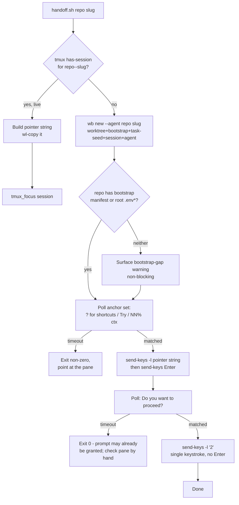

# /handoff v1 - Plan

## Goal Capsule

- **Objective:** implement `/handoff` v1 — take a discussion mid-conversation
  and route it to the right worker: switch to an already-live session
  (clipboard handoff) or spin up a fresh one (`wb new --agent` + inject),
  single-target only.
- **Authority hierarchy:** this plan, then `~/code/tasks/dotfiles--feat-handoff-v1.md`,
  then `docs/roadmap-handoff.md`. One constraint sits above all three and is
  never renegotiated during implementation: `scripts/.config/scripts/tmux/wb.sh`
  is never modified.
- **Stop conditions:** if implementation pressure pushes toward editing
  `wb.sh`, building multi-target fan-out, directly instructing an
  already-busy live agent (beyond switch + clipboard), or writing
  settings-mutation logic — stop and flag rather than proceeding. All four
  are explicit non-goals below, not open questions to resolve mid-build.
- **Execution profile:** solo personal repo, no CI, bash throughout. Tests
  are plain-bash assertions against real throwaway tmux sessions (this
  repo's existing convention — see Patterns below), never mocked tmux.
- **Tail ownership:** the implementer runs the new test files plus one live
  manual smoke walkthrough (spawn path end-to-end, then switch path against
  the now-live session) before calling a unit done. Docs regenerate
  automatically on commit (`.githooks/pre-commit` drives docgen) — no manual
  doc-build step.

---

## Product Contract

### Summary

Add `/handoff`: a new sibling script (`scripts/.config/scripts/tmux/handoff.sh`)
plus a skill (`claude/.claude/skills/handoff/SKILL.md`) that route one
piece of in-conversation discussion to its worker. The skill's job is
entirely the task file — infer repo/slug from conversation, seed or append
rich context into that task's `## Plan`. The script's job is entirely
mechanical — check for a live session, then either switch + clipboard, or
spawn via `wb new --agent` and inject a short pointer once the agent boots
and clears its one-time `~/code/tasks/` read prompt. `wb.sh` itself is
never touched; `handoff.sh` reuses its `wb_sanitize`/`wb_task_file`/
frontmatter helpers by sourcing it the same way the existing test suite
already does.

### Problem Frame

Mid-conversation, a clearly-standalone piece of follow-up work (a flaky
test needing its own fix, a design question needing its own planning
session) currently gets routed to its own agent **by hand**: `wb new --agent`,
a hand-seeded task file, a hand-typed tmux injection, watched and answered
live. That exact flow was run by hand twice on 2026-07-10 and
agent-orchestrated end-to-end a third time — each run surfaced the same
mechanical friction points (task-file payload shape, boot-timing, a
permission prompt that fires unconditionally, a model-selection footgun).
None of the friction is about *deciding* what to route where — the
conversation already has that context. It's the four-to-six manual steps
in between that `/handoff` v1 mechanizes.

### Requirements

**Scope boundary**

- R1. `/handoff` routes exactly one repo/slug per invocation. Fan-out
  (splitting a discussion into several linked tasks) is out of scope for
  v1 — it depends on the task parent/child relationship, which is designed
  (`logs/decisions/2026-07-09-hub-v0-scoping.md` D9-D12) but not yet built
  on the parallel `feat/task-parent-child` branch.
- R2. `scripts/.config/scripts/tmux/wb.sh` is never modified. All new
  behavior lives in `scripts/.config/scripts/tmux/handoff.sh` and the
  `/handoff` skill, shelling out to `wb new` / tmux exactly as the manual
  dry runs did.

**Task-file-as-payload**

- R3. Rich context for the routed work is written into the target task
  file's `## Plan` before `handoff.sh` runs — creating the file from the
  store's template if it doesn't exist yet, appending under `## Follow-ups`
  instead when `## Plan` already holds unrelated in-flight narrative.
  Full context is never inlined into injected tmux keystrokes.
- R4. Both delivery paths (spawn and switch) carry the identical short,
  fixed pointer naming the task file's path — the file itself is what
  states the first action (R6), not the pointer. There is one payload
  shape, not two.

**Session routing**

- R5. A live tmux session for the target repo/slug routes to switch +
  clipboard; its absence routes to spawn + inject via `wb new --agent`.
- R6. The first action is written directly into the target task file's
  body — a line immediately under the `#` title (e.g. "**First action
  when picked up:** `/ce-plan` from this file.") — mirroring this very
  task file's own existing convention, rather than passed to `handoff.sh`
  as a runtime argument. Defaults to `/ce-plan`; the skill states
  explicitly which action it chose and why whenever it picks something
  else — never silently inferred.
- R7. Per-spawn model selection is out of scope for v1. `handoff.sh` never
  sends `/model` to a spawned session — doing so saves that model as the
  user's global default for new sessions, a confirmed side effect from the
  2026-07-10 dry run.

**Boot / permission handshake**

- R8. Boot-readiness polls for a SET of anchors (`? for shortcuts`,
  `Try "`, the `NN% ctx` statusline) — any one match means ready. Never a
  fixed sleep, never a single literal string (the exact hint varies
  boot-to-boot, confirmed independently twice on 2026-07-10 and again this
  session).
- R9. Anchor matching is scoped to a bounded recent-lines window of the
  pane (mirroring this repo's existing `tmux_pane_awaiting_input` /
  `tail -n 20` convention). The injected pointer string is fully fixed —
  R6 moves `first_action` into the task file body, so `handoff.sh` never
  types it into the pane at all — so a poll can never match its own
  just-typed text sitting in the echoed input line before Enter is
  processed, by construction rather than a runtime check.
- R10. The one-time `~/code/tasks/` read-permission prompt (anchored on the
  literal `Do you want to proceed?`, and required to co-occur with a
  `~/code/tasks`/`Read` substring in the same matched window, so a
  differently-shaped prompt is never blind-approved) is cleared
  automatically: a single `2` keystroke (no trailing Enter — confirmed
  live, this menu selects and submits on one keystroke, unlike the main
  input box) selects the dialog's own session-scoped allow option.

**Surfaced, not fixed**

- R11. When the target repo has neither a `.worktree-bootstrap` manifest
  nor root `.env*` files, `/handoff`'s spawn path surfaces this gap to the
  user — both as a terminal warning and as a durable line under the task
  file's `## Follow-ups` — rather than silently proceeding with an
  incomplete bootstrap. The fix is a per-repo manifest — out of scope here.
- R12. Pre-scoped Claude Code settings (a `permissions.allow` rule
  pre-authorizing `~/code/tasks/` reads) are evaluated, not built as
  runtime-mutating logic this round. Resolved as a tracked reference-only
  snippet rather than either a live edit to the user's global, currently
  gitignored `~/.claude/settings.json` or new script logic that writes to
  it — already shipped ahead of this plan (`claude/.claude/settings.recommended.json`,
  `claude/README.md`).

### Scope Boundaries

#### Deferred to Follow-Up Work

- Multi-target fan-out — an explicit loop over the parent/child schema
  once `feat/task-parent-child` merges (R1).
- Instructing an already-busy existing agent directly, beyond switch +
  clipboard (the ask's own "v1 simplification").
- Per-spawn model selection via a launch-time flag/config on the `claude`
  invocation, if wanted later (R7 only rules out `/model`, not a future
  launch-time mechanism).
- Building the pre-scoped-settings mechanism for real (R12) — as its own
  small follow-up once the exact `permissions.allow` schema is verified
  against the installed Claude Code version's own docs, and once
  `~/.claude/settings.json` itself is deliberately brought under version
  control (a separate, already-deferred audit — `claude/README.md`
  "Deliberately NOT tracked").
- The `wb new` bootstrap-gap itself (R11 only surfaces it) — the fix is a
  per-repo `.worktree-bootstrap` manifest, tracked as its own roadmap line
  item per `docs/roadmap-handoff.md`.
- Post-merge wiring: `~/.zshrc` alias for `handoff.sh` (mirroring
  `alias wb=...`) and re-running `stow` so `~/.config/scripts/tmux/handoff.sh`
  exists — manual one-time steps after this branch merges, not code this
  plan produces (this worktree's own `~/.config/scripts/tmux/` symlinks
  still point at the main checkout).
- Non-blocking `/handoff` invocation — running independently of the
  invoking agent's current turn (not blocking on it finishing, not
  affecting its response) while still carrying that turn's context into
  the routed task. Explicitly parked by the owner until after real usage
  of v1 surfaces whether it's actually worth the added complexity.

---

## Planning Contract

### Key Technical Decisions

- **Responsibility split: `handoff.sh` is 100% mechanical; the skill owns
  the task file.** The skill computes repo/slug from conversational
  judgment and writes/appends rich context directly (Read/Write) to
  `~/code/tasks/<repo>--<disp_slug>.md`, where `<disp_slug>` is the slug run
  through the same sanitize transform `wb_sanitize` applies (`/`, `.`, `:`
  → `-`) — every real consumer of this path (`wb_seed_task`, `cmd_new`,
  `cmd_pause`, `wb_board_collect_rows`) computes it from the sanitized
  slug, never the raw one, so a slug containing `/` (the common case —
  branch-shaped slugs like `feat/foo-bar`) would otherwise resolve to two
  different files between the skill's write and `wb new --agent`'s later
  read. It never calls `wb new` itself. This isn't stylistic — if the
  skill called `wb new` (even bare, no `--agent`)
  to pre-seed the task file, `cmd_new`'s `is_new` check (`wb.sh:275-276`)
  would already see the session that call just created. By the time
  `handoff.sh`'s own `wb new --agent` ran moments later, `is_new` would be
  `false`, so `wb_layout_session` (`wb.sh:285`) — the thing that actually
  types `claude` into the agent window — would silently never run, and the
  boot-ready poller would wait forever for a process that was never
  started. `wb_seed_task` (`wb.sh:176-208`) only fills blank frontmatter
  fields and never touches the body, so a task file the skill wrote first
  is safe for `wb new --agent`'s own `wb_seed_task` call to see later —
  there's no ordering hazard in that direction, only in the reverse one.
- **Reuse `wb.sh` internals via sourcing, not duplication.** `wb.sh`'s own
  guard (`if [ "${BASH_SOURCE[0]}" = "${0}" ]`, end of file) exists
  specifically so another script can `source` it to reach `wb_sanitize`,
  `wb_task_file`, `wb_get_frontmatter`, `wb_set_frontmatter` without
  triggering its CLI dispatch — the same mechanism
  `tests/wb-resume.test.sh` already relies on to reach `cmd_resume` while
  stubbing `cmd_new`. `handoff.sh` sources `wb.sh` for these read-only
  helpers and shells out via subprocess (`"$WB" new --agent "$repo" "$slug"`)
  only for the actual worktree/session/agent-spawn mechanics — satisfying
  "never modify wb.sh" without hand-copying its sanitize logic where it
  could drift.
- **Uniform pointer text for both delivery paths, not two content shapes —
  and the first action lives in the task file, not the pointer.** The ask
  specifies path (a)'s delivery mechanism (clipboard + switch) but never
  its content. Rather than inventing a free-form clipboard payload for the
  less-common switch path, `handoff.sh` builds one short, fully fixed
  string — "Read the task file at `<path>` - it carries the full context
  and states the first action to take." — and either injects it (spawn) or
  clipboards it (switch). `first_action` itself is never part of that
  string: the skill writes it directly into the task file's body instead
  (R6), mirroring this very task file's own convention (a "First action
  when picked up: `/ce-plan` from this file" line right under the title).
  This keeps `handoff.sh`'s CLI surface to a flag-free `handoff.sh <repo>
  <slug>`, keeps a durable task-file trail even for the switch path (useful
  once `/board` or the parent/child rollup wants to surface it), and — as
  a direct side benefit — removes `first_action` as a source of
  runtime-variable text entirely, closing the free-text collision risk
  that R9's disjointness argument would otherwise have to defend against
  (a real gap two independent doc-review personas found in an earlier
  draft of this plan, where `first_action` was still a `handoff.sh` CLI
  flag threaded into the injected string).
- **Anchor sets are disjoint-by-construction from anything `handoff.sh`
  itself injects, plus a bounded tail-line scope as a second layer.**
  Dry-run #3 (spawning this very planning session) found a poller
  false-positiving by matching its own just-injected text sitting in the
  echoed input line. `handoff.sh`'s two anchor sets (`? for shortcuts` /
  `Try "` / `NN% ctx` for boot-ready; `Do you want to proceed?` for the
  permission dialog) are chosen so neither ever overlaps with the pointer
  string `handoff.sh` itself types into the pane — and since the pointer
  string is now fully fixed (no `first_action` substitution, per the KTD
  above), that disjointness holds unconditionally rather than depending on
  what a caller passes in. On top of that, matching scopes to a bounded
  recent-lines tail of `capture-pane` (same convention as `lib.sh`'s
  existing `tmux_pane_awaiting_input`, `tail -n 20`), which also keeps a
  stale banner or old scrollback from ever entering the match window. Full
  TUI-region parsing (precisely isolating "the live input box" from "the
  transcript") was considered and rejected as fragile and unprecedented in
  this codebase — the disjoint anchor choice is the real defense; the
  tail-window is cheap, precedented hardening on top.
- **Clipboard via `wl-copy`, no cross-platform fallback.** This machine is
  GNOME on Wayland (confirmed: `wl-copy`/`wl-paste` round-trip correctly),
  matching the user's settled environment direction (GNOME+Forge leading,
  Sway parked). A portability fallback would be speculative code for an
  environment that doesn't exist yet.
- **Pre-scoped settings: evaluated and shipped as a tracked reference
  file, not runtime-mutating script logic, and not an override of the
  existing "settings.json stays untracked" boundary.** `~/.claude/settings.json`
  is real, un-symlinked machine state, deliberately excluded from this
  repo's `claude` stow package "pending its own audit" (`b616561`); it also
  currently references Sportable-owned plugin marketplaces, which
  shouldn't land in this personal repo without a deliberate call. Rather
  than either overriding that boundary or writing script logic that
  mutates live global config, the recommended `permissions.allow` rule
  ships as `claude/.claude/settings.recommended.json` (a plain, valid JSON
  fragment) with merge instructions in `claude/README.md` — durable and
  reviewable without touching the live file or the audit boundary. This
  piece is already implemented in this worktree, ahead of the
  Implementation Units below.
- **`handoff.sh` also sources `lib.sh`** for `tmux_focus` (switch-client vs.
  attach, matching whether the caller is already inside tmux) rather than
  re-implementing that branch — `lib.sh` carries no CLI dispatch, so
  sourcing it has no guard to worry about.

### High-Level Technical Design



### Assumptions

- A fresh `git worktree add` subdirectory under an already-trusted
  `~/code/<repo>` tree never re-triggers Claude Code's folder-trust prompt
  — verified live this session (trusted a repo root once, then booted
  `claude` cold in a sibling worktree with zero prompt). `wb new`'s
  worktrees always live under an already-trusted `~/code/<repo>`, so the
  boot poller doesn't need a trust-prompt branch. If this assumption is
  ever wrong on some future machine/version, the poller still times out
  safely rather than hanging (R8's timeout applies here too).
- The permission dialog's option ordering (`2` = the session-scoped tasks/
  allow) is stable for a same-shaped prompt (a `Read` outside cwd, under
  `~/code/tasks/`). If a future Claude Code version reorders or rewords
  these options, `handoff.sh`'s hardcoded `2` keystroke would need
  recalibrating — same maintenance posture as `lib.sh`'s own
  version-calibrated modal detection (`tmux_pane_awaiting_input`'s doc
  comment already flags this class of drift).
- **Considered and rejected: avoiding the outside-cwd permission prompt
  entirely** by having the bootstrap step copy the target task file into
  the worktree and pointing the pointer string at that in-cwd copy instead
  of the absolute `~/code/tasks/` path — which would remove R9/R10's
  handshake requirement outright rather than automating around it.
  Rejected because the task store's canonical, singular location at
  `~/code/tasks/` is load-bearing elsewhere: the worktree-seeding rule
  (`~/.claude/CLAUDE.md`), `/board`, and the parent/child rollup
  (`logs/decisions/2026-07-09-hub-v0-scoping.md` D9-D12) all assume one
  authoritative file per task, not a copy that can drift from the
  original. The permission handshake is the cost of keeping that
  single-source-of-truth property; a future revisit is only worth it if
  the handshake itself becomes a real reliability problem in practice.
- **`handoff.sh` sources `wb.sh`, which reassigns `SCRIPT_DIR`/`SELF` to
  its own values** (`wb.sh:25-26`, both re-derived from `wb.sh`'s own
  `BASH_SOURCE` at the moment it's sourced) — harmless today only because
  `handoff.sh`'s design never reads `$SELF` and both scripts live in the
  same directory (so the reassigned `$SCRIPT_DIR` happens to still be
  correct). This is the same class of footgun as the 2026-07-10 deletion
  incident (an unconditional global reassignment in a sourced script
  silently clobbering the sourcing script's own variable of the same
  name) — if `handoff.sh` ever grows a feature that reads `$SELF` or
  relies on `$SCRIPT_DIR` after the `source wb.sh` line, re-capture both
  into differently-named locals immediately before sourcing.

---

## Implementation Units

### U1. `handoff.sh` scaffold: args, session/task-file computation, switch path

**Goal:** the script's entry point — safe sourcing of `wb.sh`/`lib.sh`,
argument parsing, and the simpler of the two branches (an already-live
session: clipboard + focus).

**Requirements:** R2, R4, R5, R6

**Dependencies:** none

**Files:**
- `scripts/.config/scripts/tmux/handoff.sh` (new)
- `scripts/.config/scripts/tmux/tests/handoff.test.sh` (new)

**Approach:** mirror `wb.sh`'s own header shape (`set -euo pipefail`,
`SCRIPT_DIR` resolution, `source lib.sh`) then additionally `source` `wb.sh`
itself — safe because `wb.sh`'s CLI dispatch is guarded by
`[ "${BASH_SOURCE[0]}" = "${0}" ]` (`wb.sh`, end of file), which is false
when `wb.sh` is sourced from another script, exactly the property
`tests/wb-resume.test.sh` already depends on. Parse positional
`<repo> <slug>` only — no flags; `first_action` lives in the task file's
body (R6), not on `handoff.sh`'s command line. Compute
`disp_slug=$(wb_sanitize "$slug")`, `session="${repo}--${disp_slug}"`,
`task_file=$(wb_task_file "$repo" "$disp_slug")`. Build the pointer string
once, fully fixed: `"Read the task file at $task_file - it carries the
full context and states the first action to take."`. Branch on
`tmux has-session -t "=$session"`: when true, `wl-copy` the
pointer string and call `tmux_focus "$session"` (from `lib.sh`), print a
one-line confirmation, exit 0. When the task file doesn't exist in this
branch, warn (don't fail) — a live session with no task file is an
inconsistent state worth flagging, but switching to it is still the right
action.

**Patterns to follow:** `cmd_new`'s arg-parsing loop (`wb.sh:231-237`),
`wb_task_file`/`wb_sanitize` (`wb.sh:98,119`), `tmux_focus` (`lib.sh`),
the test harness shape in `tests/wb-resume.test.sh` (source-with-guard,
plain-bash `assert()`, real throwaway tmux sessions).

**Test scenarios:**
- Happy path: `handoff.sh dotfiles feat/some-task` with no live session
  for that repo/slug does NOT take the switch branch (covered together
  with U2's spawn assertions, but the branch-selection logic itself is
  tested here against a stubbed/absent session).
- Happy path: a real throwaway tmux session named `<repo>--<slug>` exists
  → `handoff.sh` builds the correct, fully-fixed pointer string naming
  `$task_file`, and (assert via `wl-paste` after the call) the clipboard
  holds that exact string.
- Edge case: slug containing `/` (e.g. `feat/foo-bar`) sanitizes to the
  same dashed form `wb_sanitize` produces, so `session`/`task_file` match
  what `wb new` itself would have computed for the same slug.
- Error path: `handoff.sh` always requires both `<repo>` and `<slug>`
  explicitly (no `cmd_new`-style single-arg cwd-inferred convenience form
  — `/handoff` always knows both from conversational context, so there's
  no ambiguity to resolve at call time); invoking it with fewer than two
  positional args errors loudly with a usage message rather than
  attempting to infer `repo`.
- Switch-path edge case: live session exists but its task file is missing
  → warns to stderr, still switches and clipboards (does not fail).

**Verification:** `bash -n scripts/.config/scripts/tmux/handoff.sh` passes;
`bash scripts/.config/scripts/tmux/tests/handoff.test.sh` passes.

---

### U2. `handoff.sh` spawn path: `wb new --agent`, anchor-set poller, inject, permission handshake

**Goal:** the less-common-at-the-code-level but primary-in-practice branch
— no live session, so spawn one and carry it to a readable, permission-clear
state.

**Requirements:** R3 (indirectly — this unit trusts the task file already
carries rich context), R7, R8, R9, R10, R11

**Dependencies:** U1

**Files:**
- `scripts/.config/scripts/tmux/handoff.sh` (same file, extended)
- `scripts/.config/scripts/tmux/tests/handoff-poller.test.sh` (new)

**Approach:** a small generic poller,
`handoff_wait_for_pane_pattern <target> <timeout_secs> <extended-regex>`,
looping `tmux capture-pane -ep -t "$target" | tail -n 20 | grep -qE "$pattern"`
with a 1-second `sleep` between attempts up to the timeout (mirrors
`lib.sh`'s own `tail -n 20` scoping convention, `tmux_pane_awaiting_input`).
Default timeouts: 30s for the boot-ready poll, 20s for the permission-prompt
poll (both env-var overridable, e.g. `HANDOFF_BOOT_TIMEOUT`/
`HANDOFF_PERMISSION_TIMEOUT`, matching `WB_SWEEP_THRESHOLD`'s
override-with-a-default convention, `wb.sh:32`) — generous relative to the
~4-7s boot time observed live this session, since a slow machine losing the
handoff to a premature timeout is worse than a few extra seconds of
polling. Spawn path: call `"$WB" new --agent "$repo" "$slug"` (idempotent — same
call whether the worktree/task file already exist or not), then check the
target repo directory for a `.worktree-bootstrap` manifest or root
`.env*` files; when neither exists, print a non-blocking warning naming
the gap (R11) before continuing, AND append the same warning as a line
under the task file's `## Follow-ups` — a spawn nobody is watching the
terminal for shouldn't leave the gap's only record in a scrollback buffer,
and `## Follow-ups` is already the durable channel R3 establishes for
exactly this kind of note. Target pane is `"=$session:agent"` (the
window `wb_layout_session` names `agent`, `wb.sh:225`). Poll for the
boot-ready alternation (`\? for shortcuts|Try "|[0-9]+% ctx`); on timeout,
exit non-zero pointing at the target so the user can look by hand. On
match, `tmux send-keys -t "$target" -l "$pointer"` then a separate
`tmux send-keys -t "$target" Enter` (one single-line string, never literal
newlines — premature-submission risk). Poll for `Do you want to proceed\?`;
on timeout, exit 0 with a note that the prompt may already be clear or the
agent hasn't reached its first action yet (not a failure — the handoff
itself already succeeded). Before auto-answering, require the matched
window to also contain a `~/code/tasks` (or `Read`) substring — so a
differently-shaped dialog is never blind-approved — and exit 0 leaving
the prompt for the user to answer by hand when it doesn't. When it does,
`tmux send-keys -t "$target" -l '2'` — a single keystroke, no trailing
Enter (confirmed live: this menu selects and submits on the keystroke
itself, unlike the main input box).

**Technical design:**

```bash
# directional sketch — not literal implementation
handoff_wait_for_pane_pattern() {
  local target="$1" timeout="$2" pattern="$3" waited=0
  while [ "$waited" -lt "$timeout" ]; do
    tmux capture-pane -ep -t "$target" 2>/dev/null | tail -n 20 \
      | grep -qE "$pattern" && return 0
    sleep 1; waited=$((waited + 1))
  done
  return 1
}
```

**Patterns to follow:** `tmux_pane_awaiting_input` (`lib.sh`) for the
tail-scoped capture-pane convention; `wb_layout_session`'s window naming
(`wb.sh:215-229`); `wb_bootstrap`'s manifest/`.env*` check (`wb.sh:142-171`)
for how to detect the bootstrap-gap case in R11 without re-implementing
the bootstrap itself.

**Test scenarios:**
- Happy path: against a real throwaway tmux pane running a plain shell
  that `echo`s one of the three boot-ready anchors after a short delay,
  the poller returns success before its timeout.
- Happy path: same for the permission-prompt anchor.
- Edge case / regression (dry-run #2): a pane whose visible text contains
  "auto-allows `git push`" (the release-notes false-positive that broke a
  loose `grep -q allow` watcher) does NOT satisfy the boot-ready or
  permission-prompt patterns — the anchors are exact phrases, not the bare
  word "allow".
- Edge case / regression (dry-run #3): a pane whose visible text contains
  the literal pointer string itself (e.g. "Read the task file at
  ~/code/tasks/dotfiles--feat-foo.md - it carries the full context and
  states the first action to take.") does NOT satisfy the permission-prompt
  pattern (`Do you want to proceed\?`) — proves the anchor choice is
  disjoint from `handoff.sh`'s own injected text, per the KTD above.
- Auto-answer gating (R10): a pane matching `Do you want to proceed\?`
  alongside `~/code/tasks`/`Read` text triggers the `2` keystroke; a pane
  matching `Do you want to proceed\?` WITHOUT that substring does NOT
  trigger it.
- R7 regression: across every spawn-path test scenario above, assert
  `handoff.sh` never sends the literal string `/model` to the target pane
  via `send-keys` — this requirement has no other test coverage in the
  plan otherwise.
- Timeout path: a pane that never produces any anchor text returns failure
  from the poller within the configured timeout (test with a short timeout
  value, not the real default, to keep the test fast).
- Bootstrap-gap surfacing: a fixture repo dir with neither
  `.worktree-bootstrap` nor `.env*` triggers the R11 warning on stderr AND
  a matching line appended to the fixture task file's `## Follow-ups`; a
  fixture repo dir with either does neither.
- Injection shape: assert the pointer string is sent as one `send-keys -l`
  call followed by a separate `send-keys Enter` call, never a single call
  containing an embedded newline.

**Verification:** `bash scripts/.config/scripts/tmux/tests/handoff-poller.test.sh`
passes; a manual smoke run (real target repo + fresh slug, real `claude`
process) confirms the full spawn-to-permission-clear sequence end-to-end.

---

### U3. `/handoff` skill: repo/slug judgment, task-file seeding, invocation

**Goal:** the conversational trigger surface — the part of `/handoff` that
genuinely can't be a deterministic script, because deciding *which*
repo/slug a live discussion maps to needs the conversation's own context.

**Requirements:** R1, R3, R6

**Dependencies:** U1, U2 (the skill's last step invokes `handoff.sh`)

**Files:**
- `claude/.claude/skills/handoff/SKILL.md` (new)

**Approach:** document the skill's steps as agent guidance, not code:
(1) infer `repo` and `slug` from the conversation using the same
existing convention as the global worktree-seeding rule — check
`~/code/tasks/<repo>--*.md` for a task that already represents this
discussion before minting a new slug, matching by `repo:` frontmatter and
judgment on title/branch, not just an exact filename hit; ask the user
briefly only when genuinely ambiguous (cross-repo discussion, unclear
which piece is "this"). (2) Compute the task-file path the same way
`handoff.sh` will — by sanitizing the slug (`/`, `.`, `:` → `-`) before
building `<repo>--<disp_slug>.md`, not the raw slug — so the skill's write
and `wb new --agent`'s later read target the identical file; do this by
shelling out to `wb.sh`'s own helpers (e.g.
`bash -c 'source scripts/.config/scripts/tmux/wb.sh; wb_task_file "$1" "$(wb_sanitize "$2")"' _ "$repo" "$slug"`)
rather than re-deriving the sanitize transform by hand, so the path can
never drift from what `wb_task_file`/`wb_sanitize` actually compute.
Ensure the task file exists at that path: if missing, create it from
`~/code/tasks/TEMPLATE.md` filling the same frontmatter fields
`wb_seed_task` would (`repo:`, `branch: <slug>`, `worktree: .worktrees/<slug>`,
`status: doing`, `created:`, title) — never via `wb new` itself (the KTD
above explains why). (3) Determine `first_action` — default `/ce-plan`;
only pick something else (e.g. `/ce-work`) when the work is already fully
scoped with no open design decisions, and always state which was chosen
and why (R6 — explicit, not silently inferred) — then write it directly
into the task file's body as a line immediately under the `#` title (e.g.
"**First action when picked up:** `/ce-plan` from this file."), mirroring
this very task file's own convention; if a line like this already exists
(routing to an existing task), update it only if the new discussion calls
for a different first action, otherwise leave it. (4) Write the rich
context into `## Plan` when empty, or append under `## Follow-ups` when
`## Plan` already holds unrelated in-flight narrative. (5) Invoke
`handoff.sh <repo> <slug>` (no flags — `first_action` already lives in the
task file from step 3) and relay its outcome (switched-and-clipboarded vs.
spawned-and-injected vs. a timeout needing a manual look) back to the user
in one line.

**Patterns to follow:** the CLAUDE.md-documented worktree-seeding lookup
convention (task lookup by `repo:` frontmatter before seeding); `wb_seed_task`'s
frontmatter-fill template logic (`wb.sh:176-208`) as the shape to mirror
when the skill creates a task file directly, without calling it.

**Test scenarios:**
- Test expectation: none — this unit is agent-instruction prose, not
  executable code. Its correctness is verified by the manual smoke
  walkthrough in U2's Verification (a live `/handoff` invocation exercising
  the full skill → `handoff.sh` chain) and by re-reading the skill against
  R1/R3/R6 before considering it done.

**Verification:** a live, manual `/handoff` invocation from a real
in-progress conversation (or a deliberately staged one), using a slug that
contains a `/` (the common case, e.g. `feat/foo-bar`), produces a task
file with a correct "First action when picked up" line under its title
and real content under `## Plan`/`## Follow-ups`, followed by a
successful `handoff.sh <repo> <slug>` call — and the worktree/task file
`wb new --agent` operates on is confirmed to be the exact same file the
skill just wrote to (not a second, blank one).

---

### U4. Docs: roadmap sequencing, a handoff guide page

**Goal:** close the loop on `docs/roadmap-handoff.md` (mark v1 built, not
just designed) and give `/handoff` the same durable guide treatment
`wb new`/`wb resume`/etc. already have.

**Requirements:** none directly (documentation of the above, not new
behavior)

**Dependencies:** U1, U2, U3

**Files:**
- `docs/roadmap-handoff.md` (update "Sequencing" section; the dry-run #3
  block is already appended as of this session)
- `docs/handoff-guide.md` (new — mirrors `docs/wb-guide.html`'s source
  conventions: a `docs/*.md` source, docgen renders the `.html`)

**Approach:** update the existing "Sequencing" section's item 2 (mechanical
v1 requirements) and item 3 (multi-target fan-out) to reflect what shipped
vs. what's still deferred, rather than adding a new section. Write
`docs/handoff-guide.md` following the same frontmatter shape as
`docs/wb-guide.html`'s source (`title`, `status: current`, `tile`, `group:
personal-workflow`, `kind: guide`) — covers the two paths, how the first
action gets written into the task file rather than passed as a flag, and
points back to `docs/roadmap-handoff.md` for the full mechanical rationale
rather than duplicating it. No manual docgen
invocation needed — `.githooks/pre-commit` regenerates on commit for any
tracked `docs/*.md` change.

**Patterns to follow:** `docs/wb-guide.html`'s source frontmatter and
section shape; `docs/roadmap-handoff.md`'s own "Sequencing" section
structure.

**Test scenarios:**
- Test expectation: none — documentation only.

**Verification:** `git commit` triggers `.githooks/pre-commit`; confirm
`docs/handoff-guide.html` and `docs/INDEX.md` regenerate without error and
the new guide is reachable from the Hub/INDEX.

---

## Verification Contract

| Command | Applies to | Gate |
|---|---|---|
| `bash -n scripts/.config/scripts/tmux/handoff.sh` | U1, U2 | Syntax check, must exit 0 |
| `bash scripts/.config/scripts/tmux/tests/handoff.test.sh` | U1 | All assertions pass |
| `bash scripts/.config/scripts/tmux/tests/handoff-poller.test.sh` | U2 | All assertions pass, including both false-positive regressions |
| Manual smoke: spawn path against a real, fresh `<repo> <slug>` | U2, U3 | Boots, injects, clears the permission prompt, no manual intervention needed |
| Manual smoke: switch path against the now-live session from the run above | U1 | Focuses the session, clipboard holds the exact pointer string |
| `git commit` (triggers `.githooks/pre-commit`) | U4 | `docs/handoff-guide.html` + `docs/INDEX.md` regenerate cleanly |

## Definition of Done

- All four Implementation Units complete; every test scenario above has a
  corresponding passing assertion or documented manual-verification step.
- `wb.sh` has zero diff — `git diff --stat` against this branch shows no
  changes to `scripts/.config/scripts/tmux/wb.sh`.
- Both manual smoke walkthroughs (spawn path, then switch path against the
  session the spawn path just created) completed once, live, by the
  implementer — not just the automated tests.
- `docs/roadmap-handoff.md`'s "Sequencing" section reflects what actually
  shipped vs. what's still deferred; no stray dead-end code from an
  abandoned approach left in the diff.
- Post-merge follow-ups (zsh alias, re-running `stow`) are recorded where
  the next person picking this up will see them (task file `## Follow-ups`
  or this plan's Scope Boundaries) — not silently expected to be
  remembered.
