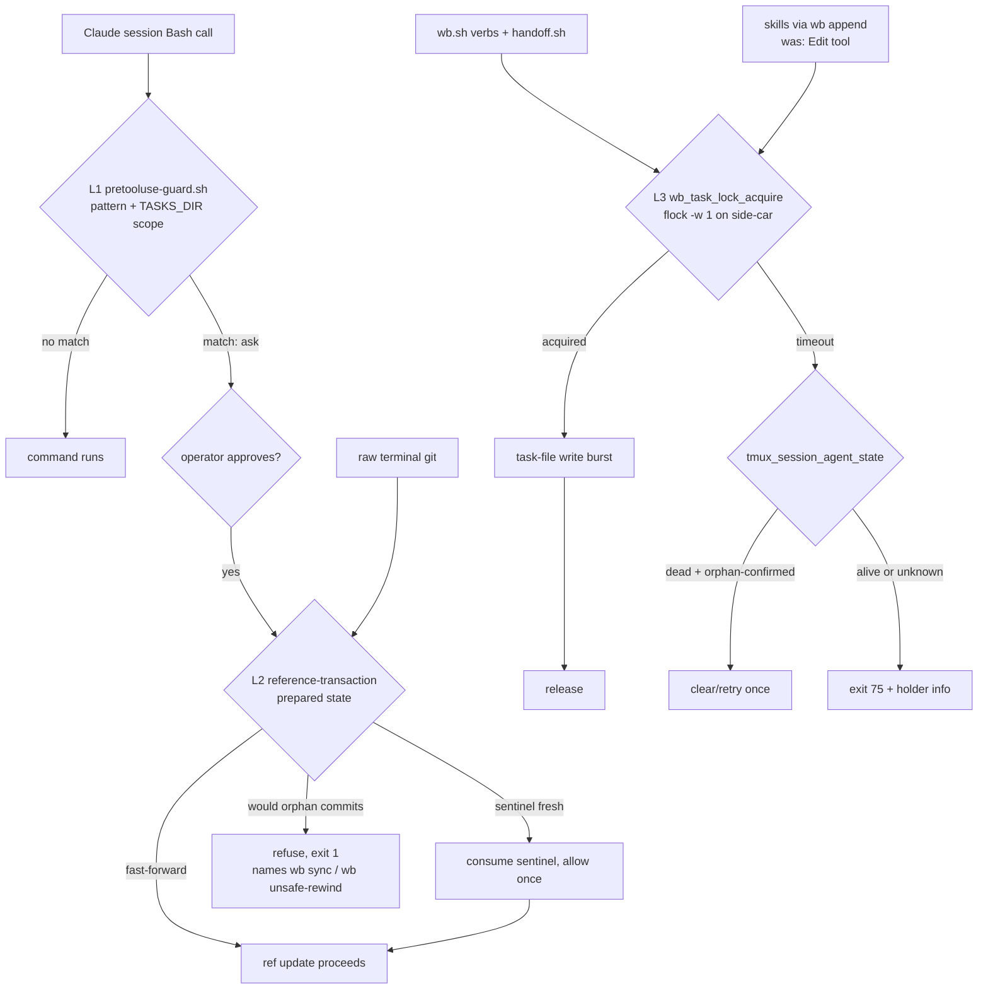
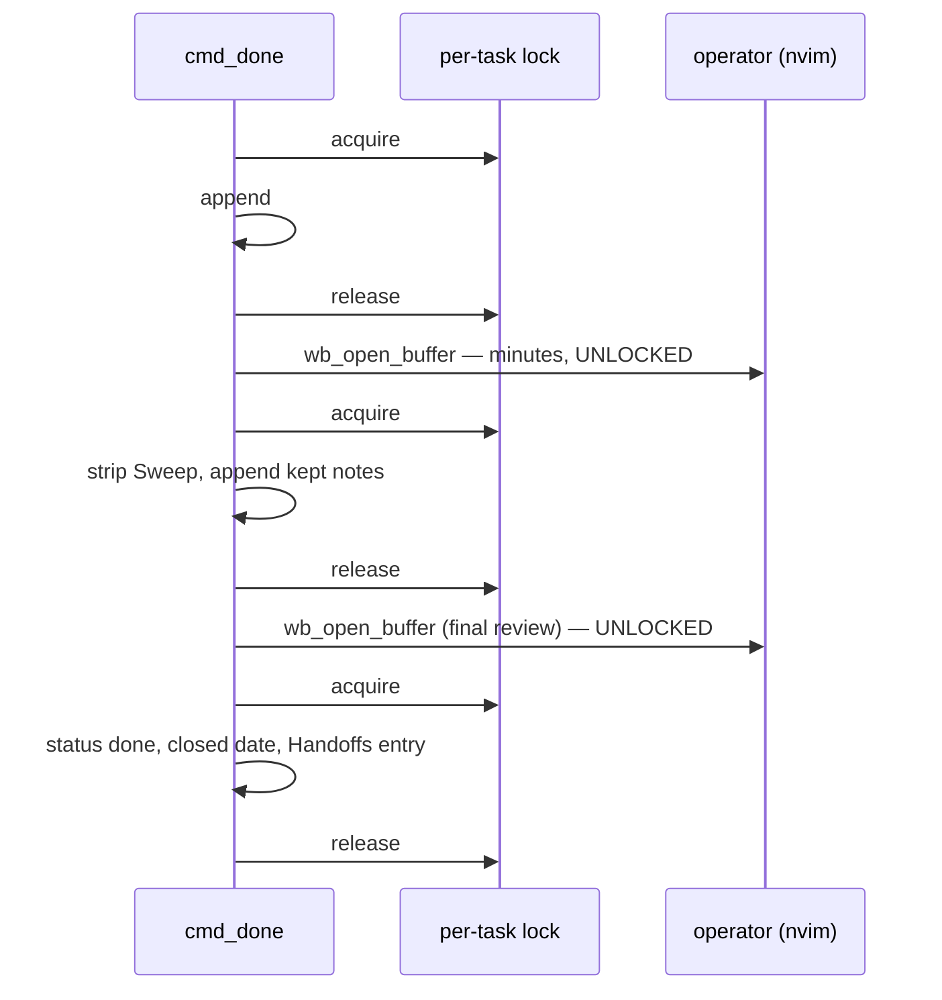
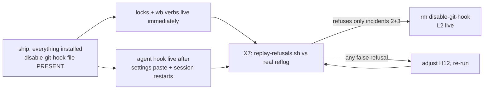

# TASKS_DIR Concurrency Safety — Hook Guards + Per-Task Write Locks - Plan

## Goal Capsule

Make the shared `~/code/tasks` checkout (TASKS_DIR) safe against the two failure classes proven by **four** real incidents, at the confirmed ~10-concurrent-agent, single-machine, single-operator scale:

1. **Git-history rewinds** from raw `git` commands typed directly in agent shells (incidents 2 and 3 — `git reset --hard` silently orphaning another session's unpushed commits). `wb.sh` issues zero git commands against TASKS_DIR (verified — its git calls target code repos only), so the fix must be caller-agnostic.
2. **Concurrent file writes** (incident 1 — the flagged handoff.sh concurrent-spawn race, `docs/roadmap.md:131`; incident 4 — a **reproduced** silent lost-write between `wb_append_handoff` and `wb_set_frontmatter`, both unlocked read-modify-write-via-`mv` cycles on the same task file, confirmed live 2026-07-11 during PR #26's review).

Product authority: synthesis of three parallel brainstorms (ideas 1, 3, 6 — ranked in the design-basis ideation doc, `docs/ideation/2026-07-11-tasks-dir-concurrency-safety-ideation.html`, committed on this branch), the 2026-07-11 decision-buffer sign-offs, and the round-2 call-out buffer (`logs/decisions/2026-07-11-tasks-dir-concurrency-safety-plan-callouts.md`). Open blockers: none. Stop condition: the git-side hook is never enabled before the X7 replay passes.

**Execution profile:** implement on `origin/development` (post-PR #26; wb.sh ≈2404 lines) — rebase this branch first. Cite functions, not line numbers; every line reference below was verified 2026-07-11 and drifts.

---

## Product Contract

### Summary

Two complementary mechanisms ship as one body of work. **Git-history safety**: a cheap Claude-Code `PreToolUse` "ask" hook on dangerous git command shapes scoped to TASKS_DIR, a caller-agnostic `reference-transaction` git hook that vetoes ref updates that would orphan commits reachable from nowhere else, and a `wb sync` paved path that removes the reason to hand-type `reset --hard`. **File-write safety**: a per-task-file `flock` side-car lock held per logical operation across every task-file write burst, a fail-fast contention UX with a tri-state session-liveness helper, and — per the round-2 decision — a locked `wb append` verb that the task-writing skills (`/wb-save`, `/handoff` seeding, `/parked-items`) call instead of editing task files with the Edit tool, so agent-mediated writes go through the same lock as script writes — backed (round 3) by an H24 `PreToolUse` matcher that asks before **any** Edit-tool write under `~/code/tasks`, covering every agent session, not just the rewired skills.

The agent-side hook alone would have prevented incidents 2 and 3; the per-task lock plus skill rewiring closes incidents 1 and 4. An explainer of the three-layer model lives at `~/code/tasks/dossiers/dotfiles--docs-roadmap-tasks-concurrency-safety/three-layer-guard-explainer.html`; a docgen-rendered guide ships with this work (U10).

### Key Decisions

**Decision record — sources:**

- **Idea 1 (three-layer hook stack): adopted as the backbone.** Only proposal targeting the root cause — raw agent-typed git commands that bypass wb.sh entirely. Its sequencing, reachability-based refuse condition, shared TTL'd sentinel, and "ask"-not-"deny" posture survive intact.
- **Idea 6 (contention-UX lock): adopted with two amendments.** Amendment 1: lock files live **outside** TASKS_DIR under the XDG state dir — no git operation inside TASKS_DIR can delete or resurrect lock state. This deliberately diverges from the handoff-v1 review's original "flock under `$TASKS_DIR` or `/tmp`" suggestion: incident 3 proved git ops destroy in-tree state, and `/tmp` violates the standing durable-path rule. Amendment 2: the dead-holder kill path verifies process identity before signaling (PID-reuse guard, L2).
- **Idea 3 (single-writer daemon): cut.** Salvaged: control-plane state lives outside TASKS_DIR. The parent/child dual-file future case is handled by sorted-path multi-lock acquisition (W11). Intent log deferred indefinitely.
- **Round-2 call-out decisions (2026-07-11, `logs/decisions/2026-07-11-tasks-dir-concurrency-safety-plan-callouts.md`):**
  1. **Skill task-file writes are rewired in this body of work** (Option B): a generic locked `wb append` verb ships, and `/wb-save`, `/handoff` seeding, and `/parked-items` stop using Edit-tool writes on `~/code/tasks` files (W13–W14).
  2. **The `wb done` nvim review window stays unlocked** (Option A): locks wrap the script's own write bursts, never the operator's editing session (W5).
  3. **The git-side hook ships installed-but-disabled** (Option A): its kill-switch file is pre-created; passing the X7 replay removes it. Kill-switches are three per-layer files (X4).
  4. **`wb install-hooks` never edits live `~/.claude/settings.json`** (Option A): verify-and-print; the tracked `claude/.claude/settings.recommended.json` carries the reference block (X3).
- **Round-3 review decisions (2026-07-12, `logs/decisions/2026-07-12-tasks-dir-concurrency-safety-review-items.md`) — all five reviewer items accepted:** the H12 refusal message states the moved-worktree aftermath and the `git reset --hard HEAD` resync; the lock's holder record carries the acquirer's own tmux identity (W3/L2); W13 pins `wb append`'s capability floor (multi-line entries, planned-preserving creation); H3 gains the reflog/gc recovery-net patterns; new H24 extends the agent hook to Edit-tool writes under TASKS_DIR.

**Other load-bearing decisions (unchanged from sign-off):**

- **Scope is `~/code/tasks` only.** No global or repo-wide guard; `~/code/notes` is a structural twin deferred to its own follow-up task.
- **Refuse condition is reachability-based, not blanket non-fast-forward.** True fast-forwards always pass; a non-ff update is refused only if it would orphan a commit reachable from no other ref.
- **Agent-side hook stays a dumb pattern+directory matcher**; correctness judgment lives only in the git-side hook.
- **Escalation posture is `"ask"`, never `"deny"`, at the agent layer** — and the hazard-class blocklist stays broad with no "obviously safe" carve-outs, per the standing confirm-before-`rm -rf` rule's no-exemptions framing.
- **One shared escape-hatch sentinel, file-based, TTL'd, consumed on use** (X1/X2).
- **Lock granularity is per logical operation**, wrapped by callers; `wb_set_frontmatter` stays lock-unaware.
- **flock on a stable side-car file, never the task file's own path** (atomic-rename inode swap defeats path-based locking).
- **Halt-and-ask-a-human = exit 75 (`EX_TEMPFAIL`) + one stderr message**, identical attended or unattended.
- **`wb sync` only fast-forwards or refuses** — never merges, rebases, or pushes.
- **New verbs are flat dispatch-table siblings**, documented in wb.sh's self-documenting header (`cmd_reviewed` from PR #20 is the freshest complete example of the pattern: header line + `cmd_` function + dispatch entry + test file).

### Requirements

#### Git-history safety — agent-side PreToolUse hook

- H1: A `PreToolUse` hook entry matched on `tool_name: Bash` in `~/.claude/settings.json` points at a script tracked in dotfiles (`scripts/.config/scripts/tmux/tasks-git-hooks/pretooluse-guard.sh`). The entry itself is hand-pasted per X3; the tracked `claude/.claude/settings.recommended.json` carries the reference copy.
- H2: Exit 0 immediately (no directory resolution) when the command string matches no dangerous-pattern regex.
- H3: Dangerous-pattern set, each anchored to an actual `git` invocation shape: `reset --hard`, `push` with `--force`/`-f`/`--force-with-lease`, `branch -D`, `update-ref -d`, `filter-branch`/`filter-repo`, `clean -f(dx)`, plus the recovery-net destroyers `reflog expire`, `reflog delete`, `gc` with `--prune`, and bare `prune` (these void X5's reflog/GC recoverability guarantee, and no other layer can see object pruning). Deliberately broader than the observed incidents; "ask" absorbs false positives.
- H4: On a pattern match, resolve the target directory per invocation — explicit `-C <path>`/`--git-dir=`, then an in-command `cd <path> &&`/`;` prefix resolved against the hook payload's top-level `cwd`, then `cwd` itself — and proceed to H5 if **any** resolvable invocation in the command string scopes to `$HOME/code/tasks` or beneath. Best-effort; the git-side hook is the backstop for missed **local** ref updates (it cannot see a remote's refs — see Scope Boundaries for `push --force`).
- H5: On a scoped match, return `permissionDecision: "ask"` naming the matched command, the incident precedent, `wb sync`/`wb unsafe-rewind` as alternatives, and that approval here does not bypass the git-side check. Never `"deny"`.
- H6: The sentinel check (X1) runs **only after** H3+H4 have matched and scoped the command — a fresh, unconsumed sentinel returns `"allow"` for that command alone, deferring judgment to the git-side hook. The sentinel must never short-circuit unmatched or out-of-scope commands (a pre-match check would turn it into a 120-second allow-everything token). Do not consume the sentinel at this layer.
- H7: Scope is Claude Code Bash tool calls only.
- H8: Check the agent-layer kill-switch (X4) first and no-op if set. On any internal error (jq missing, parse failure), fail **open**: exit 0 with a one-line stderr note — a broken guard must never block every Bash call; the git layer is the backstop.
- H24: The same guard registers a second `PreToolUse` matcher for `Edit`/`Write`/`MultiEdit` tool calls whose `file_path` resolves under `$HOME/code/tasks`: return the same `"ask"` posture naming `wb append` as the alternative. Shares the agent-layer kill-switch (X4) and the H8 fail-open posture. This enforces W14's never-Edit rule mechanically for **every** agent session, present and future — not just the three rewired skills (the shipped wb-resume skill explicitly anticipates concurrent sessions Edit-writing task files).

#### Git-history safety — reference-transaction hook

- H9: Install via `core.hooksPath` pointing at the tracked `scripts/.config/scripts/tmux/tasks-git-hooks/` (a file literally named `reference-transaction`); act only in the `prepared` state (`[ "$1" = prepared ] || exit 0`), per the verified `githooks(5)` abort-in-prepared contract (git 2.43.0).
- H10: Skip immediately for any ref outside `refs/heads/*`.
- H11: For each `refs/heads/*` line, allow immediately if `git merge-base --is-ancestor <old> <new>` succeeds — the only work on the fast path.
- H12: On a non-fast-forward update, compute the would-be-orphaned set (`git rev-list <new>..<old>`) and refuse (exit 1, stderr message) if any commit in it is reachable from no other ref (`git for-each-ref` minus the ref being updated). For deletions (`<new>` all-zero), the orphan set is `git rev-list <old> --not <all other refs>` — the two-dot form is invalid against a zero OID. The refusal message must state the post-refusal reality (verified live on git 2.43.0): HEAD/history is preserved, but a refused `reset --hard` has **already moved the index and worktree** to the target (uncommitted tracked changes are already gone) — "refused" is not "nothing happened" — and it names `git reset --hard HEAD` as the safe resync (old == new passes H11, so the resync is never refused).
- H13: Refuse deletion of `refs/heads/development` **absent a fresh sentinel** (the escape hatch is total — H16 wins over any per-ref special case); any other branch deletion goes through the H12 reachability check.
- H14: Allow new-branch creation (`<old>` all-zero) unconditionally.
- H15: When refusing, prompt interactively (`read -p … </dev/tty`) offering a one-time override **only if `/dev/tty` opens for read**; otherwise refuse without prompting. Verified 2026-07-11 from a live Claude Code Bash call: no fd is a TTY and `/dev/tty` does not open — agent sessions can never hang on this prompt. Re-verify once from inside the real hook during U6.
- H16: Honor the shared sentinel before refusing — consume it (delete) and allow exactly **one `prepared` transaction** if fresh and unconsumed. Multi-transaction rewrites (`filter-branch`) are deliberately not blessed end-to-end; the documented convention for those is a fresh clone.
- H17: This layer must not depend on anything Claude-Code-specific.

#### Git-history safety — paved path (`wb sync`)

- H18: Run `git -C "$TASKS_DIR" fetch origin` first; if the fetch fails (offline, no SSH agent), abort loudly — never compare against a stale `origin/development`.
- H19: Refuse loud, before touching any ref, if the working tree is dirty (`git status --porcelain` non-empty), mirroring `cmd_done`'s dirty-tree guard.
- H20: If local `development` is strictly behind `origin/development`, `git merge --ff-only` and report the commit count.
- H21: If strictly ahead, no-op with "nothing to pull, consider pushing"; never push automatically.
- H22: If diverged, refuse with ahead/behind counts, the manual commands to resolve, and the explicit call-out that `reset --hard origin/development` is the incident anti-pattern.
- H23: Refuse unless `git symbolic-ref HEAD` is `refs/heads/development` — on a detached HEAD or another checked-out branch, `wb sync` must not ff-merge development into it.

#### File-write safety — per-task lock

- W1: One lock file per task file at `${XDG_STATE_HOME:-$HOME/.local/state}/wb/locks/<basename>.lock`, derived purely from the task file's basename. The acquire primitive `mkdir -p`s the directory; if the directory or lock file cannot be created/opened, **fail closed** (exit 75 with a distinct message naming the path) — the `disable-locks` kill-switch (X4) is the manual escape if lock infrastructure itself breaks.
- W2: `flock` operates on the side-car file's own fd, never the task file's path.
- W3: The lock file is opened **without truncation** (`<>` or append mode) — the idiomatic `exec {fd}>file` truncates before flock is attempted and would blank the current holder's info on every contended attempt. Written (truncate-then-write) only **after** successful acquisition: holder identity (`${repo}--${disp_slug}`), PID, ISO-8601 acquire timestamp, and the acquiring process's **own** tmux identity (`$TMUX_PANE` plus `tmux display -p '#S'` when inside tmux; empty otherwise) — the field L2's pane-gone check reads; the target-task identity alone cannot answer it.
- W4: `wb_task_lock_acquire <task_file>` / `wb_task_lock_release` are the only locking primitives; `wb_set_frontmatter`, `wb_append_handoff`, `wb_seed_task`, and all other helpers remain lock-unaware.
- W5: **Locks are acquired only at outermost command scope** — the `cmd_*` verbs, each `wb_reconcile_action_*` block, and handoff.sh's own write site; nested acquisition is a bug (flock is not reentrant across fds; the literal per-helper reading self-deadlocks `wb reconcile`'s create-task action, which reaches its write through `wb_seed_task`). The locked write inventory on the development baseline, each wrapped as one or more short bursts:
  - `cmd_new`/`cmd_resume` → `wb_seed_task` (template-create redirect + get/set frontmatter chain) — acquire before the `$(wb_seed_task …)` command substitution, using the `wb_task_file`-derived path;
  - `cmd_pause` → `status paused` + `wb_append_handoff`;
  - `cmd_resume` → `wb_append_handoff` (resume entry);
  - `cmd_reviewed` → `reviewed` date stamp;
  - `cmd_done` → **three bursts**: Sweep append; post-buffer Sweep strip + kept-notes append; final `status done`/`closed` stamps + `wb_append_handoff` — never across `wb_open_buffer` (the operator's interactive nvim session, an accepted unlocked window per round-2 Decision 2);
  - `wb_reconcile_action_*` per W10;
  - handoff.sh → `handoff_append_followup` (the bootstrap-gap write, previously in no requirement).
  A critical section never spans `wb_open_buffer`, tmux calls, `git worktree` operations, or any spawn that can outlive the burst (tmux server autostart is the canonical case — a long-lived process inheriting a locked fd holds the lock until it dies). Short-lived children inside helpers (awk, mv) are fine; their inherited fd copies close at exit. Close the fd before any potentially long-lived spawn.
- W6: Release explicitly right after each guarded burst, plus an EXIT-trap safety net that **composes** with existing traps (wb.sh's `picker()` already owns an EXIT trap and calls `cmd_new` in-process — bash keeps one EXIT trap per process, so installation must append, not replace, via a small shared trap-append helper). Kernel auto-release on process death is the final backstop. Note: `$(wb_seed_task …)` runs in a subshell whose EXIT trap and fds die at subshell exit — another reason W5 pins acquisition at the caller.
- W7: Acquisition uses `flock -w 1`; success within budget produces zero output.
- W8: On timeout, print exactly one stderr message naming the recorded holder identity, PID, and elapsed-held seconds.
- W9: The primitive never auto-retries; retry is a caller-level decision.

#### File-write safety — `wb reconcile --apply` retrofit

- W10: Every `wb_reconcile_apply` action that mutates a task file takes the lock per action: `wb_reconcile_action_create_task`, `_attach`, `_merge` (via `wb_reconcile_merge_content` — a **two-file** writer: survivor tmp+mv plus loser `rm`), and `_remove` (a bare `rm -f` racing another writer's tmp+mv can resurrect the file — previously omitted).
- W11: An action touching more than one file acquires both locks in sorted-path order (deadlock-free by ordering; same pattern reserved for the future parent/child dual-file case).
- W12: The existing human-checked-box gate is unchanged.

#### File-write safety — skill writes through locked verbs (round-2 Decision 1, Option B)

- W13: A new `wb append` verb writes under a named heading in a task file, taking the per-task lock; insertion semantics reuse the existing `wb_append_handoff`/`handoff_append_followup` heading-fallback conventions. Capability floor (round-3 decision — the rewired skills' real write shapes exceed a one-line verb): a multi-line entry body mode (stdin/heredoc), support for `/wb-save`'s `###`-timestamped block entries (whose skill contract forbids the one-line Handoffs format), and a creation path that seeds a worktree-less task **preserving `status: planned`** — not `wb_seed_task`'s planned→doing flip and worktree stamping (e.g. a `wb new --planned` mode). Exact flag spelling stays an implementation-time decision inside U4; the capabilities do not.
- W14: `/wb-save`, `/handoff` (task-file seeding steps), and `/parked-items` (`claude/.claude/skills/parked-items/SKILL.md` task-file writes; the sibling `/park` skill writes only the ledger at `~/.claude/parked-items/ledger.jsonl`, outside TASKS_DIR, and is unaffected) are rewired to shell out to `wb` verbs (`wb append`, `wb new`/seeding) instead of Edit-tool writes; each SKILL.md gains an explicit instruction that task files under `~/code/tasks` are never written with editor tools.

#### Session liveness / contention UX

- L1: Extract handoff.sh's two-stage liveness check (exact-match `tmux has-session -t "=$session"`, then `pane_current_command == claude` on the `:agent` pane) into a shared `lib.sh` helper `tmux_session_agent_state <session>` returning `alive`/`dead`/`unknown`; update handoff.sh to call it — a pure refactor with identical visible behavior. lib.sh's `tmux_claude_panes`/`tmux_pane_awaiting_input` already own the `pane_current_command` calibration; the helper belongs beside them.
- L2: On `dead`: treat the recorded holder as a killable orphan only when **all** hold — `kill -0` succeeds, process identity confirms a wb/claude-shaped process (`/proc/<pid>/cmdline`), the recorded acquire timestamp is older than a generous multiple of any legitimate chain (>60s), and the holder's **own recorded pane** (the W3 tmux-identity field) no longer exists — never the target task's session, which legitimately doesn't exist yet during a handoff spawn, when the healthy winner must never be signaled (incident 1's scenario with the guard as the weapon). An empty recorded tmux field → treat as `unknown`. Anything less → `unknown`. If the PID is gone, retry `flock -n` once.
- L3: On `unknown`, never auto-clear — halt (L4).
- L4: Halt path: exit 75 + one stderr message, identical attended or unattended, with an explicit **addressee split**: agents are instructed to stop and report the contention upward, never to clear the lock; the `rm <lock-path>` manual override is addressed to the operator only. No blocking stdin read; no write into the contended file.
- L5: On `alive`, never force-break — halt per L4.

#### Cross-cutting / rollout

- X1: One shared escape-hatch sentinel at `~/code/tasks/.git/WB_ALLOW_REWIND` (one line: `<epoch> <reason>`), honored within a 120s TTL, consumed (deleted) by the git-side hook per H16, checked by H6 and H16 only after pattern/scope matching. Two concurrent `prepared` hooks can theoretically both read it before either deletes, and a sentinel spent on a command that turned out to be a fast-forward survives until TTL — both accepted at single-operator scale.
- X2: `wb unsafe-rewind "<reason>"` is the only sanctioned producer — interactive, requires a non-empty reason.
- X3: Hook scripts live in `scripts/.config/scripts/tmux/tasks-git-hooks/` (stow lands them at `~/.config/scripts/tmux/tasks-git-hooks/`); `wb install-hooks` idempotently sets `core.hooksPath` on `~/code/tasks`, applies X5, and **verifies** the `PreToolUse` entry in `~/.claude/settings.json` — printing the exact block to paste when missing, never editing the live file (round-2 Decision 4; the file is deliberately untracked per `claude/README.md`, and it carries the notify hooks that drive the picker's needs-input tier). The same block is added to `claude/.claude/settings.recommended.json`.
- X4: Three per-layer kill-switch **files** under `${XDG_STATE_HOME:-$HOME/.local/state}/wb/`: `disable-agent-hook`, `disable-git-hook`, `disable-locks` — checked at each layer's entry point. Files, not env vars: running sessions never see a new env var, but every next command re-reads the filesystem.
- X5: Harden recoverability in `~/code/tasks` (all currently unset, verified 2026-07-11): `gc.auto=0`, generous `gc.reflogExpire`/`gc.reflogExpireUnreachable`, applied by `wb install-hooks` — a sentinel-blessed rewind must be recoverable by policy, not GC luck.
- X6: Everything ships together; **enablement** is what's staged (round-2 Decision 3). The `disable-git-hook` switch file is created by `wb install-hooks` if the replay hasn't passed, so the git layer is installed-but-dormant from day one; locks and the agent hook are live immediately (the agent hook requires the one-time settings paste **and restarting running agent sessions** — Claude Code snapshots hook config at startup; the restart is a documented install step). Refusal messages may name `wb sync`/`wb unsafe-rewind` from day one since all verbs land in the same change.
- X7: Before enabling the git-side hook, replay its logic read-only against `~/code/tasks`'s actual reflog history. Pinned method: per-ref reflog time-slices approximating "other refs' positions at that moment" — an approximation that biases toward allowing. Acceptance: refuses the two real `reset --hard` incidents; allows every other recorded ref update. Enablement is literally `rm ~/.local/state/wb/disable-git-hook`.
- X8: New verbs (`wb sync`, `wb unsafe-rewind`, `wb install-hooks`, `wb append`) are flat dispatch-table siblings with header usage lines, mirroring `cmd_reviewed`'s complete example.

### Scope Boundaries

- **Not adversary-proof.** Guards honest multi-agent mistakes; not a security boundary.
- **No conflict resolution.** The lock serializes; it does not merge two legitimate sequential edits to the same key.
- **No intent queue, daemon, or drain lifecycle** (idea 3 — cut), and no per-agent worktree topology for TASKS_DIR itself.
- **The `wb done` nvim review window is an accepted unlocked writer** (round-2 Decision 2): locks cover the script's write bursts around it; the operator's minutes-long edit is human-supervised residual risk.
- **Raw-terminal working-tree destruction is only partially covered** — git has no hook for working-tree/index mutations (`clean -fdx`, `checkout -- .`, `stash drop` typed by a human outside Claude).
- **`push --force` has no git-side backstop** — the local `reference-transaction` hook never sees the remote's ref update (H10 skips the post-hoc `refs/remotes/*` line). Agent-typed force-pushes are caught by H3; raw-terminal ones are accepted residue (all observed incidents were local).
- **No session-liveness TTLs or auto-cleanup** beyond the lock-contention path; no `wb reconcile`-time stale-lock sweep (confirmed 2026-07-11, stderr-only halt is sufficient).
- **`~/code/tasks` only; single machine.** `~/code/notes` is a confirmed structural twin deferred to its own follow-up task.
- **wb.sh's own repo-level git calls across different task files are not serialized** — repo-wide contention is a distinct domain, unaddressed here.

### Dependencies / Assumptions

- Git ≥ 2.28 for `reference-transaction` — verified against `githooks(5)` on local git 2.43.0, including the abort-in-`prepared` contract.
- Claude Code `PreToolUse` contract verified 2026-07-11 against `code.claude.com/docs/en/hooks`: top-level `cwd`, `tool_name`, `tool_input.command`; response per H5. Exit-code semantics: non-zero-non-2 is a non-blocking error (tool call proceeds) — the basis for H8's fail-open posture. Hooks apply regardless of permission mode; hook config is snapshotted at session start (X6's restart step).
- `/dev/tty` probe from a live Claude Code Bash call (2026-07-11): fds 0/1/2 are not TTYs and `/dev/tty` does not open — H15's prompt can never hang an agent session.
- `jq` 1.7 present on the host; **not** in `tests/Dockerfile` (ubuntu:24.04 base) — U5 adds it. `flock` ships with util-linux in the base image.
- flock(2) auto-release on holder death — confirmed; all paths are local disk.
- wb subcommands remain short-lived one-shot CLI processes; bash 4+.
- `git commit --amend` on the shared branch is a known H12 false positive — handled by documented convention (append, don't amend, on `development`), with the sentinel for rare deliberate cases.
- H12's nested loop assumed cheap at this repo's size.
- Task files predating the current frontmatter schema exist (`docs/limitations.md`) — locked chains tolerate pre-migration files exactly as the unlocked code does today (the lock changes serialization, not parsing).
- New sourceable scripts use override-safe `VAR="${VAR:-default}"` defaults throughout (the 2026-07-10 deletion-incident convention); the liveness helper and lock module must not repeat wb.sh's unconditional `SCRIPT_DIR`/`SELF` reassignment pattern.
- **`~/code/notes` follow-up is tracked, not open** — a new task-store entry is opened once this ships.

---

## Planning Contract

### Product Contract preservation

Changed from the signed-off requirements-only version, each driven by verification or the round-2 buffer (never silently): Goal Capsule incident count 3→4 (new reproduced evidence, folded in at owner request); H4 any-match + backstop scoping; H6 check ordering (post-match only — the literal "before H2–H5" reading was a 120s allow-all); H8 fail-open posture; H12 deletion form; H13 sentinel-wins wording; H15 verified predicate; H16 per-transaction unit; H18/H23 fetch-failure + branch guard; W1 XDG + fail-closed; W3 non-truncating open; W5 rewritten as the full verified write inventory + outermost-ownership rule (was: five frontmatter chains); W10 adds `_remove` and the two-file `_merge` note; W13–W14 new (round-2 Decision 1B replaces the former "skill writes are residual risk" scope boundary); L2 orphan predicate hardened (mid-spawn winner must never be signaled); L4 addressee split; X3 verify-and-print (Decision 4A); X4 three per-layer files (Decision 3A); X6 kill-switch staging + session-restart step (Decision 3A); X7 method pinned. Round-3 review decisions (2026-07-12, all owner-accepted via the round-3 buffer): H3 expanded (reflog/gc shapes), H12 refusal-message contract, H24 added, W3 tmux-identity field added, W13 capability floor pinned, L2 predicate keyed to the recorded field. R-ID semantics otherwise preserved; nothing renumbered.

### Key Technical Decisions

- **Lock primitives live in a new sourced module `scripts/.config/scripts/tmux/wb-locks.sh`**, following the `wb-lifecycle.sh` precedent (PR #20) — sourced by wb.sh and handoff.sh, side-effect-free on source, so handoff.sh reaches the primitives without duplicating them.
- **Lock ownership is outermost-only** (W5) — the one rule that prevents both the reconcile self-deadlock and the subshell-fd trap.
- **Lock-file idiom pinned** (W3): open `<>` without truncate → `flock -w 1` → truncate-and-write holder info. Prevents contenders blanking the holder record W8/L2 depend on.
- **fd hygiene invariant**: the lock fd is never open across a process-spawning call (W5); explicit release after each burst is primary, the composing EXIT trap (W6) is the safety net.
- **Kill-switch trio doubles as rollout staging** (Decision 3A): one mechanism for testing, staging, and emergency rollback.
- **Agent hook departs deliberately from `claude-notify-hook.sh`'s "always exit 0" property** at the decision path (it returns "ask"), but inherits its stdin-guard and jq patterns, and keeps exit-0 fail-open on internal errors (H8).
- **`wb append` reuses the shipped Handoffs insertion logic** rather than inventing a third heading-fallback implementation (W13; `wb_append_handoff` and `handoff_append_followup` already embody the convention).
- **X7 replay is a standalone read-only script** (`tasks-git-hooks/replay-refusals.sh`), not a wb verb — it is a one-time enablement gate, not an operator surface.

### High-Level Technical Design

**Write/guard topology — who is stopped where:**

**`cmd_done` locking shape (Decision 2A) — bursts, never across the operator's buffer:**

**Rollout states (Decision 3A) — enablement is staged, installation is not:**

---

## Implementation Units

| U-ID | Title | Key files | Depends on |
|---|---|---|---|
| U1 | Lock primitives module | `scripts/.config/scripts/tmux/wb-locks.sh` | — |
| U2 | Tri-state liveness helper | `scripts/.config/scripts/tmux/lib.sh`, `handoff.sh` | — |
| U3 | Lock integration across all write chains | `wb.sh`, `handoff.sh` | U1, U2 |
| U4 | `wb append` + skill rewiring | `wb.sh`, `claude/.claude/skills/*` | U1, U3 |
| U5 | Agent-side PreToolUse hook | `tasks-git-hooks/pretooluse-guard.sh`, `settings.recommended.json`, `tests/Dockerfile` | — |
| U6 | reference-transaction hook | `tasks-git-hooks/reference-transaction` | — |
| U7 | `wb sync` + `wb unsafe-rewind` | `wb.sh` | — |
| U8 | `wb install-hooks` + gc hardening | `wb.sh` | U5, U6 |
| U9 | X7 replay tool + enablement | `tasks-git-hooks/replay-refusals.sh` | U6, U8 |
| U10 | Docs: guide, roadmap, reference rows, recap | `docs/guides/`, `docs/roadmap.md`, `scripts/.config/scripts/tmux/instructions.md` | U1–U9 |

All paths below are repo-relative to dotfiles; script paths shorten `scripts/.config/scripts/tmux/` to `tmux/`.

### U1. Lock primitives module (`wb-locks.sh`)

- **Goal:** the flock side-car primitives every other unit builds on.
- **Requirements:** W1–W4, W6 (helper), W7–W9, X4 (`disable-locks`), L4 (message shape).
- **Dependencies:** none.
- **Files:** `tmux/wb-locks.sh` (new), `tmux/tests/wb-locks.test.sh` (new).
- **Approach:** sourced module, side-effect-free, `VAR="${VAR:-…}"` defaults. `wb_task_lock_acquire`: kill-switch check → `mkdir -p` state dir (fail-closed exit 75 on failure) → open side-car `<>` on a dedicated fd → `flock -w 1` → truncate-and-write holder identity/PID/timestamp plus the acquirer's own tmux pane/session (W3). `wb_task_lock_release`: close fd (kernel drops the lock); lock file itself is never deleted on release (deleting would let a next opener lock a ghost inode while a third locks a fresh file). Includes the trap-append helper (compose with `picker()`'s existing EXIT trap) and the W8 contention message with L4's two-audience wording.
- **Patterns to follow:** `wb-lifecycle.sh` (sourced-module shape), `lib.sh` (no `set -e` of its own), existing `echo "wb <verb>: msg" >&2` error idiom; `wb_ensure_repo_ignore` (development wb.sh) already wraps its exclude-file append in a `( … ) 9>"$lockfile"` flock — the repo's first flock precedent, whose truncating `9>` open is fine there only because it stores no holder info (exactly what W3 changes for task locks).
- **Test scenarios:**
  - Happy: acquire → holder file carries identity/PID/ISO timestamp/own tmux identity (empty tmux fields outside tmux); release → second acquire succeeds instantly.
  - Contention: background subshell holds lock; foreground acquire returns exit 75 within ~1s, stderr names holder identity, PID, and held-seconds; holder info NOT blanked by the losing attempt (W3 regression test).
  - Crash release: `kill -9` a holding subshell; next `flock -n` succeeds.
  - Kill-switch: `disable-locks` present → acquire is a silent no-op success.
  - Fail-closed: unwritable state dir → exit 75 with the distinct directory message.
  - Trap composition: install lock trap after a pre-existing EXIT trap; both fire.
- **Verification:** `bash tmux/tests/wb-locks.test.sh` green inside the Docker sandbox (contention/kill scenarios are destructive-adjacent).

### U2. Tri-state liveness helper (L1 refactor)

- **Goal:** `tmux_session_agent_state <session>` in lib.sh; handoff.sh calls it with identical behavior.
- **Requirements:** L1.
- **Dependencies:** none.
- **Files:** `tmux/lib.sh`, `tmux/handoff.sh`, `tmux/tests/handoff-poller.test.sh` (extend).
- **Approach:** lift handoff.sh's exact two-stage check (exact-match `has-session -t "=$session"`, then `pane_current_command == claude` on `:agent`) verbatim — the zombie-session-after-timeout state is field-proven, not theoretical. handoff.sh collapses `unknown` into its current not-alive branch.
- **Patterns to follow:** `tmux_claude_panes` / `tmux_pane_awaiting_input` (lib.sh) — same prefix, same calibration source.
- **Test scenarios:** no session → `dead`; session without a claude agent pane → `unknown`; stubbed claude pane → `alive`; handoff.sh behavior unchanged on all three (characterization).
- **Execution note:** pure refactor — add the characterization assertions before moving the code.
- **Verification:** extended poller test green; `handoff.sh` dry-run behavior byte-identical.

### U3. Lock integration across all write chains

- **Goal:** every shell-script task-file mutation runs inside a lock burst; contention resolves per L2–L5.
- **Requirements:** W5, W6, W10–W12, L2–L5.
- **Dependencies:** U1, U2.
- **Files:** `tmux/wb.sh`, `tmux/handoff.sh`, `tmux/tests/wb-lock-integration.test.sh` (new).
- **Approach:** wrap the W5 inventory at outermost scope only; `cmd_done` gets the three-burst shape from the HTD sequence diagram; reconcile actions lock per action with sorted-path dual acquisition in `_merge`; `handoff_append_followup`'s call site wraps its own burst. The L2 orphan predicate (identity + >60s age + holder's own pane gone) lives here, built on U2's helper. fd closed before every spawn.
- **Patterns to follow:** existing function-local style of each `cmd_*`; `wb_reconcile_apply`'s per-action loop.
- **Test scenarios:**
  - Covers incident 4: two concurrent writers (frontmatter chain vs `wb append`-style Handoffs append) on the same fixture task → both changes present afterward, zero lost writes.
  - Covers incident 1's shape: two concurrent seed paths for the same new task → one seeds, the other blocks/halts; no interleaved file.
  - Reconcile: `_merge` acquires survivor+loser in sorted order (assert order via instrumented lock dir); `_remove` under contention halts rather than deleting mid-write; checked-box gate unchanged.
  - `cmd_done`: lock NOT held while `wb_open_buffer` runs (assert lock file acquirable during a stubbed buffer).
  - L2 kill path: recorded holder dead-session + young timestamp → `unknown`/halt (mid-spawn protection); dead + old + pane-gone + identity-confirmed → cleared and retried.
  - L5: holder `alive` → exit 75, no clearing.
- **Execution note:** destructive scenarios (SIGKILL, concurrent writers) run only in the Docker sandbox.
- **Verification:** integration test green in Docker; a manual two-pane live repro of incident 4's writer pair no longer loses an entry.

### U4. `wb append` verb + skill rewiring

- **Goal:** agent-mediated task-file writes go through the lock (round-2 Decision 1B).
- **Requirements:** W13, W14, X8.
- **Dependencies:** U1, U3.
- **Files:** `tmux/wb.sh`, `claude/.claude/skills/handoff/SKILL.md`, `claude/.claude/skills/parked-items/SKILL.md`, the wb-save skill's SKILL.md (under `claude/.claude/skills/`, exact dir per PR #26), `tmux/tests/wb-append.test.sh` (new).
- **Approach:** `cmd_append` resolves the task ref (mirror `cmd_resume`'s fail-loud-on-ambiguity matching), acquires the lock, inserts under the named heading reusing the shipped heading-fallback convention, releases. Skill instructions change from "edit the task file" to "run `wb append …`" and gain the never-Edit-task-files rule. File-creation paths (`/parked-items` new tasks, `/handoff` seeding) route through the planned-preserving seeding mode W13 pins (no planned→doing flip, no worktree stamping) rather than growing `wb append` into a creator. The verb carries W13's capability floor — multi-line stdin/heredoc body and `###`-timestamped block entries; only flag spelling is decided in-unit.
- **Patterns to follow:** `cmd_reviewed` (complete new-verb example); `wb_append_handoff` header comment (insertion contract); `tests/wb-handoffs.test.sh` (fixture style for heading edge cases).
- **Test scenarios:** append under existing heading; missing-heading fallback (before `## Decisions`, else EOF — match the shipped convention); lock actually held during append (contention test); ambiguous task ref fails loud; skill files contain no Edit-tool write instructions for `~/code/tasks` (grep assertion).
- **Verification:** `wb append` round-trips on fixtures; a manual `/wb-save` run writes through the verb (visible in the lock's holder file mid-write under a breakpoint/delay).

### U5. Agent-side PreToolUse hook

- **Goal:** the L1 "ask" guard, live in every restarted session after the settings paste.
- **Requirements:** H1–H8, X4 (`disable-agent-hook`).
- **Dependencies:** none (sentinel file may simply not exist yet).
- **Files:** `tmux/tasks-git-hooks/pretooluse-guard.sh` (new), `claude/.claude/settings.recommended.json`, `tmux/tests/tasks-agent-hook.test.sh` (new), `tmux/tests/Dockerfile` (add `jq`).
- **Approach:** stdin JSON via jq (mirror `claude-notify-hook.sh`'s stdin guard); kill-switch first; cheap regex gate before any jq/dir work (H2); H4 resolution order with any-match-wins; H6 sentinel check strictly post-match; H5 "ask" JSON naming command, incident precedent, alternatives, and the approval-doesn't-bypass-L2 note; fail-open wrapper per H8. A second matcher block implements H24: `Edit`/`Write`/`MultiEdit` payloads whose `file_path` sits under `$HOME/code/tasks` → the same "ask" naming `wb append`; both matchers ship in the same settings block and share the kill-switch.
- **Patterns to follow:** `claude-notify-hook.sh` (hook-script exemplar: stdin guard, jq, `$HOME`-based path in settings).
- **Test scenarios:** feed recorded PreToolUse JSON payloads —
  - `git reset --hard` with `cwd` inside `~/code/tasks` → "ask" with all three message elements;
  - same command, `cwd` elsewhere → exit 0 silent; `git -C ~/code/tasks reset --hard` from elsewhere → "ask"; `cd ~/code/tasks && git reset --hard` → "ask"; compound string where only the second invocation scopes → "ask" (H4 any-match);
  - non-matching commands (`git commit`, `ls`) → exit 0 with no dir resolution (assert via instrumentation);
  - fresh sentinel + matched scoped command → "allow"; fresh sentinel + unmatched command → exit 0 (H6 ordering regression — the critical one);
  - jq absent (PATH-stripped) → exit 0 + one stderr line (H8);
  - kill-switch present → exit 0 before anything else;
  - `git reflog expire --expire=now` / `git gc --prune=now` with `cwd` inside `~/code/tasks` → "ask" (the H3 recovery-net shapes);
  - H24: an `Edit` payload with `file_path` under `~/code/tasks` → "ask" naming `wb append`; the same payload targeting another repo → exit 0 silent; `Write` and `MultiEdit` shapes matched too.
- **Verification:** test file green (host + Docker); live check — paste settings block into one session's settings, restart it, type a scoped `reset --hard`, observe the ask prompt.

### U6. reference-transaction hook

- **Goal:** the caller-agnostic L2 refusal layer, correct on every githooks(5) edge the requirements pin.
- **Requirements:** H9–H17, H16↔X1, X4 (`disable-git-hook`).
- **Dependencies:** none.
- **Files:** `tmux/tasks-git-hooks/reference-transaction` (new), `tmux/tests/tasks-git-hook.test.sh` (new).
- **Approach:** kill-switch → `prepared`-state gate → per-line loop: refs/heads filter (H10), zero-OID branch (H13/H14 with the H12 deletion form), ancestor fast path (H11), reachability check (H12), sentinel consumption once per transaction (H16), `/dev/tty`-gated prompt (H15). Stderr is the only output surface — it is visible inside Claude Bash results and raw terminals alike.
- **Patterns to follow:** none in-repo (first git hook) — the guide (U10) documents it precisely because of that.
- **Test scenarios (fixture git repos in Docker):**
  - Ordinary commit, merge, ff-pull, fetch, tag push, new branch → all pass with zero output.
  - `reset --hard` past an unpushed commit reachable nowhere else → refused; same reset to an already-pushed ancestor → allowed (reachable via origin ref).
  - Post-refusal state (H12 message contract): after a refused reset, HEAD is unchanged but index/worktree have moved; the message names the resync, and `git reset --hard HEAD` then passes the hook cleanly.
  - Branch deletion: unmerged-only branch → refused; fully-merged branch → allowed; `development` deletion without sentinel → refused, with fresh sentinel → allowed once and sentinel consumed.
  - Sentinel: fresh → exactly one transaction allowed, file gone afterward; stale (>120s) → refused; second transaction in same command → refused.
  - No TTY (Docker default) → refuses without prompting, never hangs (H15).
  - `commit --amend` on development → refused absent sentinel (documents the known false positive).
- **Execution note:** build the fixture-repo helpers first — every scenario is a tiny scratch repo; none may touch a real checkout.
- **Verification:** test file green in Docker; hook inert on the host until U9 enablement (switch file present).

### U7. `wb sync` + `wb unsafe-rewind`

- **Goal:** the paved path and the sanctioned escape hatch.
- **Requirements:** H18–H23, X1 (producer side), X2, X8.
- **Dependencies:** none.
- **Files:** `tmux/wb.sh`, `tmux/tests/wb-sync.test.sh` (new), `tmux/tests/wb-unsafe-rewind.test.sh` (new).
- **Approach:** `cmd_sync` per H18–H23 branch table; `cmd_unsafe_rewind` writes `<epoch> <reason>` to the sentinel path, refuses empty reasons, prints the 120s/one-use contract.
- **Patterns to follow:** `cmd_done`'s dirty-tree guard (H19 mirrors it verbatim); header usage lines per X8.
- **Test scenarios (fixture repo + fixture remote in Docker):** behind → ff + count; ahead → no-op message, no push; diverged → refusal with both counts + anti-pattern call-out; dirty tree → refusal before any ref motion; fetch failure (unreachable remote) → loud abort; HEAD detached / on another branch → refusal (H23); unsafe-rewind: empty reason refused, sentinel content format (the TTL contract itself is proven by U6's stale-sentinel scenario).
- **Verification:** both test files green in Docker.

### U8. `wb install-hooks` + gc hardening

- **Goal:** one idempotent verb wires everything the machine needs.
- **Requirements:** X3, X4 (creates `disable-git-hook` when replay hasn't passed), X5, X6 (restart-sessions message).
- **Dependencies:** U5, U6.
- **Files:** `tmux/wb.sh`, `tmux/tests/wb-install-hooks.test.sh` (new).
- **Approach:** set `core.hooksPath` → apply X5 gc config → pre-create `disable-git-hook` unless the `replay-passed` marker exists (a file at `${XDG_STATE_HOME:-$HOME/.local/state}/wb/replay-passed`, written only by U9's replay tool on an accepting run — without this marker, an idempotent re-run after enablement would re-create the switch and silently re-disable the guard) → verify settings.json PreToolUse entry, printing the paste-block (from `settings.recommended.json`) when missing — never editing (Decision 4A) → print the restart-running-sessions reminder. Idempotent: second run changes nothing and says so.
- **Patterns to follow:** existing `git config` usage in scripts; `echo … >&2` messaging.
- **Test scenarios (fixture repo, `HOME` redirected):** first run sets hooksPath + gc keys + switch file; second run is a no-op; settings verification prints block when entry missing, stays silent when present; never writes to the fake settings.json (checksum assertion).
- **Verification:** test green; live run on the real `~/code/tasks` leaves `git config --list --local` showing hooksPath + gc keys, switch file present, and the paste-block printed.

### U9. X7 replay tool + enablement

- **Goal:** prove the refusal logic against real history, then flip L2 on.
- **Requirements:** X6, X7.
- **Dependencies:** U6, U8.
- **Files:** `tmux/tasks-git-hooks/replay-refusals.sh` (new), `tmux/tests/tasks-replay.test.sh` (new).
- **Approach:** read-only walk of per-ref reflogs, evaluating H11/H12 per recorded old→new transition against the pinned time-slice approximation; output one verdict line per transition; summary names refused transitions. On an accepting run (refusals limited to the known incidents, operator-confirmed), write the `replay-passed` marker file U8 keys on. Acceptance run against the real `~/code/tasks` is a documented operator step whose expected output is "2 refusals, both the known incidents."
- **Test scenarios:** synthetic reflog fixtures — a rewind past an unpushed commit → flagged; a rewind to a pushed ancestor → allowed; ff-only history → zero refusals; empty reflog → clean no-op with a notice (the approximation biases to allow — say so in output).
- **Verification:** test green; the real-history acceptance run recorded in the PR (output pasted), then `rm ~/.local/state/wb/disable-git-hook` performed and noted.

### U10. Documentation: guide, roadmap, reference rows, recap

- **Goal:** the three-layer model is documented well enough that future-you doesn't need this plan (the round-2 buffer note asked for exactly this).
- **Requirements:** X8 (header lines land per-unit); explain-discovered-infra rule.
- **Dependencies:** U1–U9.
- **Files:** `docs/guides/tasks-store-guards.md` (new docgen source), `docs/roadmap.md` (row at anchor `detail-tasks-concurrency-safety`: status → shipped, task pointer repointed from the stale `dotfiles--feat-wb-tasks-concurrency-safety` to `dotfiles--docs-roadmap-tasks-concurrency-safety`), `tmux/instructions.md` (rows for new verbs + hook scripts), PR recap page per the standing habit.
- **Approach:** the guide adapts the dossier explainer (`~/code/tasks/dossiers/dotfiles--docs-roadmap-tasks-concurrency-safety/three-layer-guard-explainer.html`) into a docgen source: layer model, coverage matrix, sentinel walkthrough, kill-switch table, lock contention runbook (what exit 75 means, when `rm <lock>` is safe), refused-rewind aftermath runbook (history saved, files already moved, `git reset --hard HEAD` resync), install/enablement runbook. Rerun docgen (`export DOTFILES=$(git rev-parse --show-toplevel)` first, from a worktree) so `docs/INDEX.md` and HTML regenerate — never hand-edit generated files.
- **Test expectation: none** — docs unit; verification is docgen exiting 0 and the pre-commit hook passing.
- **Verification:** docgen clean; roadmap row and INDEX entries render; recap page tiled on the Hub.

---

## Verification Contract

| Gate | Command / check | Applies to |
|---|---|---|
| Unit + integration tests (sandboxed) | build `tmux/tests/Dockerfile`, run the suite inside it (repo mounted `:ro`, fixture `HOME`); every destructive scenario (SIGKILL, concurrent writers, git rewinds) runs **only** here | U1–U9 |
| Per-file test runs | `bash tmux/tests/<name>.test.sh` for the new files listed per unit | U1–U9 |
| Incident-4 live repro | the manual two-writer repro that demonstrated the silent lost write now ends with both entries present | U3 |
| Agent-hook live check | settings block pasted, one session restarted: scoped `reset --hard` → ask prompt; unscoped → silent | U5 |
| H15 re-verification | `/dev/tty` probe from inside the real hook context once during U6 (already verified from a Bash tool call 2026-07-11) | U6 |
| X7 acceptance | `replay-refusals.sh` against real `~/code/tasks` reflog: exactly the two known incidents refused, everything else allowed; output recorded in the PR | U9 |
| Docs pipeline | docgen rerun exits 0; `.githooks/pre-commit` passes; no hand-edited generated files in the diff | U10 |
| Sourcing hygiene | `bash -n` on all touched scripts; sourcing wb.sh/wb-locks.sh stays side-effect-free (existing test convention relies on it) | U1, U3, U4, U7, U8 |

## Definition of Done

- All ten units landed on a branch off current `origin/development`; the Docker suite is green including every new test file.
- Locks live: the W5 inventory is fully wrapped, and the incident-4 repro cannot lose a write.
- Skill rewiring live: `/wb-save`, `/handoff`, `/parked-items` SKILL.md files contain no Edit-tool task-file writes (W14 grep gate).
- Agent hook live on this machine: settings block pasted, running sessions restarted (documented step), ask-prompt observed once in anger.
- Git guard installed **and still disabled** until the X7 acceptance run is recorded; enablement (`rm disable-git-hook`) is performed and noted in the PR or explicitly handed to the operator.
- `wb install-hooks` run on the real store: hooksPath + gc hardening verified via `git config --list --local`.
- Docs shipped: guide page generated, roadmap row updated and repointed, instructions.md rows added, docgen INDEX regenerated, PR recap page published.
- No abandoned experiments in the diff; scratch/test fixtures confined to `tests/`.
- Follow-up task opened in `~/code/tasks` for `~/code/notes` (the deferred structural twin) — the only planned follow-up; skill rewiring ships here, not as a follow-up.
