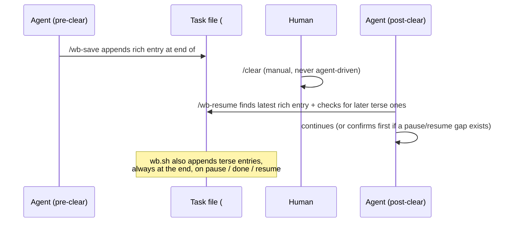

# wb Context-Handoff Skills - Plan

**Target repos:** `dotfiles` (skills, `wb.sh`) and `tasks` (`~/code/tasks` —
separate repo, `jetnoli-sportable/tasks`; schema docs only). Paths below are
relative to each repo as stated per unit.

## Goal Capsule

- **Objective:** two strands. Primary — ship `/wb-save`, `/wb-resume`, and
  a `## Handoffs` section in the task-file schema (written automatically by
  `wb.sh`'s `pause`/`done`/`resume` commands too) so a task's context can be
  cleared between stages (e.g. `/ce-plan` finishes, `/ce-work` begins)
  without losing continuity. Secondary, separately justified — ship
  `/wb-done` and `/wb-board`, owner-requested additions that round out the
  `/wb-*` family with thin wrappers around existing `wb` CLI commands; they
  don't serve the continuity goal and aren't judged against it.
- **Authority hierarchy:** this plan, then
  `~/code/tasks/dotfiles--feat-self-handoff.md`, then
  `docs/roadmap-handoff.md`'s "self-handoff between stages" section.
- **Stop conditions:** if implementation pressure pushes toward an agent
  autonomously sending `/clear` (or any tmux-keystroke self-drive) to its
  own pane — stop and flag. This was tried and the auto-mode classifier
  hard-blocked it twice; it is a closed door for this feature, not an
  open question. Also stop if pressure pushes toward multi-target fan-out,
  or toward folding `/second-opinion` or Hub v0 cataloging into this
  build — both are explicitly deferred (see Scope Boundaries).
- **Execution profile:** solo personal repo, no CI, bash + Claude Code
  skills (prose, not code). `wb.sh` changes are tested with plain-bash
  assertions against real throwaway tmux sessions and fixture task files
  (this repo's existing convention — see each unit's own Patterns to follow
  field below); skills are
  verified with a live manual smoke walkthrough, the same requirement
  `/handoff` v1 held itself to.
- **Tail ownership:** the implementer runs the extended/new `wb.sh` test
  files plus one live smoke walkthrough per skill (save → manual `/clear`
  → resume, done, board) before calling a unit done. Docs regenerate
  automatically on commit (`.githooks/pre-commit` drives docgen) — no
  manual doc-build step.

---

## Product Contract

### Summary

Add a `## Handoffs` section to the task-file schema (`~/code/tasks/README.md`,
`TEMPLATE.md`) as an append-only log of stage-transition entries, and four
thin Claude Code skills that read/write it: `/wb-save` (rich, agent-authored
snapshot before you `/clear`), `/wb-resume` (reads the log back and
continues), `/wb-done` and `/wb-board` (thin wrappers around the existing
`wb done`/`wb board` CLI commands, added to round out the `/wb-*` family).
`wb.sh` itself gains one small helper so `pause`/`done`/`resume` also write
terse, mechanical entries automatically — an audit trail that exists
whether or not `/wb-save` was ever run.

### Problem Frame

A single task's `/ce-plan` → `/ce-work` cycle currently accumulates all of
planning's research and back-and-forth into the same session that then
implements it — there's no clean way to reset context mid-task without
losing the state needed to pick back up. The original idea (an agent
autonomously clearing its own context) was dry-run tested and hard-blocked
by Claude Code's auto-mode classifier — sending `tmux send-keys ... '/clear'`
to an agent's own pane was denied twice, once for the action itself and
once for a read-only follow-up check, both times as "an agent self-driving
its own pane to alter its own session/oversight state." There is also no
direct tool-level equivalent to `/clear` that bypasses tmux. This forecloses
the autonomous mechanic; the fix is to put a human in the loop for exactly
the one step that needs to stay human-driven.

This also beats relying on Claude Code's built-in `/compact`: a compaction
summary is lossy and uncurated, and does not survive a hard `/clear` or a
torn-down worktree/session — exactly the failure modes this plan addresses
— while a `## Handoffs` entry is durable (git-tracked in the task file),
inspectable independent of any session, and composes with the `wb`
lifecycle commands that already tear worktrees/sessions down and back up
(`wb done`, `wb pause`, `wb resume`).

### Requirements

**Context handoff mechanics**
- R1. `/wb-save` writes a rich, structured snapshot (what's done, what's
  in flight, the immediate next action) into the current task's
  `## Handoffs` section.
- R2. The human runs `/clear` themselves, manually, between save and
  resume — no skill or script ever sends `/clear` (or drives any other
  tmux keystroke) to a Claude Code pane on the agent's own initiative.
- R3. `/wb-resume`, run in the now-cleared session, reads the latest rich
  `## Handoffs` entry (plus the rest of the task file) and either
  continues directly into the recorded next action, or — if an automatic
  entry landed after it, signaling a real pause/resume gap — states the
  recorded action and confirms with the human first. The direct-continue
  path is the same way `/handoff`'s injected pointer already causes a
  freshly spawned agent to act, not just orient.

**Automatic audit trail**
- R4. `wb.sh`'s `pause`, `done`, and `resume` commands each append a terse,
  mechanical `## Handoffs` entry (timestamp + which command fired)
  automatically, independent of whether `/wb-save` was ever run — `wb.sh`
  has no access to conversation content, so these entries are markers, not
  summaries.

**Session-lifecycle wrappers (owner-requested additions)**
- R5. `/wb-done` thin-wraps the existing `wb done` CLI command (dirty-tree
  check, sweep-review buffer, worktree removal, status flip) from inside a
  Claude Code session and relays the outcome.
- R6. `/wb-board` thin-wraps `wb board` (relays the plain-text table inline)
  or `wb board --html` (reports the `logs/board.html` path) from inside a
  Claude Code session. No `/board` skill exists today — "/board" is only
  how the docs name the `wb board --html` feature — so this is the first
  time it becomes an actual slash command, named `/wb-board` for
  consistency with the other three, not `/board`.

**Schema**
- R7. The task-store schema (`~/code/tasks/README.md`, `TEMPLATE.md`)
  documents the `## Handoffs` convention alongside the existing
  `## Plan`/`## Decisions`/`## Done` sections.

### Scope Boundaries

- **Autonomous self-`/clear` is out, not deferred.** Closed by the dry-run
  finding (classifier hard block, twice) — not a design option to revisit
  inside this plan.
- **Branch/task-file rename** (away from `feat/self-handoff` framing) —
  flagged in the task file, left for the owner to decide separately; not
  part of this build.
- **Hub v0 cataloging this skill family** — noted in `docs/roadmap.md`'s
  Hub v0 row; happens when Hub v0 itself resumes, not here.
- **`/second-opinion`** (formalizing today's ad-hoc fable-subagent check
  as a reusable skill) — added as its own proposal row in `docs/roadmap.md`;
  a separate, unscoped future feature, not part of this build.
- **Multi-target fan-out, cross-repo parent/child interaction** — not
  applicable; this feature operates entirely within one already-live
  task's own repo/slug/session.

---

## Planning Contract

### Key Technical Decisions

- **Task-file lookup via the tmux `@task` session option, not cwd/branch
  inference.** `cmd_new` already stamps every wb-managed session with
  `@wb_repo`/`@wb_slug`/`@task` (`wb.sh:334-336`), and `cmd_pause`/`cmd_done`
  already read `@wb_repo`/`@wb_slug` back the same way. All four new skills
  read `@task` directly (`tmux show -t "=$session:" -v @task`) instead of
  re-deriving repo/slug from the working directory — simpler, and it's
  exactly the mechanism the shell side already trusts. A session with no
  `@task` set (not a wb-managed session) is the same "not a wb task
  session" error `cmd_pause`/`cmd_done` already produce.
- **Two-tier entry richness, one shared section, chronological append-at-
  end.** `wb.sh`'s automatic entries (R4) are terse one-liners it can
  produce mechanically; `/wb-save` (R1) is the only rich, structured entry,
  because only the agent has conversation content to summarize. Both write
  into the same append-only `## Handoffs` log, and **every new entry lands
  at the end of the section** (immediately before the next `##` heading, or
  EOF) so the log reads oldest-to-newest, matching the worked example
  below. This is a deliberate deviation from `handoff_append_followup`'s
  own behavior for `## Follow-ups` (which inserts a new bullet immediately
  *after* the heading line, i.e. newest-first) — see the next decision for
  why the two can't share one literal implementation.
- **`/wb-resume` reads the latest *rich* entry, not just the last entry.**
  Because terse automatic entries (R4) can be appended after a rich
  `/wb-save` entry (e.g. a `wb pause`/`wb resume` cycle in between), the
  chronologically-last entry in `## Handoffs` is not reliably the one with
  next-action content. `/wb-resume` locates the most recent `/wb-save`-
  authored entry for its done/in-flight/next content, and separately checks
  whether any terse entries were appended after it. See U4 for what changes
  based on that check.
- **One new `wb.sh` helper, not a generalization of `handoff_append_followup`.**
  `wb.sh` gets a single new function (append `## Handoffs`, inserting the
  heading immediately before `## Decisions` if absent — the same insertion
  point `handoff_append_followup` uses for a missing `## Follow-ups`) used
  by `cmd_pause`/`cmd_done`/`cmd_resume`. It's a new function rather than a
  generalized/shared version of `handoff_append_followup` because the two
  insert differently within an existing section: `handoff_append_followup`
  inserts a single bullet immediately after the `## Follow-ups` heading
  (top-of-section); the new helper must append a multi-line `### <entry>`
  block at the *end* of `## Handoffs` (bottom-of-section, per the decision
  above) — different enough insertion behavior that sharing one function
  would need a mode flag rather than a clean parameterization. The two
  skills don't call into this bash helper; they use the Edit tool directly
  on the task file's prose content, the same division of labor `/handoff`'s
  own SKILL.md already uses (shell out to `wb.sh` helpers for mechanical
  path/frontmatter work, direct Read/Edit for freeform context) — each
  skill's own instructions restate the same heading-then-append-at-end rule
  so the two paths can't drift into different section shapes.
- **`cmd_resume`'s entry lives in `cmd_resume` itself, not `cmd_new`.**
  `cmd_resume` ends by calling `cmd_new` (`wb.sh:376`) to recreate the
  worktree/session — but `cmd_new` is also the path every *fresh* `wb new`
  takes. Writing the Handoffs entry inside `cmd_new` would fire on every
  new task, not just resumes. The entry is appended in `cmd_resume`,
  around its call to `cmd_new`.
- **`/wb-done` and `/wb-board` are thin wrappers, not reimplementations.**
  Both shell out to the real `wb done [--close]` / `wb board [--html]`
  commands and relay output — the same posture the `handoff` skill already
  takes toward `handoff.sh`. `wb done`'s sweep-review buffer
  (`wb_open_buffer`) tmux-splits and blocks on an untimed `tmux wait-for`
  (`wb.sh:834-845`) — a synchronous foreground shell-out to `wb done` would
  hang the agent's own tool call on that untimed human step. `/wb-done`
  instead invokes it the same way the `decision-buffer` skill already
  invokes its own blocking nvim opens: a background shell call with a
  unique wait-channel, ending the agent's turn until the buffer closes (see
  U5).

### High-Level Technical Design



Directional sketch of a `## Handoffs` entry shape — entries append
chronologically at the end of the section; only the agent-authored one
carries the structured fields. This example shows the case `/wb-resume`
must handle: a terse entry landed after the last rich save (a `wb pause`/
`wb resume` cycle happened before anyone ran `/wb-resume`), so reading
"the latest entry" alone would surface the content-free marker instead of
the actual next action:

```
## Handoffs

### 2026-07-11 18:42 — wb-save
**Done:** ...
**In flight:** ...
**Next:** ...

### 2026-07-11 19:05 — wb pause (auto)
Session paused via `wb pause`.

### 2026-07-12 09:10 — wb resume (auto)
Session resumed via `wb resume`.
```

---

## Implementation Units

### U1. `wb.sh`: shared Handoffs-append helper, wired into `pause`/`done`/`resume`

**Goal:** give `wb.sh` one function that appends a terse, timestamped
`## Handoffs` entry (inserting the heading if it's missing), and call it
from `cmd_pause`, `cmd_done`, and `cmd_resume`.

**Requirements:** R4.

**Dependencies:** none.

**Files (repo: dotfiles):**
- `scripts/.config/scripts/tmux/wb.sh` — new helper near
  `handoff_append_followup`'s conceptual sibling (`wb_sweep_section`,
  `wb_followup_count`); call sites in `cmd_pause` (`wb.sh:805-824`),
  `cmd_done` (`wb.sh:1461-1610`), `cmd_resume` (`wb.sh:352-386`).
- `scripts/.config/scripts/tmux/tests/wb-pause.test.sh`,
  `tests/wb-done.test.sh`, `tests/wb-resume.test.sh` — extend with
  Handoffs-entry assertions.
- `scripts/.config/scripts/tmux/tests/wb-handoffs.test.sh` — new, unit
  tests for the helper itself (heading-insert-when-absent,
  append-when-present).

**Approach:** when `## Handoffs` is absent, insert the heading immediately
**before** `## Decisions` when present, else at EOF — same insertion point
`handoff_append_followup` uses for a missing `## Follow-ups`. This is
where the mirroring ends: unlike `handoff_append_followup` (which inserts
a new bullet immediately after the `## Follow-ups` heading line, so
repeated calls read newest-first), this helper always appends its new
`### <timestamp> — <source>` entry at the **end** of `## Handoffs`
(immediately before the next `##` heading, or EOF), so repeated calls read
oldest-first — see Planning Contract for why. The three call sites append
immediately after their existing state-changing line — `cmd_pause` after
`wb_set_frontmatter ... status paused`, `cmd_done` after the `closed:`
stamp, `cmd_resume` around its `cmd_new` call (not inside `cmd_new`,
see Planning Contract).

**Patterns to follow:** `handoff_append_followup`
(`scripts/.config/scripts/tmux/handoff.sh:84-116`) for the awk shape;
`wb_sweep_section` for section-scoped extraction if a read-back helper is
needed by tests.

**Test scenarios:**
- Happy path: `cmd_pause` on a task with no `## Handoffs` section yet —
  section gets created with one entry.
- Happy path: `cmd_done` on a task that already has a `## Handoffs`
  section with prior entries — new entry appends without disturbing
  existing ones.
- Happy path: `cmd_resume` appends its own entry distinct from a fresh
  `wb new`'s path (fresh `wb new` must NOT gain a Handoffs entry).
- Edge case: `## Handoffs` heading present but section empty — appends
  cleanly, no stray blank-line drift.
- Edge case: task file has both `## Handoffs` and `## Decisions` —
  a missing `## Handoffs` heading gets inserted before `## Decisions`,
  matching the existing `## Follow-ups` insertion convention.
- Edge case: `## Handoffs` already has 2+ entries — a new entry lands
  after all existing ones (end of section), not immediately after the
  heading; existing entries' order is undisturbed.

**Verification:** existing + extended `*.test.sh` files pass (locally and
via the Docker sandboxed runner); a fixture task file shows entries from
all three commands in the order they were invoked.

---

### U2. Task-store schema: document `## Handoffs`

**Goal:** document the `## Handoffs` convention in the central task store
so it's not tribal knowledge.

**Requirements:** R7.

**Dependencies:** U1 (so the documented shape matches what actually gets
written).

**Files (repo: tasks, `~/code/tasks`):**
- `README.md` — add `## Handoffs` to the "Task body" convention list
  alongside `## Plan`/`## Decisions`/`## Done`.
- `TEMPLATE.md` — add an empty `## Handoffs` heading in the same position
  U1's helper would insert it at runtime: immediately before `## Decisions`
  (`TEMPLATE.md`'s current order is `## Plan` / `## Decisions` / `## Done`),
  so a task created fresh from the template and one that gains its
  `## Handoffs` heading later via U1's helper end up with the same section
  order.

**Approach:** short, factual documentation — append-only log, one entry
per stage transition, terse (`wb.sh`-authored) vs. rich (`/wb-save`-
authored) entries both land here. Do not touch the pre-existing
`## Follow-ups`-missing-from-TEMPLATE.md gap the `handoff` skill already
flagged — out of scope for this unit.

**Test expectation:** none — documentation only, no executable behavior.

**Verification:** `README.md` and `TEMPLATE.md` read cleanly and match
what U1's helper actually produces.

---

### U3. `/wb-save` skill

**Goal:** a skill that writes a rich `## Handoffs` snapshot into the
current task file.

**Requirements:** R1, R2.

**Dependencies:** U1, U2 (shares the section/insertion convention).

**Files (repo: dotfiles):**
- `claude/.claude/skills/wb-save/SKILL.md` — new.

**Approach:** on `/wb-save`, locate the task file via the current
session's `@task` tmux option (see Planning Contract). Compose a
structured entry — done / in flight / next action — from the current
conversation, and append it under `## Handoffs` (inserting the heading
first if absent, same rule as U1's helper, before `## Decisions` when
present). Tell the user, in one line, that the save landed and that
running `/clear` is the next manual step — never invoke `/clear` or touch
tmux state itself.

**Patterns to follow:** `/handoff`'s own step 5 ("Write the rich context")
— direct Read/Edit on the task file's prose, never overwriting prior
content, only appending.

**Test scenarios:**
- Happy path: mid-task session, `/wb-save` run — entry appears under
  `## Handoffs` with done/in-flight/next fields populated from real
  conversation state.
- Edge case: task file has no `## Handoffs` heading yet — heading gets
  created before the entry.
- Edge case: not a wb-managed session (no `@task` set) — clear error,
  no partial write.
- Edge case: `@task` is set but the file it points to doesn't exist on
  disk — clear error mirroring `cmd_pause`'s "no task file for ..."
  message (`wb.sh:820`), not a raw tool error.
- Integration: `/wb-save` followed by a manual `/clear` followed by
  `/wb-resume` in the same tmux pane — round-trips correctly (covered
  jointly with U4's scenarios).

**Verification:** live smoke walkthrough — real wb-managed session, run
`/wb-save`, inspect the task file directly.

---

### U4. `/wb-resume` skill

**Goal:** a skill that, in a freshly cleared session, reads the latest rich
`## Handoffs` entry and continues (or confirms first, if stale).

**Requirements:** R3.

**Dependencies:** U1, U2, U3 (reads what U3 writes).

**Files (repo: dotfiles):**
- `claude/.claude/skills/wb-resume/SKILL.md` — new.

**Approach:** on `/wb-resume`, locate the task file via `@task` (same
lookup as U3). Find the most recent `/wb-save`-authored (rich) entry in
`## Handoffs` for its done/in-flight/next content — not simply the last
entry in the section, since a terse automatic entry (R4) can land after
it (see Planning Contract). Also check whether any entries were appended
after that rich one:

- **No entries after it** (an immediate save → clear → resume, the common
  case): continue directly into the recorded next action — mirroring how
  `/handoff`'s injected pointer causes a freshly spawned agent to act on
  its first-action line, not just acknowledge it.
- **One or more terse entries after it** (a real `wb pause`/`wb done`/
  `wb resume` gap happened in between — the recorded next action may be
  stale): state what was recorded, note the gap (e.g. "paused, then
  resumed, since that save"), and ask the human to confirm or redirect
  before proceeding, rather than assuming the old plan still holds.

Either way, state explicitly, in one line, what was read and what happens
next — never a silent continuation.

**Patterns to follow:** `/handoff`'s "Determine `first_action`" step
(`claude/.claude/skills/handoff/SKILL.md:167-189`) for the
read-then-act posture.

**Test scenarios:**
- Happy path: session has a recent `/wb-save` entry with a clear next
  action and no terse entries after it — `/wb-resume` states what it read
  and proceeds directly into that action.
- Edge case: a terse `wb pause`/`wb resume` entry (or both) landed after
  the last `/wb-save` entry — `/wb-resume` surfaces the recorded next
  action and the gap, and asks for confirmation before proceeding, rather
  than barreling into a possibly-stale action.
- Edge case: `## Handoffs` has only automatic (terse) entries, no
  `/wb-save` entry yet — `/wb-resume` falls back to the rest of the task
  file (`## Plan`) for context and says so explicitly.
- Edge case: no `## Handoffs` section at all — clear message, falls back
  to reading the whole task file rather than failing.
- Error path: not a wb-managed session (no `@task`) — clear error.
- Error path: `@task` is set but the file it points to doesn't exist on
  disk — clear error mirroring `cmd_pause`'s "no task file for ..."
  message, not a raw tool error.

**Verification:** live smoke walkthrough — save, manual `/clear`, resume,
in the same real tmux pane; confirm the resumed agent's stated context
matches what was actually saved.

---

### U5. `/wb-done` skill

**Goal:** a thin wrapper so `wb done` can be run from inside a Claude Code
session.

**Requirements:** R5.

**Dependencies:** U1 (so the automatic Handoffs entry `wb done` now
produces is visible in the outcome relayed to the user).

**Files (repo: dotfiles):**
- `claude/.claude/skills/wb-done/SKILL.md` — new.

**Approach:** shell out to `wb done` (optionally `--close`, if the user
asks to also kill the session) using the same background-Bash-plus-
unique-wait-channel pattern the `decision-buffer` skill already uses for
its own blocking nvim opens — never a plain synchronous foreground
shell-out, since `wb done`'s sweep-review buffer (`wb_open_buffer`)
tmux-splits and blocks on an untimed `tmux wait-for` (`wb.sh:834-845`;
see Planning Contract). End the agent's turn until the wait-channel
signals the buffer closed, then relay `wb done`'s own stdout/stderr
outcome messages back to the user in one line — same relay-verbatim
posture the `handoff` skill already takes toward `handoff.sh`'s messages.

**Patterns to follow:** the `decision-buffer` skill
(`claude/.claude/skills/decision-buffer/SKILL.md`) for the background-
Bash-plus-wait-channel shape; `/handoff`'s step 6 ("Invoke `handoff.sh`
and relay the outcome") for the shell-out-and-relay shape.

**Test scenarios:**
- Happy path: clean worktree, `/wb-done` run — worktree removed, status
  flips to done, outcome relayed.
- Edge case: dirty worktree — `wb done`'s own dirty-tree error is relayed
  as-is, nothing removed.
- Edge case: `/wb-done --close` (or however the skill exposes the flag) —
  session also killed; confirm the skill never runs `--close` by default.

**Verification:** live smoke walkthrough against a real (throwaway) wb
task.

---

### U6. `/wb-board` skill

**Goal:** a thin wrapper so the task-store status table (or its HTML
view) can be pulled up from inside a Claude Code session.

**Requirements:** R6.

**Dependencies:** none.

**Files (repo: dotfiles):**
- `claude/.claude/skills/wb-board/SKILL.md` — new.

**Approach:** default invocation shells out to `wb board` and relays the
plain-text table inline (wrapped for monospace alignment). When the user
asks for the HTML/detailed view, shell out to `wb board --html` and
report the absolute path to `logs/board.html` — display the path only,
same "here's the path, open it yourself" posture this very plan's own
`ce-plan` skill uses for its HTML output; don't attempt to launch a
browser.

**Patterns to follow:** `cmd_board`
(`scripts/.config/scripts/tmux/wb.sh:1413-1459`) for what each mode
actually produces.

**Test scenarios:**
- Happy path: `/wb-board` with no argument — plain-text table relayed
  inline, matches `wb board`'s own output.
- Happy path: `/wb-board` asking for HTML — `logs/board.html` path
  reported, file exists and is non-empty.
- Edge case: empty task store — relays `wb board`'s own "no tasks in
  ..." message rather than inventing output.

**Verification:** live smoke walkthrough against the real task store.

---

## Verification Contract

| Command | Applicability | Gate |
|---|---|---|
| `bash scripts/.config/scripts/tmux/tests/wb-handoffs.test.sh` | U1 | New helper's own fixture assertions pass |
| `bash scripts/.config/scripts/tmux/tests/wb-pause.test.sh` | U1 | Extended Handoffs-entry assertions pass |
| `bash scripts/.config/scripts/tmux/tests/wb-done.test.sh` | U1 | Extended Handoffs-entry assertions pass |
| `bash scripts/.config/scripts/tmux/tests/wb-resume.test.sh` | U1 | Extended Handoffs-entry assertions pass |
| Full suite via `docker build -t wb-tests -f scripts/.config/scripts/tmux/tests/Dockerfile . && docker run --rm -v "$(pwd)":/repo:ro -w /repo wb-tests` | U1 | No regressions in the sandboxed run |
| Manual read-through of `~/code/tasks/README.md` and `TEMPLATE.md` | U2 | Documented `## Handoffs` shape and heading position match what U1's helper actually produces |
| Live smoke: save → manual `/clear` → resume, same pane | U3, U4 | Resumed agent's stated context matches what was saved |
| Live smoke: save → `wb pause` + `wb resume` (via a second terminal) → manual `/clear` → resume | U4 | `/wb-resume` surfaces the gap and confirms before proceeding, rather than silently acting |
| Live smoke: any one skill run outside a wb-managed session (no `@task`) | U3, U4, U5 | Clear "not a wb task session" error, no partial write or hang |
| Live smoke: `/wb-done` against a real throwaway task | U5 | Matches `wb done`'s own CLI behavior exactly; buffer step does not hang the agent's turn |
| Live smoke: `/wb-board` (plain + `--html`) | U6 | Matches `wb board`'s own CLI output exactly |

## Definition of Done

- All new/extended `wb.sh` tests pass locally and in the Docker sandbox.
- `~/code/tasks/README.md` and `TEMPLATE.md` document `## Handoffs`.
- All four skills pass their live smoke walkthrough, including (not just
  the happy path) the not-a-wb-session error path for U3/U4/U5 and U4's
  pause/resume-gap confirmation check (no unit is "done" on test-pass
  alone — this repo's own `/handoff` v1 precedent requires the live
  walkthrough too).
- No leftover experimental code from approaches that didn't pan out (e.g.
  no dead branch exploring the autonomous self-clear mechanic).
- Docs regenerate automatically on the next commit; no manual docgen step
  required.
