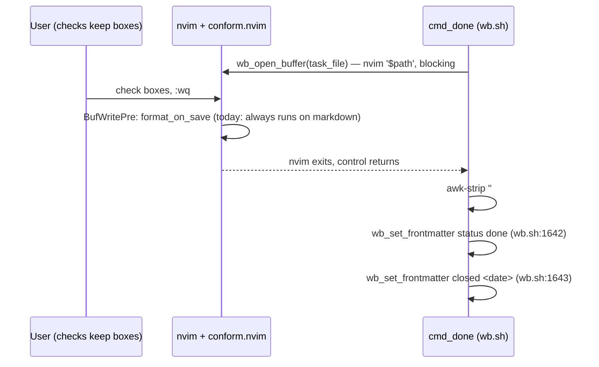

# wb done: the Sweep-review buffer stops reformatting itself

## Product Contract

### Summary

Stop `wb_open_buffer`'s ephemeral review-buffer nvim sessions from running
conform.nvim's format-on-save, so a "check a couple of keep boxes" edit no
longer silently reformats the whole task file and doesn't risk racing
`cmd_done`'s own later frontmatter writes. Scoped to the formatting fix
alone this round — write-order hardening is evaluated after live repro,
not bundled in speculatively.

Full background, confirmed root cause, and code excerpts:
`logs/decisions/2026-07-11-wb-sweep-buffer-scoping.html`. Scoping decisions
were confirmed via a companion decision buffer
(`logs/decisions/2026-07-11-wb-sweep-buffer-scoping.md`).

### Problem Frame

Reproduced live on 2026-07-11 while closing out
`~/code/tasks/dotfiles--feat-handoff-v1.md` with a real `wb done` run.
`status: done` landed in the task file's frontmatter, but `closed:` never
appeared — and the file showed unrelated cosmetic reformatting: a blank
line inserted after the closing frontmatter `---`, blank lines after
several markdown headings, and `*emphasis*` rewritten to `_emphasis_`.

`wb_open_buffer` (`scripts/.config/scripts/tmux/wb.sh:882`) opens a bare
`nvim '$path'` with no formatting override. Every real nvim session in
this dotfiles config loads `conform.nvim` with `format_on_save` enabled for
every filetype except `c`/`cpp` (`nvim/.config/nvim/lua/plugins/index.lua:131-160`),
and markdown maps to `prettier`. So saving the Sweep-review checkbox
buffer runs Prettier over the entire file as a side effect — the
reformatting signature is an exact match for stock Prettier markdown
output.

Isolating `wb_set_frontmatter`'s two calls (`status` then `closed`)
back-to-back on an identical fixture, outside `cmd_done`, worked
perfectly — the function itself isn't buggy. Between the interactive
buffer closing and those two calls, the task file is actually rewritten
three times: the nvim/Prettier save itself, `cmd_done`'s own `awk`-based
strip of the transient `## Sweep` section (`wb.sh:1613`), then the two
`wb_set_frontmatter` writes. The cosmetic-reformat root cause is solid;
the causal link from "reformat happened" to "this specific write vanished"
is correlated from the one live run so far, not proven from reading the
code alone — closing that gap is this plan's own Verification step, not a
planning-time question.

This is not the tasks-store concurrency bug
(`~/code/tasks/dotfiles--feat-wb-tasks-concurrency-safety.md`): that task
is about multiple agent sessions racing on the shared store. This is a
single session's own editor tooling reformatting a file mid-script, then
colliding with that same script's own later writes — same symptom class,
different root cause.

Research into the task file's own open question — do `wb_open_buffer`'s
other 3 call sites (`wb reconcile --review` at `wb.sh:610`, `wb reconcile
--apply`'s re-confirm at `wb.sh:799`) share the same risk shape? — resolved
without needing a decision: `wb_open_buffer` has exactly one documented
purpose (ephemeral checkbox-review buffers) across all 4 sites, and the
one genuine free-editing nvim session in this codebase (`wb new`'s window,
`wb.sh:265`, `nvim .`) doesn't go through it at all. The two reconcile call
sites open a scratch findings file rather than a task's own frontmatter,
so they don't share cmd_done's exact write-race shape — but `wb reconcile
--apply` parses that reopened file with anchored regexes
(`grep -qE '^- \[x\] ...'`); a formatter silently touching that file's
list-item spacing would misparse into the wrong action, arguably a worse
failure mode than cosmetic drift. `cmd_done` itself has the identical
exposure, and it's the highest-stakes instance of the three: it extracts
keeper files via `wb_sweep_section "$task_file" | grep -oP '^- \[x\] keep
\K.*'` (`wb.sh:1588`) from the same buffer Prettier had just reformatted —
a misparsed "keep" box there means `git worktree remove` silently destroys
a file the user meant to save, not just a cosmetic diff. The fix belongs
at the shared function, covering all 4 callers uniformly.

### Requirements

- R1. `wb_open_buffer`'s review-buffer nvim sessions do not run
  format-on-save, across all 4 current call sites (`wb.sh:610, 799, 1569,
  1624`).
- R2. Normal, non-`wb` nvim editing sessions retain today's format-on-save
  behavior unchanged — the fix is scoped to review buffers only, not a
  global format-on-save disable.
- R3. After a `wb done` run that opens a Sweep-review buffer, both
  `status: done` and `closed: <date>` land in the task file's frontmatter
  once the worktree removal that gates them succeeds.
- R4. `cmd_done`'s existing invariant — `status` flips only after a
  successful worktree removal (`wb.sh` comment ~1628) — is preserved
  byte-for-byte; this fix does not reorder or touch that gating.

### Scope Boundaries

- In scope: a buffer-local no-format signal set by `wb_open_buffer` and
  checked by conform.nvim's `format_on_save`, applied uniformly to all 4
  call sites.
- Out of scope: `wb_set_frontmatter`'s own logic — confirmed correct in
  isolation, not touched.
- Out of scope: the tasks-store concurrency bug (separate task/plan).

#### Deferred to Follow-Up Work

- Combining `cmd_done`'s two final `wb_set_frontmatter` calls (`status`,
  `closed`) into a single write pass. Decided against bundling it into
  this round (decision buffer, 2026-07-11): the formatting fix already
  removes the one confirmed rewrite-mechanism in the risk window: nothing
  else in that window is an interactive editor. Revisit only if this
  plan's live repro (Verification Contract) shows `closed:` still drops
  after the formatting fix ships.

---

## Planning Contract

### Key Technical Decisions

**KTD1 — Formatting fix only this round, write-order hardening deferred.**
Ship R1-R4 as scoped above; do not also collapse the two frontmatter
writes into one pass. Rationale: the reformatting event is the one
confirmed rewrite-mechanism in the window between the buffer closing and
`cmd_done`'s final writes; combining the writes is a reasonable
defense-in-depth idea but has no known bug behind it yet, and adds a new
multi-key variant of `wb_set_frontmatter` for a seam that may never
matter. Confirmed via decision buffer, 2026-07-11 (`logs/decisions/2026-07-11-wb-sweep-buffer-scoping.md`,
Decision 1, Option A).

**KTD2 — Unconditional buffer-local disable, not a per-call opt-out flag.**
`wb_open_buffer` sets its no-format signal on every invocation rather than
taking an explicit `--no-format` parameter callers must remember to pass.
Rationale: the function's own doc comment already scopes it to exactly
one purpose (open `<path>`, block until closed); every current and
foreseeable caller is a review buffer, and the one real free-editing nvim
session in this codebase doesn't go through this function at all. An
opt-out parameter would need all 4 call sites updated and kept in sync —
one missed site quietly reintroduces this exact bug for that path only.
Confirmed via decision buffer, 2026-07-11 (Decision 2, Option A).

**KTD3 — Signal mechanism: `WB_REVIEW_BUFFER` env var, matching the
existing `WB_AUTO_RESTORE` convention.** `wb_open_buffer` sets
`WB_REVIEW_BUFFER=1` in the environment before launching the editor, on
both its tmux and non-tmux branches; conform.nvim's `format_on_save(bufnr)`
checks `vim.env.WB_REVIEW_BUFFER == "1"` before its existing
`disable_filetypes` check and returns `nil` when set. This mirrors a
signaling convention already in use one file away for the identical class
of problem — telling a specific `wb`-launched nvim process to behave
differently from a normal edit session: `wb_layout_session` sets
`WB_AUTO_RESTORE=1 nvim .` (`wb.sh:265`), read via `vim.env.WB_AUTO_RESTORE`
in `persistence.lua:78`. Adopting the same pattern here (over an
alternative buffer-local vim variable set via `-c`) covers both of
`wb_open_buffer`'s invocation branches uniformly with no conditional
logic — an env var reaches the child process regardless of which binary
`${EDITOR:-nvim}` resolves to, and a non-nvim editor simply never reads
it, so no "is this actually nvim" guard is needed. Scoping is
process-wide rather than buffer-local, which is fine here: each
`wb_open_buffer` invocation is a fresh, single-purpose nvim process that
exists only to review the one file it opened.

---

## High-Level Technical Design

The write-race window this fix closes:

This plan's change removes the "format_on_save (today: always runs)" step
entirely for this call path — `wb_open_buffer` sets the buffer-local flag
before nvim ever opens the buffer, so the `BufWritePre` autocmd short-
circuits to `nil` and the rest of the sequence proceeds against an
unmodified file.

---

## Implementation Units

### U1. Buffer-local no-format check in conform.nvim's `format_on_save`

**Goal:** Teach the shared conform.nvim config to skip formatting when a
buffer is flagged as an ephemeral wb review buffer.

**Requirements:** R1, R2

**Dependencies:** none

**Files:**
- `nvim/.config/nvim/lua/plugins/index.lua` (the `format_on_save` function,
  currently lines 133-146)

**Approach:** Add a check for `vim.env.WB_REVIEW_BUFFER == "1"` alongside
the existing `disable_filetypes` check inside `format_on_save(bufnr)`,
returning `nil` when set — same return shape already used for `c`/`cpp`.
Order relative to the filetype check doesn't matter functionally; either
condition independently short-circuits to "don't format." Mirrors
`persistence.lua:78`'s existing `vim.env.WB_AUTO_RESTORE == "1"` check —
same env-var-signal idiom, different variable.

**Patterns to follow:** The existing `disable_filetypes[vim.bo[bufnr].filetype]`
check in the same function for the "return `nil` to skip" idiom;
`persistence.lua:78`'s `vim.env.WB_AUTO_RESTORE == "1"` for the
env-var-signal idiom itself.

**Execution note:** This is a personal nvim config/environment change with
no existing automated test harness for Lua config in this repo — prefer an
interactive smoke check over unit coverage: launch nvim on a scratch
markdown file with `WB_REVIEW_BUFFER=1 nvim scratch.md`, edit and save,
confirm no formatting fires; then launch without the env var set and
confirm normal formatting still fires.

**Test scenarios:**
- Happy path: a markdown buffer opened without `WB_REVIEW_BUFFER` set →
  `format_on_save` returns the normal `{timeout_ms = 500, lsp_format =
  "fallback"}` table (today's unchanged behavior for regular editing).
- Happy path: a markdown buffer opened with `WB_REVIEW_BUFFER=1` in the
  environment → `format_on_save` returns `nil`; saving does not invoke
  Prettier.
- Edge case: `WB_REVIEW_BUFFER=1` set on a `c`/`cpp` buffer (already
  disabled via `disable_filetypes`) → still returns `nil`; confirms no
  conflict between the two independent disable conditions.
- `Test expectation`: no regression to non-`wb` editing — a normal `nvim
  some-doc.md` session (env var unset) still autoformats on save exactly
  as before.

**Verification:** `:ConformInfo` (or a manual save-and-diff) shows no
formatter run when `WB_REVIEW_BUFFER=1` is set, and an unchanged formatter
run when it isn't.

---

### U2. Set the no-format flag from `wb_open_buffer`'s nvim invocation

**Goal:** Every `wb_open_buffer` call opens its review session with the
flag U1 checks for, across both the tmux and non-tmux code paths.

**Requirements:** R1, R2, R3, R4

**Dependencies:** U1 (the check must exist for the flag to have any
effect; safe to land in either order since the flag is inert until U1
lands)

**Files:**
- `scripts/.config/scripts/tmux/wb.sh` (`wb_open_buffer`, lines 882-893)

**Approach:** Export `WB_REVIEW_BUFFER=1` before both of `wb_open_buffer`'s
invocation branches — the `$TMUX` branch's inline `nvim '$path'` passed to
`tmux split-window`, and the non-tmux `"${EDITOR:-nvim}" "$path"` fallback.
No per-branch conditional needed: the env var propagates to whichever
editor `${EDITOR:-nvim}` resolves to, and a non-nvim editor simply never
reads it — mirroring how `WB_AUTO_RESTORE=1 nvim .` is set unconditionally
at `wb.sh:265` with no "is this nvim" guard. No change to `cmd_done`'s
call sites, worktree-removal ordering, or `wb_set_frontmatter` itself (R4).

**Patterns to follow:** `wb_layout_session`'s existing
`WB_AUTO_RESTORE=1 nvim .` env-var-before-invoke idiom (`wb.sh:265`); the
Docker-sandboxed test harness's `wb_open_buffer() { :; }` stub convention
(`scripts/.config/scripts/tmux/tests/wb-done.test.sh:85`) for why this
change is invisible to the existing automated suite.

**Test scenarios:**
- Happy path (regression): the full existing
  `scripts/.config/scripts/tmux/tests/*.test.sh` suite continues to pass
  unchanged, run via each test file's documented Docker-sandboxed runner —
  these tests stub `wb_open_buffer` entirely, so this change should be
  invisible to them.
- Integration (the case no automated test exercises today — `Covers` the
  task file's own Verification ask): on a fixture task file with a Sweep
  section, run a real `wb done` with real nvim + conform.nvim active,
  check a keep box, save and close. Confirm (a) the file's frontmatter and
  body are byte-identical apart from the checked box, and (b) both
  `status: done` and `closed: <date>` land afterward. Run this once before
  the fix (reconfirm the original bug) and once after (confirm both
  symptoms are gone) on the same fixture.
- Edge case: `EDITOR` set to a non-nvim value (e.g. `EDITOR=vi`) in the
  non-tmux fallback branch → the editor still opens normally with
  `WB_REVIEW_BUFFER=1` in its environment; a non-nvim editor has no reason
  to read that variable, so nothing breaks.
- Edge case: `wb reconcile --review` and `wb reconcile --apply`'s
  re-confirm (`wb.sh:610`, `wb.sh:799`) also open with `WB_REVIEW_BUFFER=1`
  set, since both call the same shared `wb_open_buffer` — spot-check by
  hand: edit the reopened findings file, save, confirm no reformatting and
  no corruption of its `- [x] ...` checkbox parsing.

**Verification:** Existing test suite green; live repro (above) shows no
reformatting and both frontmatter keys present; `wb reconcile` spot-check
shows no regression to its own checkbox-based parsing.

---

## Verification Contract

- All existing `scripts/.config/scripts/tmux/tests/*.test.sh` files pass,
  run via each file's documented Docker-sandboxed invocation.
- Live, interactive repro (fixture task file + real `wb done` + real
  nvim/conform.nvim) confirms both: no reformatting outside the checked
  box, and both `status: done` and `closed: <date>` present afterward.
- A quick sanity check that ordinary (non-`wb`) nvim markdown editing still
  autoformats on save as before — this touches the shared, global nvim
  config, so confirming the blast radius stayed contained to
  `wb_open_buffer`'s own buffers matters.
- `wb reconcile --review` and `wb reconcile --apply`'s re-confirm
  (`wb.sh:610`, `wb.sh:799`) spot-checked by hand: open the reopened
  findings file with real nvim/conform.nvim active, edit and save, confirm
  no reformatting and no corruption of its `- [x] ...` checkbox parsing —
  R1 claims coverage across all 4 call sites, and neither reconcile path
  has a dedicated automated test today.

## Definition of Done

- U1 and U2 implemented and reviewed.
- Verification Contract's four checks all pass.
- If live repro shows `closed:` still drops after the formatting fix
  ships, this plan's "Deferred to Follow-Up Work" item (write-order
  hardening) is promoted back into active scope rather than treated as
  optional — the fix isn't done until both original symptoms are gone.

## Risks & Dependencies

- The causal link between the reformat event and the dropped `closed:`
  write is correlated, not proven, until live repro runs (see Problem
  Frame). If repro shows the drop persists after U1+U2 ship, KTD1's
  deferral is void and write-order hardening (Decision 1, Option B in the
  companion decision buffer) needs to be picked back up.
- `nvim/.config/nvim/lua/plugins/index.lua` is global, personal nvim
  config — every nvim session on the machine loads it, not just `wb`
  flows. The buffer-local gate (U1) should contain the blast radius to
  buffers `wb_open_buffer` itself opens, but the Verification Contract's
  sanity check exists specifically to confirm that rather than assume it.

## System-Wide Impact

Personal dev tooling only — this dotfiles repo's own nvim config and
`wb.sh`. No external consumers, no CI/deploy surface, no other repos
depend on either file.
