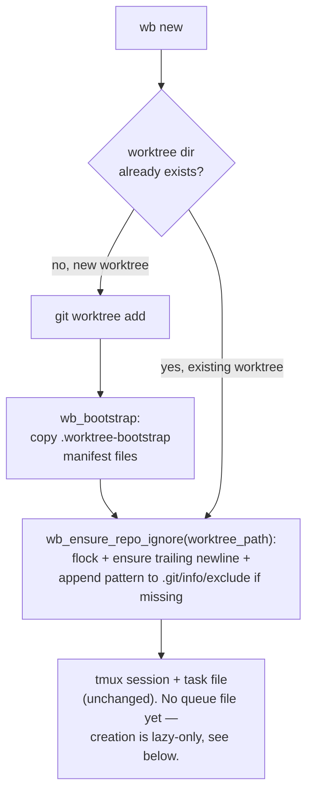
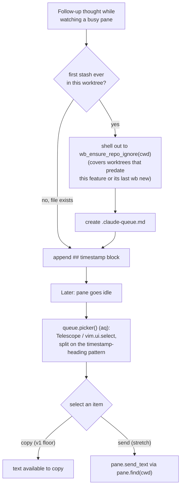

# Queue Command - Plan

## Goal Capsule

- **Objective:** give the user a simple, per-worktree scratch queue for
  follow-up thoughts aimed at the Claude Code pane they're currently
  watching, reviewable and actionable through a picker, without ever
  auto-injecting into a running turn.
- **Product authority:** this doc, then `~/code/tasks/dotfiles--feat-queue-command.md`
  (the scoping task), then the existing `claude-tmux` nvim plugin as the
  extension point.
- **Open blockers:** none — the three forks raised during scoping were
  resolved via a 2026-07-11 decision buffer
  (`logs/decisions/2026-07-11-queue-command-scoping.md`); see Outstanding
  Questions and Scope Boundaries for the resolutions.
- **Product Contract preservation:** changed — R3 reworded twice (once for
  the seeding step being new rather than a reuse of `wb_bootstrap`'s
  copy-existing-file semantics, once during doc review to drop eager file
  creation entirely — see Planning Contract); R10, AE5, AE6 added; F1 and
  F4 updated to reflect where ignore-registration actually happens; AE1
  reworded for the no-eager-file-creation change; Scope Boundaries and
  Dependencies/Assumptions each gained one bullet tied to R10. All other
  Product Contract content is unchanged.
- **Stop conditions:** if implementation pressure pushes toward editing a
  target (non-dotfiles) repo's own tracked `.gitignore`, or toward a
  machine-wide `core.excludesFile`, stop and flag rather than proceeding —
  both are explicit non-goals below (R10), not open questions to resolve
  mid-build.
- **Execution profile:** solo personal repo, no CI. The `wb.sh` unit
  follows the existing plain-bash-assertion test convention
  (`scripts/.config/scripts/tmux/tests/*.test.sh`) against real fixture
  repos and tmux sessions. The `claude-tmux` (nvim/lua) unit has no
  automated test — no test precedent exists anywhere in this repo for that
  plugin — and is verified by manual smoke walkthrough instead, the same
  way the rest of `claude-tmux` always has been.

## Product Contract

### Summary

Extend the existing `claude-tmux` nvim plugin with a per-worktree queue: a
gitignored, Telescope-discoverable scratch file where the user stashes
several follow-up thoughts for the Claude pane they're already watching,
then reviews and acts on them through a picker whenever they choose.
Stashing is a pure file append — it never touches the live pane, so it
can't interrupt or distract the agent's current turn.

### Problem Frame

The seed idea ("a `/queue` command... store a queue of messages... a cool
interop") was floated in passing with no concrete scenario behind it. Two
distinct scenarios surfaced once pressure-tested: a task-scoped ephemeral
notes panel, and stashing follow-up prompts for a live agent without
interrupting it. Only the second is in scope here (see Scope Boundaries).

The existing `claude-tmux` plugin (`nvim/.config/nvim/lua/claude-tmux/`)
already does most of the adjacent mechanical work: `reply.lua` opens a
reply surface, and `<leader>as` pastes its contents into the target pane
(found via `pane.lua`'s `find(cwd)`, which shells out to the bash helper
`tmux_find_claude_pane`) and submits with Enter.
But it holds exactly one draft at a time — sent immediately on trigger,
stored in nvim's hidden `stdpath('state')/claude-tmux/` when in `"file"`
mode, invisible to Telescope or any cwd-scoped search. That's the concrete
gap: no way to hold several distinct stashed thoughts, and no way to find
them later without opening nvim in that exact buffer.

A live check confirmed this isn't rebuilding a stock Claude Code feature:
the CLI supports redirecting mid-turn with a single correction, but
ordered multi-message queuing with visibility is only documented for the
Agent SDK's streaming-input mode (custom-built agents), not the
interactive CLI the user actually drives day to day.

There's also a standing tension worth naming: a 2026-07-10 workflow review
found notes-tui's general capture command already went unused (empty
inbox), while three unmerged answers to "capture a stray thought" already
compete (task store, notes-tui, `/park`). That's the backdrop for keeping
this addition as small as it can be.

### Key Decisions

- **Extend `claude-tmux`, not a new Claude skill or a `wb.sh` subcommand.**
  The originating task posed three location options; none fit once
  `reply.lua`/`pane.lua` turned out to already provide pane discovery and
  paste/send. A new skill or `wb.sh` subcommand would duplicate that
  plumbing rather than reuse it.
- **Manual-only delivery, by explicit choice, not by omission.** The
  pane-status pipeline that would be needed for auto-flush
  (`tmux_claude_panes` / `tmux_pane_awaiting_input` in
  `scripts/.config/scripts/tmux/lib.sh:76-136`) already exists and shipped
  for the attention-routing pipeline — but the user wants to remain the one
  who decides when a message actually gets sent, and the ratified
  2026-07-06 workbench direction already says to hold off on fancy
  nvim-bridge automation.
- **v1's floor is view-and-copy, not send.** Making a selected item's text
  available to copy (e.g., opening it in a buffer) already satisfies the
  brainstorm's stated bar. Actually pasting the selection into the pane
  (reusing `pane.lua`'s `send_text`) is worth having but is a stretch goal,
  not a blocking requirement.
- **Scoped to the one pane already being watched, not a general outbox.**
  This does not replace `/handoff` (routing one discussion to a different,
  possibly not-yet-running session) or `/park` (a personal, weekly-reviewed
  capture ledger with no target agent). It only holds follow-ups for the
  specific worktree/pane the queue file belongs to.

### Requirements

**Storage & stash**

- R1. Each wb worktree has its own queue scratch file, mirroring
  `reply.lua`'s existing per-cwd scoping, holding zero or more stashed
  follow-up messages appended in order.
- R2. The file lives inside the worktree tree, gitignored — not in nvim's
  `stdpath('state')` — so cwd-scoped tooling (Telescope, `find`) can reach
  it without putting scratch content in git history.
- R3. The queue file needs no setup before first use: it's created lazily,
  the moment the user stashes their first follow-up in a given worktree —
  whether that worktree was just created or predates this feature
  entirely. (An earlier draft of this requirement also eagerly touched the
  file at worktree-creation time; doc review found that leaves a
  permanent, empty, gitignored file in every worktree forever, which
  `cmd_done`'s sweep would then list even for worktrees that never use
  `/queue` — dropped in favor of lazy-only creation, see Planning
  Contract.)

**Picker & manual delivery**

- R4. A picker surfaces the current worktree's queued items for review,
  reusing the custom Telescope-picker pattern already implemented in
  `output.lua`'s `M.picker()` (with its `vim.ui.select` fallback for when
  Telescope isn't loaded) rather than inventing a new picker mechanism.
- R5. Selecting a queued item makes its text available to copy — the v1
  floor. Sending it into the target pane is a stretch addition on top,
  not required for v1.
- R6. All delivery is user-triggered. No background process or hook
  auto-injects a queued message into the target pane under any condition.
- R7. Stashing a message is a pure file append and never touches the live
  tmux pane, so it cannot interrupt or distract the agent's current turn.

**Telescope discoverability**

- R8. The queue file is discoverable through Telescope from within its
  worktree with no extra flags — most likely by adding it to
  `telescope.lua`'s existing `always_include_globs` whitelist (the same
  mechanism that already surfaces `.env*` / `*.hjson`), rather than
  requiring the `no_ignore` picker variant.

**Worktree lifecycle**

- R9. The queue file needs no new teardown logic: `cmd_done`'s existing
  generic gitignored-file sweep (`scripts/.config/scripts/tmux/wb.sh:1491-1528`)
  already lists every gitignored file — the queue file included — as a
  `- [ ] keep <path>` line in the task file's review buffer before
  `git worktree remove` runs, and copies checked items into the task's
  dossier. This requirement is "verify the queue file participates in that
  existing flow like any other gitignored file," not "build a new check."

**Cross-repo git-ignore registration**

- R10. The queue file is recognized as ignored by `git status` in whatever
  repo it lives in — including repos other than this one, since `wb new`
  operates on arbitrary repos under `~/code` — without ever writing to
  that repo's own tracked `.gitignore` or to a machine-wide git setting.
  Discovered during planning: no existing mechanism in this repo solves
  "teach a foreign repo to ignore a file it's never seen" (see Planning
  Contract's Key Technical Decisions).

### Key Flows

- F1. Stash a follow-up
  - **Trigger:** the user has a thought while watching a live agent pane
    they don't want to interrupt.
  - **Steps:** if this is the worktree's first-ever stash, create the
    queue file and ensure its target repo's ignore-registration in the
    same step (this is the only place that registration is guaranteed to
    run for a worktree that predates the feature — see Planning
    Contract); append the thought. No pane interaction happens either way.
  - **Covers:** R1, R2, R3, R6, R7, R10
- F2. Review and act
  - **Trigger:** the user wants to check what's stashed, typically after
    noticing the pane has gone idle.
  - **Steps:** open the picker over the current worktree's queue file;
    select an item; v1 makes its text available to copy, a stretch variant
    sends it to the pane.
  - **Covers:** R4, R5, R6
- F3. Worktree teardown with unflushed items
  - **Trigger:** `wb done` runs on a worktree whose queue file is
    non-empty.
  - **Steps:** `cmd_done`'s existing generic gitignored-file sweep lists the
    queue file in the task file's `## Sweep` checklist alongside every
    other gitignored file; checking `keep` copies it into the task's
    dossier before the worktree is removed. No queue-specific code runs.
  - **Covers:** R9

- F4. Worktree creation
  - **Trigger:** `wb new` creates a new worktree for any repo under
    `~/code` (not just this one).
  - **Steps:** the target repo's `.git/info/exclude` gains a one-time,
    idempotent entry marking the queue file's pattern as ignored, without
    touching that repo's tracked `.gitignore`. No queue file is created
    here — creation is lazy-only, at first stash (see F1) — so a fresh
    worktree is pre-registered as ignored before any file exists to ignore.
  - **Covers:** R10

### Acceptance Examples

- AE1. Given a worktree with no queue file yet (never stashed into), when
  the picker is opened, then it shows no items rather than erroring —
  identical behavior to an existing-but-empty file. Covers R1, R4.
- AE2. Given a queue file with three stashed items, when one is selected
  via the picker, then only that item's text becomes available to
  copy/act on — the other two remain queued. Covers R4, R5.
- AE3. Given a non-empty queue file, when `wb done` runs, then it appears
  as a `- [ ] keep <path>` line in the task file's `## Sweep` checklist like
  any other gitignored file, rather than silently disappearing with
  `git worktree remove`. Covers R9.
- AE4. Given the queue file is gitignored, when searching from inside that
  worktree via the existing `<leader>sf` Telescope binding, then the queue
  file appears in results. Covers R8.
- AE5. Given a repo that has never been used with `wb new` before, when a
  worktree is created in it, then that repo's own `.git/info/exclude` (not
  its tracked `.gitignore`) gains exactly one entry for the queue file's
  pattern. Covers R10.
- AE6. Given a repo whose `.git/info/exclude` already has the queue-file
  pattern registered, when a second, different worktree is created for
  that same repo — or when that same repo's first stash happens on a
  worktree that predates this feature — then the registration is not
  duplicated. Covers R10.

### Scope Boundaries

Deferred for later:

- The task-scoped ephemeral idea-dump panel — the brainstorm's other
  original scenario. Whether it's its own mechanism or a filtered `/park`
  view is unresolved, and it's entangled with the not-yet-decided
  ~2026-07-24 "fix-forward experiment" verdict for notes-tui's capture
  ergonomics.
- Automatic, idle-triggered delivery — explicitly rejected even though the
  status pipeline needed to support it already exists.
- A general cross-session/cross-repo outbox — stays `/handoff`'s territory
  (single-target routing to a different, possibly not-yet-running
  session), not this feature's job.
- Extending the Telescope-discoverability fix to `reply.lua`'s existing
  per-cwd draft file — decided against for this PR (2026-07-11 decision
  buffer): the concrete ask was about the new queue file, and touching
  `reply.lua`'s working storage isn't worth it without evidence losing a
  reply draft has actually happened. See `docs/guides/claude-tmux.md` for
  what `reply.lua` does today.
- A `wb done` flow that explicitly lists queued items as "deferred" (beyond
  the plain dossier copy R9 already covers for free) — floated as a
  possible small follow-up, not blocking this PR.
- The follow-on brainstorm for the task-scoped ephemeral idea-dump panel —
  greenlit (2026-07-11 decision buffer) to run once `/queue` itself is
  planned or built, comparing it against this queue file's shape and a
  filtered `/park` view.
- Editing a target repo's own tracked `.gitignore`, or a machine-wide
  `core.excludesFile` — both considered and rejected for R10; see Planning
  Contract's Key Technical Decisions for why.
- Automated tests for the `claude-tmux` (nvim/lua) side, e.g. a
  plenary.nvim suite run in the existing sandboxed Docker pattern
  (`scripts/.config/scripts/tmux/tests/Dockerfile`) — raised during
  planning; genuinely valuable but a standalone investment benefiting the
  whole `claude-tmux` plugin, not just this feature, so it's tracked as a
  follow-up rather than folded into this plan's diff.

### Dependencies / Assumptions

- Assumes `nvim/.config/nvim/lua/claude-tmux/` (`reply.lua`, `pane.lua`,
  `config.lua`, `output.lua`) as the extension point — verified present,
  already providing pane discovery (`pane.find(cwd)`, itself a thin wrapper
  shelling out to the bash helper `tmux_find_claude_pane`), paste/send
  (`pane.send_text`), and a working custom-Telescope-picker pattern
  (`output.lua:179`, `M.picker()`).
- Assumes `scripts/.config/scripts/tmux/lib.sh:76-136`
  (`tmux_claude_panes`, `tmux_pane_awaiting_input`) as the already-shipped
  pane-status pipeline, available if a later iteration wants to surface
  status in the picker — not required for v1's manual-only floor.
- Assumes `cmd_done`'s existing generic gitignored-file sweep
  (`scripts/.config/scripts/tmux/wb.sh:1491-1528`) — which already lists
  every gitignored file as a `- [ ] keep` line and copies checked ones into
  the task's dossier — as the mechanism that covers the queue file with no
  new code, verified by reading the implementation directly rather than
  assumed from the ratified-direction summary alone.
- Assumes `nvim/.config/nvim/lua/plugins/config/telescope.lua`'s
  `always_include_globs` whitelist (currently `*.hjson`, `.env*`) as the
  extension point for surfacing a gitignored queue file to `find_files`.
- Verified during planning: no existing mechanism in this repo registers
  an ignore rule in a repo it doesn't own — grepping the full history for
  `info/exclude` / `excludesFile` returns zero hits, and the repo's own
  `git/.gitconfig` carries only identity + credential-helper settings, no
  `core.excludesFile`. This is genuinely new, not an extension of existing
  practice.

### Outstanding Questions

All three items originally raised here were resolved via a 2026-07-11
decision buffer (`logs/decisions/2026-07-11-queue-command-scoping.md`):
`reply.lua`'s draft file stays untouched (Decision 1, folded into Scope
Boundaries above); plain file copy over parsed promotion (Decision 2,
folded into R9 and Scope Boundaries above); the idea-dump-panel follow-on
brainstorm's timing (Decision 3, folded into Scope Boundaries above).
Nothing here blocks planning.

Resolved during this planning pass (see Planning Contract's Key Technical
Decisions for rationale):

- Picker implementation: `output.lua`'s custom-Telescope-picker pattern is
  reused directly, with its `vim.ui.select` fallback, adapted for the
  queue's entry list rather than session-message data.
- Queue file format: `## <ISO 8601 timestamp>` heading blocks, one per
  stashed message, mirroring notes-tui's own inbox capture-block
  convention — trivially splittable, human-readable if opened directly.
- "Send" stays a stretch addition on top of the required view/copy floor,
  per the brainstorm's explicit choice — the implementation unit below
  notes where it would slot in (a thin reuse of `pane.lua`'s existing
  `send_text`) without requiring it for the unit to be considered done.

### Sources / Research

- `~/code/tasks/dotfiles--feat-queue-command.md` — the scoping task and its
  seed idea.
- `nvim/.config/nvim/lua/claude-tmux/reply.lua`, `pane.lua`, `config.lua`,
  `output.lua` — the existing reply/send/picker mechanism this extends.
- `scripts/.config/scripts/tmux/lib.sh:76-136` — the existing pane-status
  pipeline (`tmux_claude_panes`, `tmux_pane_awaiting_input`).
- `nvim/.config/nvim/lua/plugins/config/telescope.lua` — the existing
  gitignored-whitelist mechanism (`always_include_globs`) for `find_files`.
- `scripts/.config/scripts/tmux/wb.sh:1461-1560` (`cmd_done`) — the existing
  generic gitignored-file sweep, read directly to confirm it already covers
  a new queue file with no new code.
- `docs/guides/claude-tmux.md` — explainer doc for the `claude-tmux` plugin
  this feature extends, written alongside this plan per the 2026-07-11
  decision buffer.
- `logs/decisions/2026-07-11-queue-command-scoping.md` (+ companion `.html`)
  — the decision buffer resolving the three forks above.
- `docs/plans/2026-07-11-001-feat-handoff-v1-plan.md` and
  `logs/decisions/2026-07-10-handoff-v1-scoping.md` (on `feat/handoff-v1`)
  — `/handoff`'s scope, confirming non-overlap.
- `claude/.claude/skills/park/SKILL.md`,
  `claude/.claude/skills/parked-items/SKILL.md` — `/park`'s scope,
  confirming non-overlap.
- `docs/slice-4b-deep-dive.md`, `docs/ceremonies.md` (on `feat/hub-v0`) —
  notes-tui 4a/4b status and the fix-forward-experiment clock, confirming
  scenario-1 non-overlap.
- Memory: `workflow-goals-vs-tools-tension` — the tool-proliferation risk
  that shaped the manual-only, keep-it-small decisions.
- Memory: `agent-workbench-direction` — "Hold: fancy nvim-bridge features;
  keep basic grab/reply loop," the standing instruction behind the
  manual-only delivery decision.
- Claude Code CLI docs (`code.claude.com/docs`) — confirmed ordered,
  visible multi-message queuing is documented only for the Agent SDK's
  streaming-input mode, not the interactive CLI, so this isn't duplicating
  an existing platform feature.
- `scripts/.config/scripts/tmux/wb.sh:165-201` (`wb_bootstrap`) and
  `:280-339` (`cmd_new`) — read directly during planning to confirm
  exactly where a new seeding/ignore-registration step slots in, and why
  `wb_bootstrap` itself can't be reused for it (its contract only copies
  files a manifest already names).
- `scripts/.config/scripts/tmux/tests/*.test.sh` (e.g. `wb-new.test.sh`,
  `wb-resume.test.sh`) and `tests/Dockerfile` — the existing bash test
  convention (fixture dirs via `mktemp`, `assert`/`assert_eq` helpers, real
  throwaway tmux sessions, sandboxed Docker runner) this plan's `wb.sh`
  test scenarios follow.
- `docs/roadmap.md:69`, `docs/roadmap-handoff.md` (the `wb new` bootstrap
  gap: repos with no `.worktree-bootstrap`/`.env*`) — a related but
  distinct known gap (a target repo not cooperating with an *existing*
  copy manifest), confirming this repo has no existing answer for "teach a
  foreign repo to ignore a file it's never seen."
- `.git/info/exclude` (git's own per-repository, untracked ignore
  mechanism, shared across all of a repo's worktrees via the common `.git`
  dir) — the mechanism R10 adopts; verified via two independent research
  passes that no existing precedent for it, or for `core.excludesFile`,
  exists anywhere in this repo's history.

---

## Planning Contract

*(Revised after a 4-persona headless doc review — coherence, feasibility,
scope-guardian, adversarial. The most consequential finding, P1: the
original draft only registered the git-ignore entry from `wb new`, but
this feature's primary trigger (F1, stashing into an already-open
worktree) never goes through `wb new` at all — so real usage would have
silently left most worktrees' queue files untracked-and-unignored. Fixed
below by making ignore-registration idempotent and callable from both
`cmd_new` and `queue.lua`'s lazy stash, and by dropping eager file-creation
entirely, which also resolves a separate confirmed finding that an eagerly
-touched empty file becomes a permanent phantom entry in every future
`wb done` Sweep checklist.)*

### Key Technical Decisions

- **Queue file creation is lazy-only — there is no eager-touch path.**
  `queue.lua`'s `M.stash()` is the single place the file gets created, the
  moment the first message is stashed into a given worktree. Doc review
  confirmed live (`touch f; git status --porcelain --ignored`) that an
  eagerly-touched empty gitignored file reports `!!` identically to a used
  one, so eager creation would have put a permanent, content-free entry in
  `cmd_done`'s Sweep checklist for every worktree ever created, whether or
  not `/queue` is ever touched. Lazy-only means nothing to sweep, and
  nothing to explain, until the feature is actually used.
- **Ignore-registration is idempotent and runs from two call sites, not
  one: `cmd_new` (eagerly, for brand-new worktrees) and `queue.lua`'s
  `M.stash()` (lazily, the first time it creates the file).** This is the
  fix for the P1 finding above. `cmd_new`'s call covers newly-created
  worktrees before they're ever stashed into; `queue.lua`'s call is the
  one that actually matters in practice, since F1's primary trigger is
  stashing into an already-open worktree that predates the feature (or
  predates that repo's most recent `wb new` call) and would otherwise
  never get registered. Both call sites resolve to the identical
  `.git/info/exclude` file via `git rev-parse --git-common-dir` run
  against whatever path they're given (worktree or main checkout) — no
  need to separately track or pass around a repo root.
- **The ignore-registration helper takes any path inside the repo, not a
  pre-resolved `repo_dir`.** `wb_ensure_repo_ignore <path>` resolves
  `git -C "$path" rev-parse --git-common-dir` itself rather than assuming
  the caller already knows the main checkout's location — this is what
  lets `queue.lua` call the identical bash logic against a worktree path,
  and `cmd_new` call it against a repo dir, and land in the same file.
- **The append is guarded against two concrete failure modes doc review
  found:** a missing trailing newline in a pre-existing `.git/info/exclude`
  (which would otherwise glue the new pattern onto the end of the last
  existing line, corrupting both and defeating the `grep -qxF` idempotency
  check on every subsequent call) is fixed by ensuring the file ends in a
  newline before appending; a race between two concurrent invocations for
  the same repo (two terminals, or a script, creating worktrees back to
  back) is fixed with a `flock` on a lockfile scoped to that repo's
  `.git/info` directory, so the check-then-append is atomic.
- **Never a target repo's tracked `.gitignore`, never a machine-wide
  `core.excludesFile`, and never moving the queue file out of the worktree
  into the central task store.** `.git/info/exclude` is per-repository
  (shared across all of that repo's worktrees through the common `.git`
  dir), untracked, and a native git mechanism `git status --porcelain
  --ignored` already respects — the same check `cmd_done`'s sweep (R9)
  relies on. A target repo's tracked `.gitignore` is an uninvited edit to
  a repo dotfiles doesn't own; a machine-wide `core.excludesFile` would
  silently change `git status` behavior for every repo on the machine
  forever; and moving the file into the central task store (mirroring how
  task files themselves live outside any worktree) would dodge the ignore
  problem entirely but at the cost of breaking R8's cwd-scoped Telescope
  discoverability, which is the whole point of keeping it in-worktree.
- **Dotfiles' own worktrees additionally get a plain, tracked `.gitignore`
  entry**, alongside the generic mechanism above (which also runs for
  dotfiles itself, redundantly but harmlessly). Dotfiles is the one repo
  this plan can commit a change to directly, so doing so makes the rule
  visible and documented rather than hidden in an untracked file, at zero
  extra cost.
- **Queue file format: `## <ISO 8601 timestamp>` capture blocks**, one per
  stashed message, in a fixed `.claude-queue.md` filename, mirroring
  notes-tui's own inbox capture-block convention rather than inventing a
  new shape. The picker splits on the exact timestamp-heading pattern
  (e.g. a line matching `^## %d%d%d%d%-%d%d%-%d%dT`), not on any line that
  happens to start with `## ` — doc review found that a bare `## `
  boundary would fracture a stashed message that itself contains a
  markdown heading (pasted release notes, another doc's snippet) into
  spurious extra picker entries.
- **The picker reuses `output.lua`'s existing custom-Telescope-picker
  pattern (with its `vim.ui.select` fallback) directly**, adapted to the
  queue's parsed-entry list instead of session-message data — not a new
  picker mechanism, per R4. Its keymaps are explicitly reserved to avoid
  silently clobbering `init.lua`'s existing bindings (`o`/`p`/`f`/`y` on
  the read side, `r`/`s` on the reply side, `c` for context, `j` for
  jump — `vim.keymap.set` overwrites a collision with no error, so doc
  review flagged this as a real risk): `<leader>aq` opens the queue picker,
  `<leader>aQ` prompts for one line and stashes it immediately.
- **"Send" stays a stretch addition, not a v1 requirement** — preserving
  the brainstorm's explicit decision. Where it's built, it's a thin reuse
  of `pane.lua`'s existing `send_text`, not new pane-interaction code.

### High-Level Technical Design

Two flows benefit from a diagram: worktree creation (where the eager half
of ignore-registration happens), and the stash-review-act loop (the
feature's actual day-to-day use, including the lazy half of
ignore-registration — the one that matters most in practice).

---

## Implementation Units

### U1. `wb.sh`: per-repo ignore registration, wired into `cmd_new`

**Goal:** the mechanical, cross-repo-safe foundation — any repo `wb new`
touches gets its own `.git/info/exclude` entry for the queue file's
pattern, race-safe and idempotent, without ever touching the target
repo's own tracked files.

**Requirements:** R10

**Dependencies:** none

**Files:**
- `scripts/.config/scripts/tmux/wb.sh` (modify)
- `.gitignore` (modify — add `.claude-queue.md`, this repo's own tracked
  entry per the KTD above)
- `scripts/.config/scripts/tmux/tests/wb-queue.test.sh` (new)

**Approach:** add `wb_ensure_repo_ignore <path>`: resolve
`git -C "$path" rev-parse --git-common-dir` to find the shared `.git` dir
regardless of whether `$path` is a worktree or the main checkout; take a
`flock` on a lockfile inside that directory (e.g.
`<git-common-dir>/info/.claude-queue.lock`) so two concurrent callers for
the same repo can't race the check-then-append; ensure the target
`info/exclude` file ends in a newline before appending (a missing trailing
newline would otherwise glue the new pattern onto the prior last line,
corrupting both and breaking the `grep -qxF` idempotency check on every
later call); append the queue pattern only when `grep -qxF` shows it isn't
already present. This must never truncate or overwrite existing content in
that file, since other tooling (or the user) may already have entries
there. In `cmd_new` (`wb.sh:280-339`), call
`wb_ensure_repo_ignore "$worktree_path"` unconditionally on every
invocation, regardless of whether the worktree itself is new (self-healing
for a repo's other, older worktrees — see KTD). No file-touch call here;
queue-file creation is entirely `queue.lua`'s job (U2).

**Patterns to follow:** `wb_bootstrap` (`wb.sh:165-201`) for where the new
call slots into `cmd_new`; the existing bash test convention
(`scripts/.config/scripts/tmux/tests/wb-new.test.sh`, `wb-resume.test.sh`):
`mktemp -d` fixtures, `trap ... EXIT` cleanup, `source "$WB"` (safe per the
`BASH_SOURCE`/`$0` guard), the shared `assert`/`assert_eq` helpers, and
real throwaway tmux sessions or a private `-L` socket when a test spans
multiple `cmd_new` side effects.

**Test scenarios:**
- Happy path: `cmd_new` on a fresh fixture repo (no existing
  `.git/info/exclude`) leaves the repo's `.git/info/exclude` containing
  exactly the queue pattern; no `.claude-queue.md` exists yet in the new
  worktree (creation is lazy-only — see U2).
- Idempotency (Covers AE6): running `cmd_new` again for a second, different
  slug against the same fixture repo leaves `.git/info/exclude` with
  exactly one occurrence of the pattern, not two.
- Non-destructive append, with and without a trailing newline: pre-seed
  the fixture repo's `.git/info/exclude` with an unrelated line (e.g.
  `*.log`), once with a trailing newline and once without; assert in both
  cases that the original line is intact and the new pattern lands as its
  own line, never concatenated onto the prior one.
- Concurrency: launch two `cmd_new` invocations for the same fixture repo
  (different slugs) backgrounded to run concurrently; assert
  `.git/info/exclude` still ends with exactly one occurrence of the
  pattern, not a corrupted or duplicated line.
- Acceptance check (Covers AE5): after `cmd_new`, `touch` the queue file
  path directly in the new worktree (standing in for `queue.lua`'s later
  creation) and run `git -C <worktree> status --porcelain --ignored`
  against it; assert it reports `!!` (ignored), never `??` (untracked).
- Sweep participation (Covers AE3, R9): seed a fixture worktree's queue
  file with one line of content, run `cmd_done`, and assert the task
  file's `## Sweep` checklist contains a `- [ ] keep <path-to-queue-file>`
  line — proving R9's "verify it participates in the existing flow" claim
  with an actual assertion, not just code-reading.

**Verification:** `bash -n scripts/.config/scripts/tmux/wb.sh` passes;
`bash scripts/.config/scripts/tmux/tests/wb-queue.test.sh` passes (directly,
or via the existing sandboxed Docker runner,
`scripts/.config/scripts/tmux/tests/Dockerfile`).

---

### U2. `queue.lua`: stash + picker, wired into `init.lua`

**Goal:** the feature itself — a stash function that also guarantees its
own worktree's ignore-registration on first use, and a picker over the
current worktree's queued items, with copy as the required v1 floor and
send as an optional stretch.

**Requirements:** R1, R2, R3, R4, R5, R6, R7, R10

**Dependencies:** none — this unit's own lazy-create-plus-register path
means it doesn't need U1 to have already run against this worktree's repo;
U1 is a belt-and-suspenders eager path for brand-new worktrees, not a
prerequisite.

**Files:**
- `nvim/.config/nvim/lua/claude-tmux/queue.lua` (new)
- `nvim/.config/nvim/lua/claude-tmux/init.lua` (modify)
- `nvim/.config/nvim/lua/claude-tmux/config.lua` (modify — add a
  `tmux.wb` path option pointing at `wb.sh`, mirroring the existing
  `tmux.lib` option that points at `lib.sh`)
- `nvim/.config/nvim/lua/plugins/config/whichkey.lua` (modify — label the
  two new `<leader>aq` / `<leader>aQ` bindings)

**Approach:** follow `claude-tmux`'s established module shape — tabs,
`local M = {}` / `return M`, a per-module `notify(msg, level)` helper
copied the same way `output.lua` and `reply.lua` each carry their own
rather than importing a shared one. `M.stash(text)` resolves the queue
file via `vim.fn.getcwd() .. "/.claude-queue.md"`; if it doesn't exist yet,
first shell out to `wb.sh` (sourced via `bash -c`, the same pattern
`pane.lua`'s `find()` already uses to reach `tmux_find_claude_pane` in
`lib.sh`) to call `wb_ensure_repo_ignore` against the current cwd — this
is what actually closes the P1 gap doc review found, since most real
stashes land on a worktree that predates the feature or that repo's most
recent `wb new` — then creates the file and appends a
`## <ISO 8601 timestamp>` block followed by the stashed text. `M.picker()`
reads the file, splits it into blocks on the exact timestamp-heading
pattern (not a bare `## ` prefix — see KTD on why), and opens a picker
following `output.lua:179` (`M.picker()`)'s exact shape: a real Telescope
custom picker when available, `vim.ui.select` fallback otherwise. Selecting
an item's default action makes its text available to copy (e.g., into the
unnamed register or a small scratch buffer); an additional action in the
same picker sends it to the pane via `pane.lua`'s existing `pane.find(cwd)`
+ `pane.send_text` (the stretch addition — implement if time allows, cut
without blocking the unit if not). Reserve `<leader>aq` for the picker and
`<leader>aQ` (a one-line `vim.fn.input()` prompt, immediate stash, no
buffer) for stash — neither collides with `init.lua`'s existing
`o`/`p`/`f`/`y`/`r`/`s`/`c`/`j` bindings.

**Patterns to follow:** `output.lua:179` `M.picker()` for the
Telescope-plus-fallback structure; `reply.lua`'s module layout and
`notify()` duplication convention; `pane.lua`'s `find`/`send_text` for the
stretch send action and as the template for shelling out to a sourced bash
helper; `init.lua`'s lazy-require wrapper
(`local function output() return require("claude-tmux.output") end`,
`init.lua:13-24`) — add a matching `queue()` wrapper and command/keymap
block alongside the existing Read-side/Reply-side sections.

**Test scenarios:** no automated test precedent exists anywhere in this
repo for the `claude-tmux` plugin, so these are manual smoke scenarios
rather than automated assertions (see Scope Boundaries, Deferred to
Follow-Up Work, for why automated lua coverage isn't in this unit's scope)
— each still names a specific input and expected outcome, not just "verify
it works":
- No queue file yet, open the picker (`<leader>aq`) → shows no items, no
  error. Covers AE1.
- Stash three messages (`<leader>aQ` three times), open the picker → all
  three appear; selecting one makes only that one's text available to
  copy, the other two remain queued. Covers AE2.
- Stash a message while the target pane is mid-turn (spinner showing) →
  the stash completes with no pane interaction at all; the pane's current
  turn is visibly undisturbed. Covers R6, R7.
- First stash on a worktree whose repo has never run `wb new` since this
  feature shipped (simulating a worktree that predates the feature) →
  after the stash, `git status --porcelain --ignored` on the queue file
  reports `!!`, not `??` — the manual-smoke equivalent of AE5/AE6 for the
  lazy path specifically, since U1's automated tests only exercise the
  `cmd_new`-triggered path.
- Stash a message containing its own markdown heading (e.g. paste a
  snippet starting with `## Some heading`) → the picker still shows it as
  one entry, not fractured into two.
- Trigger every pre-existing `<leader>a*` keymap (`o`/`p`/`f`/`y`/`r`/`s`/
  `c`/`j`) after this unit lands → all still behave as before; `<leader>aq`
  and `<leader>aQ` are the only new bindings.
- If the stretch send action is built: select an item, trigger send, and
  confirm it lands in the target pane the same way `reply.lua`'s existing
  send already does.

**Verification:** the manual smoke scenarios above, run once by the
implementer; `nvim --headless +q` (or equivalent) loads the plugin without
Lua errors after the new module and `init.lua`/`config.lua` wiring land.

---

### U3. Telescope discoverability: whitelist the queue file pattern

**Goal:** the queue file shows up in the existing generic file search from
inside its worktree, with no extra flags.

**Requirements:** R8

**Dependencies:** U1 (the filename itself, `.claude-queue.md`, is already
fixed in the Planning Contract before any unit starts — this doesn't wait
on U2's implementation, just on U1 landing first for consistency of
sequencing).

**Files:**
- `nvim/.config/nvim/lua/plugins/config/telescope.lua` (modify)

**Approach:** add `".claude-queue.md"` to the existing
`always_include_globs` list (currently `*.hjson`, `.env*`) — the exact
mechanism `find_files_command()` already builds a `--no-ignore` `fd` pass
for, per whitelisted glob.

**Patterns to follow:** the existing `always_include_globs` list and
`find_files_command()` function, unchanged in structure — this unit only
adds one entry.

**Test scenarios:** Test expectation: none — a single-line config
addition, verified manually.

**Verification:** manual — trigger `<leader>sf` from inside a worktree
whose queue file exists (empty or not), confirm it appears in results
(matches AE4).

---

### U4. Docs: finalize the `claude-tmux` guide and task-file follow-ups

**Goal:** close the loop on documentation written during the brainstorm
now that the feature actually exists, rather than leaving it
forward-looking.

**Requirements:** none directly (documentation of the above)

**Dependencies:** U1, U2, U3

**Files:**
- `docs/guides/claude-tmux.md` (update)
- `~/code/tasks/dotfiles--feat-queue-command.md` (update)

**Approach:** update `docs/guides/claude-tmux.md`'s queue-related
paragraph to describe what actually shipped (the `<leader>aq`/`<leader>aQ`
keymaps, the `.claude-queue.md` filename, the lazy-creation-plus-ignore-
registration behavior, the copy-vs-send behavior) rather than the
forward-looking version written alongside the brainstorm. Confirm the task
file's `## Follow-ups` entries (the `wb done` deferred-listing idea, the
idea-dump-panel brainstorm, the lua-test-infra follow-up) still read
correctly once this unit is the one closing the task out.

**Test scenarios:** Test expectation: none — documentation only.

**Verification:** `git commit` triggers `.githooks/pre-commit`; confirm
`docs/guides/claude-tmux.html` and `docs/INDEX.md` regenerate without
error.

---

## Verification Contract

| Command | Applies to | Gate |
|---|---|---|
| `bash -n scripts/.config/scripts/tmux/wb.sh` | U1 | Syntax check, must exit 0 |
| `bash scripts/.config/scripts/tmux/tests/wb-queue.test.sh` | U1 | All assertions pass, including concurrency, newline-safety, AE5/AE6, and Sweep-participation (AE3/R9) checks |
| `git -C <worktree> status --porcelain --ignored` after a stash | U1 + U2 | Queue file reports `!!`, never `??` — checked once via `cmd_new` (U1) and once via the lazy path on a pre-existing worktree (U2 manual smoke) |
| Manual smoke: no queue file yet, open picker | U2 | Matches AE1 |
| Manual smoke: stash 3, select 1 via picker | U2 | Matches AE2 |
| Manual smoke: stash content containing its own `## ` heading | U2 | Picker still shows one entry, not fractured |
| Manual smoke: every pre-existing `<leader>a*` keymap still works | U2 | No silent collision from the two new bindings |
| Manual smoke: `<leader>sf` from a worktree with a queue file | U3 | Matches AE4 |
| `wb done` on a worktree with a non-empty queue file | U1 (automated, Sweep-participation test) | Queue file appears in the `## Sweep` checklist, same as any other gitignored file |
| `git commit` (triggers `.githooks/pre-commit`) | U4 | `docs/guides/claude-tmux.html` + `docs/INDEX.md` regenerate cleanly |

## Definition of Done

- All four Implementation Units complete; every test scenario above has a
  corresponding passing assertion or documented manual-verification step.
- `git status --porcelain --ignored` shows the queue file as `!!`, never
  `??`, in both the `cmd_new`-triggered case (a fresh worktree) and the
  lazy-stash case (a worktree whose repo predates this feature's most
  recent `wb new`) — the acceptance bar for R10 covers both paths, not
  just the easier one.
- No changes landed in any target repo's own tracked `.gitignore`, and no
  changes to `core.excludesFile` or any other machine-wide git setting.
- No worktree ever shows a `.claude-queue.md` entry in `wb done`'s Sweep
  checklist unless `/queue` was actually used in it — confirming the
  eager-touch phantom-entry problem doc review found does not recur.
- `wb done`'s existing Sweep flow, unchanged in behavior, still correctly
  lists a non-empty queue file — regression-checked directly via the U1
  Sweep-participation test, not assumed from reading `cmd_done` alone.
- `docs/guides/claude-tmux.md` and the task file's `## Follow-ups` reflect
  what actually shipped, not the brainstorm-time forward-looking version.
- No stray dead-end code from an abandoned approach (e.g. the original
  eager-touch path) left in the diff.
