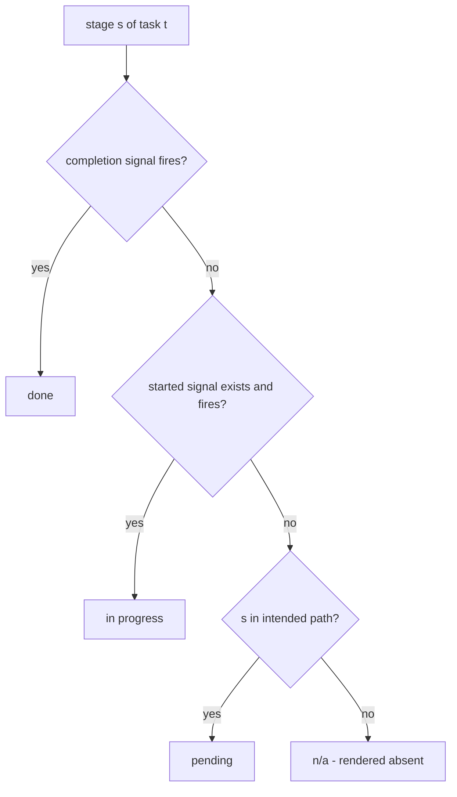

# wb Board Display v2 - Plan

## Goal Capsule

- **Objective:** replace `wb board --html`'s planned on/off lifecycle badges with an intended-path display — four-state stages rendered as a per-card stepper and a new Pipeline overview tab — plus first-class task relationships: dependencies (`depends_on:`), parent rollup indicators, parent filtering, and a computed Key Findings section — plus board-level narrowing to a single repo alongside the window control.
- **Product authority:** this document, backed by the resolved decision record at `logs/decisions/2026-07-11-wb-board-display-scoping.md` (rounds 3-6, all decisions checked) and the approved mockups (`logs/decisions/2026-07-11-wb-board-v2-full-mockup.html`, `logs/decisions/2026-07-12-wb-board-v2-mock-variations.html`).
- **Open blockers:** none. The detection layer merged (PR #20); no open PR touches `wb.sh` at time of writing.

---

## Product Contract

### Summary

Every task on `wb board --html` shows the stages it intends to do and where each stands — n/a, pending, in progress, or done — computed live from detectors and a new `path:` intent field, rendered as a stepper in each detail card and as a Pipeline overview tab. Task relationships become visible: blocked tasks carry dependency indicators in both directions, parents roll up child completion, and a Key Findings section surfaces computed insights like the most-blocking task. The whole board can also be narrowed to a single repo from a control next to the today/week window selector.

### Problem Frame

The board's status tabs answer "which bucket is this task in" but not "what did we intend to do here, and where are we in it". All in-flight tasks read alike regardless of whether they are mid-implementation or untouched, a finished task's signals read confusingly like an unstarted one's once its worktree is removed, and the store has no way to express "task c can't start until task a is done" or "parent d completes when its children do" — relationship scope the parent/child build explicitly deferred. The detection functions that can answer these questions are already merged and deliberately unwired, waiting on this display design.

### Key Decisions

- **Four states, computed, never stored.** Each path stage resolves to n/a / pending / in progress / done at render time from per-stage signals. A snapshot-at-`wb done` alternative was rejected: stored state can drift and would miss the nine already-done tasks.

- **Intent is an explicit field with a self-correcting default.** `path:` frontmatter declares intended stages; absent means the default `plan,work,review` (the ~90% real shape). Detection always upgrades an undeclared stage, so a wrong or missing declaration corrects itself the moment an artifact exists. Prose inference was rejected (mentions are not intent — the store's own files contain "do NOT run /ce-plan first" phrasing) and a no-default field was rejected (it would blank out every existing task).
- **`status:` frontmatter is the single authority; relationships are annotations.** Blocked tasks keep their own status and tab; parents keep their own pill. Bucket-forcing, render-time computed status, and store write-back were each rejected for creating a second truth the files don't hold.
- **Done tasks are not special.** The same strip renders for done and in-flight tasks; the status pill carries done-ness. This is truthful only if doc-stage detection falls back to the kept branch when a task's worktree is gone — a fallback **this work must build**: the merged `wb_lifecycle_has_doc` currently returns not-found the moment the worktree directory is missing (guard at `wb-lifecycle.sh:86`), so without the new fallback every done task's plan cell would render falsely pending.
- **Relationships are flat, single-level.** Recursion is an explicit non-goal: the only real example is single-level, and `parent:` stems already chain, so upgrading later is a rendering change with no schema or data migration.
- **`reviewed:` gets stamped by convention, not automation.** The agent that runs a `/ce-code-review` inside a wb session runs `wb reviewed` when the pass completes — one instruction in repo guidance, no change to the external skill. Hook-based detection stays parked; manual-only was rejected on the store's zero-adoption evidence.
- **One computation, two surfaces.** The stepper (detail cards) and the Pipeline tab render the same per-task state. Cards use the two-zone layout (identity left, lane meta top-right, stages as stacked glyph-over-label); the progress-rail variant was rejected because its connector implies a sequence the stages don't promise. The today/week window renders as a board-level segmented control in the header, separate from the tab row.
- **Final-calls round (2026-07-12, `logs/decisions/2026-07-12-wb-board-display-final-calls.md`).** A PR in any state is itself a work-started signal (merge-style-proof; a first-parent diff was considered and set aside — fork-point computation depends on reflog data that fresh clones and gc'd repos lack, and with the PR signal in place it would only cover merge-commit merges that never had a PR, a case this workflow doesn't produce; planning may still layer it under R3 as a refinement). Branchless tasks fire no artifact signals (R27). Dangling `depends_on:` stems fail open with a warning (R18). Repo/parent filters AND-compose via row-level hiding (R28). Key Findings stays board-global and labelled so (R22). The nine pre-convention done tasks are grandfathered — no `reviewed:` backfill (R22).

### Requirements

**State model and intent**

- R1. Each path stage (`ideate`, `brainstorm`, `plan`, `work`, `review`) renders exactly one of: n/a (not intended — absent from the display, never shown as missing), pending, in progress, or done.
- R2. A stage is done when its completion signal fires: an artifact for ideate/brainstorm/plan, the `reviewed:` field for review; work is done when the task is closed and, if the task has a PR, that PR is closed or merged.
- R3. Work is the only stage with a started signal; it renders in progress when R2's done condition is not met and either changes exist (the existing change-detection heuristic) or the task has a PR in any state — a PR is itself evidence work started, keeping AE1 true under both squash and merge-commit merges.
- R4. Intent comes from a `path:` frontmatter field listing stages; when absent, the intended path defaults to `plan,work,review`; a fired signal upgrades a stage's state regardless of declaration.
- R5. `wb new` seeds `path:` with the default and accepts a `--path` override flag; there is no interactive prompt.
- R6. Stage states stay truthful after a task's worktree is removed: doc-stage detection gains a kept-branch fallback (a git-object read such as `ls-tree`/`show` — new work; the merged module has no branch-read path and fails closed when the worktree is gone), so already-done tasks render their real history. The fallback lands in the shared doc-detection helper so plan, brainstorm, and ideate inherit it uniformly.
- R7. Ideate detection is added using the same mechanism as plan/brainstorm, against the ideation docs path.
- R8. Brainstorm detection recognizes current `ce-brainstorm` outputs, which land as requirements-only plans rather than under the legacy brainstorms path. The discriminator is frontmatter, not location: a `docs/plans/` artifact counts as brainstorm-done when it carries `product_contract_source: ce-brainstorm` (the field persists when `ce-plan` later deepens the same file — verified against `2026-07-11-003-feat-queue-command-plan.md` — so brainstorm-done never regresses), and counts as plan-done only while its `artifact_readiness` is not `requirements-only` (legacy plans without the field still count). Ordinary plans therefore never fire the brainstorm signal, and a brainstorm output never fires the plan signal early.
- R27. A task with an empty `branch:` fires no artifact signals — doc-stage detection needs a branch name to match against — so its intended stages render pending; the docs-before-branch pattern is audited in Key Findings (R22), never fed into state. (Numbered out of sequence to keep existing R-IDs stable.)

**Rendering — Pipeline tab**

- R9. A Pipeline tab joins the existing status tabs, rendering one row per in-flight (non-done) task: four-state stage cells plus worktree / agent / PR meta-columns.
- R10. Tables render at their natural minimum width with comfortable padding, never stretched to the container.
- R11. Stage cells link to the stage's artifact (doc or PR); task names anchor to that task's detail card.
- R12. The today/week window control renders as a board-level segmented control in the header, visually separate from the tab row and properly sized.
- R26. The Pipeline table and card views can be filtered to a single repo via a control in the board header next to the today/week window control (R12); a dropdown-style control is the preferred form. An explicit "All repos" option is the default on load, so the unfiltered board stays the starting view. (Numbered out of sequence to keep existing R-IDs stable.)
- R28. The repo (R26) and parent (R21) filters are independent radio groups that AND-compose via row-level hiding on top of the existing tab×window panels; filter combinations never multiply pre-rendered panels, and an empty intersection renders the existing `.empty-state` treatment. (Numbered out of sequence to keep existing R-IDs stable.)

**Rendering — detail cards**

- R13. Every task detail card (done tasks included) shows its path as a stepper using the two-zone card layout: identity left, lane meta (agent / worktree / PR) top-right, stages as stacked glyph-over-label, artifact chips below.
- R14. Stepper segments link to their artifacts, and the card lists all matched docs per stage (the cell links the newest when several match).

**Relationships**

- R15. A task declares dependencies with a `depends_on:` frontmatter field holding one or more blocker task stems; a dependency is met when the blocker's `status:` is done.
- R16. A task with unmet dependencies renders dimmed with a blocked indicator whose tooltip names each blocker and its status; its own status and tab are unchanged; the indicator disappears once all dependencies are met.
- R17. Dependency counts are visible in both directions — the blocked task shows its unmet-blocker count, the blocker shows how many tasks it unblocks; final placement (a Deps column or an inline alternative) is a planning decision.
- R18. Dependency cycles are detected at render time and fail open: affected tasks render unblocked with a visible cycle warning naming the loop. A `depends_on:` stem that resolves to no task file fails open the same way — the task renders unblocked with a warning naming the unresolvable stem.
- R19. `wb new` accepts a `--depends-on <stem>` flag; hand-editing the field remains the escape hatch. The picker is untouched.
- R20. A parent task's card shows a children-done counter and, when all children are done while the parent is not, a ready-to-close hint; the parent's own status is never altered or overridden.
- R21. The Pipeline table and card views can be filtered to a single parent's family (the parent and its children).

**Key Findings**

- R22. The board renders a Key Findings section of insights computed at generation time; it is board-global — filters never narrow it — and its header carries a small `board-wide · ignores filters` tag. Starter set, adjustable at planning: the task blocking the most others, parents ready to close, count of done-but-unreviewed tasks (counting only tasks closed on/after the R23/R24 convention commit — the nine earlier done tasks are grandfathered), the oldest in-flight task, tasks whose status maps to no bucket, and branchless tasks whose stem matches store docs (the docs-before-branch pattern R27 suppresses from state, surfaced here so it's noticed if it becomes real).

**Schema and conventions**

- R23. The tasks-repo schema gains `path:` and `depends_on:` in the template, the README's documented status values are corrected to match reality, and `TEMPLATE.md`'s seeded `status: open` becomes the bucketed `planned` (the template stops manufacturing no-bucket tasks) — one commit.
- R24. Repo agent guidance and the wb guide instruct: after any `/ce-code-review` pass completes inside a wb session, run `wb reviewed` immediately.
- R25. Board-describing docs are updated (`docs/roadmap-board.md`, `docs/wb-guide.md`, `claude/.claude/skills/wb-board/SKILL.md`) and docgen is rerun.

### Acceptance Examples

- AE1. **Covers R2, R3.** Given a task with committed changes and a merged PR, when the task is still open, then work renders in progress; when the task is closed, work renders done.
- AE2. **Covers R4.** Given a task with no `path:` field, when a brainstorm artifact appears for it, then brainstorm renders done even though the default path never declared it.
- AE3. **Covers R6, R13.** Given a done task whose worktree was removed but whose branch carries a plan doc, then plan renders done — never pending.
- AE4. **Covers R15, R16.** Given task c with `depends_on:` naming task a, while a is not done c renders dimmed with the blocked indicator; on the first render after a is done, the indicator is gone with no manual edit.
- AE5. **Covers R18.** Given a depends on c and c depends on a, both render unblocked and a cycle warning names the loop.
- AE6. **Covers R20.** Given parent d with children a, b, c all done while d is `doing`, d shows a 3/3 counter and the ready-to-close hint, and d's pill still reads `doing`.
- AE7. **Covers R1, R4.** Given a docs-only task with `path: work,review`, its ideate, brainstorm, and plan stages are absent from strip and row — not rendered as pending or off.
- AE8. **Covers R27.** Given a planned task with an empty `branch:`, all its intended stages render pending — even though `docs/plans/` holds a dozen unrelated plans its empty match fragment would otherwise catch.
- AE9. **Covers R18.** Given task b whose `depends_on:` names a stem matching no task file, b renders unblocked with a warning naming the unresolvable stem.

### Scope Boundaries

- Recursive multi-level rollup is an explicit non-goal: grandchildren render under their immediate parent only, and the documented upgrade path is rendering-only.
- No bucket-forcing for blocked tasks, no computed parent status, no automated status write-back to the store — rejected as two-truths mechanisms.
- The interactive picker is untouched; the plain-text `wb board` output is unchanged (HTML-only surface, matching precedent).
- Hook-based review detection is parked, not planned; the agent convention (R24) does not block adding it later.
- A next-week view with a planned execution date is deferred to its own task (`dotfiles--board-next-week-planned-date` in the central store), which records the day-vs-week semantics collision to resolve first.
- Per-task HTML pages and Jira integration remain excluded per the board roadmap.
- Per-filter Key Findings variants are deferred (parked): the shipped section is board-global with an explicit label; slicing it per repo/family layers on later without rework.
- The stage vocabulary is fixed at five for v1, but the `path:` list model is deliberately extensible: optional stages (e.g. a doc-review pass, a `ce-debug` diagnosis) can join later with a detector and glyph each — visualizing optional stages on the board is parked, not planned.
- The nine pre-convention done tasks are grandfathered: no `reviewed:`/`path:` backfill; R22's unreviewed counter starts at the R23/R24 convention commit.

### Dependencies / Assumptions

- The seven detection functions are merged and available on this branch as a sourced module; render wiring was deliberately left to this work — as were three detection-layer extensions this contract adds on top of the merged module: the R6 kept-branch fallback, R7 ideate detection, and R8 new-style brainstorm recognition.
- The `reviewed:` field and `wb reviewed` command already exist; the tasks-repo template already carries `reviewed:`.
- Assumption: the board's CSS-only, no-JS constraint holds for all new surfaces (tabs, filters, tooltips) — mechanisms that would require JS need a planning-time alternative or an explicit exception.

### Outstanding Questions

**Deferred to Planning**

- Placement of the two-direction dependency counts (dedicated Deps column vs inline alternative) — the user likes the counts and both directions, and is open on the column.
- Where Pipeline-row anchors land given hidden tab panels can't be revealed without JS (All-tab card copies vs same-panel-only highlighting).
- Which repo guidance file carries the R24 review-stamp convention.
- Final Key Findings set beyond the R22 starter list.
- Markup details of the AND-composing radio row-hiding filters (id scheme, label/control placement) — the mechanism itself was decided in the 2026-07-12 final-calls round (R28); empty intersections reuse `.empty-state`.

### Sources / Research

- `logs/decisions/2026-07-11-wb-board-display-scoping.md` — the full decision record this contract encodes (rounds 3-6, all options, recommendations, and the user's checks and notes).
- `logs/decisions/2026-07-11-wb-board-v2-full-mockup.html` — approved full-board mockup (tabs, pipeline, cards, relationships, done rendering).
- `logs/decisions/2026-07-12-wb-board-v2-mock-variations.html` — approved variants: two-zone card, header segmented window control, both-direction dependency counts.
- `scripts/.config/scripts/tmux/wb-lifecycle.sh` — the merged detection module (doc-stage detection with its worktree-gone guard at line 86; work-done split halves; review stamp read).
- `scripts/.config/scripts/tmux/wb.sh` — board render: tabs at 1403, bucket map at 1135, `children_of` at 1393, target-highlight CSS at 1581, `wb_seed_task` at 268, `cmd_done` teardown at 1801.
- `docs/plans/2026-07-11-001-feat-wb-board-lifecycle-plan.md` — the detection layer's contract this display consumes; its U4 render scope was ceded to this work.
- `docs/plans/2026-07-10-002-feat-task-parent-child-relationship-plan.md` — names sibling ties as deliberately deferred scope; this work picks that thread up.
- `docs/roadmap-board.md` — the fuller `/board` direction this display's drill-down anchors anticipate.
- `logs/decisions/2026-07-11-wb-board-lifecycle-scoping.md` — rounds 1-3 history, including the badges-to-table reframe this design descends from.
- User directive, 2026-07-12 doc-review session — added R26 (board-level repo filter next to the window control); post-dates the decision record above.
- `logs/decisions/2026-07-12-wb-board-display-final-calls.md` (+ `.html` context dossier) — the post-review final-calls round: six calls resolved 2026-07-12 (work-started semantics, branchless guard, dangling-stem fail-open, filter composition, Key Findings scope, legacy grandfathering), all encoded in R3/R18/R22/R23/R27/R28.
