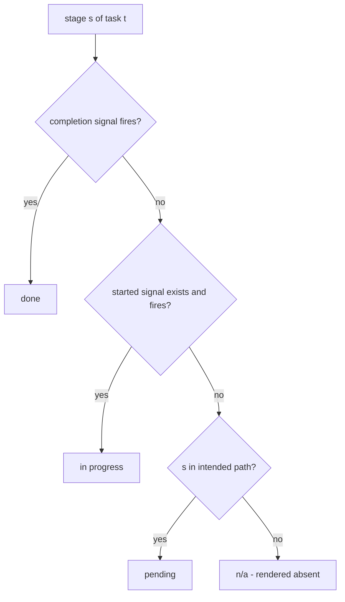
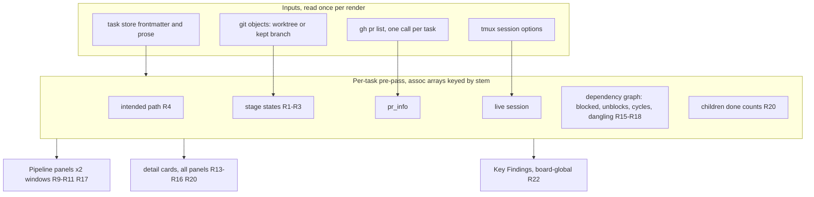

# wb Board Display v2 - Plan

## Goal Capsule

- **Objective:** replace `wb board --html`'s planned on/off lifecycle badges with an intended-path display — four-state stages rendered as a per-card stepper and a new Pipeline overview tab — plus first-class task relationships: dependencies (`depends_on:`), parent rollup indicators, parent filtering, and a computed Key Findings section — plus board-level narrowing to a single repo alongside the window control.
- **Product authority:** this document, backed by the resolved decision record at `logs/decisions/2026-07-11-wb-board-display-scoping.md` (rounds 3-6, all decisions checked), the final-calls record at `logs/decisions/2026-07-12-wb-board-display-final-calls.md`, and the approved mockups (`logs/decisions/2026-07-11-wb-board-v2-full-mockup.html`, `logs/decisions/2026-07-12-wb-board-v2-mock-variations.html`). Mockups are visual authority; this document is behavioral authority.
- **Open blockers:** none. The detection layer merged (PR #20). One live lane (`docs/roadmap-tasks-concurrency-safety`) is editing `wb.sh` concurrently — it does not touch the board render region, but overlaps `cmd_new`; see Sequencing and Lane Coordination.
- **Stop conditions:** surface instead of guessing if (a) the concurrency lane merges a conflicting `cmd_new`/`wb_seed_task` change mid-implementation — rebase before continuing; (b) any change would alter the plain-text `wb board` output; (c) real store files fail frontmatter parsing in a way the plan's schema assumptions don't cover; (d) work drifts into parked scope (per-filter Key Findings, optional-stage visualization, hook-based review detection).
- **Tail ownership:** implementation ends with the Verification Contract green, the R23 tasks-repo commit landed, and docs regenerated via docgen; PR strategy follows repo convention (single PR on `feat/wb-board-display` unless the implementer finds a natural split at the U8 cross-repo boundary).

---

## Product Contract

### Summary

Every task on `wb board --html` shows the stages it intends to do and where each stands — n/a, pending, in progress, or done — computed live from detectors and a new `path:` intent field, rendered as a stepper in each detail card and as a Pipeline overview tab. Task relationships become visible: blocked tasks carry dependency indicators in both directions, parents roll up child completion, and a Key Findings section surfaces computed insights like the most-blocking task. The whole board can also be narrowed to a single repo from a control next to the today/week window selector.

### Problem Frame

The board's status tabs answer "which bucket is this task in" but not "what did we intend to do here, and where are we in it". All in-flight tasks read alike regardless of whether they are mid-implementation or untouched, a finished task's signals read confusingly like an unstarted one's once its worktree is removed, and the store has no way to express "task c can't start until task a is done" or "parent d completes when its children do" — relationship scope the parent/child build explicitly deferred. The detection functions that can answer these questions are already merged and deliberately unwired, waiting on this display design.

### Key Decisions

- **Four states, computed, never stored.** Each path stage resolves to n/a / pending / in progress / done at render time from per-stage signals. A snapshot-at-`wb done` alternative was rejected: stored state can drift and would miss the nine already-done tasks.



- **Intent is an explicit field with a self-correcting default.** `path:` frontmatter declares intended stages; absent means the default `plan,work,review` (the ~90% real shape). Detection always upgrades an undeclared stage, so a wrong or missing declaration corrects itself the moment an artifact exists. Prose inference was rejected (mentions are not intent — the store's own files contain "do NOT run /ce-plan first" phrasing) and a no-default field was rejected (it would blank out every existing task).
- **`status:` frontmatter is the single authority; relationships are annotations.** Blocked tasks keep their own status and tab; parents keep their own pill. Bucket-forcing, render-time computed status, and store write-back were each rejected for creating a second truth the files don't hold.
- **Done tasks are not special.** The same strip renders for done and in-flight tasks; the status pill carries done-ness. This is truthful only if doc-stage detection falls back to the kept branch when a task's worktree is gone — a fallback **this work must build**: the merged `wb_lifecycle_has_doc` currently returns not-found the moment the worktree directory is missing (guard at `wb-lifecycle.sh:86`), so without the new fallback every done task's plan cell would render falsely pending.
- **Relationships are flat, single-level.** Recursion is an explicit non-goal: the only real example is single-level, and `parent:` stems already chain, so upgrading later is a rendering change with no schema or data migration.
- **`reviewed:` gets stamped by convention, not automation.** The agent that runs a `/ce-code-review` inside a wb session runs `wb reviewed` when the pass completes — one instruction in repo guidance, no change to the external skill. Hook-based detection stays parked; manual-only was rejected on the store's zero-adoption evidence.
- **One computation, two surfaces.** The stepper (detail cards) and the Pipeline tab render the same per-task state. Cards use the two-zone layout (identity left, lane meta top-right, stages as stacked glyph-over-label); the progress-rail variant was rejected because its connector implies a sequence the stages don't promise. The today/week window renders as a board-level segmented control in the header, separate from the tab row.
- **Final-calls round (2026-07-12, `logs/decisions/2026-07-12-wb-board-display-final-calls.md`).** A PR in any state is itself a work-started signal (merge-style-proof; a first-parent diff was considered and set aside — fork-point computation depends on reflog data that fresh clones and gc'd repos lack, and with the PR signal in place it would only cover merge-commit merges that never had a PR, a case this workflow doesn't produce; planning may still layer it under R3 as a refinement). Branchless tasks fire no artifact signals (R27). Dangling `depends_on:` stems fail open with a warning (R18). Repo/parent filters AND-compose via row-level hiding (R28). Key Findings stays board-global and labelled so (R22). The nine pre-convention done tasks are grandfathered — no `reviewed:` backfill (R22).

### Requirements

**State model and intent**

- R1. Each path stage (`ideate`, `brainstorm`, `plan`, `work`, `review`) renders exactly one of: n/a (not intended — absent from the display, never shown as missing), pending, in progress, or done.
- R2. A stage is done when its completion signal fires: an artifact for ideate/brainstorm/plan, the `reviewed:` field for review; work is done when the task is closed and, if the task has a PR, that PR is closed or merged.
- R3. Work is the only stage with a started signal; it renders in progress when R2's done condition is not met and either changes exist (the existing change-detection heuristic) or the task has a PR in any state — a PR is itself evidence work started, keeping AE1 true under both squash and merge-commit merges.
- R4. Intent comes from a `path:` frontmatter field listing stages; when absent, the intended path defaults to `plan,work,review`; a fired signal upgrades a stage's state regardless of declaration.
- R5. `wb new` seeds `path:` with the default and accepts a `--path` override flag; there is no interactive prompt.
- R6. Stage states stay truthful after a task's worktree is removed: doc-stage detection gains a kept-branch fallback (a git-object read such as `ls-tree`/`show` — new work; the merged module has no branch-read path and fails closed when the worktree is gone), so already-done tasks render their real history. The fallback lands in the shared doc-detection helper so plan, brainstorm, and ideate inherit it uniformly.
- R7. Ideate detection is added using the same mechanism as plan/brainstorm, against the ideation docs path.
- R8. Brainstorm detection recognizes current `ce-brainstorm` outputs, which land as requirements-only plans rather than under the legacy brainstorms path. The discriminator is frontmatter, not location: a `docs/plans/` artifact counts as brainstorm-done when it carries `product_contract_source: ce-brainstorm` (the field persists when `ce-plan` later deepens the same file — verified against `2026-07-11-003-feat-queue-command-plan.md` — so brainstorm-done never regresses), and counts as plan-done only while its `artifact_readiness` is not `requirements-only` (legacy plans without the field still count). Ordinary plans therefore never fire the brainstorm signal, and a brainstorm output never fires the plan signal early.
- R27. A task with an empty `branch:` fires no artifact signals — doc-stage detection needs a branch name to match against — so its intended stages render pending; the docs-before-branch pattern is audited in Key Findings (R22), never fed into state. (Numbered out of sequence to keep existing R-IDs stable.)

**Rendering — Pipeline tab**

- R9. A Pipeline tab joins the existing status tabs, rendering one row per in-flight (non-done) task: four-state stage cells plus worktree / agent / PR meta-columns.
- R10. Tables render at their natural minimum width with comfortable padding, never stretched to the container.
- R11. Stage cells link to the stage's artifact (doc or PR); task names anchor to that task's detail card.
- R12. The today/week window control renders as a board-level segmented control in the header, visually separate from the tab row and properly sized.
- R26. The Pipeline table and card views can be filtered to a single repo via a control in the board header next to the today/week window control (R12); a dropdown-style control is the preferred form. An explicit "All repos" option is the default on load, so the unfiltered board stays the starting view. (Numbered out of sequence to keep existing R-IDs stable.)
- R28. The repo (R26) and parent (R21) filters are independent radio groups that AND-compose via row-level hiding on top of the existing tab×window panels; filter combinations never multiply pre-rendered panels, and an empty intersection renders the existing `.empty-state` treatment. (Numbered out of sequence to keep existing R-IDs stable.)

**Rendering — detail cards**

- R13. Every task detail card (done tasks included) shows its path as a stepper using the two-zone card layout: identity left, lane meta (agent / worktree / PR) top-right, stages as stacked glyph-over-label, artifact chips below.
- R14. Stepper segments link to their artifacts, and the card lists all matched docs per stage (the cell links the newest when several match).

**Relationships**

- R15. A task declares dependencies with a `depends_on:` frontmatter field holding one or more blocker task stems; a dependency is met when the blocker's `status:` is done.
- R16. A task with unmet dependencies renders dimmed with a blocked indicator whose tooltip names each blocker and its status; its own status and tab are unchanged; the indicator disappears once all dependencies are met.
- R17. Dependency counts are visible in both directions — the blocked task shows its unmet-blocker count, the blocker shows how many tasks it unblocks; final placement (a Deps column or an inline alternative) is a planning decision.
- R18. Dependency cycles are detected at render time and fail open: affected tasks render unblocked with a visible cycle warning naming the loop. A `depends_on:` stem that resolves to no task file fails open the same way — the task renders unblocked with a warning naming the unresolvable stem.
- R19. `wb new` accepts a `--depends-on <stem>` flag; hand-editing the field remains the escape hatch. The picker is untouched.
- R20. A parent task's card shows a children-done counter and, when all children are done while the parent is not, a ready-to-close hint; the parent's own status is never altered or overridden.
- R21. The Pipeline table and card views can be filtered to a single parent's family (the parent and its children).

**Key Findings**

- R22. The board renders a Key Findings section of insights computed at generation time; it is board-global — filters never narrow it — and its header carries a small `board-wide · ignores filters` tag. Starter set, adjustable at planning: the task blocking the most others, parents ready to close, count of done-but-unreviewed tasks (counting only tasks closed on/after the R23/R24 convention commit — the nine earlier done tasks are grandfathered), the oldest in-flight task, tasks whose status maps to no bucket, and branchless tasks whose stem matches store docs (the docs-before-branch pattern R27 suppresses from state, surfaced here so it's noticed if it becomes real).

**Schema and conventions**

- R23. The tasks-repo schema gains `path:` and `depends_on:` in the template, the README's documented status values are corrected to match reality, and `TEMPLATE.md`'s seeded `status: open` becomes the bucketed `planned` (the template stops manufacturing no-bucket tasks) — one commit. The same commit restores the template's `# Title` body heading and `## Follow-ups` section, drift that breaks `wb_seed_task`'s title substitution and `wb_followup_count`.
- R24. Repo agent guidance and the wb guide instruct: after any `/ce-code-review` pass completes inside a wb session, run `wb reviewed` immediately.
- R25. Board-describing docs are updated (`docs/roadmap-board.md`, `docs/wb-guide.md`, `claude/.claude/skills/wb-board/SKILL.md`) and docgen is rerun.

### Acceptance Examples

- AE1. **Covers R2, R3.** Given a task with committed changes and a merged PR, when the task is still open, then work renders in progress; when the task is closed, work renders done.
- AE2. **Covers R4.** Given a task with no `path:` field, when a brainstorm artifact appears for it, then brainstorm renders done even though the default path never declared it.
- AE3. **Covers R6, R13.** Given a done task whose worktree was removed but whose branch carries a plan doc, then plan renders done — never pending.
- AE4. **Covers R15, R16.** Given task c with `depends_on:` naming task a, while a is not done c renders dimmed with the blocked indicator; on the first render after a is done, the indicator is gone with no manual edit.
- AE5. **Covers R18.** Given a depends on c and c depends on a, both render unblocked and a cycle warning names the loop.
- AE6. **Covers R20.** Given parent d with children a, b, c all done while d is `doing`, d shows a 3/3 counter and the ready-to-close hint, and d's pill still reads `doing`.
- AE7. **Covers R1, R4.** Given a docs-only task with `path: work,review`, its ideate, brainstorm, and plan stages are absent from strip and row — not rendered as pending or off.
- AE8. **Covers R27.** Given a planned task with an empty `branch:`, all its intended stages render pending — even though `docs/plans/` holds a dozen unrelated plans its empty match fragment would otherwise catch.
- AE9. **Covers R18.** Given task b whose `depends_on:` names a stem matching no task file, b renders unblocked with a warning naming the unresolvable stem.

### Scope Boundaries

- Recursive multi-level rollup is an explicit non-goal: grandchildren render under their immediate parent only, and the documented upgrade path is rendering-only.
- No bucket-forcing for blocked tasks, no computed parent status, no automated status write-back to the store — rejected as two-truths mechanisms.
- The interactive picker is untouched; the plain-text `wb board` output is unchanged (HTML-only surface, matching precedent).
- Hook-based review detection is parked, not planned; the agent convention (R24) does not block adding it later.
- A next-week view with a planned execution date is deferred to its own task (`dotfiles--board-next-week-planned-date` in the central store), which records the day-vs-week semantics collision to resolve first.
- Per-task HTML pages and Jira integration remain excluded per the board roadmap.
- Per-filter Key Findings variants are deferred (parked): the shipped section is board-global with an explicit label; slicing it per repo/family layers on later without rework.
- The stage vocabulary is fixed at five for v1, but the `path:` list model is deliberately extensible: optional stages (e.g. a doc-review pass, a `ce-debug` diagnosis) can join later with a detector and glyph each — visualizing optional stages on the board is parked, not planned.
- The nine pre-convention done tasks are grandfathered: no `reviewed:`/`path:` backfill; R22's unreviewed counter starts at the R23/R24 convention commit.
- A first-parent-aware committed-changes diff stays a deferred refinement under R3: with the PR-any-state signal in place it would only cover merge-commit merges that never had a PR, a case this workflow doesn't produce (see Assumptions).

### Dependencies / Assumptions

- The seven detection functions are merged and available on this branch as a sourced module; render wiring was deliberately left to this work — as were three detection-layer extensions this contract adds on top of the merged module: the R6 kept-branch fallback, R7 ideate detection, and R8 new-style brainstorm recognition.
- The `reviewed:` field and `wb reviewed` command already exist; the tasks-repo template already carries `reviewed:`.
- Assumption: the board's CSS-only, no-JS constraint holds for all new surfaces (tabs, filters, tooltips) — mechanisms that would require JS need a planning-time alternative or an explicit exception.

### Sources / Research

- `logs/decisions/2026-07-11-wb-board-display-scoping.md` — the full decision record this contract encodes (rounds 3-6, all options, recommendations, and the user's checks and notes).
- `logs/decisions/2026-07-11-wb-board-v2-full-mockup.html` — approved full-board mockup (tabs, pipeline, cards, relationships, done rendering).
- `logs/decisions/2026-07-12-wb-board-v2-mock-variations.html` — approved variants: two-zone card, header segmented window control, both-direction dependency counts.
- `scripts/.config/scripts/tmux/wb-lifecycle.sh` — the merged detection module (doc-stage detection with its worktree-gone guard at line 86; work-done split halves; review stamp read).
- `scripts/.config/scripts/tmux/wb.sh` — board render: tabs at 1403, bucket map at 1135, `children_of` at 1393, target-highlight CSS at 1581, `wb_seed_task` at 268, `cmd_done` teardown at 1801.
- `docs/plans/2026-07-11-001-feat-wb-board-lifecycle-plan.md` — the detection layer's contract this display consumes; its U4 render scope was ceded to this work.
- `docs/plans/2026-07-10-002-feat-task-parent-child-relationship-plan.md` — names sibling ties as deliberately deferred scope; this work picks that thread up.
- `docs/roadmap-board.md` — the fuller `/board` direction this display's drill-down anchors anticipate.
- `logs/decisions/2026-07-11-wb-board-lifecycle-scoping.md` — rounds 1-3 history, including the badges-to-table reframe this design descends from.
- User directive, 2026-07-12 doc-review session — added R26 (board-level repo filter next to the window control); post-dates the decision record above.
- `logs/decisions/2026-07-12-wb-board-display-final-calls.md` (+ `.html` context dossier) — the post-review final-calls round: six calls resolved 2026-07-12 (work-started semantics, branchless guard, dangling-stem fail-open, filter composition, Key Findings scope, legacy grandfathering), all encoded in R3/R18/R22/R23/R27/R28.

---

## Planning Contract

Product Contract preservation: unchanged, except the Outstanding Questions section — its five Deferred-to-Planning items are resolved by KTD-6 through KTD-10 below — a Scope Boundaries line making the first-parent deferral explicit (it was already recorded in the final-calls Key Decision), and R23 extended to name the template-body repair its one commit carries (see Assumptions).

### Key Technical Decisions

- KTD-1. **One pre-pass, computed once per task, consumed by every surface.** All per-task state — stage states, PR info, live session, dependency graph, children counters — is computed in a single pass before the window×tab panel loops and stored in associative arrays keyed by the row's `anchor_key` (unique for task and untracked rows alike — untracked rows have no stem, and their live-session badge must survive the hoist), mirroring the existing `children_of` pre-pass (`wb.sh:1393-1401`). Today `wb_board_pr_info` and `wb_board_live_session_for` run inside the innermost per-panel loop (`wb.sh:1473`), so one task fires up to 4 identical `gh` network calls per render; adding the Pipeline tab (13 panels) and per-stage git reads without hoisting would multiply that. The pre-pass caps cost at one `gh` call and one stage-state computation per task per render, and gives Key Findings (R22) its inputs for free.
- KTD-2. **Stage state is a string-valued resolver in `wb-lifecycle.sh`, composing the merged predicates.** A new function resolves one of `na|pending|progress|done` per stage per task (four values can't be an exit code; the module's boolean predicates keep their 0/1 convention, documented as such). Work-stage semantics per R2/R3: done = task `status: done` AND (no PR ever, or PR CLOSED/MERGED); in progress = not done AND (committed-or-uncommitted real changes via `wb_lifecycle_work_done` OR a PR in any state — reusing the `$pr_info` string, no new fetch). Doc stages: done = extended `wb_lifecycle_has_doc`. Review: done = `reviewed:` non-empty. "Closed" means `status: done` — never the `closed:` date field (single-authority principle). The R4 upgrade rule is structural: signals are checked before path membership, so a fired signal always wins. The resolver's path parsing is render-tolerant: unknown stage tokens are ignored, duplicates dropped, canonical stage order imposed — a hand-edited `path:` must never crash the `set -euo pipefail` render; loud validation lives only in `wb new --path`. One degradation to know: `wb_board_pr_info` returns empty on any `gh` failure, so an offline or rate-limited render reads as "no PR ever" — the PR-done gate and PR-started signal both drop out for that render (an upward degradation, unlike the doc detectors' fail-to-pending) and self-heal on the next successful render; the U4 pre-pass may record a fetch-failure sentinel so the PR meta-column can render `?` instead of `—`.
- KTD-3. **All detection hardening lands inside the shared `wb_lifecycle_has_doc` helper, in guard order.** (1) Empty `branch:` returns not-found before any matching — the empty sanitized fragment would otherwise substring-match every doc in the directory (R27, AE8) — and an empty `worktree:` skips every worktree-rooted check: the composed path degenerates to the repo's main checkout (which exists, so the current `[ -d ]` guard passes) and the glob would scan the wrong tree. The same guard discipline extends to the work signals in KTD-2's resolver: empty `branch:` disables the committed-changes half and the PR lookup; empty `worktree:` disables the uncommitted-changes half — without it, `git status` runs against the main checkout and any dirty main checkout renders every branchless planned task work-in-progress, violating AE8. The store has eight such tasks today. (2) With a live worktree, the existing glob + prose halves run as today. (3) With no worktree, the kept-branch fallback reads git objects from the main checkout: `ls-tree` filename listing replaces the glob half, and prose-named paths are existence-checked against the branch instead of the worktree (R6, AE3). All git reads follow `wb_lifecycle_work_done`'s never-hard-fail convention — any git error degrades to not-found, never aborts under `set -e`. (4) The R8 frontmatter discriminator applies to matched `docs/plans/` candidates in **both** halves — the current glob half fires on any filename match with no frontmatter read, which would call a requirements-only brainstorm output plan-done. Frontmatter is read from the worktree file or via `git show <branch>:<path>` under the fallback.
- KTD-4. **Doc detection's two halves stay in lockstep: every stage addition updates the glob and the `wb_board_related_docs` regex.** The prose half of `wb_lifecycle_has_doc` delegates to `wb_board_related_docs` (`wb.sh:1327`), whose pattern today matches only `plans|brainstorms|solutions` + `logs/decisions` — R7's ideate stage requires adding `ideation` there or the prose half of ideate detection can never fire (and ideation docs can never become artifact chips). This is a standing invariant, not a one-off: the module header and tests both encode it.
- KTD-5. **Artifact links never point at paths that don't exist on disk.** Stage cells and stepper segments link with this precedence: file exists at the dotfiles root → existing root-relative `wb_board_doc_link` href; else file exists in the task's live worktree → absolute-path href; else (branch-only, worktree gone) → unlinked glyph whose tooltip names the doc. "Newest when several match" (R14) is lexical filename order — the store's date-prefixed doc names sort correctly and the rule works identically for worktree and `ls-tree` listings, which have no mtimes. Work-stage cells link to the PR URL when one exists; review cells carry the `reviewed:` date in their tooltip.
- KTD-6. **Dependency counts render as a Deps meta-column in the Pipeline table and as chips on cards** *(resolves the deferred dep-count placement question; DEP·2 was the checked variant, and the user wanted both directions visible)*. Blocked task: `⛔ n` (unmet count) with a tooltip naming each blocker and its status (R16/R17); blocker: `→ n` counting only dependents whose dependency is currently unmet — the chip disappears once the blocker is done, symmetric with R16's disappearing indicator — with a tooltip naming the waiting tasks; no deps: `—`. A mid-chain task that is simultaneously blocked and blocking renders both chips together (`⛔ 1 → 1`) — the two directions are independent facts, never mutually exclusive states. Cards carry the same two indicators as chips in the two-zone layout since cards have no columns. Blocked rows and cards are dimmed per the approved mockup; tooltips are native `title=` attributes (no CSS tooltip machinery exists or is needed). Cycle and dangling-stem warnings render in place of the `⛔` chip as a warn-colored chip on every affected row/card; a cycle's tooltip carries the loop normalized to start at its lexicographically smallest stem, so all members show the identical string, and tasks that depend on a cycle member without being in the loop evaluate normally against that member's `status:`.
- KTD-7. **The Pipeline panel is window-independent; anchors stay same-panel; Key Findings links prefer the Pipeline copy** *(resolves the deferred anchor-placement question)*. The window filter admits a row only when created/closed/mtime falls inside it, so a task untouched for over a week exists in no window-filtered panel at all — yet R9 promises one row per in-flight task, and R22's "oldest in-flight task" insight names exactly such tasks. The Pipeline tab therefore renders once, outside the window filter, shown under either window radio by two visibility rules — the guaranteed-complete in-flight surface. `:target` cannot flip a radio, so a link into a hidden panel is a dead end; the existing render already solves this with view-scoped anchors (`t-<tab>-<win>-<key>`) and per-panel detail stacks — the Pipeline panel renders its own details-stack beneath the table, and Pipeline task names link within their own panel. Key Findings task links point at the Pipeline copy for in-flight tasks and the All/week copy for done tasks, with a generation-time existence check (the render knows every emitted anchor id): an entry whose task renders in no reachable panel becomes plain text, never a dead link. The section's `board-wide · ignores filters` tag explains the one remaining mismatch (reader on a different tab). Finally, a filter must never dead-end an in-panel anchor: a `:target`-wins override (`.task-detail:target { display: block !important }`, plus the row equivalent) reveals a filter-hidden card when it is the link target.
- KTD-8. **Filters are two independent radio groups, declared with the existing radios, hiding rows via generated attribute-selector rules** *(resolves the deferred filter-markup question; the AND-composing row-hiding mechanism itself is R28, already decided)*. The radios must be emitted before `<header>`/`<main>` like the existing `tl`/`st` groups — the `~` combinator only reaches later siblings; ids follow the existing prefix convention (`fr-<repo>`, `fp-<stem>`, values through `wb_board_anchor_slug`). Rows and cards carry `data-repo` and `data-family` attributes (a row's family value is a space-separated list of its own stem and its parent's stem, so `[data-family~=]` matches the parent and its children as one family). Per active option, a generated rule hides non-matching rows scoped to `.view` descendants — Key Findings sits outside every `.view` and carries neither attribute, so no filter rule can reach it (R22) — and two independent rule families AND for free. Controls render in the header next to the window control as `<details>` dropdowns wrapping the radio labels, with "All repos" / "All families" checked by default (R26). The collapsed summary reflects the active selection when it isn't All ("Repo: dotfiles ▾", generic "Repo ▾" on All) via per-option label spans toggled by the same `:checked` sibling rules — without this, a collapsed non-default filter silently narrows the board, contradicting the window control's always-visible rationale in the same header. A no-JS `<details>` doesn't auto-close after a pick — accepted for v1, with the existing `.tabgroup` pill strip as the fallback presentation if that grates. The family group is emitted only when at least one parent/child pair exists in the store (today there are none — a lone "All families" control would be noise). Empty intersections are computed at generation time: bash knows every panel's row repo/family sets, so for each filter combination that empties a panel it emits a rule revealing that panel's pre-rendered `.empty-state` div — bounded at repos × families × panels (low hundreds of rules), the same pre-render-everything physics as the existing 12 panels, and no `:has()` dependency.
- KTD-9. **`wb_board_html_escape` gains `"` escaping.** Blocked/unblocks tooltips put task titles and statuses inside `title="…"` attributes; the current helper escapes only `&<>` because escaped strings previously landed in text content only. Extending the single shared helper closes the attribute-injection gap for every current and future call site at once.
- KTD-10. **R24's convention lands in `~/.claude/CLAUDE.md` and `docs/wb-guide.md`** *(resolves the deferred guidance-file question)*. No repo-tracked agent-instruction file exists (no root `AGENTS.md`/`CLAUDE.md`; `claude/.claude/` stows skills only), and the global `~/.claude/CLAUDE.md` is the one file every wb-session agent actually loads — it already carries workflow rules of exactly this shape. The wb guide carries the human-readable copy. The Key Findings set ships as R22's starter six exactly *(resolves the deferred Key-Findings-set question — nothing earned adding before real usage)*.
- KTD-11. **The R22 unreviewed counter is scoped by a literal convention date constant.** The render has no way to derive "the R23/R24 convention commit" at runtime; a named constant in `wb.sh` (set to the date the R23 commit lands, during U8) gates which `closed:` dates count. Grandfathering is thereby data-independent — the nine legacy tasks need no edits.
- KTD-12. **`depends_on:` is a comma-separated scalar of exact task-file stems.** Matches `parent:`'s plain-scalar style and the existing single-line frontmatter helpers. `wb_sanitize` rewrites only `/`, `.`, and `:` — a comma can survive into a stem — so `--depends-on` rejects `,` alongside `/`, and a hand-edited comma-bearing stem falls to R18's fail-open warning instead of silently splitting into two dangling fragments. `--depends-on` validates like `--parent`: the stem must resolve to a real task file (fail-loud at creation, mirroring `wb_resolve_parent_ref`) and must not be the task's own stem; dangling stems can then only arise from later renames or hand-edits, which R18 fails open with a warning. Cycle detection is an iterative visited-set walk over the pre-pass dependency map — flat, no recursion, fail-open per R18.

### Assumptions

Un-validated bets made under delegated planning authority; each is cheap to reverse if wrong.

- **Pipeline is the first tab and default-checked**, per the approved mockup's checked state. Reverting to All-first is a two-line change.
- **The Pipeline panel ignores the today/week window** (KTD-7). R9's "one row per in-flight task" reads as unconditional, and window-filtering it would silently drop stale in-flight tasks; the mockup shows a single Pipeline panel. If the user wanted a windowed Pipeline, the two visibility rules collapse back to the standard per-window pair.
- **The `<details>` dropdown is used despite not auto-closing on selection** — R26 names dropdown-style as the preferred form and the wart is cosmetic; the pill-strip fallback is a presentation-only swap.
- **R23's one schema commit also repairs template drift**: the live `TEMPLATE.md` has lost its `# Title` body heading and `## Follow-ups` section, which `wb_seed_task`'s substitution (`wb.sh:290`) and `wb_followup_count` depend on — every recently seeded task has no title heading. Restoring them rides the same commit as the approved `status: open` → `planned` fix.
- **The first-parent diff refinement (final-calls Decision 1, Option C) is deferred, not implemented.** The user was open to C if it carried no real cons; the planning finding is that its marginal value is zero in this workflow — every merge path that C would rescue is already covered by the PR-any-state signal, and the only uncovered case (a merge-commit merge with no PR) doesn't occur here. Its cost is real: a per-task mainline-ancestry walk at render time plus rebase/orphaned-branch edge cases. Revisit only if a no-PR merge workflow appears.
- **Stage-state resolver returns strings while the module's other functions stay boolean** — a documented second convention in `wb-lifecycle.sh`, not a drift.
- **Untracked-worktree rows are excluded from the Pipeline tab** — they have no task file, hence no path or stage intent; they remain visible in All/Unclassified as today.

### High-Level Technical Design

Render data flow — what the pre-pass computes and which surfaces consume it:



Document order — the CSS-only mechanics require radios before everything they control (directional sketch, not markup spec):

```text
<style>                       static rules + generated panel/highlight/filter/empty-state/:target-override rules
radios: tl (2) · st (7)       existing groups, Pipeline added to st, first + checked
radios: fr-* (n+1) · fp-* (m+1)   new filter groups, "All" options checked; fp-* omitted while no families exist
<header>                      h1 · window segmented control (SEL-1) · tab labels · Repo/Family dropdowns
<main>
  13 panels (6 bucket tabs x 2 windows + 1 window-independent Pipeline)
    pipeline panel: table (natural-width wrap) + own details-stack
    bucket panels: details-stack of two-zone cards (existing structure, reworked card markup)
  Key Findings section          outside every .view, no data-repo/data-family attrs
```

### Sequencing and Lane Coordination

- Unit order: U1 → U2 → U4 → U5/U6 → U7; U9 follows U4/U5 (its filter immunity holds by construction and is verified by U7's tests); U3 and U8 are independent of the render chain (U3 reads best with U8 landed first, but degrades safely without it); U10 last.
- One live lane overlaps `wb.sh`: the `docs/roadmap-tasks-concurrency-safety` worktree has committed and uncommitted `wb.sh` changes (locking helpers, `cmd_new`/`cmd_reviewed`/`cmd_done` wrapping). It does not touch the board render region (`wb.sh:1125-1668`), so U4-U7/U9 are conflict-free; U3 edits `cmd_new`'s parser and `wb_seed_task` right where that lane wraps `wb_seed_task` in a lock acquire/release. Whichever branch merges second rebases; keep U3's `cmd_new` edits confined to the flag-parser block and `wb_seed_task`'s body so the conflict stays one hunk. `feat/wb-board-lifecycle` and `feat/wb-done-close` show stale diffs from squash merges — they are not live lanes (no worktree).
- The tasks store has concurrent writers (the concurrency lane tests against it); U8 is one small commit touching only `TEMPLATE.md`/`README.md` — no task-file edits, so no writer conflict surface.

---

## Implementation Units

| U-ID | Title | Key files | Depends on |
|---|---|---|---|
| U1 | Doc-detection hardening: branchless guard, kept-branch fallback, ideate, discriminator | `wb-lifecycle.sh`, `wb.sh` (regex), `tests/wb-lifecycle.test.sh` | — |
| U2 | Stage-state resolver and path parsing | `wb-lifecycle.sh`, `tests/wb-lifecycle.test.sh` | U1 |
| U3 | `wb new --path` / `--depends-on` and seeding | `wb.sh`, `tests/wb-new.test.sh` | U8 (soft) |
| U4 | Render pre-pass: per-task state, deps graph, escaping | `wb.sh`, `tests/wb-board-html.test.sh` | U2 |
| U5 | Pipeline tab | `wb.sh`, `tests/wb-board-html.test.sh` | U4 |
| U6 | Two-zone detail cards, stepper, relationship indicators | `wb.sh`, `tests/wb-board-html.test.sh` | U4 |
| U7 | Header window control and repo/family filters | `wb.sh`, `tests/wb-board-html.test.sh` | U5, U6 |
| U8 | Tasks-repo schema commit | `~/code/tasks/TEMPLATE.md`, `~/code/tasks/README.md` | — |
| U9 | Key Findings section | `wb.sh`, `tests/wb-board-html.test.sh` | U4, U5 |
| U10 | Review-stamp convention, docs, docgen | `docs/*`, `claude/.claude/skills/wb-board/SKILL.md`, `~/.claude/CLAUDE.md` | U1-U9 |

All paths under `scripts/.config/scripts/tmux/` unless otherwise shown; `~/code/tasks` and `~/.claude/CLAUDE.md` are outside this repo.

### U1. Doc-detection hardening: branchless guard, kept-branch fallback, ideate, discriminator

- **Goal:** `wb_lifecycle_has_doc` reports truthfully for branchless tasks, worktree-removed tasks, the ideate stage, and new-style brainstorm outputs.
- **Requirements:** R6, R7, R8, R27 (AE3, AE8).
- **Dependencies:** none.
- **Files:** `scripts/.config/scripts/tmux/wb-lifecycle.sh`, `scripts/.config/scripts/tmux/wb.sh` (the `wb_board_related_docs` pattern at ~1327), `scripts/.config/scripts/tmux/tests/wb-lifecycle.test.sh`.
- **Approach:** per KTD-3 guard order — empty-branch and empty-worktree short-circuits first (guards on the field values, never on composed paths, which degenerate to the main checkout when a field is blank); glob + prose halves against the worktree when it exists; `git ls-tree`-based filename matching and `git cat-file -e`-based prose-path existence checks against the kept branch when it doesn't; every git read degrades to not-found on error (never-hard-fail convention). Add `wb_lifecycle_has_ideate` delegating with kind `ideation`, and add `ideation` to the `wb_board_related_docs` pattern (KTD-4 — both halves, always). Implement the R8 discriminator as a per-candidate frontmatter check applied in both halves: `docs/plans/` candidates count for brainstorm when `product_contract_source: ce-brainstorm`, and for plan only when `artifact_readiness` ≠ `requirements-only` or absent; frontmatter comes from the worktree file or `git show <branch>:<path>` under the fallback. `wb_get_frontmatter` works on any `---`-fenced file and is reusable for these reads.
- **Patterns to follow:** existing guard/comment style of the module; `wb_lifecycle_work_done`'s two-half structure and safe-default convention; exit-code predicates (0/1).
- **Test scenarios** (extend `wb-lifecycle.test.sh` in its `check <desc> <true|false> <fn…>` style, real fixture repos via `mk_repo`/`add_worktree`):
  - Covers AE8. Empty `branch:` with a `docs/plans/` full of unrelated files → `has_plan`, `has_brainstorm`, `has_ideate` all false.
  - Covers AE8. Empty `worktree:` on a task whose repo's main checkout has matching docs → all doc signals false (detection never scans the main checkout as if it were the task's worktree).
  - Covers AE3. Doc committed on a branch, worktree then removed via `git worktree remove` → `has_plan` true through the `ls-tree` fallback.
  - Worktree removed, branch also deleted → false, exit 0-safe under `set -e` (no hard failure).
  - Worktree present: existing glob and prose behaviors unchanged (regression: current passing checks stay green).
  - Prose-named doc committed only on the unmerged branch, worktree gone → prose-half fallback finds it via the branch read.
  - `docs/ideation/` doc matched by filename → `has_ideate` true; same doc does not fire `has_plan`.
  - A `docs/plans/` file with `product_contract_source: ce-brainstorm` + `artifact_readiness: requirements-only` → brainstorm true, plan false.
  - Same file after enrichment (`artifact_readiness: implementation-ready`, source field persists) → brainstorm still true, plan now true.
  - A legacy `docs/plans/` file with no contract frontmatter → plan true, brainstorm false.
  - Discriminator under the kept-branch fallback: requirements-only plan file readable only via `git show` → brainstorm true, plan false.
- **Verification:** `bash scripts/.config/scripts/tmux/tests/wb-lifecycle.test.sh` all-pass; the real store's done tasks (e.g. `dotfiles--feat-wb-board-lifecycle`) report plan-done with their worktrees gone.

### U2. Stage-state resolver and path parsing

- **Goal:** one function answers "what state is stage s of task t in" for all five stages, implementing the four-state model and the R4 upgrade rule.
- **Requirements:** R1, R2, R3, R4 (AE1, AE2, AE7).
- **Dependencies:** U1.
- **Files:** `scripts/.config/scripts/tmux/wb-lifecycle.sh`, `scripts/.config/scripts/tmux/tests/wb-lifecycle.test.sh`.
- **Approach:** per KTD-2. A path parser normalizes the `path:` field (comma-separated, whitespace-tolerant, optional `[]` brackets stripped, unknown stage names ignored, duplicates dropped, canonical stage order imposed) and returns the default `plan,work,review` when the field is absent or blank — empty and absent are indistinguishable through `wb_get_frontmatter` and both mean the default; "no stages at all" is deliberately inexpressible. The resolver takes the per-row values the render loop already has (repo, branch, worktree, taskfile, status, `pr_info`) and prints `na|pending|progress|done`; signals are evaluated before path membership so a fired signal upgrades an undeclared stage. Only work has a progress state; doc stages and review go straight from pending to done. Work-signal guards per KTD-3: empty `branch:` disables the committed half and the PR-derived signals; empty `worktree:` disables the uncommitted half.
- **Test scenarios:**
  - Covers AE1. Open task + changes + merged PR → work `progress`; same task with `status: done` → work `done`.
  - Open task, no changes, PR in OPEN state → work `progress` (PR-any-state started signal).
  - `status: done`, PR still OPEN → work `progress`, not done (R2's PR-closed condition).
  - `status: done`, no PR ever → work `done`.
  - Covers AE2. No `path:` field + brainstorm artifact exists → brainstorm `done` despite the default path omitting it.
  - Covers AE7. `path: work,review` → ideate/brainstorm/plan all `na`; work/review render per signals.
  - `path:` blank vs absent → both yield the default; `path: plan, work , review` (spaces) parses cleanly; `path: plan,bogus,work` drops `bogus` without failing under `set -euo pipefail`; `path: work,plan,plan` dedups and renders canonical order.
  - Review with `reviewed:` stamped → `done`; unstamped but in path → `pending`.
  - Covers AE8. Branchless, worktree-less planned task while the fixture repo's main checkout is dirty → work `pending`, never `progress` (the uncommitted-half guard).
  - Session-less parent task (placeholder `repo:` pointing nowhere) → all detectors fail closed, stages render pending, no error.
- **Verification:** lifecycle suite all-pass; resolver output for the current real store matches hand-computed expectations for one done, one doing, one branchless task.

### U3. `wb new --path` / `--depends-on` and seeding

- **Goal:** task creation can declare intent and dependencies; every seeded task carries an explicit default `path:`.
- **Requirements:** R5, R19.
- **Dependencies:** U8 (soft — template gains the keys there; seeding is written to work either way).
- **Files:** `scripts/.config/scripts/tmux/wb.sh` (`cmd_new` parser, `wb_seed_task`), `scripts/.config/scripts/tmux/tests/wb-new.test.sh`.
- **Approach:** clone `--parent`'s value-taking parser shape (dangling-value check included). `--path` validates each stage against the five-stage vocabulary and fails loudly on unknown names before anything is created; `--depends-on` (repeatable; values accumulate) validates each stem resolves to a real task file, contains no `/` (path traversal into `$TASKS_DIR/<stem>.md`) and no `,` (the list delimiter — `wb_sanitize` never strips commas), and is not the task's own stem — mirroring `wb_resolve_parent_ref`'s fail-loud convention with its error message parameterized so it no longer hardcodes `--parent` (KTD-12). Naming an already-done blocker is legal (immediately met). Overwrite semantics follow `--parent`'s precedent: an explicit flag wins even on an existing task file, while flag-less seeding only blank-fills — so `wb resume` (which re-enters `cmd_new` without flags) never clobbers an existing `path:`/`depends_on:`. `wb_seed_task` writes the fields via template substitution when the template carries the keys, with a `wb_set_frontmatter` backfill for files/templates that don't. Keep the `cmd_new` edits confined per Sequencing and Lane Coordination.
- **Execution note:** prefer behavioral tests on a throwaway tmux socket over source-text assertions — `wb-new.test.sh`'s own header records that source-grep tests missed two real bugs.
- **Test scenarios:**
  - `wb new` without flags → seeded file has `path: plan,work,review`.
  - `--path work,review` → seeded file carries exactly that; `--path bogus` → loud failure, nothing created.
  - `--depends-on <real-stem>` → field written; repeated `--depends-on` flags accumulate; `--depends-on <missing-stem>` → loud failure before worktree/session creation; a stem containing `/` or `,` rejected; self-reference rejected; a done blocker accepted.
  - Existing task file with `path:` already set → flag-less `wb new` never overwrites it, `--path` on the same file does (explicit-flag-wins precedent); existing file predating the keys → keys backfilled blank-fill-only.
  - `--parent` and `--agent` continue to work alongside the new flags (regression).
- **Verification:** `bash scripts/.config/scripts/tmux/tests/wb-new.test.sh` all-pass; a real `wb new` in a scratch repo produces a picker-visible task with the new fields.

### U4. Render pre-pass: per-task state, deps graph, escaping

- **Goal:** every per-task fact the new surfaces need is computed once, before the panel loops, with no change to rendered output yet beyond consuming hoisted values.
- **Requirements:** R15, R18 data model, R17/R20 counts, R3's `pr_info` reuse (AE5, AE9 data; enables U5/U6/U7/U9).
- **Dependencies:** U2.
- **Files:** `scripts/.config/scripts/tmux/wb.sh`, `scripts/.config/scripts/tmux/tests/wb-board-html.test.sh`.
- **Approach:** per KTD-1, a pre-pass over collected rows builds `anchor_key`-keyed associative arrays (stems exist only for task rows; untracked rows must keep their live badge): `pr_info` and live-session (moved out of the per-panel loop — call-count drops to one per task per render), intended path and per-stage states (via U2's resolver), parsed `depends_on`, per-task unmet-blocker and currently-unmet dependents counts, blocked flag, cycle membership (iterative visited-set walk, fail-open with the KTD-6 normalized loop string), dangling stems (fail-open with a warning naming the stem), children-done counts and ready-to-close flags. The PR fetch is keyed by repo+branch, not stem — two real store tasks share one branch and must not fetch twice — is skipped entirely for an empty `branch:`, and the single `gh` call also fetches the PR URL so work-stage cells can link to it (KTD-5). Extend `wb_read_task`'s single-pass awk to also emit `path`/`depends_on`/`reviewed` rather than adding per-field file reads. Extend `wb_board_html_escape` with `"` → `&quot;` (KTD-9).
- **Test scenarios:**
  - Covers AE5. Two tasks depending on each other → both unblocked, cycle warning naming both stems present in output.
  - Covers AE9. `depends_on:` naming a missing stem → task unblocked, warning naming the stem.
  - Chain a→b→c with a done: b unblocked, c still blocked by b (flat resolution, no transitive met-ness).
  - A task with two blockers, one done → still blocked, unmet count 1; blocker's dependents count reflects both directions.
  - Mid-chain fixture (a→b→c, a not done) → b carries both indicators at once (`⛔ 1` and `→ 1`) — blocked and blocking are independent facts.
  - `gh` stub called exactly once per task across a full render (count assertions on a stub `wb_board_pr_info`).
  - `wb_board_html_escape '"<&>"'` output carries `&quot;` and existing entities (regression on `&<>`).
  - Full render before/after pre-pass on a deps-free fixture store → identical visible content (hoisting is behavior-preserving), including an untracked worktree row's live-session badge.
- **Verification:** `bash scripts/.config/scripts/tmux/tests/wb-board-html.test.sh` all-pass; existing chip/badge assertions untouched.

### U5. Pipeline tab

- **Goal:** the new overview: one row per in-flight task with four-state stage cells, meta columns, and a Deps column, per the approved mockup.
- **Requirements:** R9, R10, R11, R17 (AE1 visible surface).
- **Dependencies:** U4.
- **Files:** `scripts/.config/scripts/tmux/wb.sh`, `scripts/.config/scripts/tmux/tests/wb-board-html.test.sh`.
- **Approach:** add `pipeline` to the `TABS`/`TAB_LABEL` arrays as the first, default-checked tab (see Assumptions). The panel renders once, window-independent (KTD-7), shown under either window radio by two generated visibility rules: task-kind rows whose bucket is not `done` (untracked rows excluded — no task file, no intent): Task cell (name + repo, dimmed when blocked), Status pill, five stage cells (`✓ ◐ ○ ·` glyphs, n/a rendered as the faint dot per the mockup legend), then dashed-off meta columns Worktree ✓/—, Agent (live badge)/—, PR `#N` link/—, Deps (KTD-6). Stage cells link per KTD-5 with `title=` tooltips carrying the signal explanation; task names anchor to the panel's own details-stack (KTD-7), rendered beneath the table through the same shared task-detail renderer the bucket panels use — U5's tests assert the stack's presence and anchors only, so U6's two-zone rework flows through the shared renderer into this panel without a second pass and without a U5→U6 build dependency. Tables move to the natural-width wrapper treatment (R10) — `width: auto` in a padded, `overflow-x: auto` wrapper — and the page widens toward the approved mockups' `min(1560px, 95vw)` (the current `max-width: 60rem` fights both mockups); re-check `scroll-margin-top` once the header grows the filter controls. Update the suite's structural count assertions (12 → 13 panels, 12 → 14 panel-visibility rules, 8 → 9 tab-highlight rules) and `extract_panel` neighbor ordering.
- **Test scenarios:**
  - The single Pipeline panel is default-visible under both window radios (two visibility rules) and lists every non-done task row regardless of window — including a stale fixture task whose created/closed/mtime all fall outside the week window; done tasks absent.
  - Covers AE1. Fixture with changes + merged PR, status doing → work cell renders `◐`; flip status to done → `✓`.
  - Covers AE7. `path: work,review` row → ideate/brainstorm/plan cells render the n/a glyph, not pending.
  - Stage cell for a done plan links to the plan doc; work cell links to the PR URL when `pr_info` is stubbed; branch-only doc (worktree gone, unmerged) renders unlinked glyph with tooltip.
  - Deps column: blocked fixture shows `⛔ 1` with blocker name + status in `title=`; its blocker shows `→ 1`; dep-free rows show `—`.
  - be--monorepo scenario: a fixture repo literally named `be--monorepo` with task `be--monorepo--sfb-988` renders its Pipeline row with the right repo cell, anchor, and stage states — the `--` in the repo name must not corrupt stem/anchor/family handling anywhere in the row.
  - Untracked worktree rows absent from Pipeline, still present in All/Unclassified.
  - Panel-count and highlight-rule count assertions updated and passing.
- **Verification:** board-html suite all-pass; manual `wb board --html` shows the Pipeline tab first with real-store rows matching the mockup's shape.

### U6. Two-zone detail cards, stepper, relationship indicators

- **Goal:** every detail card (done tasks included) becomes the approved two-zone card with a glyph-over-label stepper, per-stage artifact chips, and dependency/rollup indicators.
- **Requirements:** R13, R14, R16, R17 (cards), R20 (AE3, AE4, AE6).
- **Dependencies:** U4.
- **Files:** `scripts/.config/scripts/tmux/wb.sh`, `scripts/.config/scripts/tmux/tests/wb-board-html.test.sh`.
- **Approach:** rework the task-detail markup: identity zone left (title anchor, status pill, `repo · branch` line), lane-meta zone top-right (live-agent badge, `⌂` worktree presence, PR chip), stepper as stacked glyph-over-label segments in path order (done/progress segments link per KTD-5), then the existing `detail_extra` content (summary line, Plan/Done excerpts, parked notes, docs chips) below. R14: the card lists all matched docs per stage as chips grouped under the stepper; the stepper segment links the lexically newest. Blocked cards: dimmed + `⛔` chip with tooltip naming blockers and statuses; blockers get the `→ n` unblocks chip (KTD-6); cycle/dangling warnings render as visible warning chips (AE5/AE9 surface). Parent cards keep the children rollup and gain the `n/m children done` counter plus the ready-to-close hint when all children are done and the parent is not; the parent's own pill is never altered. Child rows inside a parent card gain a compact per-child mini-stepper (glyph + label, exactly as the approved full mockup's parent group card renders — that mockup point was approved wholesale in round 5); blocked children keep their chip treatment. Done tasks use the identical card — the superseded lifecycle-plan KTD that skipped done-bucket badge rendering must not be carried forward. Untracked-worktree cards keep their existing "no task file" body: no task file means no intent, so no stepper.
- **Test scenarios:**
  - Covers AE3. Done fixture, worktree removed, plan doc on the branch → card stepper shows plan `✓` (never `○`).
  - Covers AE4. Blocked fixture → card dimmed with `⛔` chip and blocker tooltip; mark blocker done → next render has no indicator.
  - Covers AE6. Parent with 3/3 done children while `doing` → counter `3/3`, ready-to-close hint present, pill still `doing`; with 2/3 → no hint.
  - Child rows inside a parent card render compact per-child mini-steppers.
  - Stepper renders only path/fired stages in path order; upgraded stage (fired but undeclared) appears.
  - Multiple plan docs matched → all listed as chips, segment links the lexically newest.
  - A task title containing `<`, `&`, and `"` renders escaped in card text and inside `title=` attributes.
  - Done task card is structurally identical to an in-flight card (two-zone + stepper present).
- **Verification:** board-html suite all-pass; manual render matches CARD·2 in the variations mockup, including the done-task variant.

### U7. Header window control and repo/family filters

- **Goal:** the board header gains the segmented today/week control and the two AND-composing narrowing filters.
- **Requirements:** R12, R21, R26, R28.
- **Dependencies:** U5, U6 (rows/cards to attribute and hide).
- **Files:** `scripts/.config/scripts/tmux/wb.sh`, `scripts/.config/scripts/tmux/tests/wb-board-html.test.sh`.
- **Approach:** per KTD-8. Window labels restyle as a right-aligned segmented control (SEL·1) — same radios, new presentation, visually separate from the tab row (R12). Two new radio groups emitted alongside the existing ones (DOM order is load-bearing; `fr-`/`fp-` id prefixes); options generated from the pre-pass: one per repo present in rows plus "All repos" (checked), one per family plus "All families" (checked) — the family group emitted only when a parent/child pair exists. Rows, cards, and pipeline rows gain `data-repo`/`data-family` attributes (slug-sanitized; family value lists own stem + parent stem). Generated hide rules per non-All option, scoped to `.view` descendants; the two groups AND-compose by construction, and both compose on top of tab×window panel visibility without multiplying panels (R28). Header controls render as `<details>` dropdowns wrapping the labels, with collapsed summaries reflecting the active selection per KTD-8. Empty intersections use generation-time enumeration: per filter combination that empties a panel, a rule reveals that panel's pre-rendered `.empty-state` div (KTD-8 — no `:has()`). A `:target`-wins override keeps filter-hidden cards reachable from anchors (KTD-7). Key Findings carries no data attributes, sits outside every `.view`, and is untouched by any filter (R22).
- **Test scenarios:**
  - Filter radios and their generated hide rules present; "All repos"/"All families" checked by default; every hide rule is `.view`-scoped and zero rules target the Key Findings section.
  - Every task row and card carries `data-repo`; children and their parent share a family token (`[data-family~=]` semantics); a store with no `parent:` values emits no family radio group at all.
  - Repo filter rule hides non-matching rows only — spot-check the generated selector for one repo against a two-repo fixture.
  - Repo × family AND composition: generated hide rules stay independent per group (no combined-selector explosion), panel count still 13.
  - Empty intersection: a fixture combination with zero matching rows in one panel emits the reveal rule for that panel's pre-rendered empty-state div.
  - `:target`-wins override rule present, so a filter-hidden card still reveals when anchored.
  - be--monorepo repo-filter option: id/value derived from the `--`-bearing repo name is a valid, collision-free HTML id.
  - Window control renders as the segmented control in the header, separate from the tab row (structural assert on header markup).
  - A checked non-All repo option toggles its selection span in the collapsed dropdown summary (`Repo: <name> ▾`).
- **Verification:** board-html suite all-pass; manual check in a browser: selecting a repo narrows table + cards on every tab, family filter stacks on top, Key Findings never changes.

### U8. Tasks-repo schema commit

- **Goal:** the store's template and README match the schema this feature reads, in one commit (R23).
- **Requirements:** R23.
- **Dependencies:** none (land before U3 ideally; U3 degrades safely without it).
- **Files** (external repo `~/code/tasks`): `TEMPLATE.md`, `README.md`.
- **Approach:** `TEMPLATE.md`: `status: open` → `planned`, kept comment-free like every other line — `wb_get_frontmatter` does not strip inline comments (only `wb_read_task`'s `clip()` does), so a commented template value would poison `wb_seed_task`'s own `status`/`path:` reads; the vocabulary lives in the README instead. Add blank `path:` and `depends_on:` lines; restore the `# Title` heading and `## Follow-ups` section lost to template drift (Assumptions — `wb_seed_task`'s title substitution and `wb_followup_count` both key on them). `README.md`: correct the documented status values, document `path:` (five-stage vocabulary, default semantics, upgrade rule) and `depends_on:` (comma-separated exact stems, done-means-met, fail-open dangling/cycle behavior), and note the grandfathering decision — the nine pre-convention done tasks keep empty `reviewed:`/`path:` deliberately, per the final-calls record. State the grandfathering in the commit message too (the user asked for it to be clearly noted in history). The repo is personal: any GitHub API operation goes through `pgh`, not `gh`; plain `git push` is unaffected.
- **Test scenarios:** `Test expectation: none` in this repo's suite — the Docker sandbox has no `~/code`; covered by U3's seeding tests against a fixture template carrying the new shape, plus manual verification below.
- **Verification:** one commit in `~/code/tasks` (pushed to its remote); a fresh `wb new` in a scratch repo seeds a task with title heading, `## Follow-ups`, `status: doing` (bumped from `planned`), and both new keys; `wb board` plain-text output unchanged.

### U9. Key Findings section

- **Goal:** the board-global insights section, computed from the pre-pass, immune to filters.
- **Requirements:** R22.
- **Dependencies:** U4, U5 (filter immunity holds by construction; U7's tests verify it).
- **Files:** `scripts/.config/scripts/tmux/wb.sh`, `scripts/.config/scripts/tmux/tests/wb-board-html.test.sh`.
- **Approach:** render once, after the panels inside `<main>` (visible under every tab), header tagged `board-wide · ignores filters`. Starter six from pre-pass arrays: most-blocking task (max dependents; ties listed), parents ready to close, done-but-unreviewed count scoped by the KTD-11 convention-date constant, oldest in-flight task (min `created:` among non-done), no-bucket statuses, and branchless tasks whose stem matches store docs (the R27 docs-before-branch audit — matched against the dotfiles docs dirs by stem fragment). Task links per KTD-7: the Pipeline-panel card anchor for in-flight tasks, the All/week card anchor for done tasks, plain text when the task renders in no reachable panel (generation-time existence check). Ties in most-blocking name all tied stems. An insight with no results is omitted entirely (no empty heading); only when all six are empty does the section render a single muted "nothing notable" line — the section itself never vanishes, which would read as breakage. The KTD-11 convention-date constant is defined in this unit, its value the date recorded when U8's commit lands. Pure bash/awk over pre-pass data — no `jq` dependency (the Docker sandbox has none).
- **Test scenarios:**
  - Fixture with one blocker of two tasks → most-blocking insight names it with count 2 and links to its Pipeline-panel anchor.
  - Parent with all children done, parent `doing` → listed under ready-to-close.
  - Unreviewed counter: done task closed before the constant date not counted; closed on/after and unstamped counted; stamped not counted.
  - Branchless task whose stem matches a `docs/plans/` filename → surfaced in the audit insight while its stage cells stay pending (state suppression intact).
  - Section markup carries the board-wide tag, sits outside all panels, and has no `data-repo`/`data-family` attributes.
  - Task absent from every panel (out-of-window fixture) → its insight entry renders as plain text, not an anchor.
  - Partially empty fixture (deps exist, nothing unreviewed, no cycles) → populated insights render, empty ones absent, and no "nothing notable" line.
- **Verification:** board-html suite all-pass; manual render shows the section under every tab with filters active.

### U10. Review-stamp convention, docs, docgen

- **Goal:** the R24 convention is written where agents and humans will actually see it, and every board-describing doc reflects v2.
- **Requirements:** R24, R25.
- **Dependencies:** U1-U9 (documents the shipped behavior).
- **Files:** `docs/wb-guide.md`, `docs/roadmap-board.md`, `claude/.claude/skills/wb-board/SKILL.md`, `docs/docgen.json` (board tile description), `~/.claude/CLAUDE.md` (outside the repo — KTD-10).
- **Approach:** R24 instruction, verbatim in both carriers: after any `/ce-code-review` pass completes inside a wb session, run `wb reviewed` immediately (stamps `reviewed: <date>` on the task). `~/.claude/CLAUDE.md` gets it as a short workflow rule alongside the existing wb conventions; `docs/wb-guide.md` gets the human copy plus a section on the v2 board (stepper states, Pipeline tab, filters, Key Findings, `path:`/`depends_on:` fields). `docs/roadmap-board.md`'s query-model section gets a v2 pass; the wb-board `SKILL.md` drops its stale `cmd_board` line references (they've already drifted) in favor of function-name references, and its board description mentions the new tabs/filters. Update the `docs/docgen.json` board tile text ("6 status tabs…" is stale). Docgen reruns via the pre-commit hook on these paths; any manual run from this worktree must `export DOTFILES="$(git rev-parse --show-toplevel)"` first or it regenerates the main checkout's docs.
- **Test scenarios:** `Test expectation: none` — docs-only unit; verification is the docgen run and link check.
- **Verification:** docgen regenerates without errors; `docs/INDEX.md`/HUB tile reflect the new text; the R24 sentence is present in both carriers.

---

## Verification Contract

| Gate | Command / check | Proves |
|---|---|---|
| Lifecycle detection | `bash scripts/.config/scripts/tmux/tests/wb-lifecycle.test.sh` | U1, U2 (R1-R8, R27; AE1-AE3, AE7, AE8) |
| Creation flags | `bash scripts/.config/scripts/tmux/tests/wb-new.test.sh` | U3 (R5, R19) |
| Board render | `bash scripts/.config/scripts/tmux/tests/wb-board-html.test.sh` | U4-U7, U9 (R9-R22, R26, R28; AE4-AE6, AE9; be--monorepo row) |
| Regression | `bash scripts/.config/scripts/tmux/tests/wb-board.test.sh`, `wb-schema.test.sh`, `wb-parent-child.test.sh` | plain-text `wb board` and existing schema/rollup behavior unchanged |
| Sandboxed suite | `docker build -t wb-tests -f scripts/.config/scripts/tmux/tests/Dockerfile .` then `docker run --rm -v "$(pwd)":/repo:ro -w /repo wb-tests` | whole suite in the no-`~/code`, no-`gh`, no-`jq` sandbox (stub `gh`-dependent paths by function redefinition; keep Key Findings `jq`-free) |
| Live smoke | `wb board --html` against the real store; open `logs/board.html` | Pipeline tab, steppers, filters, Key Findings on real data; done tasks (worktrees gone) show real history |
| Cross-repo | manual: commit in `~/code/tasks`, then a scratch `wb new` | U8 (Docker sandbox cannot cover it) |
| Docs | commit triggers pre-commit docgen (manual runs: `export DOTFILES` first) | U10 |

The live smoke is the AE walkthrough: AE1-AE9 each map to at least one automated scenario above, and the smoke confirms the same shapes on the real store.

---

## Definition of Done

- All ten units complete in dependency order; every Verification Contract gate green, including the Docker sandbox run.
- The real-store render shows: Pipeline tab (default) with four-state rows, two-zone cards with steppers on done and in-flight tasks alike, working repo/family filters that never touch Key Findings, and the six starter insights.
- Plain-text `wb board` output is byte-identical to pre-change output on the same store snapshot.
- The R23 commit is landed and pushed in `~/code/tasks` with the grandfathering decision stated in its message; the R24 sentence exists in `~/.claude/CLAUDE.md` and `docs/wb-guide.md`.
- Docs regenerated via docgen; no stale board description remains in the tile/skill/guide surfaces.
- No abandoned experiment code: rejected approaches (e.g. any first-parent diff spike, alternate filter markup) are removed from the diff before it lands.
- The `wb.sh` merge is coordinated with the concurrency-safety lane: whichever branch lands second rebases, with the expected conflict confined to `cmd_new`/`wb_seed_task`.
