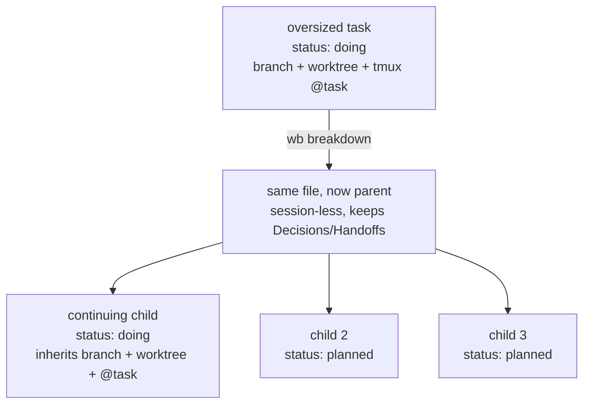
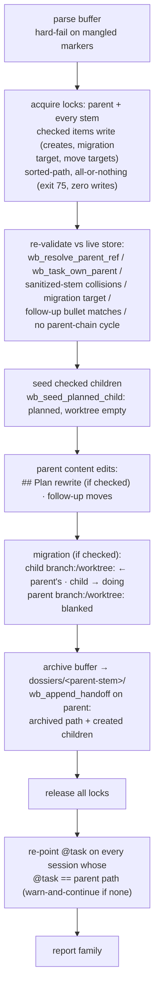

# wb Breakdown - Plan

## Goal Capsule

- **Objective:** split one oversized task in `~/code/tasks` (or an incoming Jira ticket) into a linked parent/child family of session-sized tasks, through a human-approved proposal buffer and a locked multi-file apply.
- **Product authority:** the three-round decision buffer `logs/decisions/2026-07-12-wb-breakdown-scoping.md` (+ companion `.html`; gitignored scratch, decisions mirrored in `~/code/tasks/dotfiles--feat-wb-breakdown-skill.md` `## Decisions`). All 13 decisions resolved 2026-07-12; the four planning-deferred questions are resolved in this document's Planning Contract — KTD1–KTD4, with the nudge-placement half of the primitive question in KTD8; KTD5–KTD10 record the further decisions planning added.
- **Stop conditions:** surface rather than guess if (a) the concurrency-safety PR's lock primitives land with a different call shape than `wb_task_lock_acquire`/`wb_task_lock_release` (KTD6), (b) its W13 planned-preserving creation mode lands with a shape U1 cannot extend, or (c) any change would contradict a D1–D13 resolution.
- **Execution profile:** wb.sh work is bash under `set -e` discipline; every unit's tests run in the Docker sandbox (Verification Contract); `wb breakdown --apply` (U3) must not land before the W11 sorted-path multi-lock — the whole feature ships as one PR after it (D13).
- **Product Contract preservation:** unchanged from the requirements round, except: the Outstanding Questions subsection (explicitly deferred-to-planning) is resolved into KTD1–KTD4/KTD8 and removed; F1's `@task` re-point step is assigned to `wb breakdown --apply` per D4's "explicit apply step" (the requirements text ambiguously credited the skill); Sources line anchors were re-verified against this worktree.

---

## Product Contract

### Summary

A `/wb-breakdown` skill that takes a task-file stem or a Jira ticket and proposes a family split in an editable reconcile-style buffer, plus a `wb breakdown --apply` verb that writes the approved family — session-less parent, planned children, worktree handed to the continuing child — as one locked operation.

### Problem Frame

The task store accumulates items that are really epics: one `.md` whose `## Plan` holds a week of work.
A single session chews on such a file for days, handoff entries pile up, and the board shows one opaque card.
The parent/child mechanism shipped in `feat/task-parent-child` (2026-07-10) gave the store family semantics — `parent:` frontmatter, picker sibling grouping, a board rollup card — but nothing *produces* a family except hand-editing frontmatter.
`/handoff` v1 explicitly deferred fan-out ("splitting a single discussion into several linked tasks") to this feature.
Separately, work arrives as Jira tickets, and turning a ticket into a scoped wb task today is entirely manual.

### Key Decisions

Resolved across three buffer rounds; the table is the condensed record, rationale in the decision doc.

| # | Decision | Resolution |
|---|---|---|
| D1 | Where the Jira-watch loop lives | Own task (`dotfiles--loop-jira-watch`, created); Jira primitives stay in `feat-jira-integration` |
| D2 | Input surface | Task-file stem OR Jira ticket key/URL, fetched agent-side via the Atlassian MCP |
| D3 | Decomposition source | Evidence ladder: ticket subtasks/description → ce-plan doc units → substantive `## Plan` → fresh agent pass |
| D4 | Parent fate | Task turns session-less parent; `branch:`/`worktree:` migrate to the continuing child; tmux `@task` re-aimed |
| D5 | Interaction model | Skill authors the proposal; `wb breakdown --apply` validates and writes under the W11 multi-lock |
| D6 | Sequencing | Breakdown-first; apply gated on W11; Jira brainstorm resumes after |
| D7 | Child slugs | Parent-prefixed by default (`feat/hub-v0` → `feat/hub-v0-board-embed`), editable in the buffer |
| D8 | Parent status | Manual, plus a print-only nudge from `wb done` when the last child closes |
| D9 | Content migration | `## Plan` slices move to children; Follow-ups/Decisions/Handoffs stay on the parent unless explicitly checkbox-moved |
| D10 | Candidate marker | `breakdown-candidate` tag, optional rationale line in `## Plan` |
| D11 | `jira:` ref shape | Full ticket URL, normalized on input; never sync state |
| D12 | Proposal UX | Reconcile-style action buffer via the existing blocking-nvim opener |
| D13 | v1 boundary | Full slice in one PR (skill + verb + planned-seed primitive + nudge + tests), after W11 |

The family transformation D4/D6 describe:



### Actors

- A1. Jet — invokes the skill, edits and approves the proposal buffer, remains the only decision-maker.
- A2. The breakdown skill (agent session) — gathers evidence, authors the proposal, never writes task files itself.
- A3. `wb.sh` — validates and executes the approved proposal; owns every task-store write.
- A4. The scoping loop (future, `dotfiles--loop-scope-planned-tasks`) — may tag candidates; never splits.

### Requirements

**Input and decomposition**

- R1. `/wb-breakdown <stem>` operates on an existing task file; `/wb-breakdown <ticket-key|url>` fetches the ticket agent-side via the Atlassian MCP.
- R2. Ticket input first seeds a parent task file from the ticket (title, description into `## Plan`, `jira:` ref), then proceeds identically to stem input.
- R3. The proposed split comes from the richest evidence present, in order: ticket subtasks/description, a ce-plan doc's implementation units, a substantive `## Plan`, a fresh agent pass — every rung emitting the identical proposal format.
- R4. `/wb-breakdown` with no argument lists tasks tagged `breakdown-candidate`.

**Proposal and approval**

- R5. The proposal is a reconcile-style action buffer: per child, a machine-readable comment plus editable slug/goal/absorbs lines and one create checkbox; parent edits (worktree migration target, follow-up moves) are their own checkboxed section.
- R6. Unchecked items are left exactly as-is — approval is per-item, and the closed buffer is the durable record of what was approved.
- R7. Proposed child slugs extend the parent's slug by default; any slug is editable in the buffer before apply.

**Apply and family write**

- R8. `wb breakdown --apply` executes only checked items: it validates parent references with the existing guards, seeds non-continuing children as `planned` with `parent:` set, and applies parent edits — all inside one sorted multi-lock spanning every file the family write touches.
- R9. Seeding a `planned` child without a session is a new wb.sh primitive; existing creation paths (session-spawning `wb new --parent`, `doing`-status reconcile create) are unchanged.
- R10. The broken-down task becomes a session-less parent: its `branch:`/`worktree:` values migrate to the designated continuing child's file (never cleared into limbo), and the live session's tmux `@task` is re-pointed at the continuing child.
- R11. Parent `## Follow-ups`, `## Decisions`, and `## Handoffs` entries stay on the parent; a checked move relocates a bullet to a named child (a move, never a copy).

**Lifecycle and metadata**

- R12. `wb done` on a task with a `parent:` prints a nudge naming the parent when all siblings are now done; it writes nothing beyond its own task.
- R13. `jira:` frontmatter stores the full ticket URL and nothing else; children mapped from ticket subtasks may carry their own `jira:` URL.
- R14. The store schema docs (`~/code/tasks/README.md`, `TEMPLATE.md`) document `jira:` and the `breakdown-candidate` tag convention.
- R15. Tests follow the repo's bash-assertion convention and cover: proposal-buffer parsing, apply validation and guards, the planned-seed primitive, worktree migration leaving no orphan, and the nudge condition.

### Key Flows

- F1. Stem breakdown
  - **Trigger:** `/wb-breakdown <stem>` on an oversized task.
  - **Steps:** skill climbs the evidence ladder → writes the proposal buffer → opens it blocking → Jet edits/checks/closes → skill hands the buffer to `wb breakdown --apply` → family written under the lock, `@task` re-pointed by apply (D4's explicit apply step) → skill reports the family.
  - **Covers:** R1, R3, R5–R11.
- F2. Ticket breakdown
  - **Trigger:** `/wb-breakdown SFB-1234` or a Jira URL.
  - **Steps:** MCP fetch → seed parent task file with `jira:` URL → continue as F1 from the ladder's ticket rung.
  - **Covers:** R2, R13.
- F3. Last-child close
  - **Trigger:** `wb done` on a child whose siblings are all done.
  - **Steps:** status flip as today → sibling scan → printed nudge naming the parent; no other writes.
  - **Covers:** R12.

### Acceptance Examples

- AE1. **Covers R6.** Given a proposal with three children and only two checked, when `--apply` runs, then exactly two child files exist and the buffer's unchecked block corresponds to no file or frontmatter change anywhere.
- AE2. **Covers R10.** Given a task with a live worktree broken down with child 1 marked continuing, when apply completes, then `wb reconcile` reports no orphaned worktree and no missing worktree, and the session's `@task` names child 1's file.
- AE3. **Covers R12.** Given a family with children A and B where A is done, when `wb done B` runs, then the nudge prints; given C still open instead, then no nudge prints.
- AE4. **Covers R3.** Given a stem whose task has neither a ticket, a plan doc, nor substantive `## Plan` content, when the skill runs, then the proposal comes from a fresh agent pass and the buffer format is indistinguishable from the other rungs.

### Success Criteria

- An oversized task or ticket becomes an approved, store-valid family in one buffer round.
- Picker and board render the new family with zero display-side changes; `wb reconcile` stays green through breakdown.
- Each created child is one-session-sized as judged in the approval buffer — the operator edits rather than re-runs.

### Scope Boundaries

Deferred for later:

- The Jira watch loop (`dotfiles--loop-jira-watch`, own task) and bash-side `wb new <ticket>` (`feat-jira-integration`).
- Family-aware count rollups in `wb_followup_count`, picker, or board.
- Un-breakdown / merging a family back into one task.
- Sibling ties between tasks (parent/child only, as before).
- Inverting D5: a `wb breakdown` verb that drives an agent internally (captured in the task file's `## Follow-ups`).

Deferred to follow-up work (plan-local):

- Promoting the substantive-`## Plan` test (KTD4) from a SKILL.md convention to a read-only wb.sh helper, if `loop-scope-planned-tasks` wants it mechanical.
- Cycle-tolerant family rendering in picker/board read paths (v1 guards cycles at the write path only — KTD5 validation).
- Family-aware `wb resume` matching niceties beyond the U4 coherence fix (e.g. resuming a parent suggests its children).

### Dependencies / Assumptions

- The `feat-wb-tasks-concurrency-safety` PR lands first, in full (its X6 ships everything together): `wb-locks.sh` primitives (`wb_task_lock_acquire`/`wb_task_lock_release`, its U1), the sorted-path multi-lock precedent in reconcile's `_merge` (its W11/U3), and the W13 planned-preserving creation mode (its U4). Hard gate for U3 here and therefore for the PR.
- Parent/child mechanics are shipped and stable: validation guards, picker grouping, board rollup.
- The Atlassian MCP is available in the invoking agent session; ticket input degrades gracefully (clear error, stem path unaffected) when it isn't.
- The store's schema conventions (`~/code/tasks/README.md`) remain the source of truth for frontmatter fields this feature adds to.
- Single-operator store: apply re-validates under the locks (KTD5), but no cross-session merge of two conflicting proposals is attempted.

### Sources / Research

- `logs/decisions/2026-07-12-wb-breakdown-scoping.md` + `.html` — the three-round decision record (gitignored; summarized in Key Decisions above).
- `~/code/tasks/dotfiles--feat-wb-breakdown-skill.md` — the task file; `## Decisions` mirrors the resolved rounds.
- `~/code/tasks/README.md` — parent/child schema (parents session-less, placeholder `repo:`), free-form `tags:`; `TEMPLATE.md` — `status: planned` default, blank `worktree:`.
- `~/code/tasks/dotfiles--feat-wb-tasks-concurrency-safety.md` + its plan `docs/plans/2026-07-11-001-feat-tasks-dir-concurrency-safety-plan.md` (currently on the `docs/roadmap-tasks-concurrency-safety` branch/worktree) — lock primitives (W1–W9), outermost-scope rule (W5), sorted multi-lock (W11), planned-preserving creation + `wb append` (W13), never-Edit enforcement hook (H24).
- `scripts/.config/scripts/tmux/wb.sh` — verified anchors: `wb_sanitize` :129, `wb_resolve_parent_ref` :136, `wb_task_own_parent` :148, `wb_seed_task` :263–307 (`doing` hardcoded :285/:297, `parent:` via optional 4th arg :305), `cmd_new`/`--parent` :330–418 (`@task` set :414), `cmd_resume` :430–468 (resumes from `repo:`/`branch:` frontmatter :450–454), `wb_reconcile_collect` :540–563 (missing-worktree = non-empty `worktree:` pointing nowhere), reconcile review writer :634–684 (refuse-to-clobber :636–640, report path :623–628), reconcile actions :686–795 (survivor validation :783–788), reconcile parser :801–874 (block splitter :806–817, two-phase reopen :844–873), `wb_open_buffer` :956–974 (`WB_REVIEW_BUFFER=1`), `wb_followup_count` :1100–1112, `wb_pending_counts` nudge :1119–1123, `cmd_done` :1670–1820 (task-file from `@wb_repo`/`@wb_slug` :1691–1700, status flip + handoff :1803–1805, pending nudge :1809–1812), guarded CLI dispatch :2385–2404, board family rollup :1390–1400/:1514, picker grouping `wb_parent_subrows` :1959–2043.
- `scripts/.config/scripts/tmux/wb-lifecycle.sh:83-107` — plan/brainstorm evidence detection feeding the ladder (`wb_lifecycle_has_plan`/`_has_brainstorm`).
- `scripts/.config/scripts/tmux/tests/wb-reconcile-review.test.sh` — the buffer-grammar test model: `fresh_env` per apply scenario, `mk_template`, function-redefinition stubs, `sed -i` checkbox flips, marker-scoped `check_line_for`; `tests/wb-done.test.sh:7-27` — docker-only flagging + source-text-assertion wording for tmux-dependent behavior; `tests/wb-parent-child.test.sh` — fake-tmux shim and declare-f/eval stub-restore patterns.
- `claude/.claude/skills/` — skill conventions: `handoff/SKILL.md:30-36,87-96` (never writes wb-owned state; shell out to `wb_sanitize`/`wb_task_file`, source-and-call shape), `wb-done/SKILL.md:47-109,202-209` (buffer-opening verbs run as one backgrounded Bash call, no second wait-channel; bare `wb` alias), `decision-buffer/SKILL.md:137-190` (blocking-nvim recipe, parse-on-return contract), `wb-save/SKILL.md:137` (test-scenarios section convention).
- `~/code/tasks/dotfiles--loop-scope-planned-tasks.md` — the sibling loop that shares the substantive-plan test (its step 1 is exactly the "no `## Plan` content beyond a stub" detection).

---

## Planning Contract

### Key Technical Decisions

- KTD1. **Proposal-buffer grammar: a `wb-breakdown` marker family with reconcile's parsing contract.** One buffer per parent at `logs/breakdowns/<parent-stem>.md` in the dotfiles repo, path from a `wb_breakdown_report_path` twin of `wb_reconcile_report_path` (:623–628, keeping the `|| true` on the git lookup — a bare failing `$(git …)` under `set -e` was a real shipped bug). Blocks open with an HTML-comment marker carrying space-free `key=value` identity fields; checked actions are anchored `^- \[x\]` matches; user-supplied values live in backticked fields on the action lines (`___` placeholder = unfilled); multi-line child plan bodies sit between explicit `begin-plan`/`end-plan` sub-markers so free text is never value-parsed. Prose outside markers/checkboxes/backtick fields is ignored by the parser (edit tolerance). Regeneration refuses to clobber a buffer that still has a marker plus any unchecked box (reconcile :636–640 precedent). Machine-read slugs are raw branch names; stems derive at apply time via `wb_sanitize` — which maps only `/`, `.`, `:` to `-` and strips neither spaces nor backticks (both legal in git refnames), so U2 validates that slug fields contain no whitespace or backticks and hard-fails the line otherwise. Malformed checked blocks (mangled/missing marker, unbalanced plan-body markers) are hard parse errors naming the line — never silently treated as unchecked.
- KTD2. **Continuing-child designation lives on the parent-edits migration line.** `- [ ] migrate branch/worktree + re-aim @task → continuing child: `` `<raw-slug>` `` — one line, one backticked editable target, pre-filled by the skill (default: the first child; skill may judge otherwise). Exactly-one as authored; because the buffer is freely editable, more than one migration line in the parent block (checked or not) is a hard parse error naming the lines — the duplicate-`n=` posture — so no exactly-one-checked scan is needed beyond that guard. Validation then only checks the target resolves to a child created in this apply or an existing child of this parent. The skill omits the line entirely for a session-less parent (ticket-seeded, or no `branch:`/`worktree:`); a checked migration on such a parent is a validation error. Unchecked migration with checked children is valid: all children seed `planned`, the parent keeps its session.
- KTD3. **Planned-seed primitive: a new internal `wb_seed_planned_child`, plus the ticket-parent path composed with concurrency-W13.** The child seeder creates from `TEMPLATE.md` (awk -v splice for the short frontmatter values, mirroring `wb_seed_task` :281–292) leaving `status: planned` as the template has it, setting `repo:`/`branch:` (raw slug)/`created:`/title/`parent:`, landing the buffer-carried child `## Plan` body under the template's `## Plan` (same mechanism as the ticket-parent body), and leaving `worktree:` **empty** — `wb_reconcile_collect` (:557–560) flags any non-empty `worktree:` pointing nowhere, so a pre-filled worktree on a planned child would break AE2's reconcile-green criterion. It never touches an existing file (collisions are validation errors upstream). It is called only from `cmd_breakdown`'s locked apply — not a public verb. Ticket parents (R2) are created via the concurrency plan's W13 planned-preserving creation mode (its U4; flag spelling decided there), extended here with a `--jira <url>` option and a stdin `## Plan` body if the landed shape lacks them — extension, never duplication. Ticket title goes into the `#` heading, never into frontmatter (no YAML-quoting surface).
- KTD4. **Substantive-`## Plan` test: a named, citable SKILL.md convention shared with the scoping loop.** The skill's ladder rung 3 gate is a mechanical definition under its own SKILL.md heading ("The substantive-plan test"): `## Plan` counts as substantive when it holds ≥3 actionable items (top-level bullets or `###` sub-headings) or ≥10 non-blank content lines, excluding template stub text. `loop-scope-planned-tasks` cites the same section for its "no `## Plan` content beyond a stub" detection (its Plan step 1). Kept agent-side because both consumers are agents and wb.sh owns writes, not judgment; promotion to a read-only wb.sh helper is a named follow-up.
- KTD5. **Apply is ordered, per-item fail-loud, and idempotently re-runnable.** Write order inside the lock: re-validate everything against live store state (never trust the buffer snapshot) → seed checked children (frontmatter + goal title + buffer-carried `## Plan` body) → parent content edits (parent-`## Plan` rewrite when checked, follow-up moves) → migration (set continuing child `branch:`/`worktree:` from parent, flip it `planned`→`doing`, blank the parent's two fields — exactly one file may claim a worktree) → archive the closed buffer to `~/code/tasks/dossiers/<parent-stem>/` (R6's durable record must outlive gitignored scratch — the 2026-07-10 incident wiped exactly that tier) and append one `wb_append_handoff` entry to the parent naming the archived copy and created children. The parent's `status:` is untouched (D8: manual) — the board's in-progress rollup card for a split parent is intended until Jet closes it. The parent-`## Plan` rewrite replaces whatever the section holds at apply time; content added between authoring and apply is clobbered — accepted single-operator risk, stated in the buffer header. After release: re-point `@task` on every session whose `@task` equals the parent path, then report. Validation failures and per-item errors go to stderr and skip that item (reconcile posture); apply never deletes files to roll back. Re-running the same buffer converges: an existing child whose `parent:` matches is "already created, skipping"; an already-blanked parent skips migration; a stale `@task` still gets re-pointed. A buffer with zero checked items is a clean no-op exit 0, distinct in message from a missing/empty buffer (error). Collisions are validated on **sanitized** stems, intra-buffer and against the store, before any write.
- KTD6. **Locking: compose with W4/W5/W11, concentrated in one acquisition site.** `cmd_breakdown` acquires the sidecar locks (`wb_task_lock_acquire`) for the parent plus every stem any checked item writes — created children, the migration target, and every follow-up-move target (R8's "every file the family write touches" includes pre-existing children) — in sorted-path order, all-or-nothing (on any failure release everything acquired, exit 75, zero writes), at outermost verb scope only. The critical section never spans `wb_open_buffer` (the skill opens the buffer before apply runs; apply itself is single-phase and non-interactive), tmux calls, or git operations — the `@task` re-point happens after release. Acquisition lives in one function so the landed W11 shape swaps in without touching the apply logic.
- KTD7. **Session/task coherence: `@task`-first resolution, because D4's re-aim is otherwise a lie.** `cmd_done`, `cmd_pause`, and `cmd_reviewed` today derive the task file from `@wb_repo`/`@wb_slug` (:1691–1700, :940–942), and `cmd_resume` re-seeds from `repo:`+`branch:` via `cmd_new` (:450–454) — so after migration, every one of them would resolve the continuing session back to the **parent's** file (e.g. `wb done` would close the parent, violating R12's "writes nothing beyond its own task"). A shared helper (`wb_session_task_file <session>`: `@task` when set and existing, else the current repo/slug derivation) becomes the resolution path for those verbs; `cmd_done` additionally takes its worktree path from the task file's `worktree:` frontmatter when set (fallback: `.worktrees/$slug`), and its dossier path from the task file's stem; `cmd_resume` seeds and re-points the **matched** file rather than the branch-derived stem (directional: an internal task-file override for `cmd_new`'s seeding step). Three companion guards ride with the helper: `cmd_done` also accepts a task-file stem that matches no live session as a **store-only close** (status/closed/handoff burst; no sweep, worktree, or session teardown — a session-less parent has neither, and this is the path KTD8's printed nudge command needs to actually work); when a task's `worktree:` is set but the path is missing while the derived `.worktrees/$slug` exists, `cmd_done` fails loud naming the drift rather than tearing down against the wrong target; and `wb_seed_task`'s blank-field backfill skips `branch:`/`worktree:` (with a stderr warning naming the claiming child) when another task file already claims that pair — otherwise a muscle-memory `wb new <old-slug>` reattach silently refills the parent's deliberately-blanked fields and two files claim one worktree. `wb_live_session_row` (:1909–1923) joins the `@task`-first adoption list too: it derives the picker's live-session row from `@wb_repo`/`@wb_slug`, which apply never re-points, so a migrated session would otherwise render as the parent. Fallbacks preserve today's behavior byte-for-byte for sessions without `@task`.
- KTD8. **Nudge: end of `cmd_done`, print-only, fail-open.** A `wb_family_all_done <parent_stem>` helper scans `wb_task_files` for `parent:` == stem; when every child (including the just-flipped one) is `done`, `cmd_done` prints the nudge naming the parent stem — beside the existing `wb_pending_counts` nudge (:1809–1812), matching its pattern. The printed command (`wb done <parent-stem>`) works only via KTD7's stem-fallback store-only close — a session-less parent resolves to no tmux session on today's path. Only `done` counts (a `review`/`paused`/`planned` sibling suppresses it); an only child fires it; a missing parent file suppresses it silently; nothing beyond printing ever happens (D8).
- KTD9. **Ticket seeding: fetch before any write; find-or-create semantics.** The skill makes no store write until the MCP fetch succeeds (bad key/404/auth error → clear message, zero files). An existing task with the same stem or the same `jira:` URL is reused fill-blanks-only, never overwritten. `jira:` stores the full URL exactly as normalized (D11); subtask-mapped children may carry their own.
- KTD10. **Docs and citation hygiene.** Store schema changes (R14: `jira:` in the README schema block + TEMPLATE, the `breakdown-candidate` tag convention, a cross-link line in `loop-scope-planned-tasks`) land as a separate commit in the `~/code/tasks` repo (PR #20's `reviewed:` precedent), not in this PR. The new SKILL.md cites wb.sh by function name plus a search hint, not bare line numbers (three PR #26 commits existed solely to refresh stale line refs). Dotfiles docs regenerate via docgen (checking `docs/docgen.json` before any new `group:`), plus the per-PR recap page habit.

### High-Level Technical Design

The proposal-buffer grammar (directional — exact regexes are U2's job; shapes and vocabulary are the contract):

```markdown
# wb breakdown — feat/hub-v0 (dotfiles--feat-hub-v0)

> Check what you approve, edit slugs/goals/bodies in place, save and close.
> `wb breakdown --apply logs/breakdowns/dotfiles--feat-hub-v0.md` executes
> exactly what's checked — an unchecked item is left exactly as-is.

## child 1 — board embed (continuing)
<!-- wb-breakdown: block=child n=1 parent=dotfiles--feat-hub-v0 repo=dotfiles -->
- [x] create child: `feat/hub-v0-board-embed`
- goal: embed the live board table into the Hub page
<!-- wb-breakdown: begin-plan n=1 -->
- absorb: board-embed bullets from parent ## Plan (rewritten below)
- …child plan body, verbatim markdown, written into the child's ## Plan…
<!-- wb-breakdown: end-plan -->

## child 2 — artifact index
<!-- wb-breakdown: block=child n=2 parent=dotfiles--feat-hub-v0 repo=dotfiles -->
- [ ] create child: `feat/hub-v0-artifact-index`
- goal: one-line goal (editable)
<!-- wb-breakdown: begin-plan n=2 -->
…
<!-- wb-breakdown: end-plan -->

## parent edits
<!-- wb-breakdown: block=parent parent=dotfiles--feat-hub-v0 -->
- [x] migrate branch/worktree + re-aim @task → continuing child: `feat/hub-v0-board-embed`
- [ ] rewrite parent ## Plan as below
<!-- wb-breakdown: begin-plan parent -->
…skill-authored post-split summary + unabsorbed remainder…
<!-- wb-breakdown: end-plan -->
- [ ] move follow-up: "explore wb breakdown verb…" → child: `feat/hub-v0-artifact-index`
```

Apply-time sequence (U3), with lock scope explicit:



Division of labor across the two halves (D5): the skill owns evidence and authorship — ladder climb (ticket → `wb_lifecycle_has_plan` doc → substantive `## Plan` → fresh pass), buffer writing, the blocking open, and invoking apply; wb.sh owns every store mutation and all validation. The skill opens the buffer with the decision-buffer tmux recipe (unique `$$-$RANDOM` wait channel, `@claude_blocked`) and sets `WB_REVIEW_BUFFER=1` on the nvim invocation so conform.nvim's format-on-save cannot mangle markers (the PR #27 Sweep-buffer lesson). The apply invocation is an **ordinary synchronous Bash call**: apply is single-phase, non-interactive, and lock-bounded (`flock -w 1`), so its stdout/stderr — including KTD5's per-item warn-and-skip messages, which the family report must relay — come back inline. The backgrounded-call mechanism (wb-done SKILL.md) exists for verbs that open buffers mid-run; here the skill opens the buffer itself, so no wait channel is needed around apply.

---

## Implementation Units

### U1. Planned-seed primitives

- **Goal:** `wb_seed_planned_child` exists and behaves per KTD3; the ticket-parent creation surface exists (W13-composed).
- **Requirements:** R9, R2 (creation half), R13.
- **Dependencies:** concurrency PR's U4 landed (for the W13 mode to extend); nothing else in this plan.
- **Files:** `scripts/.config/scripts/tmux/wb.sh`, `scripts/.config/scripts/tmux/tests/wb-breakdown.test.sh` (new; seed section).
- **Approach:** template-splice via `awk -v` for the short frontmatter values exactly like `wb_seed_task`'s create branch, minus the `status: doing` line and the worktree stamp; `parent:` set unconditionally; the child `## Plan` body accepted on stdin and landed under the template's `## Plan` (same interface for the ticket-parent body); refuse (return 1, stderr) if the target file exists. Ticket-parent path: extend the landed W13 creation mode with `--jira <url>` and a stdin plan body only if it lacks them; the `jira:` key is written with `wb_set_frontmatter` (which must tolerate a key absent from TEMPLATE — verify, extend if needed).
- **Execution note:** multi-line bodies must never pass through `awk -v` — awk applies C escape-sequence processing to `-v` values, so `\n`/`\t`/`\K` in quoted code get expanded or dropped (the cited `wb_seed_task`/`wb_reconcile_merge_content` splices are safe only because their values never carry backslashes). Insert bodies via a temp file (`getline`) or `ENVIRON`, and pin it with a backslash-bearing regression test.
- **Patterns to follow:** `wb_seed_task` :263–307; the concurrency plan's U4 approach notes; `set -e` guard discipline (every may-fail command in an `if`/`||` shape).
- **Test scenarios:**
  - Happy: seed creates a file with `status: planned`, empty `worktree:`, `branch:` = raw slug, `parent:` set, title from goal; `wb_get_frontmatter` round-trips every field.
  - Existing file → return 1, stderr names the stem, file untouched.
  - `jira:` set on a ticket parent; a stdin body lands under `## Plan` for both children and ticket parents.
  - A body containing backslash sequences (`\n`, `\t`, `\K` inside fenced code) round-trips byte-identical.
  - Covers AE2 (half): a store with planned children (empty `worktree:`) shows zero findings from `wb_reconcile_collect`.
  - Existing paths unchanged: `wb_seed_task` still flips planned→doing and stamps worktrees (regression assert).
- **Verification:** seed section of `wb-breakdown.test.sh` green in the Docker sandbox.

### U2. `wb breakdown` verb skeleton: buffer parsing + validation

- **Goal:** `cmd_breakdown` dispatches (`breakdown) shift; cmd_breakdown "$@"` in the guarded table :2385–2404), `--apply <buffer-path>` parses blocks and validates everything in KTD5's list — with no writes yet.
- **Requirements:** R5, R6 (parse half: unchecked detection), R7, R8 (validation half).
- **Dependencies:** none (parse/validate functions are sourceable and testable pre-lock-gate).
- **Files:** `scripts/.config/scripts/tmux/wb.sh`, `scripts/.config/scripts/tmux/tests/wb-breakdown.test.sh` (parse/validate sections).
- **Approach:** mirror `wb_reconcile_apply`'s line-scan block splitter (:806–817) keyed on `<!-- wb-breakdown: block=` lines; field extraction per block with `grep -oP 'key=\K[^ ]+'`; plan bodies captured between `begin-plan`/`end-plan` markers with unbalanced-marker hard errors; `wb_breakdown_report_path` twin; refuse-to-clobber guard for the skill's regeneration path. Validation per KTD5/KTD2: parent resolves (`wb_resolve_parent_ref`), no self-parent (`wb_task_own_parent`), no A→B→A cycle via the parent's own `parent:` chain, sanitized-stem collisions (intra-buffer + store), migration target resolves to a created-or-existing child and parent has `branch:`/`worktree:` to give, follow-up move text matches exactly one parent bullet and names a created-or-existing child. Errors: hard parse errors abort; per-item validation failures warn + skip (reconcile posture).
- **Patterns to follow:** `wb_reconcile_apply` :801–874; `wb_tsv_split` (never `IFS read` for tab data); never derive repo/slug from filenames (wb.sh header rule — use marker fields and frontmatter).
- **Test scenarios:**
  - Covers AE1 (parse half): three child blocks, two checked → parser yields exactly two create actions; the unchecked block yields none.
  - Checkbox grammar: `[X]`, extra indentation, trailing prose on the line, `*` bullets — pin accepted forms; non-conforming checkbox-like lines are parse errors, not silently-unchecked.
  - Mangled/deleted marker on a checked block → hard error naming the line; nothing validated further.
  - Duplicate `n=` keys (copy-pasted block) → explicit rejection.
  - Two raw slugs sanitizing to one stem → collision error; slug colliding with an existing store file → collision error.
  - Migration checked, target is an unchecked child → error; target field still `___` → error; parent session-less → error; a second migration line in the parent block (checked or not) → hard parse error naming the lines.
  - A slug field containing whitespace or a backtick → hard parse error naming the line (`wb_sanitize` strips neither).
  - Follow-up move text matching zero or two bullets → skip with warning listing candidates; move target unchecked → error.
  - Zero checked items → clean no-op exit 0; missing/empty buffer path → non-zero with distinct message.
  - Edited `parent=` field pointing at a different task → rejected (single-parent buffer).
- **Verification:** parse/validate sections green in the sandbox; `bash -n wb.sh` clean.

### U3. Locked family apply execution

- **Goal:** `--apply` executes checked items under the sorted multi-lock per KTD5/KTD6: children seeded, parent content edits, migration, handoff entry, post-release `@task` re-point.
- **Requirements:** R8, R10, R11, R6 (apply half). Covers AE1, AE2.
- **Dependencies:** U1, U2; **hard gate:** concurrency PR merged (wb-locks.sh + W11 precedent).
- **Files:** `scripts/.config/scripts/tmux/wb.sh`, `scripts/.config/scripts/tmux/tests/wb-breakdown.test.sh` (apply sections).
- **Approach:** one acquisition function (sorted stems for every file a checked item writes → `wb_task_lock_acquire` each; on any failure release acquired set, exit 75); the KTD5 write order verbatim, including the dossier archival of the closed buffer; parent `## Plan` rewrite via the section-replace awk shape (`wb_reconcile_merge_content` :747–762 is the section-machinery precedent, minding U1's no-`awk -v`-for-bodies rule); follow-up moves delete the bullet block (bullet + indented continuation lines) from the parent and append under the child's `## Follow-ups`; migration sets child `branch:`/`worktree:`, flips child to `doing`, blanks parent's fields via `wb_set_frontmatter`; `@task` re-point iterates sessions and re-points every one whose `@task` equals the parent path, warn-and-continue when none match.
- **Execution note:** build the idempotent re-apply behavior first (skip-as-done detection), then the happy path — crash-recovery semantics are the riskiest part and the tests want them pinned early.
- **Test scenarios:**
  - Covers AE1: three proposed / two checked → exactly two child files; unchecked block's slug appears nowhere; parent untouched except checked edits.
  - Covers AE2: fixture repo + real worktree, migration checked → child has parent's old `branch:`/`worktree:` and `status: doing`; parent's fields blank; `wb_reconcile_collect` emits zero findings; `@task` re-point asserted via the source-text fallback (wb-schema.test.sh :66–77 style) plus a fake-tmux shim where feasible.
  - Idempotent re-apply: run apply twice → second run all skips, exit 0, byte-identical store.
  - Crash simulation: kill between child-seed and migration (or stub a failing step) → re-apply completes the remainder; no file deleted.
  - Lock contention: a held sibling lock → exit 75, zero writes, everything released.
  - A follow-up move targeting a pre-existing child: that child's lock is held during the append (assert via instrumented lock dir).
  - The closed buffer's archived copy exists under `dossiers/<parent-stem>/` and the parent's handoff entry names the archived path.
  - Follow-up move: bullet with sub-bullets moves whole-block; `wb_followup_count` total unchanged.
  - Handoff entry appended once on the parent, not duplicated on re-apply.
- **Verification:** apply sections green **docker-only** (real `git worktree` + kill scenarios; flag the test file like wb-done.test.sh :7–13); manual AE2 walkthrough in a live tmux session.

### U4. Session/task coherence for migrated families

- **Goal:** KTD7 — `wb_session_task_file` helper; `cmd_done`/`cmd_pause`/`cmd_reviewed` resolve via `@task` first; `cmd_done` derives worktree/dossier from the task file, gains the stem-fallback store-only close, and fails loud on worktree drift; `cmd_resume` seeds the matched file; `wb_seed_task` gains the duplicate-claim backfill guard; `wb_live_session_row` adopts the helper.
- **Requirements:** R10 (the migration must stay workable), R12 (nudge must act on the child's own file).
- **Dependencies:** none on U1–U3 (independently landable; sequence-friendly pre-gate).
- **Files:** `scripts/.config/scripts/tmux/wb.sh`, `scripts/.config/scripts/tmux/tests/wb-breakdown.test.sh` (coherence section), `scripts/.config/scripts/tmux/tests/wb-done.test.sh` (fallback regression asserts).
- **Approach:** helper reads `@task` (session-scoped `tmux show -v`), validates the file exists, falls back to today's `wb_task_file "$repo" "$(wb_sanitize "$slug")"` derivation; `cmd_done`'s `worktree_path` prefers the task file's `worktree:` (fallback `.worktrees/$slug`) and fails loud when `worktree:` is set but missing while the derived path exists, dossier keyed on the task file's stem; an argument matching no live session resolves as a task-file stem for a store-only close (status/closed/handoff burst — skip dirty-check, sweep, worktree removal, and session steps when the task has no worktree); `cmd_resume` passes its matched file through so seeding/`@task` target it (directional: an internal override consumed by `cmd_new`'s seeding step only — session/worktree creation still derives from `repo:`+`branch:`); `wb_seed_task`'s blank backfill of `branch:`/`worktree:` is skipped with a stderr warning when another task file's frontmatter already claims the pair; `wb_live_session_row` resolves its task file through the helper (KTD7's picker note).
- **Test scenarios:**
  - Migrated-family fixture: session `@task` → child file; `wb done` flips the **child** to done, removes the migrated worktree, dossier under the child's stem; parent untouched.
  - No `@task` set → byte-identical current behavior for done/pause/reviewed (characterization asserts before the change).
  - `@task` pointing at a deleted file → fallback derivation, one stderr warning.
  - Resume-after-breakdown: continuing child torn down then `wb resume <child-stem>` → reattaches via the child's migrated `branch:`/`worktree:`, seeds/points at the child file, creates no second worktree.
  - Store-only close: `wb done <parent-stem>` on a session-less, worktree-less parent flips it to done and appends the handoff entry; no teardown attempted; a stem matching neither a session nor a task file still fails loud.
  - Reattach guard: post-migration `wb new <parent-branch>` does not refill the parent's blanked `branch:`/`worktree:`; the warning names the claiming child.
  - Picker attribution: the migrated session's picker row shows the continuing child's task file, not the parent's; rows for sessions without `@task` render byte-identical.
  - Worktree drift: `worktree:` set but missing while `.worktrees/$slug` exists → `cmd_done` exits loud, nothing flipped or removed.
- **Execution note:** characterization coverage on the untouched fallback paths before changing resolution — these verbs run on every task, not just families.
- **Verification:** coherence section green docker-only; existing `wb-done.test.sh` suite still green unmodified except added asserts.

### U5. `wb done` last-child nudge

- **Goal:** KTD8 — `wb_family_all_done` + the printed nudge. Covers AE3, F3.
- **Requirements:** R12.
- **Dependencies:** U4 (correct task-file resolution for children).
- **Files:** `scripts/.config/scripts/tmux/wb.sh`, `scripts/.config/scripts/tmux/tests/wb-breakdown.test.sh` (nudge section).
- **Approach:** after the status flip and handoff append (:1803–1805), read the closed task's `parent:`; when set, scan siblings and print `wb done: all children of <parent> are done — close it with: wb done <parent>` when they all are. Pure read + print; guarded so any scan failure cannot abort `cmd_done` under `set -e`.
- **Test scenarios:**
  - Covers AE3: A done, close B → nudge names the parent; C still `doing`/`review`/`planned` → silent.
  - Only child → nudge fires.
  - `parent:` empty → no scan; parent file missing → silent, `wb done` still succeeds.
  - Nudge is stdout-only: store byte-identical apart from the closed task's own flip.
- **Verification:** nudge section green in the sandbox.

### U6. `/wb-breakdown` skill

- **Goal:** `claude/.claude/skills/wb-breakdown/SKILL.md` — the authoring half of D5, end-to-end F1/F2 orchestration.
- **Requirements:** R1–R4, R5 (authorship half), R7 (default slugs), R13 (normalization). Covers AE4.
- **Dependencies:** U1 (verbs it calls), U2 (grammar it writes); U3 for the end-to-end dry-run in Verification — the SKILL.md can be authored pre-gate, but verifying it exercises apply's writes.
- **Files:** `claude/.claude/skills/wb-breakdown/SKILL.md` (new).
- **Approach:** house skill shape — `name` + long trigger-rich `description` frontmatter only; why-it-exists intro; `## Scope` stating the never-writes-task-files boundary (handoff :30–36 wording) and that all store writes go through `wb` verbs; numbered flow: no-arg candidates listing (`grep -l '^tags:.*breakdown-candidate' ~/code/tasks/*.md` anchored on the frontmatter field, with `README.md`/`TEMPLATE.md` filtered out — U7 adds the literal tag string to the schema docs, and prose mentions must not list as candidates; read-only, skill-side per D10), stem vs ticket input detection, ticket fetch via Atlassian MCP + URL normalization + parent seeding through the U1 verb (fetch-before-any-write per KTD9), the evidence ladder with "The substantive-plan test" as its own citable heading (KTD4), re-breakdown handling (existing children listed as context, no create boxes), buffer authoring per the HTD grammar with parent-prefixed default slugs, blocking open via the decision-buffer recipe + `WB_REVIEW_BUFFER=1`, parse-on-return contract (checked boxes are the answer; notes answered before acting), apply invocation as an ordinary synchronous Bash call whose stdout/stderr feed the family report (apply is non-interactive — the HTD division-of-labor note; the wb-done backgrounding mechanism applies only to buffer-opening verbs), and the family report. Cites wb.sh by function name + search hint, never bare line numbers (KTD10).
- **Test scenarios:** skill files aren't executable tests; the SKILL.md carries the house test-scenarios section covering: no-arg listing, stem happy path, ticket happy path, MCP-unavailable degradation (clear error, stem path unaffected), AE4 (bare task → fresh-pass rung, identical buffer format), all-unchecked close (report no-op, don't re-fire the buffer), and the buffer-already-has-unresolved-items refusal relay. Plus one grep-shaped repo test in `wb-breakdown.test.sh`: the SKILL.md contains no Edit/Write-tool instructions targeting `~/code/tasks` (the concurrency plan's U4 precedent).
- **Verification:** dry-run the skill flow on a fixture stem in a live session; the grep assertion green.

### U7. Documentation and landing

- **Goal:** KTD10's doc set: store schema docs, dotfiles docs, recap.
- **Requirements:** R14.
- **Dependencies:** U1–U6 (documents what shipped).
- **Files:** `~/code/tasks/README.md` + `~/code/tasks/TEMPLATE.md` + a cross-link line in `~/code/tasks/dotfiles--loop-scope-planned-tasks.md` (separate commit in the tasks repo); `docs/roadmap.md` row; wb guide section if one exists for verbs (check `docs/docgen.json` before adding any new `group:`); regenerated `docs/` via docgen; the per-PR recap page.
- **Approach:** README schema block gains `jira:` (full URL, optional) and the `breakdown-candidate` tag convention with its optional `## Plan` rationale line; TEMPLATE gains the `jira:` key. Everything else follows the existing docgen/recap habit.
- **Test scenarios:** Test expectation: none — docs-only unit; docgen exiting 0 and the pre-commit hook regenerating cleanly are the checks.
- **Verification:** docgen run clean; recap tile renders on the Hub.

---

## Verification Contract

| Gate | Command / check | Applies to |
|---|---|---|
| Sandboxed suite | `docker build` the `tests/Dockerfile` `wb-tests` image, then run `scripts/.config/scripts/tmux/tests/wb-breakdown.test.sh` in it (repo mounted `:ro`; exact invocation per the header convention in `wb-done.test.sh:7-13`) | U1–U5; mandatory for U3/U4's worktree/kill scenarios |
| Existing suites stay green | full `tests/*.test.sh` loop in the sandbox | every wb.sh-touching unit (U1–U5) |
| Syntax | `bash -n scripts/.config/scripts/tmux/wb.sh` | U1–U5 |
| Reconcile-green criterion | fixture family post-apply → `wb reconcile` reports "no drift found" | U3 (AE2) |
| Acceptance walkthrough | AE1–AE4 exercised end-to-end: AE1/AE2 in the sandbox suite, AE3 in the nudge section, AE4 as a live skill dry-run on a bare fixture task | U3, U5, U6 |
| Skill write-boundary | grep assertion: no editor-tool writes to `~/code/tasks` instructed anywhere in the new SKILL.md | U6 |
| Docs pipeline | docgen exits 0; pre-commit regeneration clean; no orphan `group:` vs `docs/docgen.json` | U7 |

---

## Definition of Done

- All seven units complete in dependency order; `wb-breakdown.test.sh` plus the full existing suite green inside the Docker sandbox.
- AE1–AE4 demonstrated per the Verification Contract; `wb reconcile` green through a real breakdown.
- The W11 gate honored: the PR merges into `development` only after the `feat-wb-tasks-concurrency-safety` PR; one PR carries the full slice (D13), opened with `pgh`, conventional commits with the Co-Authored-By trailer, the enriched plan committed as `docs(plans):`.
- Tasks-repo schema commit (R14 + the loop cross-link) pushed separately in `~/code/tasks`.
- Docs regenerated via docgen; recap page tiled on the Hub.
- No abandoned or experimental code in the diff; SKILL.md citations are function-name + search-hint style.

---

## System-Wide Impact

- **U4 changes verbs that run on every task, not just families:** `cmd_done`/`cmd_pause`/`cmd_reviewed` resolution order, `cmd_done`'s worktree derivation and stem-fallback close, `wb_seed_task`'s backfill guard, and the picker's live-session row. The `@task`-first path only activates when `@task` is set and valid; characterization tests pin the fallbacks as byte-identical. This is the one unit whose blast radius exceeds the feature.
- **`@wb_repo`/`@wb_slug` stay permanently stale on a migrated continuing session** — apply re-points `@task` only. U4 moves every current consumer that resolves a task file from those options onto the `@task`-first helper; any future consumer of `@wb_slug`'s stem-derivation role must do the same (its branch-identity role remains accurate, since the migrated `branch:` equals the session's real branch).
- **Interplay with the concurrency work:** breakdown's apply becomes the store's first true multi-file writer, i.e. the case W11 was reserved for; its H24 hook will "ask" on any agent Edit/Write under `~/code/tasks`, which the skill never does (buffer lives in dotfiles `logs/breakdowns/`) — the design is compatible by construction, and the U6 grep assertion keeps it that way.
- **Store schema:** `jira:` is a new optional frontmatter key; anything iterating frontmatter tolerates unknown keys today (verified: readers are key-addressed via `wb_get_frontmatter`), so no reader changes are needed.
