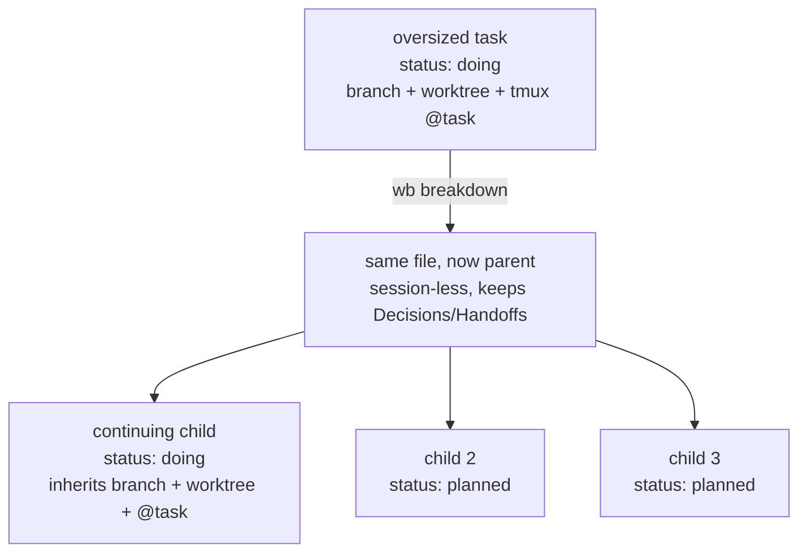

# wb Breakdown - Plan

## Goal Capsule

- **Objective:** split one oversized task in `~/code/tasks` (or an incoming Jira ticket) into a linked parent/child family of session-sized tasks, through a human-approved proposal buffer and a locked multi-file apply.
- **Product authority:** the three-round decision buffer `logs/decisions/2026-07-12-wb-breakdown-scoping.md` (+ companion `.html`; gitignored scratch, decisions mirrored in `~/code/tasks/dotfiles--feat-wb-breakdown-skill.md` `## Decisions`). All 13 decisions resolved 2026-07-12.
- **Open blockers:** the W11 sorted-path multi-lock from `~/code/tasks/dotfiles--feat-wb-tasks-concurrency-safety.md` (planned, not built). `wb breakdown --apply` must not land before it; the whole feature ships as one PR after W11 (D13).

---

## Product Contract

### Summary

A `/wb-breakdown` skill that takes a task-file stem or a Jira ticket and proposes a family split in an editable reconcile-style buffer, plus a `wb breakdown --apply` verb that writes the approved family — session-less parent, planned children, worktree handed to the continuing child — as one locked operation.

### Problem Frame

The task store accumulates items that are really epics: one `.md` whose `## Plan` holds a week of work.
A single session chews on such a file for days, handoff entries pile up, and the board shows one opaque card.
The parent/child mechanism shipped in `feat/task-parent-child` (2026-07-10) gave the store family semantics — `parent:` frontmatter, picker sibling grouping, a board rollup card — but nothing *produces* a family except hand-editing frontmatter.
`/handoff` v1 explicitly deferred fan-out ("splitting a single discussion into several linked tasks") to this feature.
Separately, work arrives as Jira tickets, and turning a ticket into a scoped wb task today is entirely manual.

### Key Decisions

Resolved across three buffer rounds; the table is the condensed record, rationale in the decision doc.

| # | Decision | Resolution |
|---|---|---|
| D1 | Where the Jira-watch loop lives | Own task (`dotfiles--loop-jira-watch`, created); Jira primitives stay in `feat-jira-integration` |
| D2 | Input surface | Task-file stem OR Jira ticket key/URL, fetched agent-side via the Atlassian MCP |
| D3 | Decomposition source | Evidence ladder: ticket subtasks/description → ce-plan doc units → substantive `## Plan` → fresh agent pass |
| D4 | Parent fate | Task turns session-less parent; `branch:`/`worktree:` migrate to the continuing child; tmux `@task` re-aimed |
| D5 | Interaction model | Skill authors the proposal; `wb breakdown --apply` validates and writes under the W11 multi-lock |
| D6 | Sequencing | Breakdown-first; apply gated on W11; Jira brainstorm resumes after |
| D7 | Child slugs | Parent-prefixed by default (`feat/hub-v0` → `feat/hub-v0-board-embed`), editable in the buffer |
| D8 | Parent status | Manual, plus a print-only nudge from `wb done` when the last child closes |
| D9 | Content migration | `## Plan` slices move to children; Follow-ups/Decisions/Handoffs stay on the parent unless explicitly checkbox-moved |
| D10 | Candidate marker | `breakdown-candidate` tag, optional rationale line in `## Plan` |
| D11 | `jira:` ref shape | Full ticket URL, normalized on input; never sync state |
| D12 | Proposal UX | Reconcile-style action buffer via the existing blocking-nvim opener |
| D13 | v1 boundary | Full slice in one PR (skill + verb + planned-seed primitive + nudge + tests), after W11 |

The family transformation D4/D6 describe:

### Actors

- A1. Jet — invokes the skill, edits and approves the proposal buffer, remains the only decision-maker.
- A2. The breakdown skill (agent session) — gathers evidence, authors the proposal, never writes task files itself.
- A3. `wb.sh` — validates and executes the approved proposal; owns every task-store write.
- A4. The scoping loop (future, `dotfiles--loop-scope-planned-tasks`) — may tag candidates; never splits.

### Requirements

**Input and decomposition**

- R1. `/wb-breakdown <stem>` operates on an existing task file; `/wb-breakdown <ticket-key|url>` fetches the ticket agent-side via the Atlassian MCP.
- R2. Ticket input first seeds a parent task file from the ticket (title, description into `## Plan`, `jira:` ref), then proceeds identically to stem input.
- R3. The proposed split comes from the richest evidence present, in order: ticket subtasks/description, a ce-plan doc's implementation units, a substantive `## Plan`, a fresh agent pass — every rung emitting the identical proposal format.
- R4. `/wb-breakdown` with no argument lists tasks tagged `breakdown-candidate`.

**Proposal and approval**

- R5. The proposal is a reconcile-style action buffer: per child, a machine-readable comment plus editable slug/goal/absorbs lines and one create checkbox; parent edits (worktree migration target, follow-up moves) are their own checkboxed section.
- R6. Unchecked items are left exactly as-is — approval is per-item, and the closed buffer is the durable record of what was approved.
- R7. Proposed child slugs extend the parent's slug by default; any slug is editable in the buffer before apply.

**Apply and family write**

- R8. `wb breakdown --apply` executes only checked items: it validates parent references with the existing guards, seeds non-continuing children as `planned` with `parent:` set, and applies parent edits — all inside one sorted multi-lock spanning every file the family write touches.
- R9. Seeding a `planned` child without a session is a new wb.sh primitive; existing creation paths (session-spawning `wb new --parent`, `doing`-status reconcile create) are unchanged.
- R10. The broken-down task becomes a session-less parent: its `branch:`/`worktree:` values migrate to the designated continuing child's file (never cleared into limbo), and the live session's tmux `@task` is re-pointed at the continuing child.
- R11. Parent `## Follow-ups`, `## Decisions`, and `## Handoffs` entries stay on the parent; a checked move relocates a bullet to a named child (a move, never a copy).

**Lifecycle and metadata**

- R12. `wb done` on a task with a `parent:` prints a nudge naming the parent when all siblings are now done; it writes nothing beyond its own task.
- R13. `jira:` frontmatter stores the full ticket URL and nothing else; children mapped from ticket subtasks may carry their own `jira:` URL.
- R14. The store schema docs (`~/code/tasks/README.md`, `TEMPLATE.md`) document `jira:` and the `breakdown-candidate` tag convention.
- R15. Tests follow the repo's bash-assertion convention and cover: proposal-buffer parsing, apply validation and guards, the planned-seed primitive, worktree migration leaving no orphan, and the nudge condition.

### Key Flows

- F1. Stem breakdown
  - **Trigger:** `/wb-breakdown <stem>` on an oversized task.
  - **Steps:** skill climbs the evidence ladder → writes the proposal buffer → opens it blocking → Jet edits/checks/closes → skill hands the buffer to `wb breakdown --apply` → family written under the lock → skill reports the family and re-points `@task` if the invoking session was the continuing one.
  - **Covers:** R1, R3, R5–R11.
- F2. Ticket breakdown
  - **Trigger:** `/wb-breakdown SFB-1234` or a Jira URL.
  - **Steps:** MCP fetch → seed parent task file with `jira:` URL → continue as F1 from the ladder's ticket rung.
  - **Covers:** R2, R13.
- F3. Last-child close
  - **Trigger:** `wb done` on a child whose siblings are all done.
  - **Steps:** status flip as today → sibling scan → printed nudge naming the parent; no other writes.
  - **Covers:** R12.

### Acceptance Examples

- AE1. **Covers R6.** Given a proposal with three children and only two checked, when `--apply` runs, then exactly two child files exist and the buffer's unchecked block corresponds to no file or frontmatter change anywhere.
- AE2. **Covers R10.** Given a task with a live worktree broken down with child 1 marked continuing, when apply completes, then `wb reconcile` reports no orphaned worktree and no missing worktree, and the session's `@task` names child 1's file.
- AE3. **Covers R12.** Given a family with children A and B where A is done, when `wb done B` runs, then the nudge prints; given C still open instead, then no nudge prints.
- AE4. **Covers R3.** Given a stem whose task has neither a ticket, a plan doc, nor substantive `## Plan` content, when the skill runs, then the proposal comes from a fresh agent pass and the buffer format is indistinguishable from the other rungs.

### Success Criteria

- An oversized task or ticket becomes an approved, store-valid family in one buffer round.
- Picker and board render the new family with zero display-side changes; `wb reconcile` stays green through breakdown.
- Each created child is one-session-sized as judged in the approval buffer — the operator edits rather than re-runs.

### Scope Boundaries

Deferred for later:

- The Jira watch loop (`dotfiles--loop-jira-watch`, own task) and bash-side `wb new <ticket>` (`feat-jira-integration`).
- Family-aware count rollups in `wb_followup_count`, picker, or board.
- Un-breakdown / merging a family back into one task.
- Sibling ties between tasks (parent/child only, as before).
- Inverting D5: a `wb breakdown` verb that drives an agent internally (captured in the task file's `## Follow-ups`).

### Dependencies / Assumptions

- W11 sorted-path multi-lock (`feat-wb-tasks-concurrency-safety`) lands first — hard gate for `--apply` and therefore for the PR.
- Parent/child mechanics are shipped and stable: validation guards, picker grouping, board rollup.
- The Atlassian MCP is available in the invoking agent session; ticket input degrades gracefully (clear error, stem path unaffected) when it isn't.
- The store's schema conventions (`~/code/tasks/README.md`) remain the source of truth for frontmatter fields this feature adds to.

### Outstanding Questions

Deferred to planning:

- Exact machine-readable grammar of the proposal buffer comments (parity with reconcile's parsing and tests).
- The "substantive `## Plan`" heuristic for the ladder's third rung — design it to be shared with `loop-scope-planned-tasks`.
- Shape of the planned-seed primitive (flag on the existing seeding path vs a new function) and where the sibling scan for the nudge lives.
- How the skill designates the continuing child in the buffer (explicit checkbox field vs first-child default).

### Sources / Research

- `logs/decisions/2026-07-12-wb-breakdown-scoping.md` + `.html` — the three-round decision record (gitignored; summarized in Key Decisions above).
- `~/code/tasks/dotfiles--feat-wb-breakdown-skill.md` — the task file; `## Decisions` mirrors the resolved rounds.
- `~/code/tasks/README.md` — parent/child schema (parents session-less, placeholder `repo:`), free-form `tags:`.
- `scripts/.config/scripts/tmux/wb.sh` — anchors: validation guards (`wb_resolve_parent_ref` :136, `wb_task_own_parent` :148), seeding (`wb_seed_task` :263–307, `doing` hardcoded :285/:297), `wb new --parent` (:335–412, sets `@task` :414), reconcile buffer + apply (:646–690, :706–725, :835–838), blocking buffer opener (`wb_open_buffer` :956), `wb_followup_count` (:1100–1113), board family rollup (:1390–1400, :1514), `cmd_done` (:1670), picker grouping (`wb_parent_subrows` :1959–2043).
- `scripts/.config/scripts/tmux/wb-lifecycle.sh:103-107` — plan/brainstorm evidence detection feeding the ladder.
- `claude/.claude/skills/handoff/SKILL.md` — the fan-out deferral this feature discharges; the session-spawn mechanism children compose with.
