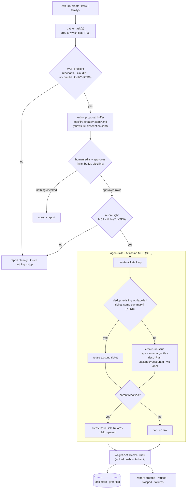
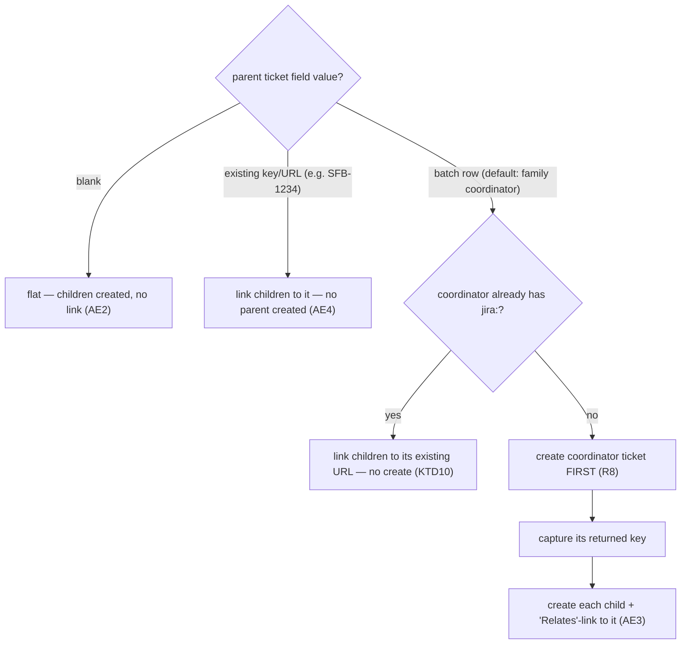

# Jira Ticket Interop - Plan

## Goal Capsule

- **Objective:** give the wb workbench easy, low-risk Jira interop — create SFB
  tickets from wb tasks (Phase 1), and pull sprint tickets into wb tasks
  (Phase 2) — so an idea broken into a task family can become real tickets, and
  assigned sprint work can become tasks, without leaving the workbench.
- **Product authority:** Jet (personal workflow tooling in `dotfiles`).
- **Authority hierarchy:** the fixed Product Contract governs *what* is built;
  this plan's Key Technical Decisions govern *how*. `wb.sh` and `/wb-breakdown`
  conventions override any generic pattern; Jet's in-session redirects override
  the plan.
- **Execution profile:** Phase 1 (emit) is implementation-ready and builds in
  U-ID order — U1 (the locked verb the skill depends on) first. Phase 2 (sprint
  pull) is a light sketch, not first-increment work, and does not gate Phase 1.
- **Stop conditions:** Phase 1 is done when the emit flow creates SFB tickets
  from a task or family through an approved buffer and stamps each `jira:` via
  the locked verb, with the guardrail test green. Surface a genuine blocker (MCP
  unavailable at run time, store-lock contention) rather than fabricating a Jira
  outcome.
- **Tail ownership:** normal repo flow — run the wb test suite, rerun
  `docgen.sh` after editing indexed sources, ship Phase 1 as its own PR with an
  HTML recap per the repo's PR-recap habit.
- **Open blockers:** none. Runtime dependency: the Atlassian MCP must be
  connected with `write:jira-work` at run time (it dropped mid-session and is
  not connected in the planning session either).

---

## Product Contract

*Product Contract unchanged from the requirements-only artifact, except the
"Deferred to planning" items under Outstanding Questions — now resolved in the
Planning Contract below. No product-scope change.*

### Summary

Add a `/wb-jira-create` skill that turns a wb task (or a `/wb-breakdown` family)
into new SFB tickets through a human-approved proposal buffer, writing each
created ticket's URL back into the task's `jira:` field. A Phase 2 companion
pulls the user's sprint tickets into wb tasks by reusing `/wb-breakdown`'s
existing ticket→task path.

### Problem Frame

Today the two systems are manually bridged. `/wb-breakdown` can turn one Jira
ticket into a task family, but the reverse — an idea scoped into tasks locally,
then filed as tickets for the team — is hand-work: copy each task's title and
plan into Jira's UI, one issue at a time, then paste the ticket URL back. The
same friction hits the other direction when sprint work assigned in Jira has to
be re-typed as tasks. The cost is double-entry and drift between the task store
and the team tracker.

### Key Decisions

- **Agent-side only; no new credential.** All Jira access goes through the
  already-authenticated Atlassian MCP (`createJiraIssue`,
  `searchJiraIssuesUsingJql`); bash never calls Jira, so nothing new is stored
  on the machine.
- **Reuse the `jira:` field for persistence.** A created ticket's URL lands in
  the existing frontmatter field — no cache, no new schema.
- **A new `/wb-jira-create` skill, not a step folded into `/wb-breakdown`.** It
  mirrors `/wb-breakdown`'s authoring→approve→apply pattern, runs on any
  task/family, and chains after a breakdown for the full idea→tickets motion.
- **Hierarchy via a generic issue-link to a chosen parent, not an Epic.** A
  single "parent ticket" field links children with a universal "Relates" link,
  sidestepping SFB's unknown epic-link configuration. Real Epic hierarchy is a
  later-phase upgrade.
- **Create-only.** Updating or transitioning existing tickets is out of scope.
- **Phased.** Phase 1 = emit (create tickets). Phase 2 = sprint pull (ingest).
  Phase 2 does not gate Phase 1.

### Actors

- A1. **User (Jet)** — invokes the skill, edits and approves the proposal
  buffer, owns the create decision.
- A2. **`/wb-jira-create`** — gathers the task(s), authors the proposal buffer,
  calls the MCP on approval, triggers the `jira:` write-back.
- A3. **Atlassian MCP / project SFB** — creates issues and issue-links under the
  granted `write:jira-work` scope.
- A4. **Task store (`~/code/tasks`)** — receives the `jira:` write-back through
  its locked write path.

### Key Flows

F1. **Emit — create tickets (Phase 1).**
- **Trigger:** `/wb-jira-create <task-or-family>` (or run after `/wb-breakdown`).
- Gather the task(s); drop any that already carry `jira:`.
- Author a proposal buffer in `logs/`: one row per ticket (type, summary,
  description preview) plus one "parent ticket" field for the run.
- User edits (flip a row's type, set/clear the parent) and approves.
- For each approved row, `createJiraIssue` in SFB; if a parent resolved, add a
  "Relates" issue-link; write each returned URL back into the task's `jira:`.
- Relay the MCP's actual results; never fabricate an outcome.

F2. **Sprint pull — ingest (Phase 2).**
- **Trigger:** the companion pull command.
- List the user's current-sprint SFB tickets via JQL (MCP).
- User picks which to convert.
- Each picked ticket runs through `/wb-breakdown`'s existing ticket→task path.

### Requirements

**Emit — creating tickets**
- R1. `/wb-jira-create` accepts a single task or a whole family and, for each
  task lacking a `jira:` value, creates one SFB issue via the Atlassian MCP.
- R2. Default issue type is Feature; each row's type is editable in the proposal
  buffer among SFB's types (Feature, Defect, Bug, Improvement, New Feature).
- R3. Each issue sends: summary = task title; description = the task's `## Plan`
  body; assignee = the user; a `wb` label. No other fields in v1.
- R4. On success, the created ticket's canonical URL is written into that task's
  `jira:` frontmatter via the task store's locked write path.

**Hierarchy — specifying a parent**
- R5. The proposal buffer carries one optional "parent ticket" field applied to
  every child created in the run.
- R6. The parent field resolves three ways: an existing ticket key/URL; a row in
  the current batch (default: the family's coordinator task, when one exists);
  or blank.
- R7. When a parent resolves, each created child is linked to it with a generic
  "Relates" issue-link; when blank, tickets are created flat with no linkage.
- R8. A batch-row parent is created before its children so its key exists to
  link against.

**Approval and safety**
- R9. The skill authors a proposal buffer in `logs/` and never writes to Jira or
  the task store on its own initiative, mirroring `/wb-breakdown`'s split.
- R10. Nothing is created in Jira until the user approves the buffer.
- R11. A task already carrying a `jira:` value is skipped and reported, never
  double-created.
- R12. The skill never updates, transitions, or edits existing tickets.

**Sprint pull — ingest (Phase 2)**
- R13. A companion flow lists the user's current-sprint SFB tickets via JQL and
  lets the user pick which to convert into wb tasks.
- R14. Each picked ticket is converted through `/wb-breakdown`'s existing
  ticket→task path, not a reimplementation.
- R15. Phase 2 is independent — Phase 1 (emit) ships without it.

### Acceptance Examples

- AE1. **Covers R11.** A family of three where one child already has `jira:` →
  the buffer proposes two tickets, the third is listed as skipped.
- AE2. **Covers R6, R7.** Parent field left blank → each task becomes a flat
  ticket, no issue-links created.
- AE3. **Covers R6, R7, R8.** Parent field set to the coordinator batch row →
  the coordinator ticket is created first, then each child is created and
  "Relates"-linked to it.
- AE4. **Covers R6, R7.** Parent field set to an existing `SFB-1234` → children
  are "Relates"-linked to `SFB-1234`; no parent ticket is created.

### Scope Boundaries

**Deferred to a later phase**
- Real Epic hierarchy (parent → Epic + epic-linked children) and the native
  `parent` field — the higher-fidelity upgrades that depend on SFB's project
  configuration. The "parent ticket" field is forward-compatible: the same value
  can later drive an epic-link with no buffer change.
- Phase 2 sprint pull is in this plan but not in the first shippable increment.

**Outside this feature's identity**
- Updating, transitioning, or editing existing tickets (create-only).
- Syncing Jira ticket state back onto the board (read-direction display).

### Dependencies / Assumptions

- The Atlassian MCP must be connected with `write:jira-work` (verified this
  session; it dropped mid-session, so it must be live at run time).
- A locked task-store write is required to set `jira:` on an existing task file,
  consistent with the concurrency-safety lock primitives (PR #22). Raw
  Edit/Write to the store is disallowed.
- Phase 2 depends on `/wb-breakdown`'s shipped ticket→task path (PR #29).
- Target project is SFB ("Software Features and Bugs"); its issue types are
  Feature, Defect, Epic, Improvement, Bug, New Feature — no Story, no Sub-task.

### Outstanding Questions

The three items the requirements-only artifact deferred to planning are now
resolved:

- **Locked write-back mechanism — RESOLVED.** A new dedicated `wb jira-set`
  verb, not an extension of `cmd_new --jira`. See KTD1 (Planning Contract) and
  U1.
- **`getIssueLinkTypes` (nicer directional link than "Relates") — RUNTIME
  CHECK.** The Atlassian MCP is disconnected in the planning session, so this
  cannot be probed now. v1 commits to the guaranteed-present symmetric "Relates"
  link; the probe is a documented run-time step. See KTD5 and U3.
- **SFB project style / epic-link field — DEFERRED to the Epic-hierarchy
  upgrade (later phase).** Not needed for v1's generic-link mechanism.

### Sources / Research

- `~/code/tasks/dossiers/dotfiles--feat-jira-integration/framing.html` — goal,
  settled foundations, the emit flow.
- `logs/decisions/2026-07-16-jira-emit-flow-scoping.md` / `.html` — trigger and
  field decisions.
- `docs/ideation/2026-07-16-jira-emit-hierarchy-ideation.html` — the
  parent-linkage mechanism and why generic issue-links beat Epic for v1.
- `claude/.claude/skills/wb-breakdown/SKILL.md` — the authoring→approve→apply
  pattern to mirror and the ticket→task path Phase 2 reuses.
- `scripts/.config/scripts/tmux/wb.sh` (`cmd_new --planned --jira`) and
  `~/code/tasks/README.md` (the `jira:` field) — the persistence primitive.

---

## Planning Contract

### Key Technical Decisions

- KTD1. **`jira:` write-back is a new dedicated `wb jira-set` verb, not an
  extension of `cmd_new --jira`.** `cmd_new`'s `--jira` path
  (`scripts/.config/scripts/tmux/wb.sh:965-974`) is a *creation-time seed*: it
  requires `--planned`, consumes stdin as a `## Plan` body, and exists to seed
  new worktree-less task files. The emit flow instead patches one frontmatter
  field on tasks that *already exist* (typically `doing`), so a creation verb is
  the wrong shape. The clean fit is a verb modeled on `cmd_reviewed`
  (`wb.sh:2363`) — resolve the task, take the guarded lock, set the field,
  release.
- KTD2. **Per-task locked write-back, one guarded lock per task — not a
  `breakdown`-style multi-file transaction.** Ticket creation happens agent-side
  over the MCP, so there is no all-in-one bash apply to wrap: bash cannot create
  the tickets. The skill calls `wb jira-set <stem> <url>` once per successfully
  created ticket, each call an independent `wb_task_lock_acquire_guarded`
  burst (`wb.sh:355`). If ticket N's creation fails mid-run, tickets 1..N-1 are
  already created and stamped — honest partial state with no rollback, which is
  correct because create-only tickets cannot be un-created. But `createJiraIssue`
  (agent) and `wb jira-set` (bash) are not one transaction: a ticket can be
  created and then its stamp fail — lock contention (a designed refuse path,
  U1), process death, or a mis-derived stem. So the task-file `jira:` field is
  not a sufficient double-create guard by itself; KTD8 adds the Jira-side
  backstop.
- KTD3. **The write-back is idempotent-or-refuse.** On an empty `jira:` the verb
  writes the URL. On an identical `jira:` it is a no-op success (safe retry after
  a partial failure). On a *different* non-empty `jira:` it fails loud and writes
  nothing — never clobbering an existing ticket link. This is defense-in-depth
  behind the skill's R11 skip: a double-emit bug fails safe instead of
  overwriting.
- KTD4. **The proposal buffer is an agent/human approval surface only; bash
  never parses it.** This is the deliberate divergence from `/wb-breakdown`,
  whose `wb breakdown --apply` parses its buffer and owns every write. Here the
  "creation" lives in Jira (MCP), so the only store write is the field stamp —
  `wb jira-set` owns that, and no new bash buffer-grammar/parser is introduced.
- KTD5. **Parent linkage uses the generic "Relates" issue-link
  (`createIssueLink`), config-independent and the most widely present.** `Epic`
  and native `parent` are deferred (SFB's project style is unknown and the MCP is
  down). Link types are admin-configurable instance state, so the flow must
  confirm rather than assume: when the MCP reconnects, `getIssueLinkTypes` for
  project SFB runs both to confirm a usable "Relates"-equivalent type actually
  exists and to check for a nicer directional type. If the probe returns no
  usable link type, the run skips linkage cleanly and reports flat tickets rather
  than failing each `createIssueLink`. The "parent ticket" field is
  forward-compatible with the later Epic upgrade with no buffer change.
- KTD6. **The URL is stored verbatim; the agent normalizes it.** `wb jira-set`
  writes exactly the string it is handed, matching `cmd_new --jira` and
  `~/code/tasks/README.md`'s "stored exactly as normalized when the task was
  created … never re-derived or rewritten once set."
- KTD7. **The skill reuses `/wb-breakdown`'s proven mechanics verbatim:** buffer
  under `logs/jira-create/`, the unresolved-buffer clobber refusal, the
  `tmux split-window` + per-invocation `wait-for` blocking open with
  `WB_REVIEW_BUFFER=1` (the conform.nvim format-on-save guard), and MCP
  fetch/preflight-before-write. Same shapes → same review posture.
- KTD8. **A Jira-side dedup precedes each create, backing up the `jira:` skip.**
  Because create-then-stamp is non-atomic (KTD2), a prior run can leave a real
  SFB ticket whose task never got stamped; the gather-time `jira:` skip (R11)
  would miss it and double-create in the shared tracker on retry. Before each
  `createJiraIssue`, the skill queries `searchJiraIssuesUsingJql` for an existing
  SFB issue carrying the `wb` label with the same summary, and on a hit reuses
  that ticket (stamps its URL back) instead of creating a second. The `jira:`
  field stays the fast-path skip; the JQL check is the correctness backstop on
  retry.
- KTD9. **The MCP preflight validates depth, and re-runs after approval.**
  Reachability alone is insufficient: the create loop needs a `cloudId` (via
  `getAccessibleAtlassianResources`, exactly as `/wb-breakdown` step 2b threads
  it into every call), the named tools present, and the current user's
  `accountId` — Jira Cloud takes `accountId`, not a name, for R3's assignee — all
  resolved once up front. Because the approval buffer is an unbounded wait during
  which the MCP has been observed to drop (Goal Capsule), the preflight re-runs
  immediately after approval and before the first `createJiraIssue`; the
  pre-buffer check is advisory.
- KTD10. **An already-ticketed batch-row parent resolves to its existing URL,
  never a re-create.** The default parent is the family coordinator (R6), and a
  coordinator seeded from a Jira ticket via `/wb-breakdown` normally already
  carries `jira:` — so it is skipped (R11) and R8's "create the parent first"
  cannot run. In that case the parent resolves through R6's existing-ticket-key
  path (children link to the coordinator's existing URL); no second coordinator
  ticket is created.

### High-Level Technical Design

The emit flow crosses four actors — the skill (agent), the human at the buffer,
the Atlassian MCP, and the locked bash verb writing the task store — with one
approval gate and a per-ticket create→link→write-back loop. The agent/bash
boundary matters: everything except `wb jira-set` and the store write is
agent-side.

Parent resolution is the one non-linear branch (R6–R8). The batch-row case
front-loads the coordinator's creation so its key exists before children link
to it.

### Assumptions

- The Atlassian MCP exposes `createJiraIssue`, `createIssueLink`,
  `searchJiraIssuesUsingJql`, and `getIssueLinkTypes` under the OAuth identity
  with `write:jira-work`. Not verifiable in the planning session (MCP down) — the
  skill preflights it and stops cleanly if absent.
- Every wb task carries a `# ` title and a `## Plan` section (the schema in
  `~/code/tasks/README.md`); the skill reads title→summary and `## Plan`→
  description.
- A family is a parent task plus its `parent:`-linked children.
  `_wb_resolve_task_fuzzy` (`wb.sh:1053`) resolves the single input stem;
  enumerating the children is a scan over `wb_task_files` matching
  `parent: <stem>` (the `wb_family_all_done` pattern, `wb.sh:194`), not the fuzzy
  matcher (which returns exactly one match or fails loud).
- Jira Cloud's create-issue call takes an `accountId` for assignee (R3) and a
  `cloudId` for the site; both are resolved in the MCP preflight (KTD9), not
  derivable offline. The MCP-returned ticket URL is shape-validated (expected
  Atlassian host + `SFB-<n>` key) before it is stamped, so a malformed or
  wrong-site string never lands in `jira:`.

### Sequencing

U1 (the verb) lands first — the skill in U2/U3 calls it. U2 (buffer) and U3
(orchestration) author one skill file and co-land, but split as separable
concerns (approval surface vs. emit flow). U4 (guardrail test + docs) closes
Phase 1. U5 (Phase 2) is independent and last.

---

## System-Wide Impact

- **Shared team tracker; create-only is convention, not a constraint.** Every
  emit writes into the shared SFB project and created tickets cannot be
  un-created. The create-only / never-transition guarantee (R12) is enforced by
  SKILL prose plus the U4 grep assertion, not a technical scope limit — the
  granted `write:jira-work` scope permits create/update/transition/delete across
  every project the OAuth identity can reach. The human-approval buffer is the
  primary gate, and it shows the full `## Plan` body that will be published (not
  a preview), so the approver sees exactly what lands in the shared tracker.
- **Untrusted ingested content (Phase 2).** The sprint-pull companion (U5) reads
  teammate-authored ticket text through `/wb-breakdown`. That text is untrusted
  input, not instructions — a prompt-injection surface to design against when
  Phase 2 is built, and a reason to keep the skill's MCP tool surface as narrow
  as the create-only posture allows.
- **No sandbox project.** The end-to-end verification gate writes real SFB
  tickets. A dry-run mode (author + resolve the buffer + report what *would* be
  created, calling no `createJiraIssue`) is the safe rehearsal for exercising the
  flow without touching the shared tracker.

---

## Implementation Units

### U1. `wb jira-set` — locked `jira:` write-back verb

- **Goal:** add one `wb` verb that stamps a created ticket's URL into an existing
  task's `jira:` field under the task-store lock — the only store write in the
  emit flow.
- **Requirements:** R4; safety net for R11.
- **Dependencies:** none.
- **Files:** `scripts/.config/scripts/tmux/wb.sh` (new `cmd_jira_set`; dispatch
  entry near `wb.sh:5568-5580`), `scripts/.config/scripts/tmux/tests/wb-jira-set.test.sh` (new).
- **Approach:** mirror `cmd_reviewed` (`wb.sh:2363`). Signature
  `wb jira-set <repo>--<slug> <url>`. Resolve the stem to
  `$TASKS_DIR/<stem>.md` exactly — fail loud if absent, the
  `wb_resolve_parent_ref` (`wb.sh:172`) pattern, not the fuzzy matcher, since the
  caller passes an exact stem. Require a non-empty `<url>`. Read the current
  `jira:` via `wb_get_frontmatter`: identical → no-op success; non-empty and
  different → fail loud naming the existing value, write nothing (KTD3); empty →
  proceed. The write is the `cmd_reviewed` sequence:
  `_wb_lock_trap_append_if_top_level wb_task_lock_release_all` →
  `wb_task_lock_acquire_guarded "$file" || exit $?` →
  `wb_set_frontmatter "$file" jira "$url"` → `wb_task_lock_release "$file"`.
  Store the URL verbatim (KTD6). Add `jira-set) shift; cmd_jira_set "$@" ;;` to
  the main dispatch case.
- **Patterns to follow:** `cmd_reviewed` (`wb.sh:2363`) for the locked
  single-field write; `cmd_new`'s `wb_set_frontmatter … jira` call
  (`wb.sh:966`); `wb_resolve_parent_ref` (`wb.sh:172`) for exact-stem resolution.
- **Execution note:** implement test-first — the lock / idempotency / refuse
  contract is exactly what the bash suite characterizes (see
  `tests/wb-pause.test.sh` and `tests/wb-lock-integration.test.sh` shapes).
- **Test scenarios** (`tests/wb-jira-set.test.sh`; fixture store with
  `TASKS_DIR` override, `source wb.sh; set +e` idiom per `tests/wb-pause.test.sh`):
  - Happy path: task with empty `jira:` → verb writes the URL; frontmatter reads
    back the exact string; exit 0; confirmation message names the task.
  - Idempotent re-run: same URL again → exit 0, field unchanged, no error.
  - Refuse-clobber: task with a *different* existing `jira:` → exit non-zero,
    field unchanged, message names the existing value. (Covers R11 safety net.)
  - Missing stem: `<repo>--<slug>` with no file → fail loud, zero files touched.
  - Empty/absent URL argument → usage error, exit non-zero, no write.
  - Field-insert: task file predating the `jira:` key (no `jira:` line) → verb
    inserts it before the closing `---` (exercises `wb_set_frontmatter`'s insert
    branch, `wb.sh:97`).
  - Lock contention: `jira:` write while a live holder owns the lock → verb
    refuses per `wb_task_lock_acquire_guarded` (mirror
    `tests/wb-lock-integration.test.sh`).
- **Verification:** `bash scripts/.config/scripts/tmux/tests/wb-jira-set.test.sh`
  all green; `wb jira-set` reachable from the dispatch; `shellcheck` clean on
  `wb.sh`.

### U2. `/wb-jira-create` — proposal buffer (grammar, authoring, approval)

- **Goal:** define the approval surface — the buffer grammar, the authoring
  step, the clobber refusal, the blocking open, and the parse-on-return contract.
- **Requirements:** R2, R5, R6, R9, R10; AE1 (skipped-task listing appears here).
- **Dependencies:** none — U2 authors the buffer only; the `wb jira-set` call
  lives in U3. (U2 and U3 co-land in one SKILL.md, which needs U1 transitively
  via U3.)
- **Files:** `claude/.claude/skills/wb-jira-create/SKILL.md` (new).
- **Approach:** mirror `/wb-breakdown`'s buffer sections
  (`claude/.claude/skills/wb-breakdown/SKILL.md`, steps 5–7). Buffer at
  `logs/jira-create/<stem>.md`. Grammar: one checkbox block per ticket-to-create
  carrying an editable `type:` (default `Feature`, among Feature/Defect/Bug/
  Improvement/New Feature — R2), the `summary` (task title), and the full
  description that will be sent — the entire `## Plan` body verbatim, shown in
  full (not a truncated preview) so the approver sees exactly what publishes to
  the shared tracker; a single run-level `Parent ticket:` field (blank | `SFB-1234` | a
  batch-row reference, default the family coordinator — R5, R6); and a read-only
  "skipped (already has jira:)" list (R11, AE1). Refuse to clobber an unresolved
  prior buffer (the `wb_reconcile_generate_review` guard `/wb-breakdown` cites).
  Open blocking with the `tmux split-window` + per-invocation `wait-for` channel
  and `WB_REVIEW_BUFFER=1` (conform.nvim guard), then end the turn. Parse on
  return: resolve inline notes / edited fields first; an all-unchecked close is a
  reported no-op that does not re-fire.
- **Patterns to follow:** `/wb-breakdown` SKILL steps 5 (author), 6 (blocking
  open), 7 (parse-on-return); `decision-buffer` SKILL for the auto-open recipe.
- **Test scenarios** (behavioral — enumerated in the SKILL's own "Test scenarios
  this skill must cover" section, per `/wb-breakdown`'s precedent; the one
  bash-enforceable assertion lives in U4):
  - Buffer lists one create-block per non-skipped task with `type: Feature`
    default and an editable type among the five SFB types.
  - A family with one already-ticketed child → that child appears only in the
    skipped list, never as a create-block (AE1).
  - `Parent ticket:` defaults to the family coordinator when the family has one;
    blank when a single standalone task is the input.
  - Unresolved-buffer refusal: re-invoking against a stem whose prior buffer
    still has a marker and an unchecked box relays a refusal, no overwrite.
  - All-unchecked close → reported no-op, no MCP calls, no re-open.
  - The buffer renders each ticket's full description (the verbatim `## Plan`
    body), not a truncated preview.
- **Verification:** the skill loads and lists in the skills catalog; a dry read
  shows a buffer grammar and blocking-open recipe matching `/wb-breakdown`'s.

### U3. `/wb-jira-create` — emit orchestration (MCP create, link, write-back, report)

- **Goal:** the emit flow itself — invocation and gathering, MCP preflight,
  ticket creation with parent linkage, the per-ticket `wb jira-set` write-back,
  and honest result reporting.
- **Requirements:** R1, R3, R4, R6, R7, R8, R11, R12; AE1–AE4.
- **Dependencies:** U1, U2.
- **Files:** `claude/.claude/skills/wb-jira-create/SKILL.md`.
- **Approach:** invocation `/wb-jira-create <task|family>` (plus "create tickets
  for this", "file these as SFB tickets", and the chains-after-`/wb-breakdown`
  phrasing); resolve a stem or a family with the existing conventions; gather
  each task's `# ` title and `## Plan` body. Scope guardrail stated explicitly:
  the ONLY store write this skill performs is via `wb jira-set` (U1) — it never
  Edits/Writes `~/code/tasks`, and never updates/transitions tickets (R12),
  mirroring `/wb-breakdown`'s D5 split. Drop tasks already carrying `jira:`
  (R11). MCP preflight before authoring (fetch-before-write, `/wb-breakdown`
  step 2b) resolving `cloudId` (via `getAccessibleAtlassianResources`), the
  current user's `accountId`, and the presence of the named tools — not just
  reachability (KTD9); if the MCP is unavailable, report and stop, touching
  nothing. After approval, re-run the preflight (the buffer wait is unbounded
  and the MCP can drop, KTD9) before any write. Order the creation by parent
  resolution (per the HTD parent-resolution diagram, R8): if the parent is a
  batch row not already ticketed, `createJiraIssue` for it first and capture its
  key; if that batch-row parent already carries `jira:` (the common coordinator
  case), resolve the parent to its existing ticket URL instead of creating one
  (KTD10). Then per approved row: dedup first — `searchJiraIssuesUsingJql` for an
  existing `wb`-labelled SFB issue with the same summary, reusing it on a hit
  (KTD8); otherwise `createJiraIssue` (projectKey SFB; `issueTypeName` from the
  row; `summary` = title; `description` = `## Plan` body; `assignee` = the
  resolved `accountId`; labels include `wb` — R3). If a parent resolved,
  `createIssueLink` type "Relates" child→parent (R7, KTD5). Validate the returned
  URL's shape (Atlassian host + `SFB-<n>`), derive the task's exact
  `<repo>--<slug>` stem from its resolved file (basename minus `.md`), and call
  `wb jira-set <stem> <url>` (R4). Relay the MCP's actual results and, on a
  mid-run failure, report which tickets were created/reused and stamped and which
  were not — never fabricate an outcome (KTD2). Record the `getIssueLinkTypes`
  runtime-check note (KTD5). Optionally archive the approved buffer to the task
  store's `dossiers/<stem>/`, mirroring `/wb-breakdown`.
- **Patterns to follow:** `/wb-breakdown` SKILL steps 2b (MCP fetch/preflight),
  8–9 (apply invocation shape and never-invent-an-outcome reporting); framing
  and ideation sources for the parent-linkage rationale.
- **Test scenarios** (behavioral — in the SKILL's own scenarios section):
  - Single standalone task, blank parent → one flat SFB ticket, no link, `jira:`
    stamped (AE2).
  - Family with coordinator as parent → coordinator ticket created first, each
    child created and "Relates"-linked to it, each `jira:` stamped (AE3).
  - Existing `SFB-1234` as parent → children "Relates"-linked to it, no parent
    ticket created (AE4).
  - Already-ticketed task in the batch → skipped and reported, never
    double-created (R11).
  - MCP-down preflight → clean stop, zero tickets, zero writes.
  - Mid-run MCP failure on ticket N → tickets 1..N-1 reported created+stamped,
    N reported failed; no rollback claimed (KTD2).
  - Coordinator parent already carries `jira:` → children link to its existing
    URL, no second coordinator ticket created (KTD10).
  - Retry after a create-then-stamp failure: a prior-run `wb`-labelled ticket
    with the same summary exists but the task was never stamped → the skill
    reuses it and stamps, never double-creates (KTD8).
  - MCP drops during the approval wait → the post-approval re-preflight catches
    it and stops before any `createJiraIssue` (KTD9).
  - A malformed or wrong-site MCP-returned URL → shape validation refuses the
    write-back, reports it, and leaves `jira:` unset.
  - The skill never emits an Edit/Write against `~/code/tasks` and never
    transitions/updates a ticket (R12) — asserted mechanically in U4.
- **Verification:** a dry read of the SKILL confirms every store write routes
  through `wb jira-set` and every Jira write is `createJiraIssue`/
  `createIssueLink` only; behavioral scenarios above are enumerated in the SKILL.

### U4. Guardrail test + user docs

- **Goal:** lock in the "skill never writes the store directly" invariant with a
  repo-level test, and document the new verb + skill for users.
- **Requirements:** R9, R12 (enforced); documentation completeness.
- **Dependencies:** U1, U2, U3.
- **Files:** `scripts/.config/scripts/tmux/tests/wb-jira-set.test.sh` (extend
  with the SKILL grep-assertion, or a sibling assertion block), `docs/wb-guide.md`
  (new `## wb jira-create` section), `~/code/tasks/README.md` (already documents
  the `jira:` field — extend only if the write path needs a mention).
- **Approach:** add a grep assertion — mirroring the precedent
  `tests/wb-breakdown.test.sh` established (its check that the SKILL contains no
  Edit/Write-tool instruction targeting `~/code/tasks`) — that
  `claude/.claude/skills/wb-jira-create/SKILL.md` contains no Edit/Write-to-store
  instruction and no ticket-update/transition instruction, so the only store
  write is `wb jira-set` and Jira access is create-only. Add a `## wb jira-create`
  section to `docs/wb-guide.md` next to the existing `## wb breakdown` section
  (`docs/wb-guide.md:213`): the emit motion, the buffer, the parent field, and
  the `wb jira-set` write-back. Rerun `docgen.sh` so `docs/wb-guide.html`,
  `INDEX.md`, and `/help` regenerate (never hand-edit generated `.html`/`INDEX`).
- **Patterns to follow:** `tests/wb-breakdown.test.sh`'s SKILL grep assertion;
  `docs/wb-guide.md`'s `## wb breakdown` section as the section template.
- **Test scenarios:**
  - Grep assertion fails if the SKILL gains an Edit/Write instruction targeting
    `~/code/tasks`, or an update/transition-ticket instruction.
  - `docgen.sh` run is idempotent (second run is a no-op), per the repo's
    docgen convention.
- **Verification:** the grep assertion passes against the authored SKILL;
  `docs/wb-guide.html` and `INDEX.md` regenerate cleanly; `/help "wb jira-create"`
  resolves.

### U5. Phase 2 — sprint-pull companion (light sketch)

- **Goal:** ingest direction — list the user's current-sprint SFB tickets and
  convert the chosen ones into wb tasks by reusing `/wb-breakdown`'s ticket→task
  path. Sketched, not first-increment.
- **Requirements:** R13, R14, R15.
- **Dependencies:** `/wb-breakdown`'s shipped ticket→task path (PR #29);
  independent of Phase 1 (R15).
- **Files:** a new companion skill (e.g.
  `claude/.claude/skills/wb-jira-pull/SKILL.md`) — shape to be settled when this
  phase is built.
- **Approach (directional, not specified):** a skill lists current-sprint SFB
  tickets via `searchJiraIssuesUsingJql` (MCP) with a current-sprint JQL; presents
  them for the user to pick; runs each picked ticket key/URL through
  `/wb-breakdown`'s existing ticket path (its step 2b — `getJiraIssue` → seeded
  `wb new --planned --jira` parent → optional split), never a reimplementation
  (R14). Because ingest is create-side in the store, it inherits
  `/wb-breakdown`'s locked-write guarantees for free; no new store-write verb is
  needed.
- **Execution note:** kept light per scope — resolve the JQL shape, the
  pick-surface, and whether pull auto-splits or only seeds when this phase is
  actually built. Full test scenarios are deferred to that build.
- **Test expectation:** none at this stage — Phase 2 is a sketch; test scenarios
  are authored when the companion is built. `/wb-breakdown`'s ticket→task path is
  already covered by `tests/wb-breakdown.test.sh`.

---

## Verification Contract

| Gate | Command / signal | Applies to |
|---|---|---|
| Verb unit tests | `bash scripts/.config/scripts/tmux/tests/wb-jira-set.test.sh` | U1, U4 |
| Skill store-write guardrail | grep assertion (in `wb-jira-set.test.sh`) that the SKILL has no Edit/Write to `~/code/tasks` and no ticket update/transition | U3, U4 |
| Shell lint | `shellcheck scripts/.config/scripts/tmux/wb.sh` clean | U1 |
| No regressions | the touched sibling suites still pass, e.g. `bash scripts/.config/scripts/tmux/tests/wb-breakdown.test.sh`, `bash scripts/.config/scripts/tmux/tests/wb-lock-integration.test.sh` | U1 |
| Docs regenerate | `docgen.sh` run is a clean no-op on second pass; `docs/wb-guide.html`, `INDEX.md`, `/help` reflect the new verb + skill | U4 |
| End-to-end emit (manual, MCP live) | on a two-task fixture family: buffer authored (full descriptions shown) → approved → two SFB tickets created → both `jira:` stamped → coordinator-parent "Relates" links present; a re-run of the same family creates no duplicates (KTD8 dedup) | U2, U3 |

The skill halves (U2, U3, U5) are agent-driven and not bash-unit-testable; their
behavioral scenarios live in the SKILL's own "Test scenarios this skill must
cover" section (the `/wb-breakdown` precedent), and the one mechanically
enforceable invariant is the U4 grep assertion. The end-to-end emit gate is a
manual run because it depends on the live Atlassian MCP.

---

## Definition of Done

**Global**
- Phase 1 emit works end-to-end: `/wb-jira-create` on a task or family authors a
  buffer, waits for approval, creates SFB tickets via the MCP with the resolved
  parent linkage, and stamps each `jira:` through `wb jira-set` — relaying actual
  MCP results.
- `wb jira-set` is the only store write in the flow and never clobbers an
  existing `jira:` (KTD3); the skill never Edits the store and never
  updates/transitions tickets (R12), enforced by the U4 assertion.
- The create path is retry-safe: a create-then-stamp failure cannot cause a
  double-create on re-run (Jira-side dedup, KTD8), and the MCP preflight
  (cloudId, accountId, tool presence) re-runs after approval (KTD9).
- All Verification Contract gates pass; `docgen.sh` re-run; no abandoned
  experimental code left in the diff.
- The `getIssueLinkTypes` runtime-check note is present in the skill so the
  "Relates" choice is revisited when the MCP is live.

**Per unit**
- U1: verb landed, all `wb-jira-set.test.sh` scenarios green, dispatch wired,
  shellcheck clean.
- U2: buffer grammar, clobber refusal, blocking open, and parse-on-return
  authored to match `/wb-breakdown`; behavioral scenarios enumerated in the SKILL.
- U3: MCP create + "Relates" linkage + per-ticket write-back + honest reporting
  authored; AE1–AE4 covered by the SKILL's scenarios; guardrail invariant holds.
- U4: grep assertion passing; `docs/wb-guide.md` section added and docs
  regenerated.
- U5: sprint-pull approach captured as a light sketch pointing at
  `/wb-breakdown`'s ticket→task path; no first-increment obligation.
