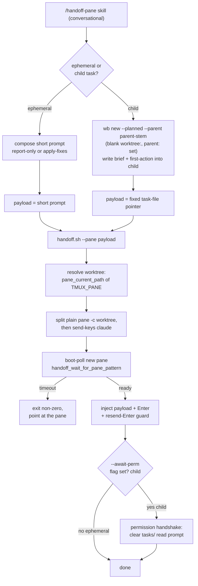

# Handoff pane mode - Plan

## Goal Capsule

- **Objective:** add a third handoff mode — a co-located `claude` agent in a
  **split pane of the current tmux window, sharing this session's worktree** —
  via a new `/handoff-pane` skill plus a `--pane` mode on
  `scripts/.config/scripts/tmux/handoff.sh`. This is the shape you reach for
  when you want a second agent to review or act on **uncommitted** changes in
  the worktree you're already in — something neither existing mode (switch to a
  live session; `wb new --agent` fresh worktree) can do.
- **Authority hierarchy:** this plan, then the resolved decision buffer
  (`logs/decisions/2026-07-19-handoff-pane-mode-scoping.md`, especially its
  `## Decisions made` block), then the task file
  (`~/code/tasks/dotfiles--feat-handoff-pane-mode.md`). One constraint sits
  above all three and is never renegotiated mid-build:
  `scripts/.config/scripts/tmux/wb.sh` is never modified.
- **Stop conditions:** if implementation pressure pushes toward editing
  `wb.sh`, building the pane-aware `wb done` detection (explicitly deferred —
  see Scope Boundaries), calling `wb_seed_planned_child` directly instead of
  the public locked `wb new --planned --parent` verb, or fan-out (multiple
  panes per invocation) — stop and flag rather than proceeding.
- **Execution profile:** solo personal repo, no CI, bash throughout. Tests are
  plain-bash assertions against real throwaway tmux sessions with plain-shell
  fixture panes (this repo's existing convention —
  `scripts/.config/scripts/tmux/tests/handoff.test.sh`,
  `scripts/.config/scripts/tmux/tests/handoff-poller.test.sh`), never mocked
  tmux and never a real `claude`
  process in the automated tests.
- **Tail ownership:** the implementer runs the new test file plus two live
  manual smoke walkthroughs (the ephemeral path end-to-end, then the
  child-task path) before calling the work done. Docs regenerate on commit
  (`.githooks/pre-commit` drives docgen) — no manual doc-build step.

---

## Product Contract

### Summary

Add `/handoff-pane`: a new skill (`claude/.claude/skills/handoff-pane/SKILL.md`)
plus a `--pane` mode on the existing `handoff.sh`. The skill owns the
conversational judgment — whether the helper is ephemeral or a tracked child
task, what prompt/context it carries, and what posture it takes toward the
shared worktree. The script's `--pane` branch is entirely mechanical — resolve
the invoking pane's worktree, split the current window, boot-poll the new
pane, inject the payload, and (only when the payload points at a `~/code/tasks`
file) clear the one-time read-permission prompt. `handoff.sh`'s existing
poller, injector, and permission-handshake helpers are reused in place;
`wb.sh` is never touched, and child-task seeding goes through the public
`wb new --planned --parent` verb.

### Problem Frame

Mid-session, you sometimes want a *second* agent looking at the work in your
*current* worktree — most concretely, to code-review changes you haven't
committed yet and either report or fix them. This surfaced live on 2026-07-19
in the `be--monorepo` customer-download-files session and had to be done by
hand: `tmux split-window -c <worktree>` then paste a prompt. Neither existing
`/handoff` mode fits — a fresh `wb new --agent` worktree is a clean checkout
that physically cannot see uncommitted changes, and switching to a live
session both abandons the requester's pane and points at a *different*
worktree. The missing primitive is "an agent in a split pane right here,
sharing this exact worktree."

### Requirements

**Invocation surface**

- R1. `/handoff-pane` is a **separate skill**, not a mode of the `/handoff`
  routing skill. `/handoff`'s conversational flow (repo/slug inference,
  task-file-as-payload, switch-vs-spawn) does not apply; a sibling skill keeps
  each legible and matches the existing `/wb-*` skill-family convention.
- R2. The **script** stays one file: `handoff.sh` gains a `--pane` mode that
  reuses its existing helpers in place — no second script, no duplication of
  the poller/injector/handshake, no premature helper extraction.
- R3. `scripts/.config/scripts/tmux/wb.sh` is never modified. Child-task
  seeding uses the public locked `wb new --planned --parent` verb; no direct
  call to `wb_seed_planned_child` (breakdown-internal) and no `wb.sh` edit.

**Pane spawn**

- R4. `--pane` spawns `claude` in a **new pane of the current tmux window**,
  with the new pane's working directory set to the **invoking pane's** worktree
  (`#{pane_current_path}` of `$TMUX_PANE`), so both agents share one worktree
  and the helper sees uncommitted changes.
- R5. The split is **horizontal** (side-by-side) by default, with the
  direction held in a single env-overridable constant so flipping to vertical
  is a one-line change, not a hard-coded literal.
- R6. Boot-readiness, injection, and the permission handshake reuse the
  existing `handoff_wait_for_pane_pattern`, the send-keys injector (single
  `-l` payload + separate `Enter` + the resend-Enter guard), and
  `handoff_permission_prompt_matches` — pointed at the new pane's id.

**Task binding (both modes supported)**

- R7. **Ephemeral binding:** no task file. The payload is a short one-line
  prompt (or a pointer to a scratch brief living in the worktree). No store
  entry, no `@task`, no lock contention with the parent by construction.
- R8. **Child-task binding:** a planned child task, created via
  `wb new --planned --parent <parent-stem> <repo> <slug>`, which seeds
  `status: planned`, `parent:` set, and a **blank `worktree:`** — so the child
  owns no worktree and its eventual `wb done` takes the store-only path,
  never removing the parent's worktree. The parent stem is the bare
  `<repo>--<slug>` form `--parent` requires (`wb_resolve_parent_ref`,
  `wb.sh:172-177`), derived as `basename "$(wb_session_task_file …)" .md` —
  not the task-file path `wb_session_task_file` returns. The payload is the
  same fixed task-file pointer `/handoff` already uses.
- R9. The invoker (the `/handoff-pane` skill, using conversational judgment)
  picks ephemeral vs child per call; when the current session has no resolvable
  `@task`, child binding is unavailable and the skill falls back to ephemeral
  (stating so).

**Concurrency posture**

- R10. The helper's posture toward the shared worktree is **invoker-chosen per
  call, never silent**: either report-only (default-safe, e.g.
  `/ce-code-review mode:agent`, no edits) or apply-fixes-with-the-parent-paused.
  The chosen posture is written into the helper's prompt/first-action, and the
  skill states which it chose and why.

**Lifecycle (documented, not enforced this PR)**

- R11. The `wb done` / shared-worktree interaction is **documented as a
  footgun**, not code-guarded this PR: `wb done` never enumerates panes, so
  `git worktree remove --force` can delete the shared worktree under a live
  helper pane, and `wb done --close` kills the whole session (the helper with
  it). Making `wb done` pane-aware is a deferred follow-up.

### Scope Boundaries

#### Deferred to Follow-Up Work

- **Pane-aware `wb done`** — a read-only check in `cmd_done` that warns when an
  extra `claude` pane is live in the session before teardown (reusing
  `tmux_claude_panes`). Deferred because it requires modifying `wb.sh`, which
  this PR does not touch; tracked as its own small, tested PR.
- **Cross-cutting "check for uncommitted work before acting" convention** — the
  real mitigation for the apply-fixes concurrency risk (KTD7) is a general
  agent-behavior rule: every agent verifies the worktree's uncommitted state
  before editing, so two agents sharing a worktree can't silently overwrite
  each other. This is cross-cutting (it governs all agents, not just pane
  helpers) and lives outside this PR — a separate workflow/instructions
  initiative. Until it exists, v1 apply-fixes stays convention-only with the
  risk documented (KTD7); the requester pausing the parent is the interim
  safety.
- **Fan-out** — more than one helper pane per invocation. Single-target only,
  same v1 boundary as `/handoff`.
- **Overview naming** — `claude-sessions.sh` already lists a helper pane (it
  enumerates panes), but under its pane title, not the wb task name
  (`lib.sh:106-108`). Giving a pane-mode helper a task-tied label in the
  overview is out of scope here.
- **Post-merge wiring** — any `~/.zshrc` alias and `stow` re-run so the new
  skill/script resolve from `~/.config/...`; the same manual post-merge step
  `/handoff` v1 already documented.

---

## Planning Contract

### Key Technical Decisions

- **KTD1 — Responsibility split: `handoff.sh --pane` is 100% mechanical; the
  skill owns everything conversational.** The script resolves the worktree,
  splits the pane, boot-polls, injects a payload string it is handed, and runs
  the permission handshake when the skill's explicit flag says to. It never
  touches the task store in pane mode. The skill decides ephemeral-vs-child,
  authors the prompt/context, seeds any child task, chooses posture, and
  composes the payload. This mirrors `/handoff` v1's split
  (`docs/plans/2026-07-11-001-feat-handoff-v1-plan.md`) and keeps the script
  mechanical — it is told whether to expect the handshake, never inferring
  binding shape from the payload itself.
- **KTD2 — Reuse helpers in place, no extraction.** `handoff.sh`'s helpers
  (`handoff_wait_for_pane_pattern` `handoff.sh:48`, the injector
  `handoff.sh:267-278`, `handoff_permission_prompt_matches` `handoff.sh:124`)
  are already target-parameterized. The `--pane` branch calls them with the
  new pane id. No new `pane.sh`; the run-guard boundary (`handoff.sh:136`)
  already makes the helpers sourceable if a future split is ever wanted.
- **KTD3 — Resolve the worktree from the invoking pane, not from repo/slug.**
  Every existing `handoff.sh` path derives paths from the passed `<repo>
  <slug>`. Pane mode has neither; it reads the invoking pane's cwd:
  `worktree="$(tmux display -p -t "$TMUX_PANE" '#{pane_current_path}')"`, then
  verifies it is a real git worktree (`git -C "$worktree" rev-parse
  --show-toplevel`) and fails loudly otherwise — a drifted cwd (the agent
  `cd`'d elsewhere earlier in the same long-lived shell) must never silently
  split into the wrong directory. `claude` is then started the way
  `wb_layout_session` (`wb.sh:800`) does — split a *plain* pane, then
  `send-keys -l 'claude'` + Enter into its interactive shell — never as a
  `split-window`-trailing command, which runs under `/bin/sh -c` (missing the
  interactive-shell PATH that puts `claude` on `$PATH`) and, with no
  `remain-on-exit` set, leaves no shell to diagnose a failed launch. This is
  the net-new mechanical primitive.
- **KTD4 — Child seeding via the public `wb new --planned --parent` verb.**
  The merged parent/child schema (PR #17) exposes
  `wb new --planned [--parent <stem>]` (`wb.sh:812` usage), which seeds a
  planned child with blank `worktree:` — exactly the safe, no-worktree record
  pane mode needs. The skill shells out to it; it never calls
  `wb_seed_planned_child` (breakdown-internal, unlocked) or edits `wb.sh`.
  `--parent` takes a bare `<repo>--<slug>` stem (`wb_resolve_parent_ref`,
  `wb.sh:172-177`), but `wb_session_task_file` returns the task-file *path* —
  so the skill derives the stem with `basename "$(wb_session_task_file …)" .md`
  before passing it, never the raw path.
- **KTD5 — Permission handshake gated by an explicit skill flag, not
  payload-sniffing.** The one-time `~/code/tasks` read prompt only fires for
  child binding (the payload is a task-file pointer); ephemeral prompts read
  only within the already-trusted worktree, so no outside-cwd prompt appears.
  Rather than have the script infer binding by string-matching the payload for
  the tasks-dir path — a fragile implicit contract where rewording a prompt
  silently flips behavior — the skill passes an explicit `--await-perm` flag
  for child binding, and the `--pane` branch runs the handshake iff that flag
  is set, skipping the ~20s permission-poll on the common ephemeral path. The
  handshake itself reuses `handoff_permission_prompt_matches`'s existing
  `~/code/tasks|Read` co-occurrence check.
- **KTD6 — Split direction is a flippable constant.** Default horizontal
  (`-h`, side-by-side, matching the decision-buffer precedent
  `SKILL.md:174`), held in an env-overridable variable
  (e.g. `HANDOFF_PANE_SPLIT="${HANDOFF_PANE_SPLIT:--h}"`) so `-v` is a
  one-word change, per the decision buffer's Decision 3.
- **KTD7 — Posture lives in the prompt, not the script.** Report-only vs
  apply-fixes is a property of the first-action/prompt text the skill writes,
  invoker-chosen per call. The script is posture-blind. Default report-only.
  Apply-fixes carries a sharp caution: the helper and the parent edit the
  shared worktree behind **no lock**, so if the parent is not actually idle,
  concurrent edits to the same file **silently overwrite each other's
  uncommitted work with no git recovery path**. The interim safety is the
  requester pausing the parent; the durable fix is the deferred cross-cutting
  "check for uncommitted work before acting" convention (see Scope Boundaries),
  not a handoff-pane-specific lock. v1 ships apply-fixes convention-only with
  this risk documented in the guide (U3).

### High-Level Technical Design



### Assumptions

- The Bash-tool subprocess that the `/handoff-pane` skill uses to invoke
  `handoff.sh --pane` inherits `$TMUX_PANE` pointing at the agent's own pane
  (confirmed this session: `TMUX_PANE` is set in the agent's environment), and
  that pane's `pane_current_path` is the worktree. If `$TMUX_PANE` is ever
  unset — or set but pointing at a pane whose cwd has drifted off the worktree
  (the agent `cd`'d elsewhere earlier in the same long-lived shell) — the
  script errors loudly: the unset case mirrors the existing `$TMUX` guard
  (`handoff.sh:149`), and the drift case is caught by the `git -C "$worktree"
  rev-parse` check in KTD3, rather than silently splitting the wrong window.
- A `claude` process launched in a fresh pane under an already-trusted
  `~/code/<repo>` worktree does not re-trigger the folder-trust prompt — the
  same assumption `/handoff` v1 verified for its spawn path; the boot poller's
  timeout is the safety net if it is ever wrong.
- `tmux split-window -P -F '#{pane_id}'` reliably returns the new pane's id for
  use as the injection/poll target — standard tmux behavior, exercised by the
  test fixtures against real throwaway sessions.

### Sequencing

U1 (script `--pane` mode) has no dependencies and is independently testable.
U2 (the skill) depends on U1 (its final step invokes `handoff.sh --pane`).
U3 (docs) depends on U1 and U2 being settled. Build U1 → U2 → U3.

---

## Implementation Units

### U1. `handoff.sh --pane` mode: flag parse, worktree resolution, pane spawn, inject, conditional handshake

**Goal:** the mechanical half — a `--pane` branch that resolves the invoking
pane's worktree, splits the current window, and carries the new pane to an
injected, permission-clear state, reusing the existing helpers.

**Requirements:** R2, R3 (no wb.sh touch), R4, R5, R6, and the script side of
R7/R8 (payload-agnostic injection) and R10 (posture-blind).

**Dependencies:** none.

**Files:**
- `scripts/.config/scripts/tmux/handoff.sh` (modified — new branch + arg parse)
- `scripts/.config/scripts/tmux/tests/handoff-pane.test.sh` (new)

**Approach:** relax the rigid `[ "$#" -ne 2 ]` gate (`handoff.sh:138-141`) to
recognize a `--pane` mode that takes a payload argument plus an optional
`--await-perm` flag (child binding, KTD5) instead of `<repo> <slug>` (split
direction is the `HANDOFF_PANE_SPLIT` env constant per KTD6 — never a
positional or flag); the two-positional switch/spawn path stays exactly as-is
when `--pane` is absent. In the `--pane` branch: require `$TMUX` and
`$TMUX_PANE` (loud error otherwise, mirroring `handoff.sh:149`); resolve
`worktree` from the invoking pane and verify it is a real git worktree (fail
loudly on drift, KTD3); split a *plain* pane (`split-window -h -t "$TMUX_PANE"
-c "$worktree" -P -F '#{pane_id}'`, no trailing command) capturing the new
pane id, then `send-keys -t "$pane" -l 'claude'` + a separate `Enter` to launch
the agent in its interactive shell (mirroring `wb_layout_session` `wb.sh:800`,
KTD3); reuse `handoff_wait_for_pane_pattern` for boot-readiness (same anchor
set, `handoff.sh:258`); inject the payload as one `send-keys -l` call + a
separate `Enter` + the existing resend-Enter guard (`handoff.sh:267-278`); then
run the permission handshake **only when `--await-perm` was passed** (child
binding, KTD5), reusing `handoff_permission_prompt_matches`.
Emit one-line outcome messages in the same verbatim style as the switch/spawn
paths (spawned-pane-and-injected / cleared-permission / boot-timeout /
no-permission-seen). No task-store writes and no task-file lock in this branch.

**Technical design (directional, not implementation spec):**

```bash
# directional sketch — the --pane branch, alongside the existing switch/spawn
HANDOFF_PANE_SPLIT="${HANDOFF_PANE_SPLIT:--h}"   # KTD6: flippable
if [ "$mode" = "pane" ]; then
  [ -n "${TMUX_PANE:-}" ] || { echo "handoff: --pane needs \$TMUX_PANE" >&2; exit 1; }
  worktree="$(tmux display -p -t "$TMUX_PANE" '#{pane_current_path}')"
  git -C "$worktree" rev-parse --show-toplevel >/dev/null 2>&1 \
    || { echo "handoff: $worktree is not a git worktree — refusing to split" >&2; exit 1; }
  # plain pane, then launch claude in its interactive shell (KTD3) — never a
  # split-window-trailing 'claude' (that runs under /bin/sh -c: wrong PATH,
  # and no shell survives a failed launch)
  pane="$(tmux split-window "$HANDOFF_PANE_SPLIT" -t "$TMUX_PANE" \
          -c "$worktree" -P -F '#{pane_id}')"
  tmux send-keys -t "$pane" -l claude; tmux send-keys -t "$pane" Enter
  handoff_wait_for_pane_pattern "$pane" "$HANDOFF_BOOT_TIMEOUT" \
    '\? for shortcuts|Try "|[0-9]+% ctx' >/dev/null || { …boot timeout… ; exit 1; }
  tmux send-keys -t "$pane" -l "$payload"; tmux send-keys -t "$pane" Enter
  sleep 1; tmux send-keys -t "$pane" Enter                 # resend-Enter guard
  [ "${await_perm:-0}" = 1 ] && { …run permission handshake… ; }   # KTD5: child only
fi
```

**Patterns to follow:** the switch/spawn branch structure and verbatim outcome
messages (`handoff.sh:190-294`); the `$TMUX` guard (`handoff.sh:149-152`); the
decision-buffer split-window shape (`claude/.claude/skills/decision-buffer/SKILL.md:174`);
the plain-bash test harness in
`scripts/.config/scripts/tmux/tests/handoff.test.sh` and
`scripts/.config/scripts/tmux/tests/handoff-poller.test.sh` (source-with-guard,
`assert()`, real throwaway tmux sessions, plain-shell fixture panes).

**Test scenarios:**
- Flag parsing: `handoff.sh --pane "some prompt"` enters the pane branch;
  `handoff.sh <repo> <slug>` (no `--pane`) still enters the switch/spawn path
  unchanged (regression); `handoff.sh` with no recognizable args errors with a
  usage message.
- Worktree resolution: in a throwaway tmux session whose fixture pane is
  cwd'd to a temp dir, the pane branch resolves that dir and the newly split
  pane's `pane_current_path` equals it.
- Split + capture: invoking the pane branch increases the window's pane count
  by exactly one and returns a non-empty `#{pane_id}` used as the target.
- Split mechanism (KTD3): the pane is split with **no trailing command** and
  `claude` is launched by a subsequent `send-keys -l claude` + `Enter` — assert
  the split-window invocation carries no command argument and that the pane's
  shell survives when the launched command exits fast (a fixture that runs a
  quick-exiting command leaves the pane's shell alive, not a closed pane).
- Split direction: `HANDOFF_PANE_SPLIT=-v` produces a vertical split; default
  is horizontal.
- Worktree-drift guard (KTD3): when the invoking pane's cwd is not inside a git
  worktree, the pane branch errors loudly and does **not** split.
- Injection shape: the payload reaches the new pane as one `send-keys -l` call
  followed by a **separate** `Enter` (never a single call with an embedded
  newline); assert against a fixture pane running a shell that echoes input.
- Handshake gating (KTD5): `--pane --await-perm <payload>` drives the script
  into the permission-handshake poll; `--pane <payload>` (no flag) does **not**
  enter it (assert the ephemeral path does not block for
  `HANDOFF_PERMISSION_TIMEOUT` — use a short timeout override to keep the test
  fast). Gating is on the explicit flag, never on payload content.
- R7/`/model` regression: across every pane-branch scenario, the script never
  sends the literal string `/model` to the new pane.
- Guard: `--pane` with `$TMUX_PANE` unset errors loudly and does not split.
- Boot timeout: a fixture pane that never emits a boot anchor makes the branch
  exit non-zero pointing at the pane, within a short overridden timeout.

**Verification:** `bash -n scripts/.config/scripts/tmux/handoff.sh` passes;
`bash scripts/.config/scripts/tmux/tests/handoff-pane.test.sh` passes; the
existing `scripts/.config/scripts/tmux/tests/handoff.test.sh` and
`scripts/.config/scripts/tmux/tests/handoff-poller.test.sh` still pass (no
regression to switch/spawn).

---

### U2. `/handoff-pane` skill: binding choice, child seeding, posture, invocation

**Goal:** the conversational half — decide ephemeral vs child, author the
prompt/context and (for child) the task record, choose posture, and invoke
`handoff.sh --pane`.

**Requirements:** R1, R7, R8, R9, R10; and R3 at the skill level (child seeding
via `wb new --planned --parent` only).

**Dependencies:** U1.

**Files:**
- `claude/.claude/skills/handoff-pane/SKILL.md` (new)

**Approach:** document the steps as agent guidance, not code. (1) Decide
**binding**: ephemeral when the helper is a throwaway (review this worktree,
a quick spike, a second pair of eyes) with no need for a store record; child
when a tracked, durable record is wanted. (2) Decide **posture** (R10):
default report-only (e.g. `/ce-code-review mode:agent`, no edits); apply-fixes
only when the user asks and accepts pausing the parent — state which was chosen
and why, never silently. (3) **Ephemeral path:** compose a short one-line
prompt carrying the posture; the payload is that prompt, invoked **without**
`--await-perm` (no tasks/ read, so no handshake). (4) **Child path:** resolve
the parent stem from the current session's `@task` — `wb_session_task_file`
(against `tmux display -p '#S'`) returns the task-file *path*, so take
`basename … .md` to get the bare `<repo>--<slug>` stem `wb new --parent`
requires (`wb_resolve_parent_ref`, `wb.sh:172-177`); if none resolves, fall
back to ephemeral and say so (R9). Otherwise create the child via
`wb new --planned --parent <parent-stem> <repo> <child-slug>`, write the review
brief + a first-action line into the child task file (following `/handoff`'s
task-file-authoring conventions and its `## Follow-ups`-heading safeguard), and
set the payload to the fixed pointer `"Read the task file at <child_task_file>
- it carries the full context and states the first action to take."` (5) Invoke
`handoff.sh --pane "<payload>"` — adding `--await-perm` on the child path so the
script clears the one-time tasks/ read prompt (KTD5) — and relay its verbatim
outcome line back to the user. (6) Surface the lifecycle footgun
(R11) once, briefly, when a helper pane is left live.

**Patterns to follow:** `claude/.claude/skills/handoff/SKILL.md` for skill
shape, the fixed-pointer string, the `## Follow-ups`-heading safeguard, and the
"state the first action, never silent" conventions; the `/wb-*` sibling skills
for the family naming and tone; `wb.sh:812` for the exact
`wb new --planned --parent` usage string.

**Test scenarios:** none — this unit is agent-instruction prose. Its
correctness is verified by the manual smoke walkthroughs in the Verification
Contract and by re-reading the skill against R1/R7/R8/R9/R10.

**Verification:** a live `/handoff-pane` invocation from a real wb session runs
the full skill → `handoff.sh --pane` chain for both bindings (see Verification
Contract).

---

### U3. Docs: handoff guide + roadmap sequencing

**Goal:** document pane mode where `/handoff` is already documented, including
the lifecycle footgun and the deferred pane-aware `wb done` follow-up.

**Requirements:** R11 (documentation of the footgun); documentation of R1–R10.

**Dependencies:** U1, U2.

**Files:**
- `docs/handoff-guide.md` (modified — add a pane-mode section)
- `docs/roadmap-handoff.md` (modified — sequencing + deferred follow-up)

**Approach:** add a pane-mode section to `docs/handoff-guide.md` covering the
two bindings (ephemeral vs child), the two postures (report-only vs
apply-fixes — and the sharp apply-fixes warning from KTD7: with the parent not
paused, concurrent edits silently overwrite uncommitted work with no git
recovery, so pause the parent), and the **lifecycle footgun**:
close a helper pane before `wb done --close` (it kills the whole session);
`worktree remove` deletes the shared worktree under a live pane; uncommitted
helper changes make `wb done` refuse (the dirty guard — a feature, not a bug).
Update `docs/roadmap-handoff.md`'s sequencing to record pane mode as built and
list pane-aware `wb done` as the deferred follow-up. No manual docgen step —
`.githooks/pre-commit` regenerates the `.html` on commit.

**Patterns to follow:** the existing `docs/handoff-guide.md` structure and its
frontmatter; `docs/roadmap-handoff.md`'s sequencing section shape.

**Test scenarios:** none — documentation only.

**Verification:** `git commit` triggers `.githooks/pre-commit`; confirm
`docs/handoff-guide.html` and `docs/INDEX.md` regenerate without error and the
pane-mode content is reachable from the Hub/INDEX.

---

## Verification Contract

| Command / check | Applies to | Gate |
|---|---|---|
| `bash -n scripts/.config/scripts/tmux/handoff.sh` | U1 | Syntax check, exits 0 |
| `bash scripts/.config/scripts/tmux/tests/handoff-pane.test.sh` | U1 | All assertions pass, including the handshake-inference and `/model` regressions |
| `bash scripts/.config/scripts/tmux/tests/handoff.test.sh` + `bash scripts/.config/scripts/tmux/tests/handoff-poller.test.sh` | U1 | Still pass — no regression to switch/spawn |
| Manual smoke: ephemeral path from a live wb session | U1, U2 | A pane splits in the current window, `claude` boots, the report-only prompt injects, the helper sees the worktree's uncommitted changes |
| Manual smoke: child path from a live wb session | U1, U2 | `wb new --planned --parent` creates a child (`parent:` set, `worktree:` blank), the pane splits, the pointer injects, the tasks/ permission prompt clears, the child agent reads the child task file |
| Lifecycle check: `wb done` behavior with a live helper pane | U3 | Dirty guard refuses if the helper left uncommitted changes; `--close` kills the pane — confirmed matches the documented footgun |
| `git commit` (triggers `.githooks/pre-commit`) | U3 | `docs/handoff-guide.html` + `docs/INDEX.md` regenerate cleanly |

## Definition of Done

- All three implementation units complete; every test scenario has a passing
  assertion or a documented manual-verification step.
- `wb.sh` has zero diff — `git diff --stat` against this branch shows no
  changes to `scripts/.config/scripts/tmux/wb.sh`.
- The existing switch/spawn paths are unregressed
  (`scripts/.config/scripts/tmux/tests/handoff.test.sh` and
  `scripts/.config/scripts/tmux/tests/handoff-poller.test.sh` pass unchanged).
- Both manual smoke walkthroughs (ephemeral, then child) completed once, live,
  by the implementer — not just the automated tests.
- Child binding is proven to leave `worktree:` blank and to close store-only
  (a `wb done` on the child never removes the parent's worktree).
- `docs/roadmap-handoff.md` records pane mode as built and pane-aware
  `wb done` as the deferred follow-up.
- No dead-end code from an abandoned approach left in the diff; the split
  direction is a single flippable constant, not a scattered literal.
- Post-merge follow-ups (zsh alias, `stow` re-run) are recorded in the task
  file's `## Follow-ups` where the next person will see them.
