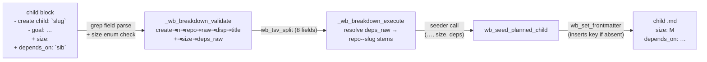

# feat: Capture `size:` + `depends_on:` at wb-breakdown apply-time

**Target repo:** dotfiles (this worktree). All paths repo-relative.

Product Contract preservation: N/A — solo plan bootstrapped from the task
file's `## Decisions` record (decision buffer `logs/decisions/2026-08-26-size-depends-capture.md`, 2026-08-26). Every design fork was resolved with the
user in that buffer; this plan is the HOW.

---

## Summary

Let a `/wb-breakdown` proposal buffer set each child's rough `size: S|M|L|XL`
and its `depends_on:` blockers, and have `wb breakdown --apply` write both into
the new child's frontmatter. Add the brand-new `size:` field to the schema, and
add a `--size` flag to `wb new` so size is settable on every creation path
(mirroring the already-present `--depends-on`).

Children `family-dag-view-render` (the DAG/roadmap board view) and
`family-dag-view-critical-path` (tier-staging skill) consume these fields;
adoption is near-zero today, so reliable capture must land first.

---

## Problem Frame

The wider family plan needs two per-task signals — a rough size and an explicit
dependency edge set — to render a DAG and compute a critical path. Verified
current state in the worktree:

- **`depends_on:` is already fully built on the `wb new` path.** `cmd_new` has a
  repeatable, validated `--depends-on` flag
  (`scripts/.config/scripts/tmux/wb.sh:865,948,958`); `wb_seed_task` writes it
  (`wb.sh:624`); the board consumes it (`wb_board_parse_deps`, `DEPS_OF`, cycle +
  blocking detection at `wb.sh:3307,3943,4052`). `TEMPLATE.md`/`README.md` carry
  the key.
- **`size:` exists nowhere** — not in `TEMPLATE.md`, not in `wb.sh`.
- **The breakdown apply path carries neither field.** `wb_seed_planned_child`
  (`wb.sh:751`) takes only `(repo, slug, parent, title)`; the buffer grammar has
  only `create child:` + `- goal:` lines (`claude/.claude/skills/wb-breakdown/SKILL.md` §5); `_wb_breakdown_validate` emits a 6-field TSV `create` row
  (`wb.sh:1877`) that `_wb_breakdown_execute` reads verbatim (`wb.sh:2153`).

So the work is narrow: thread two values through the breakdown apply path, add
the `size:` field to the schema and to `wb new`, and document the buffer grammar.
`depends_on:` needs no new board/`wb new` work.

---

## Requirements

- **R1** — The breakdown buffer's per-child grammar can carry a `size:` and a
  `depends_on:` value, edited by a human before apply.
- **R2** — `wb breakdown --apply` writes both into each created child's
  frontmatter.
- **R3** — `size:` values are validated against the `S|M|L|XL` enum; empty is
  allowed and means "unset" (reads as `M`).
- **R4** — `depends_on:` in the buffer uses raw sibling slugs, resolved to
  `<repo>--<sanitize(slug)>` at apply, with no hard existence check (same-apply
  siblings needn't be seeded yet; the board already fails open on dangling
  refs). Full `<repo>--<slug>` stems are accepted verbatim for cross-repo/
  external deps.
- **R5** — The authoring skill emits both bullets on every child block but
  leaves their **values blank** unless the child's own plan/goal already states
  a clear basis (explicit effort → size; explicitly-named dependency →
  depends_on). No blind `M`, no predecessor chain.
- **R6** — `size:` is added to `TEMPLATE.md`; readers treat absent/blank as `M`;
  existing task files are **not** backfilled (matches the README Grandfathering
  precedent).
- **R7** — `wb new` gains a validated `--size S|M|L|XL` flag threaded through
  `wb_seed_task`.
- **R8** — Existing breakdown behavior (create/migrate/move/plan-rewrite,
  idempotent re-apply, all hard/item-level validation) is unchanged; a buffer
  with no `size:`/`depends_on:` bullets still applies exactly as today.

Traceability to the decision record: R1/R4→D1,D2 · R3/R4→D2 · R5→D3 · R6→D4A ·
R7→D4C.

---

## High-Level Technical Design

Both new values ride the existing buffer → validator → flat-TSV → seeder →
frontmatter pipeline. The validator stays the single choke point that parses and
validates; the flat TSV `create` row grows from 6 to 8 fields; the seeder gains
two params. Green = added this task.



Design notes (directional, not implementation spec):

- **Field parse** mirrors the existing `- goal:` extraction
  (`grep -oP '^\s*-\s+<key>:\s*\K.*'`, `wb.sh:1852`).
- **Size enum** is checked in one shared spot the validator and `cmd_new` both
  call — e.g. a tiny `_wb_valid_size` helper matching `^(S|M|L|XL)$` or empty.
- **Dep resolution** (execute-side): split `deps_raw` on commas; per token strip
  backticks/whitespace; a token containing `--` is a full stem, kept verbatim; a
  bare token is prefixed `<child-repo>--<wb_sanitize(token)>`; re-join with
  commas. No existence check (R4). Optional, non-blocking: warn to stderr on a
  resolved dep matching neither a same-buffer sibling nor an existing file.
- **TSV trailing-empty safety**: with `size`/`deps` empty the row ends in empty
  fields; `wb_tsv_split` (`wb.sh:253`) must yield them as empty strings, and the
  seeder must treat empty as "write blank". Confirm splitter behavior on trailing
  empties in U3/U4 tests rather than assuming it.

---

## Key Technical Decisions

- **KTD1 (D1) — sibling bullets, not marker attrs.** `size:`/`depends_on:` are
  human-tunable content, so they go as `- size:` / `- depends_on:` bullets next
  to `- goal:`, parsed the identical field-grep way. Not folded into the
  structural `<!-- wb-breakdown: block=… -->` marker (hand-edit-hostile; the PR
  #27 mangling class the `WB_REVIEW_BUFFER=1` guard exists to prevent) and not
  onto the strict-parse `create child:` line.
- **KTD2 (D2) — raw slugs, resolve at apply, fail-open.** Matches the existing
  migrate/move target convention (`wb.sh:1891,1929`) and leans on the board's
  built-in fail-open handling (`README.md:64`, `wb.sh:3350`) rather than
  duplicating `wb new`'s stricter pre-existence check, which would be wrong for
  same-apply siblings.
- **KTD3 (D3) — blank-unless-verified pre-fill.** Bullets always present
  (discoverable, one keystroke to fill); values blank unless the child's own
  plan/goal states a clear basis. Blank `size:` reads as `M` at load, so
  blank-by-default costs nothing and avoids manufacturing false precision. This
  overrode the buffer doc's own recommendation per the user's note.
- **KTD4 (D4A) — no backfill.** Add `size:` to `TEMPLATE.md`, extend README
  Grandfathering, treat absent/blank as `M`. `wb_set_frontmatter` already inserts
  a missing key on demand, and a bulk stamp of the read-time default across a
  concurrently-written store is pure churn.
- **KTD5 (D4C) — `wb new --size`.** The seeder is being touched anyway; a
  validated `--size` on `cmd_new` removes the odd asymmetry where `wb new` sets
  `depends_on` but not `size`, and makes the consumer fields populatable on every
  creation path.

---

## Implementation Units

### U1. Add `size:` to the schema

**Goal:** introduce the `size:` frontmatter key and document its semantics.
**Requirements:** R6.
**Dependencies:** none.
**Files:**
- `~/code/tasks/TEMPLATE.md` (add `size:` line — place immediately after
  `depends_on:`, grouping it with the other graph/planning fields)
- `~/code/tasks/README.md` (frontmatter example block; new short "Size"
  subsection near "Dependencies"; extend the "Grandfathering" paragraph to name
  `size:` alongside `path:`/`depends_on:`)
- `scripts/.config/scripts/tmux/tests/wb-breakdown.test.sh:40` (the inline
  TEMPLATE fixture hardcoded in the test harness — add `size:` so seeder tests
  assert against a fixture that mirrors the real template)

> Note: `TEMPLATE.md`/`README.md` live in the `~/code/tasks` store, not the
> dotfiles repo. They are edited directly (not via a wb verb); this is schema
> documentation, the one place a task edits the store's template rather than a
> task file.

**Approach:** documentation + template only. Define the read-time default (`M`)
in prose so downstream consumers (children 2/5) have a canonical rule to code
against. No code reads `size:` yet in this task.
**Patterns to follow:** the existing `depends_on:` schema entry and its
"Dependencies" subsection (`README.md:31,58`); the Grandfathering paragraph
(`README.md:68`).
**Test scenarios:** `Test expectation: none — documentation + template constant.`
Correctness is exercised transitively by U2's seeder tests reading the updated
fixture.
**Verification:** `TEMPLATE.md` carries a blank `size:` line; README's schema
block, a Size subsection, and the Grandfathering paragraph all name `size:`.

### U2. Extend `wb_seed_planned_child` to write `size:` + `depends_on:`

**Goal:** the breakdown child seeder accepts and persists both new fields.
**Requirements:** R2, R4 (write side).
**Dependencies:** U1.
**Files:** `scripts/.config/scripts/tmux/wb.sh` (`wb_seed_planned_child`, ~L751);
`scripts/.config/scripts/tmux/tests/wb-breakdown.test.sh` (extend the U1 seeder
test block, ~L57-105).
**Approach:** add two trailing optional params — `size` (5th) and `depends_on`
(6th, already comma-joined + resolved by the caller) — after `title`. Keeping
them trailing and optional preserves every existing 3/4-arg call. After the
existing template/plan-body seed, write each via `wb_set_frontmatter` **only when
non-empty**, so an unset value leaves the template's blank line intact (and blank
`size:` reads as `M`). Do not route these through `awk -v` — `wb_set_frontmatter`
is the established post-seed field writer here.
**Patterns to follow:** `wb_seed_task`'s "explicit wins, otherwise leave blank"
handling of `path:`/`depends_on:` (`wb.sh:619-628`); the existing `title` param
default (`wb.sh:753`).
**Test scenarios:**
- Happy: seed with `size=L` → child frontmatter `size: L`.
- Happy: seed with `depends_on=proj--a,proj--b` → child frontmatter carries that
  exact comma-joined value.
- Edge: seed with empty `size` and empty `depends_on` → both keys present but
  blank (template lines untouched); no spurious values.
- Edge: seed with `size=L` but empty `depends_on` → size set, depends_on blank.
- Regression: the existing 3-arg and 4-arg (`title`-only) calls still produce
  identical output (status planned, blank worktree, branch=raw slug, parent set).
**Verification:** `bash tests/wb-breakdown.test.sh` U1 block passes with the new
assertions; the existing seeder assertions are unchanged.

### U3. Parse + validate the new bullets in `_wb_breakdown_validate`; widen the TSV row

**Goal:** the validator reads `- size:`/`- depends_on:` from each child block,
enforces the size enum, and emits both on the `create` action row.
**Requirements:** R1, R3, R4 (parse/validate side), R8.
**Dependencies:** none (row shape is consumed by U4).
**Files:** `scripts/.config/scripts/tmux/wb.sh` (`_wb_breakdown_validate`
~L1719-1878; add a shared `_wb_valid_size` helper near the other `_wb_bd_*`
helpers ~L1657); `scripts/.config/scripts/tmux/tests/wb-breakdown.test.sh`.
**Approach:** in the per-child item-level loop where `title` is already extracted
(`wb.sh:1852`), extract `size` and `depends_on` with the same field-grep. If a
non-empty `size` fails the `S|M|L|XL` enum, treat it as a **hard parse error**
(`return 2`, whole-apply abort) — consistent with the block's other structural
guards, and named clearly (`child n=N size '<v>' is not one of S|M|L|XL`).
Extend the emitted `create` row from 6 to 8 tab fields:
`create⇥n⇥repo⇥raw_slug⇥disp_slug⇥title⇥size⇥deps_raw`, where `deps_raw` is the
raw (unresolved, still-backticked) depends_on string — resolution happens in U4.
**Technical design (directional):**
```
size="$(printf '%s' "$b" | grep -oP '^\s*-\s+size:\s*\K.*' | head -1)"
deps="$(printf '%s' "$b" | grep -oP '^\s*-\s+depends_on:\s*\K.*' | head -1)"
[ -z "$size" ] || _wb_valid_size "$size" || { echo "... not one of S|M|L|XL" >&2; return 2; }
printf 'create\t%s\t%s\t%s\t%s\t%s\t%s\t%s\n' "$n" "$repo" "$raw" "$disp" "$title" "$size" "$deps"
```
**Patterns to follow:** the existing `title` extraction and the 6-field `printf`
(`wb.sh:1852,1877`); the hard-error `return 2` convention used for slug/repo
checks (`wb.sh:1780-1806`); `_wb_bd_*` helper style (`wb.sh:1657`).
**Test scenarios:**
- Happy: a child block with `- size: L` and `- depends_on: \`feat-a\`, \`feat-b\``
  → validate stdout `create` row has 8 fields with `L` and the raw dep string.
- Edge: block with neither bullet → row still has 8 fields, last two empty; no error.
- Edge: block with `- size:` present but blank → size field empty, no error.
- Error: `- size: XXL` (or `medium`) → hard abort, `return 2`, nothing written,
  clear message naming the child.
- Error: `- size: l` (lowercase) — decide + assert: reject (enum is uppercase)
  OR normalize. Plan default: reject, keep the enum strict and uppercase.
- Regression: an old-style buffer (no new bullets) validates and emits exactly as
  the pre-change tests expect apart from the two new trailing empty fields.
**Verification:** validate-only tests assert the widened row and the enum abort;
existing validate tests pass (updated for the two trailing fields).

### U4. Thread the widened row through `_wb_breakdown_execute` into the seeder

**Goal:** execute reads the 8-field row, resolves `deps_raw` to real stems, and
passes `size` + resolved `depends_on` to the seeder.
**Requirements:** R2, R4 (resolution side).
**Dependencies:** U2, U3.
**Files:** `scripts/.config/scripts/tmux/wb.sh` (`_wb_breakdown_execute`
~L2148-2162); `scripts/.config/scripts/tmux/tests/wb-breakdown.test.sh`.
**Approach:** widen the `wb_tsv_split` field read (`f[6]=size`, `f[7]=deps_raw`).
Resolve `deps_raw` → a comma-joined stem list: split on commas; per token strip
backticks + surrounding whitespace; skip empties; a token containing `--` is a
full stem kept verbatim; a bare token becomes `<repo>--<wb_sanitize(token)>`
(where `repo` is the child's own repo field). Pass `size` and the resolved list
as the seeder's new 5th/6th args. **No hard existence check** (R4). Optional
(non-blocking, only if cheap): warn to stderr on a resolved dep that matches
neither a same-buffer confirmed child stem nor an existing task file.
**Patterns to follow:** the `create`-row read loop (`wb.sh:2149-2162`); stem
resolution for migrate/move targets (`$parent_repo--$mig_disp`, `wb.sh:1891`;
`$parent_repo--$move_disp`, `wb.sh:1929`); `wb_sanitize` (`wb.sh:172`).
**Test scenarios:**
- Integration (end-to-end apply): a buffer with two checked children, child 2
  carrying `- size: S` and `- depends_on: \`<child-1-slug>\`` → after
  `wb breakdown --apply`, child 2's file has `size: S` and
  `depends_on: <repo>--<child-1-disp-slug>`, even though child 1 is created in the
  same apply (order-independence).
- Integration: full `<repo>--<slug>` stem in the buffer → written verbatim,
  unprefixed.
- Integration: multi-dep list (`\`a\`, \`b\``) → resolved, comma-joined, no
  stray spaces or backticks.
- Edge: empty size + empty deps → child seeded with blank `size:`/`depends_on:`
  (blank size reads as `M`).
- Regression: existing end-to-end apply tests (create/migrate/move/plan-rewrite,
  idempotent re-apply) still pass unchanged.
**Verification:** the wb-breakdown end-to-end test scenario produces children with
correctly resolved fields; the full suite's floor is unchanged.

### U5. Add `--size` to `wb new` (`cmd_new` + `wb_seed_task`)

**Goal:** size is settable on the standalone creation path, mirroring
`--depends-on`.
**Requirements:** R7.
**Dependencies:** U1 (schema), U3 (`_wb_valid_size` helper to reuse).
**Files:** `scripts/.config/scripts/tmux/wb.sh` (`cmd_new` arg parser + usage
strings + validation ~L836-959; `wb_seed_task` signature + write ~L546,619-628);
`scripts/.config/scripts/tmux/tests/wb-breakdown.test.sh` or the `wb new` test
file (add size coverage where `--depends-on` is covered).
**Approach:** add a `--size <value>` case to `cmd_new`'s index/shift parser
(single-valued, like `--path`/`--parent`, not repeatable). Validate the value
with `_wb_valid_size` (reject non-enum, loud, before any file touch — same
fail-loud-first convention as `--depends-on`/`--path`). Thread it as a new
trailing optional param on `wb_seed_task`, written with the same "explicit wins,
otherwise blank-fill" rule the `path:`/`depends_on:` block already uses
(`wb.sh:619-628`). Update both `new_usage` strings.
**Patterns to follow:** the `--path` single-value case (`wb.sh:860-864`); the
`--depends-on` validation loop (`wb.sh:948-957`); `wb_seed_task`'s
explicit-wins-else-blank writes (`wb.sh:619-628`).
**Test scenarios:**
- Happy: `wb new --planned --size L proj feat-x` → `size: L` in the new file.
- Edge: `wb new` without `--size` → `size:` present but blank (blank-fill).
- Error: `--size XXL` → loud abort before any worktree/file is created;
  message names `--size` and the valid set.
- Error: `--size` with no value / followed by another flag → "requires a value".
- Regression: `--depends-on`, `--path`, `--parent` behavior unchanged.
**Verification:** `wb new --size` tests pass; the pre-existing `wb new` argument
tests are unchanged.

### U6. Update `wb-breakdown/SKILL.md` — grammar + authoring pre-fill rule

**Goal:** document the new child-block bullets and the blank-unless-verified
authoring behavior so the skill emits them correctly.
**Requirements:** R1, R5.
**Dependencies:** U3 (grammar the skill must match), U4.
**Files:** `claude/.claude/skills/wb-breakdown/SKILL.md` (§5 grammar block and its
"Rules worth restating"; the buffer example blocks).
**Approach:** add `- size:` and `- depends_on:` to the child-block grammar
directly under `- goal:`. Document: (a) both bullets are always emitted; (b)
their **values are blank by default** — the skill fills `size` only from an
explicit effort estimate already in the child's plan body, and `depends_on` only
from an explicitly-named dependency it already wrote in prose; otherwise blank;
(c) `depends_on` lists raw sibling slugs (backticked) resolved at apply, full
`repo--slug` stems allowed for external deps; (d) `size` must be one of
`S|M|L|XL` or blank, and a bad value hard-aborts the whole apply. Keep the
SKILL's standing invariant that it never edits `wb.sh` or the store directly —
this is documentation of grammar the code (U3/U4) enforces.
**Patterns to follow:** the existing §5 grammar block and "Rules worth restating"
(`SKILL.md:203-252`).
**Test scenarios:** `Test expectation: none — skill prose.` The repo-level grep
assertion in `tests/wb-breakdown.test.sh` (no Edit/Write-to-`~/code/tasks`
instructions in SKILL.md) must still pass — do not add any store-write
instruction.
**Verification:** grammar block shows both bullets with the blank-default rule;
the SKILL.md no-store-write grep assertion still passes.

### U7. Test-suite coverage + full-suite floor check

**Goal:** the new behavior is covered and the suite's known-good floor is intact.
**Requirements:** R2–R8 (coverage).
**Dependencies:** U2, U3, U4, U5.
**Files:** `scripts/.config/scripts/tmux/tests/wb-breakdown.test.sh` (primary);
any `wb new` test file touched in U5.
**Approach:** consolidate the per-unit assertions above; add at least one
end-to-end apply scenario proving same-apply sibling dep resolution. Run the full
Docker suite and baseline-compare the failing-file set against the documented
floor (3 env-dependent files: `handoff*`, `wb-reconcile-review`) rather than
reading a raw exit 1 as a regression; INDEX regen drift is benign.
**Execution note:** add the validator/seeder tests **first** (they're fast and
pin the TSV/field contract), then the end-to-end apply test.
**Test scenarios:** covered by U2–U5's enumerations; U7 is the aggregation +
floor-comparison gate, not new behavior.
**Verification:** new assertions green; failing-file set matches the known floor,
no new regressions.

---

## Scope Boundaries

**In scope:** buffer grammar for `size:`/`depends_on:`; apply-time write of both;
`size:` schema addition + docs; `wb new --size`; SKILL.md grammar/authoring
update; tests.

**Deferred to Follow-Up Work:**
- Board/critical-path **consumption** of `size:` — owned by children
  `family-dag-view-render` and `family-dag-view-critical-path`.
- The optional apply-time "warn on unresolvable dep" nicety is included only if
  cheap in U4; if it grows, split it out.

**Out of scope (non-goals):**
- Retroactive backfill of `size:` onto existing task files (KTD4/D4A —
  deliberately not done).
- Any change to how `depends_on:` is parsed/consumed by the board or validated by
  `wb new` (already built; untouched).
- Story-point or numeric sizing — the enum is fixed at `S|M|L|XL`.

---

## Risks & Dependencies

- **TSV trailing-empty fields.** Adding two often-empty trailing fields risks
  `wb_tsv_split` dropping them or the seeder misreading position. Mitigation:
  explicit U3/U4 tests on empty trailing fields; verify `wb_tsv_split`
  (`wb.sh:253`) behavior rather than assuming.
- **Store-file edits (U1).** `TEMPLATE.md`/`README.md` are in the shared
  `~/code/tasks` store with concurrent writers. Mitigation: single small edit,
  no bulk write; the git-hook write-detection scope applies — keep the change
  minimal and committed promptly.
- **Test fixture drift.** The test harness hardcodes its own TEMPLATE
  (`wb-breakdown.test.sh:40`); forgetting to add `size:` there would make seeder
  tests assert against a stale template. Mitigation: U1 explicitly updates the
  fixture.
- **Enum case decision.** Lowercase `l` etc. — the plan defaults to strict
  uppercase reject; if that proves annoying in practice, normalization is a
  trivial follow-up (not built now).

---

## Definition of Done

- A breakdown buffer with per-child `- size:`/`- depends_on:` bullets applies to
  children carrying the correct, resolved frontmatter (R1–R4).
- `size:` is in `TEMPLATE.md`, documented in `README.md` (schema + Size subsection
  + Grandfathering), and present in the test fixture; existing files are not
  backfilled (R6).
- `wb new --size` sets a validated size; bad values abort loudly (R3, R7).
- SKILL.md documents the grammar and the blank-unless-verified authoring rule
  (R5).
- New tests pass; the full wb Docker suite's failing-file set matches the
  documented floor with no new regressions (R8).

---

## Sources & Research

- Decision record: `logs/decisions/2026-08-26-size-depends-capture.md` (+ `.html`)
  and the task file `## Decisions` (origin).
- Code read this session: `wb.sh` — `wb_seed_planned_child` (751),
  `wb_seed_task` (546), `cmd_new` (829), `_wb_breakdown_validate` (1719),
  `_wb_breakdown_execute` (2141), `_wb_bd_field` (1657), `wb_tsv_split` (253),
  `wb_set_frontmatter`, board deps (3307/3943/4052).
- Schema: `~/code/tasks/README.md` (Dependencies §, Grandfathering §),
  `~/code/tasks/TEMPLATE.md`.
- Grammar contract: `claude/.claude/skills/wb-breakdown/SKILL.md` §5.
- No external research — this is repo-local bash tooling with strong local
  patterns (the `--depends-on` path is a direct template for `--size`).
