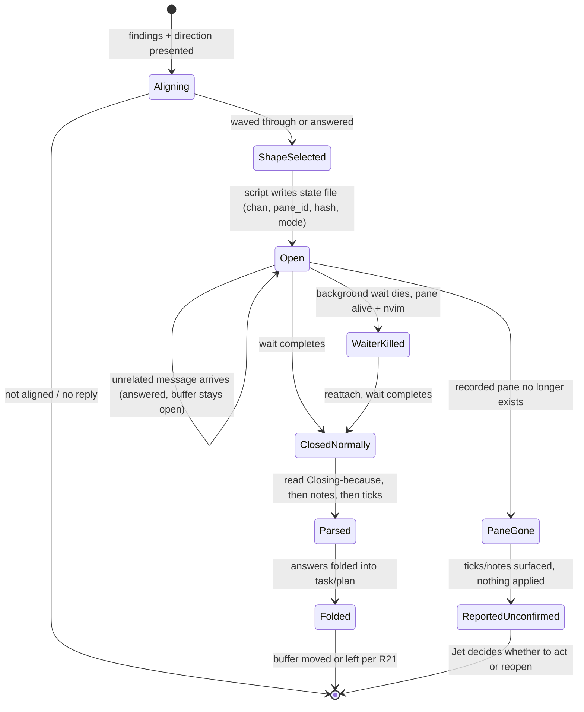

# Decision Buffer v2 - Plan

## Goal Capsule

- **Objective:** Rebuild the `decision-buffer` skill so a buffer opens only after an align check, offers six shapes for six kinds of answer, never acts on a silent close, and shares one bundled open script with its dependents.
- **Product authority:** Jet, via the 2026-09-07/08 findings review, brainstorm interview, shape buffer, skill-creator pass, and chat confirmations (2026-09-08, twice). Evidence in `~/code/tasks/dossiers/dotfiles--decision-buffer-skill-v2/` and `~/code/tasks/dossiers/dotfiles--decision-buffer-skill-audit/`.
- **Open blockers:** None. The dossier-boundary and dependent-migration questions raised during planning are resolved below (Key Technical Decisions).

**Product Contract preservation:** Requirements R2, R10, R11, R14, R16, R18, R21, R25 were tightened during planning — flow analysis found each, as brainstormed, described a case that could not actually occur or left a real gap open (see Key Technical Decisions for why). No requirement was removed or had its intent reversed; each change narrows an ambiguity the brainstorm didn't anticipate. R1, R3–R9, R12, R13, R15, R17, R19, R20, R22–R24, R26 are unchanged.

---

## Product Contract

### Summary

Rewrite the `decision-buffer` skill into one skill with three disclosure levels: a short body that asks "are we aligned, shall I take this to a buffer?" before opening anything and then selects a shape, per-shape reference files, and a bundled open script that the skill and wb.sh both call. Turn off recommendations by default, make a silent close apply nothing in every buffer including the two proposal buffers, and reword the handoff kickoff default and the global rule so neither fires a buffer before alignment.

### Problem Frame

The skill is Jet's most-used tool: 85 buffers across 72 of 127 recent work sessions. Its trigger is a format test, "I have 2+ options", and 75% of opens are the agent reaching for it unprompted after research lands. One buffer in four comes back with no box ticked and prose instead. On 2026-09-04 a scoping spike produced an options-and-recommendation buffer twice, and Jet asked why an investigation had jumped to decisions.

The audit found the mechanism sound and the sequence wrong. Jet's words: planning and brainstorming "has been managed as a single phase but should be broken down into 2. First align and then once direction is established ... we can ask clarifying questions or pop open a decision buffer." Secondary problems compound it. The same template is bent into findings reviews, SQL paste loops and fact confirmations. The tmux recipe is prose in five skills and code once. A silent close means "unanswered" in one skill and "approve everything" in two others. Two of Jet's rules live only in memory files. The handoff skill hard-codes "artifact + decision buffer" as every routed task's first action, which is how the spike got its kickoff line.

Planning found a second layer under that: the mechanism itself has never been tested, and several of its documented behaviors — the "or the user sends any message" parse trigger, the assumption that a killed wait means a killed pane, the two proposal buffers' pre-ticked boxes — don't hold up against how the skill is actually used, largely because two of the pre-ticked-box buffers were live during this very planning session (see Key Technical Decisions).

### Key Decisions

- **Align check before any buffer, as a question not a gate.** The agent presents findings and a proposed direction in chat, then asks whether to take the remaining points to a buffer. Jet can wave it through. Jet asked for "a happy middle ground between where we are now and what's being proposed." A hard gate was rejected.
- **One skill, three disclosure levels, name kept.** Body under ~220 lines holding the align check, shape selection, close contract and parse rules. One reference file per shape. The open mechanism as a bundled script. This came from running the structural question through the skill-creator skill: two skills with near-identical descriptions would create a trigger near-miss pair, and a wb subcommand puts seven dependents and the test suite in the blast radius for nothing the script does not give. Advice at `~/code/tasks/dossiers/dotfiles--decision-buffer-skill-v2/2026-09-08-skill-creator-advice.md`.
- **Six shapes, chosen after alignment by the kind of answer needed.** Choice, findings review, clarifying interview, paste target, confirm-facts, code-review triage. Findings review and interview were dogfooded by hand in this task and worked. Paste target is blessed at Jet's request.
- **Recommendations off by default in every shape.** Jet: "off by default so accidental closes don't trigger actions." Leans go in chat. The 83% follow rate when a box was ticked is a known cost, tracked in the follow-up task.
- **A silent close never acts, in any buffer.** Every shape's header states what an unmarked close means. A `Closing because:` line at the foot lets Jet say why. The wb-breakdown and wb-jira-create proposal buffers gain an explicit approve tick in this task rather than a follow-up.
- **Fold at close, keep the raw buffer as scratch.** Answers are folded into the task file or plan. The raw buffer moves to the task dossier's `decision-records/` folder and is never cited as source of truth — except for buffers opened in an employer repo, which fold in place and stay in that repo's own scratch (see Key Technical Decisions, dossier boundary).
- **Companion HTML only when it earns its place.** Written when a lot of extra context is needed or the questions are not self-describing. Never for interview, paste or confirm shapes.
- **Feedback is a ledger, not a metric.** A `learnings.md` beside the skill collects one dated line per in-session "this buffer isn't helping" flag.
- **Code questions at planning stage stay, with context.** Not deferred. Jet: "the stage we are at should guide how the questions are asked ... I'll need clear context and code examples as I probably won't know exactly what we are referring to."

### Requirements

**Trigger and alignment**

- R1. The skill's trigger is intent-based: an answer is needed in writing, asynchronously, in Jet's editor, and the direction has been agreed. The "2+ options" clause is removed from the skill and from the global rule in the user's CLAUDE.md.
- R2. Before writing any buffer, the agent presents findings and a proposed direction in chat and asks whether to take the open points to a buffer. Three outcomes are handled: Jet waves it through or answers directly (proceed accordingly); Jet replies with a question (answer it in chat, then re-ask alignment in one line — do not open a buffer on that turn); Jet does not reply because the turn ends or is interrupted (treat as not aligned; do not open on the next turn without re-asking).
- R3. Every question in a buffer states why it is being asked and which stage it belongs to. A code-level question asked during planning carries the relevant code excerpt and enough context to judge it without opening files.
- R4. A task file's "first action: decision buffer" line does not bypass R2.

**Shapes**

- R5. The skill offers six shapes: choice, findings review, clarifying interview, paste target, confirm-facts, code-review triage. Shape is selected after alignment from the kind of answer needed, using a selection table in the skill body.
- R6. Each shape is a reference file loaded only when selected, holding its template and header text.
- R7. Every shape's header states what an unmarked or unchanged close means for that shape.
- R8. The choice shape carries no recommendation line unless Jet asks or the agent has a stated reason; nothing is ever pre-ticked.
- R9. The confirm-facts shape is limited to a small batch per buffer, because long fact lists overwhelm.
- R10. The paste-target shape presents each item as a query or step, a paste slot, and a verify line. It reopens until every slot carries a pasted result or an explicit strike-through (`~~`), or Jet writes a closing reason to stop; after three reopens with no new paste, the agent asks in chat instead of reopening again.

**Close contract**

- R11. A silent close means the file's content is unchanged from what the agent wrote (compared against a hash recorded when the buffer opened), with no `Closing because:` line. A silent close applies nothing in any shape; the agent reports that and continues in chat. Any diff from the recorded content — an edited fact, a reordered option, a struck-through line, not only a tick or a note — counts as a note and is acknowledged, never treated as silence.
- R12. `Closing because:` is read first and controls how the rest of the buffer is handled. A reason that signals abort ("too early", "wrong shape", "ignore", "let's talk") means nothing is applied; any ticks present are echoed back as "you also ticked X — carry into the next round?" rather than acted on. Any other reason proceeds to the normal notes-then-ticks handling below. An ambiguous reason is asked about in chat before anything is applied.
- R13. Prose notes are answered before any selection is acted on. In a shape with an approve gate (R14), a note requesting a change means the approve tick is not acted on until the note is resolved and the buffer is reopened.
- R14. The wb-breakdown and wb-jira-create proposal buffers carry one top-level approve tick, separate from and in addition to their existing per-item ticks. An unticked approve line applies nothing, regardless of the per-item ticks' state, and does not permanently block a future proposal for the same target — the existing refusal rule (today keyed to "any unchecked box exists") is changed to key off whether a buffer is still open, so a declined proposal can be regenerated.

**Mechanism**

- R15. The tmux open recipe exists once, as a script bundled with the skill. The skill and wb.sh call that script; the four skills that currently carry prose copies (wb-done, parked-items, wb-breakdown, wb-jira-create) are migrated to call it in this task, not deferred, because the change each needs is small.
- R16. The script records, beside the document, the wait-channel, the tmux pane id it opened, the time it opened, and a hash of the document's initial content. The state file is overwritten unconditionally on every open, with one exception: the paste-target shape's reopen counter (R10) carries forward across opens of the same still-incomplete sequence and resets only when new content lands. A stale file from a prior run at the same doc path is otherwise never reused as a signal source. Outside tmux, three fallback tiers exist for two different kinds of caller: a `gnome-terminal --wait` terminal mode and a manual `! nvim` mode both serve the skill's own agent-driven opens and write a state file scoped to what each can support (a process id in the terminal case, nothing to re-attach to in the manual case); a direct synchronous mode serves wb.sh's own non-agent callers, matches their existing pre-v2 behavior exactly, and writes no state file at all. `@claude_blocked` is set only in the tmux and terminal modes.
- R17. The open is always run in the background so the tool timeout cannot kill it.
- R18. If the recorded wait dies while the recorded pane is still alive and running nvim, the agent re-attaches to the recorded channel rather than opening a second buffer, and says so. If the recorded pane is gone, the agent does not re-attach or wait; it reads the document on disk as found, tells Jet the close was not deliberate, and surfaces any ticks or notes found as "on disk, unconfirmed" — it does not apply them without asking first. The buffer is parsed only when the wait or a re-attach completes, or Jet explicitly says the buffer is closed — never because an unrelated message arrived while the recorded pane is still open; an unrelated message during that window is answered on its own terms, with the buffer's open status restated.

**Upstream defaults and dependents**

- R19. The handoff skill's kickoff default becomes "present findings and direction, check alignment", followed by a shape chosen by task kind: spike or scoping tasks get a findings review or interview, settled plans get a choice.
- R20. The global rule in the user's CLAUDE.md is reworded to the intent trigger and the align check, and points at the skill for shapes.

**Records and feedback**

- R21. At close, answers are folded into the task file or plan. Where the buffer's raw file then goes depends on where it was opened: a buffer in an employer repo's tracked `docs/decisions/` stays in place with a one-line "Folded into: <path>" note (no `git mv`, since that history is the record); a buffer in an employer repo's gitignored `logs/decisions/` also stays in that repo, with the same note, per the existing rule that employer-repo content never lands on a personal surface; a buffer in the personal dotfiles repo's `logs/decisions/` moves into the current task's dossier under `decision-records/` (created if absent); a buffer already written inside a dossier is left as-is. In every case the buffer is never cited as the source of truth once its answers are folded.
- R22. A `learnings.md` beside the skill receives one dated line, with Jet's words and the buffer path, each time Jet flags a buffer as unhelpful in session.
- R23. The two memory-only rules, self-contained plus glossary and buffer-is-rough-not-durable, are written into the skill as the first unit of work.
- R24. Companion HTML is written only when extra context is substantial or questions are not self-describing, and never for interview, paste or confirm shapes.

**Repo hygiene**

- R25. Before relying on any bundled reference or script file, the skill checks the file exists and is executable where applicable; if not, it reports the exact re-stow command needed and stops rather than falling back to hand-writing the tmux recipe from memory.
- R26. The human guide, docgen index, and memory files that name the skill are updated to the new sections; the skill name is unchanged.

### Key Flows

- F1. Research lands and the agent has options
  - **Trigger:** Subagents return or the agent finishes reading.
  - **Steps:** Agent posts findings and a proposed direction in chat. Agent asks whether the direction holds and whether to take open points to a buffer (R2's three outcomes apply here). Agent selects a shape and writes the buffer with a header stating the close contract, and the mechanism script records the open's state. Jet closes, or the wait is interrupted (see F2). On a genuine close, the agent reads `Closing because:` first (R12), then notes (R13), then ticks, answering notes before acting on any selection. Answers are folded into the task or plan; the raw buffer is moved or left per R21's three-way rule.
  - **Covers:** R1–R3, R5–R13, R15, R21.
- F2. The recorded wait or pane dies
  - **Trigger:** The background wait is killed, or the tmux server itself crashes.
  - **Steps:** Agent checks the state file. If the recorded pane is alive and running nvim, it re-attaches a waiter to the recorded channel and tells Jet. If the pane is gone, it reads the document as-is, tells Jet the close was not deliberate, and surfaces any found ticks or notes as unconfirmed rather than acting on them. A second, redundant wake (e.g. the original wait completing after a re-attach was already started) is a no-op — the state file is gone by the time it would fire.
  - **Covers:** R16, R18.
- F3. A task is routed via handoff
  - **Trigger:** The handoff skill seeds a task file.
  - **Steps:** The first action reads "present findings and direction, check alignment", then names a shape by task kind. The routed worker follows F1.
  - **Covers:** R4, R19.

### Acceptance Examples

- AE1. **Covers R2, R4.** Given a spike task whose file says "first action: decision buffer", when the worker picks it up, then it presents findings and direction in chat and asks about alignment before any buffer, and if a buffer follows it is a findings review or interview.
- AE2. **Covers R11, R12.** Given a choice buffer closed with no ticks, no notes and `Closing because: too early`, when the agent returns, then it applies nothing, quotes the reason, and returns to alignment in chat.
- AE3. **Covers R14.** Given a wb-breakdown proposal buffer closed with its approve line unticked, when the apply step runs, then no task files are written, the agent reports that nothing was approved, and a later run of `/wb-breakdown` for the same parent regenerates rather than refusing.
- AE4. **Covers R16, R18.** Given an open buffer whose background waiter is killed while the recorded pane is still alive and running nvim, when the agent handles it, then it re-attaches to the recorded channel and no second buffer opens.
- AE5. **Covers R3.** Given a planning-stage buffer that asks which of two functions should own a check, when Jet reads it, then the question carries both function excerpts and the downstream consequence of each answer.
- AE6. **Covers R8.** Given a choice buffer where Jet did not ask for a recommendation, when it opens, then no option is pre-ticked and no recommendation line is present.
- AE7. **Covers R16, R18.** Given a state file at a doc path left over from a prior open whose recorded pane no longer exists, when the agent tries to re-attach at that same path, then it reports the pane is gone without calling the blocking wait, and follows the pane-gone path (AE8) instead of returning as if the buffer had just closed.
- AE8. **Covers R18.** Given the tmux server crashed while a choice buffer had one tick saved, when the agent returns, then it says the close was not deliberate, quotes the tick as "found on disk, unconfirmed", applies nothing, and asks whether to act on it or reopen.
- AE9. **Covers R18.** Given a buffer is open and Jet sends an unrelated message, when the agent handles it, then it answers the message, states the buffer is still open, and does not read ticks or notes from the document on that turn.
- AE10. **Covers R13, R14.** Given a wb-breakdown proposal with the approve box ticked and a note asking to rename one child's slug, when the agent returns, then the apply step does not run, the note is answered, and a corrected proposal is reopened.
- AE11. **Covers R10.** Given a paste-target buffer where every slot has a paste or a strike-through, when the agent returns, then it does not reopen the buffer and summarizes the verify lines instead.
- AE12. **Covers R25.** Given the `claude` package has not been re-stowed after the new script and reference files were added, when the skill runs, then it reports the missing file and the exact stow command, and does not hand-write a tmux recipe as a substitute.
- AE13. **Covers R21.** Given a buffer opened in an employer repo's gitignored `logs/decisions/`, when its answers are folded, then the file stays in that repo with a "Folded into" note; given the same situation in the personal dotfiles repo, then the file moves into the current task's dossier under `decision-records/`.
- AE14. **Covers R11.** Given a buffer closed with no ticks and no `Closing because:` line, but with one option's background paragraph edited, when the agent returns, then it treats the edit as a note and acknowledges it, rather than reporting a silent close.

---

## Planning Contract

### Key Technical Decisions

- **KTD1 — One skill, three disclosure levels (A′), not two skills or a wb subcommand.** Skill-creator's progressive-disclosure model (metadata → body → bundled `references/`/`scripts/`) already covers the shapes problem via its "domain organization" pattern. Two skills with near-identical descriptions would create a trigger near-miss pair that Claude has to disambiguate on every buffer-shaped request; a `wb buffer` subcommand puts wb.sh (~5,600 lines), its Docker test suite, and seven dependents in the blast radius for a benefit the bundled script already delivers at a fraction of the risk.
- **KTD2 — The mechanism becomes a bundled script (`scripts/open-buffer.sh`), not prose repeated per skill.** The tmux recipe exists as prose in five skills and as real code once, in `wb_open_buffer()`. That asymmetry is skill-creator's own signal for "bundle it": one executable implementation, five thin callers.
- **KTD3 — The state file adds a pane id and a content hash to the existing unique-channel convention.** The original per-open unique-channel rule (07-07) already prevents a *stale signal* from causing an instant return. It does not, on its own, let the agent tell a genuinely closed pane apart from a pane that no longer exists — that distinction needs the pane id, and "was anything actually written" needs the content hash. Both are additions to, not replacements of, the existing channel-uniqueness rule.
- **KTD4 — The approve tick is a second, independent gate from per-item ticks in the two proposal buffers, and wb-breakdown's own refusal rule changes with it.** Today's proposal templates pre-tick every item, so "closed unchanged → applied" is true by construction; adding a plain approve tick without changing the refusal rule (currently "any unchecked box = unresolved", stated as agent-executed prose in `wb-breakdown/SKILL.md`, not in `wb.sh`) would make every declined proposal permanently block a rerun, since the new approve box defaults unticked. The refusal condition moves to "a buffer is still open" (tracked via the state file from KTD3), which is the actual invariant the refusal rule was protecting. This is distinct from `wb.sh`'s `_wb_breakdown_validate` orphan-checkbox pre-pass, an unrelated structural-corruption check on marker placement that this plan does not touch.
- **KTD5 — Silent close is defined by content hash, not by the absence of ticks.** An edited fact, a reordered option, or a struck-through line is not a tick and not prose under "Questions / Notes", but it is not silence either. Comparing against the hash recorded at open time catches all three without new parsing rules per edit type.
- **KTD6 — Parsing never fires on an unrelated message while the recorded pane is still open.** The skill's current step 3 says parse "or the user sends any message" — reasonable when the buffer's mechanism could not otherwise detect a close, but wrong now that the state file can. An unrelated message during an open buffer is answered on its own terms; the buffer's status is restated, not consumed.
- **KTD7 — Decision-record destination follows the existing personal/employer boundary, not a single rule.** Jet's global CLAUDE.md rule already says employer-repo content never lands on a personal surface. The task dossier at `~/code/tasks/dossiers/` is a personal surface. So an employer-repo buffer folds and stays in that repo; only a personal dotfiles-repo buffer moves into the personal dossier. This resolves what would otherwise be a genuine product-scope question by applying a rule Jet has already stated, rather than defaulting silently.
- **KTD8 — New tests cover state-file and parse logic directly, plus a minimal stub for the reattach decision tree; no full tmux-driving harness is introduced.** No test in this repo currently fakes tmux, and the existing suite's convention (`wb-handoffs.test.sh` and siblings) is to source shell functions against fixture files. The actual `split-window`/`wait-for` calls are covered by a documented manual smoke check, matching the existing suite's scope. The `--reattach` decision tree's `tmux list-panes` parsing is new, branchy logic with no precedent in this repo (unlike the base open recipe, which `wb_open_buffer()` already exercises in production) and a silent regression here degrades to the conservative pane-gone path rather than failing loudly — that combination is worth a small stub returning canned `list-panes` output, short of building tmux-session-driving infrastructure for the whole suite.

### High-Level Technical Design

**Buffer lifecycle, from open to resolution:**



**Shape selection (after alignment, one row chosen):**

| Shape | Used for | Recommendation | Reopens |
|---|---|---|---|
| Choice | A settled decision between named options | Off unless asked | Rare — rewrite fresh |
| Findings review | Reacting to claims with agree/disagree/dig deeper/out of scope | Never | Occasional |
| Clarifying interview | Free-text answers to open questions, with a stated default | Never | Occasional |
| Paste target | An async place to run steps and paste results back | Never | Expected, until every slot is filled or struck |
| Confirm-facts | Ticking a small batch of true/false statements | Never | Rare |
| Code-review triage | Apply/Defer/Skip per finding | Never | Rare |

**State file (written beside the document, e.g. `<doc>.buffer-state`):**

```text
chan=<unique wait channel>
pane_id=<tmux pane id, tmux mode only>
mode=tmux|terminal|direct|manual
opened_at=<unix time>
caller_pid=<pid of the opening process, for duplicate-waiter detection>
content_hash=<hash of the document's content at open time>
reopen_count=<count of consecutive reopens with no new content, paste-target shape only>
```

Written only in `tmux`, `terminal`, and `manual` modes — `direct` mode (wb.sh's own non-agent callers) writes no state file, since those callers block synchronously and have no reattach or reopen behavior to track. Where a state file is written, every field except `reopen_count` is overwritten unconditionally on each open (R16). `reopen_count` is the one field carried forward from the prior state file when the same document path is reopened with no new paste since the last open (R10's three-reopen cap); it resets to 0 whenever the content hash changes, meaning a paste landed.

Directional pseudocode for the reattach decision, not implementation-specification:

```text
on --reattach <doc>:
  if no state file for <doc>: report "nothing to reattach", exit
  if mode != tmux: report "reattach not supported outside tmux", exit
  panes = tmux list-panes -a
  if state.pane_id not in panes: → PaneGone path (AE8, AE9)
  elif panes[state.pane_id].command == "nvim": wait-for(state.chan)  → ClosedNormally
  else: → CLOSED_NO_SIGNAL, read doc directly (treat as a normal close)
```

---

## System-Wide Impact

This plan touches shared infrastructure rather than one isolated component:

- **wb.sh** (~5,600 lines, its own Docker-sandboxed test suite) gains a new dependency on an external script (U4) and a changed refusal condition on its `--apply` path (U5) — both are load-bearing for `/wb-breakdown`'s core create flow, not cosmetic.
- **Seven skills** reference the buffer mechanism today; four are migrated in this task (U4, U5) and two more (`handoff`, `quick-wins`) reference it by description only and are unaffected by the file changes, though `handoff`'s kickoff text changes (U6).
- **The personal/employer-repo boundary** (KTD7) is applied here for the first time to a mechanism that previously had no opinion on it — future skills that move files into the task dossier should follow the same three-way rule rather than inventing their own.
- **Agent triggering**: the skill's description changes from a format-based trigger to an intent-based one (R1); this plan does not verify the change empirically (e.g., via a description-triggering eval), so a triggering regression would surface as a lived complaint rather than a caught test failure — the `learnings.md` ledger (R22) is the intended catch for this class of issue.

## Risks & Dependencies

- **Risk — wb-breakdown apply-path regression.** U5 changes both the checkbox grammar's approve-gate and the refusal condition on the same code path that creates real task files. Mitigated by the explicit regression scenario in U5 (a genuinely malformed line stays `malformed`) and by running the existing `wb-breakdown.test.sh` suite before and after.
- **Risk — re-stow forgotten.** New files under `claude/.claude/skills/decision-buffer/` are invisible until `stow --no-folding -t "$HOME" claude` runs (the package is stowed per-file). Mitigated by R25's runtime check, which reports the exact command instead of silently degrading.
- **Risk — CLAUDE.md edit has no PR review.** `~/.claude/CLAUDE.md` is untracked and outside this repo's git history, so U6's change to it will not appear in the PR diff. Mitigated by stating the exact before/after wording in U6's Approach, so a reviewer reading the plan can verify it was made even though the diff can't show it.
- **Risk — the trigger change is untested.** R1's intent-based description replaces the format-based trigger with no empirical description-triggering eval run against it. A regression would surface only as a lived complaint, not a caught test failure; the `learnings.md` ledger (R22) is the intended catch for this class of issue.
- **Dependency — the `claude` stow package's `--no-folding` convention** (`install.sh:19`), which makes `~/.claude/skills/decision-buffer/` a directory of per-file symlinks and is why R25's runtime check and U7's re-stow step both exist.
- **Dependency — `_wb_bd_checkbox_state`'s existing grammar** (`wb.sh:1684-1696`), which U5 extends rather than replaces.
- **Dependency — `wb_open_buffer()`** (`scripts/.config/scripts/tmux/wb.sh`), the only existing code implementation of the recipe today, becomes U4's shim target.
- **Dependency — `scripts/docgen.sh` indexes skills by directory name.** Keeping the name `decision-buffer` avoids an index collision.
- **Assumption — no test in this repo fakes a tmux session** (verified during planning). U7 adds only a minimal `list-panes`-output stub for the reattach decision tree, not a general tmux-session-driving harness, per KTD8.

## Implementation Units

### U1. Bundle the open-and-wait mechanism as a script

**Goal:** One executable implementation of the tmux open/wait/reattach/fallback recipe, replacing the prose copy in five places.
**Requirements:** R15, R16, R17, R18. Realizes F2; covers AE4, AE7, AE8, AE9.
**Dependencies:** None.
**Files:**
- `claude/.claude/skills/decision-buffer/scripts/open-buffer.sh` (new)
- `claude/.claude/skills/decision-buffer/references/mechanism.md` (new — documents the state-file format and the fallback contract from R16/R18)

**Approach:** Default mode opens `<path>` in a tmux split, capturing the new pane's id (`split-window -P -F '#{pane_id}'`), sets `@claude_blocked nvim-buffer`, always exports `WB_REVIEW_BUFFER=1` (so nvim's format-on-save skip fires regardless of shape), writes the state file described in the High-Level Technical Design, and blocks on `wait-for`. On a normal close it deletes the state file and exits 0. A `--reattach <path>` mode implements the decision tree from the High-Level Technical Design: pane alive and running nvim → wait again on the recorded channel; pane gone → report and exit without waiting; pane alive but not nvim → treat as already closed. Before waiting (fresh open or reattach), the script checks whether another live process already holds the wait via `caller_pid`; if so it reports "already waiting" and exits, rather than starting a second wait (closes the duplicate-waiter case). Outside tmux, two distinct fallbacks exist for two distinct callers: `--terminal` spawns `gnome-terminal --wait` for the decision-buffer skill's own agent-driven opens (an agent that needs to end its turn rather than block a shell), writing a state file scoped to what that mode can support (a process id, nothing to reattach to); `--direct` runs `${EDITOR:-nvim} "$path"` synchronously in the calling shell with no state file at all, matching `wb_open_buffer()`'s existing non-tmux behavior (`wb.sh:2800-2802`) for wb.sh's own non-agent callers (`wb reconcile --review`, sweep-review call sites) that block until the editor exits and were never agent-driven. `manual` (the third tier, printing a copyable `! nvim <path>` command for the human to run themselves) is reserved for a headless agent context with neither tmux nor a way to spawn a terminal. `@claude_blocked` is set only in the tmux and `--terminal` modes, never in `--direct` or `manual`.

**Patterns to follow:** The existing `wb_open_buffer()` (`scripts/.config/scripts/tmux/wb.sh:2785-2803`) for the base tmux recipe; `claude-notify-hook.sh`'s always-exit-0, never-block convention for a script other tools depend on.

**Test scenarios:**
- Happy path: opening writes a state file with channel, pane id, mode, and content hash; the script blocks until close; the state file is deleted and the script exits 0.
- Edge: `--reattach` when the recorded pane is alive and running nvim waits on the recorded channel and returns 0 when it completes.
- Edge: `--reattach` when the recorded pane no longer exists reports pane-gone and does not call the blocking wait (fixture stubs `tmux list-panes` output missing that pane id).
- Edge: `--reattach` when the recorded pane exists but is not running nvim is treated as already closed and reads the document directly.
- Edge: a state file already present at the target path from an earlier run is unconditionally overwritten on a fresh open, never reused as a signal source.
- Error: a second `--reattach` call while a live waiter already holds the state file reports "already waiting" and does not start a second wait.
- Integration: `WB_REVIEW_BUFFER=1` is exported in every mode, including all three non-tmux fallbacks.
- Regression: `--direct` mode, called the way `wb_open_buffer()`'s existing non-tmux branch is called today, produces the same synchronous, blocking-until-close behavior with no state file and no `@claude_blocked` — the existing `wb-open-buffer.test.sh` coverage of `WB_REVIEW_BUFFER` reaching the child process continues to pass unchanged against this mode.

**Verification:** The fixture test for this unit passes standalone with no real tmux session required for the state-file and decision-tree logic. A documented manual smoke check — open one real buffer inside tmux, kill the background wait, run `--reattach` — confirms the pane stays open and the same buffer resumes rather than a second one appearing.

---

### U2. Write the six shape reference files

**Goal:** One self-contained reference file per shape, each carrying its template and its own close-contract header text.
**Requirements:** R5, R6, R7, R8, R9, R10. Covers AE6, AE11.
**Dependencies:** None.
**Files:**
- `claude/.claude/skills/decision-buffer/references/shapes/choice.md` (new)
- `claude/.claude/skills/decision-buffer/references/shapes/findings-review.md` (new)
- `claude/.claude/skills/decision-buffer/references/shapes/interview.md` (new)
- `claude/.claude/skills/decision-buffer/references/shapes/paste-target.md` (new)
- `claude/.claude/skills/decision-buffer/references/shapes/confirm-facts.md` (new)
- `claude/.claude/skills/decision-buffer/references/shapes/code-review-triage.md` (new)

**Approach:** `choice.md` keeps the existing options-plus-optional-recommendation shape, with the recommendation line now explicitly opt-in per R8. `findings-review.md` and `interview.md` are generalized from the two buffers actually built and used during this planning session — their headers, mark semantics, and "what a blank answer means" language carry over directly. `paste-target.md` implements R10's completion rule in its own header: every slot needs a pasted result or a strike-through, and the shape states the three-reopen-then-ask-in-chat cap. `confirm-facts.md` limits itself to a small batch, uses plain confirm ticks with no options, and its header states plainly that there is no recommendation to give rather than forcing the ritual line R8 was written to remove. `code-review-triage.md` is Apply/Defer/Skip per finding, with its header stating that a silent close applies nothing (tying it to R11 rather than the current implicit behavior).

**Patterns to follow:** `~/code/tasks/dossiers/dotfiles--decision-buffer-skill-v2/2026-09-07-audit-findings-review.md` and `2026-09-08-brainstorm-interview.md` — the two shapes dogfooded by hand this session.

**Test scenarios:** Test expectation: none — these are prose templates, not executable code. They are exercised indirectly by U1 and U7's parse-rule tests, which run against fixture documents built from each template.

**Verification:** During Definition of Done, opening one real buffer each in at least the choice, findings-review, and paste-target shapes confirms each header correctly states its own close semantics without cross-referencing another shape's rules.

---

### U3. Rewrite the decision-buffer skill body

**Goal:** A ~170–220 line `SKILL.md` holding the align check, the shape-selection table, the parse rules, and the fold-and-move step — everything else lives in `references/`.
**Requirements:** R1, R2, R3, R4, R5, R11, R12, R13, R21, R22, R23, R24. Realizes F1; covers AE1, AE2, AE5, AE13, AE14.
**Dependencies:** U1, U2.
**Files:**
- `claude/.claude/skills/decision-buffer/SKILL.md` (rewritten in place)
- `claude/.claude/skills/decision-buffer/learnings.md` (new — seeded with one commented example line showing the dated, quoted-words, buffer-path format)

**Approach:** Frontmatter keeps `name: decision-buffer`; the `description` sells one intent — an async written answer is needed and the direction is already agreed — and names the six shapes so a request naturally matching one of them still routes here. The body opens with the align-check step (R2's three outcomes spelled out), then the shape-selection table (pointing at each `references/shapes/*.md`), then a short mechanism paragraph that calls `scripts/open-buffer.sh` and points to `references/mechanism.md` for the state-file contract rather than re-deriving it. Parse rules state the tick-line grammar (a line matching the checkbox pattern, outside fenced code, blockquotes, or HTML comments, and below the first section heading — so a literal `[x]` inside instructional text is never miscounted), the `Closing because:` precedence from R12, and the never-parse-on-an-unrelated-message rule from R18/KTD6. The two previously memory-only rules (self-contained and glossary discipline; buffer-is-rough-not-durable) are written directly into the relevant sections rather than left implicit. The Afterwards section states R21's three-way move rule plainly.

**Patterns to follow:** Skill-creator's progressive-disclosure guidance (body under ~500 lines, ideally much less; detail lives in `references/`, loaded only when needed).

**Test scenarios:** Test expectation: none — `SKILL.md` is agent-read prose. Its parse rules are exercised by U7's fixture tests against sample documents; its overall shape is exercised by the manual dogfood run in Definition of Done.

**Verification:** `scripts/docgen.sh build` indexes the skill without error and the generated guide page renders. A read-through confirms the body stays within progressive-disclosure guidance and that neither memory-only rule is still absent from the file.

---

### U4. Migrate wb.sh and its dependents to the shared script

**Goal:** `wb_open_buffer()` becomes a thin shim over U1's script; wb-done and parked-items' prose recipes point at the script instead of repeating it. (wb-breakdown and wb-jira-create's own recipe lines are migrated in U5, alongside their approve-gate change, since that unit already touches both files — see U5's Approach.)
**Requirements:** R15 (this unit covers wb-done and parked-items; U5 covers wb-breakdown and wb-jira-create, completing R15's four-skill migration).
**Dependencies:** U1.
**Files:**
- `scripts/.config/scripts/tmux/wb.sh` (edit `wb_open_buffer()`, currently at `:2785-2803`)
- `claude/.claude/skills/wb-done/SKILL.md` (edit the section carrying the tmux recipe)
- `claude/.claude/skills/parked-items/SKILL.md` (edit the section carrying the tmux recipe)

**Approach:** `wb_open_buffer()` keeps its existing call signature so its four internal callers (the sweep/review call sites in `wb.sh`) need no change; its body becomes a call to `~/.claude/skills/decision-buffer/scripts/open-buffer.sh "$path"`, falling back to the current inline recipe — with the same re-stow message R25 defines — only when the script is missing or not executable, so a stale environment degrades loudly rather than silently. `wb-done` and `parked-items`' `SKILL.md` files replace their spelled-out tmux recipe with one line pointing at the script; neither skill's own close-handling logic changes, only how the pane opens.

**Patterns to follow:** wb.sh's existing `WB_REVIEW_BUFFER` env-var-signal convention as precedent for a small compatibility shim with a documented fallback.

**Test scenarios:**
- Happy path: `wb_open_buffer` calls the script with the same path argument when the script is present and executable.
- Error path: the script is missing or not executable — the function prints the re-stow message and falls back to the prior inline recipe rather than failing silently.
- Regression: each of the four existing internal callers still triggers a normal blocking open with no change to its own post-close handling.

**Verification:** The existing wb.sh test cases that exercise `wb_open_buffer`'s callers continue to pass unchanged. A manual smoke test opens one real sweep/review buffer through an existing `wb` command and confirms the pane behaves as before.

---

### U5. Add the approve gate to the two proposal buffers

**Goal:** wb-breakdown and wb-jira-create proposal buffers require an explicit top-level approve tick; an unapproved close applies nothing and does not permanently block a rerun. This unit also completes R15's dependent migration: since it already edits both skills' `SKILL.md` files for the approve gate, it replaces their remaining inline tmux-recipe prose with a call to U1's script in the same edit.
**Requirements:** R14, R15 (the wb-breakdown/wb-jira-create half). Covers AE3, AE10.
**Dependencies:** U3, U4.
**Files:**
- `claude/.claude/skills/wb-breakdown/SKILL.md` (buffer template, and its own agent-executed "refuse to clobber a prior unresolved buffer" guard — prose, not bash, currently describing "if a file already exists at that path, still carries a `<!-- wb-breakdown:` marker, and still has any unchecked `- [ ]` box, stop")
- `scripts/.config/scripts/tmux/wb.sh` (`wb breakdown --apply`'s `_wb_breakdown_validate`, whose `_wb_bd_checkbox_state`-based orphan-checkbox pre-pass at `:1684-1696` and `:1846-1861` stays unchanged — it is a structural-corruption check on marker placement, unrelated to the approve gate, and this unit does not touch it)
- `claude/.claude/skills/wb-jira-create/SKILL.md` (buffer template and its agent-side approval check)
- `scripts/.config/scripts/tmux/tests/wb-breakdown.test.sh` (extended with this unit's scenarios)
- `scripts/.config/scripts/tmux/tests/wb-jira-set.test.sh` (extended with the approve-gate scenario for the ticket-creation path)

**Approach:** Add one top-level `- [ ] Approve — apply everything ticked below` line, using the same checkbox grammar `_wb_bd_checkbox_state` already classifies, to both templates. Per-item ticks may stay pre-ticked, since they express the proposal — the approve gate is what makes them inert until confirmed. `wb breakdown --apply` reads the approve line first: unticked → exits 0 reporting "not approved, nothing applied", writes nothing; ticked but a note requests a change → also applies nothing, per R13, and reports which note is blocking. The refusal rule this unit actually changes lives as agent-executed prose in `wb-breakdown/SKILL.md`, not in `wb.sh`: today it says a prior file at the target path, still carrying a block marker with any unchecked box, blocks a rerun. That check is rewritten to test whether a live state file exists for that buffer path (via U1's mechanism) instead of scanning boxes — a closed-but-unapproved buffer is archived to `<stem>.unapproved-<timestamp>.md` so the original path is free for a fresh run. `_wb_breakdown_validate`'s own orphan-checkbox pre-pass in `wb.sh` is a separate, unrelated structural check and is not touched. wb-jira-create's agent-side gate (no bash apply step) gets the same approve-line convention and checks it before calling the ticket-creation tool. In the same edit to both `SKILL.md` files, the inline tmux-recipe prose each currently carries is replaced with a call to U1's script (R15), matching the change U4 makes to `wb-done` and `parked-items` — this unit is where the last two of the four dependents complete that migration.

**Patterns to follow:** `_wb_bd_checkbox_state`'s existing strict-vs-malformed distinction — the approve line is classified by the same grammar so a malformed approve line is never silently read as "none."

**Test scenarios:**
- Happy path: approve ticked, no notes, per-item ticks as proposed — apply runs and produces the expected task files or tickets.
- Edge: approve left unticked (today's default state) — apply reports not approved and creates nothing; a later run for the same parent regenerates instead of refusing.
- Edge: approve ticked, but a note asks to rename one child's slug — apply does not run, the note is surfaced, nothing is created.
- Regression: a genuinely malformed checkbox line is still classified `malformed`, never silently `none`.
- Migration: both `SKILL.md` files call the script rather than inlining the tmux recipe, matching U4's pattern for the other two dependents.

**Verification:** `bash scripts/.config/scripts/tmux/tests/wb-breakdown.test.sh` and `bash scripts/.config/scripts/tmux/tests/wb-jira-set.test.sh` pass with the scenarios above added; the sandboxed suite shows no regression in the surrounding apply-path cases; no inline tmux-recipe prose remains in either `SKILL.md`.

---

### U6. Reword the handoff default, the global rule, and confirm the memory sync

**Goal:** The handoff skill's kickoff default and the global CLAUDE.md rule route through the align check instead of jumping straight to a buffer.
**Requirements:** R19, R20, R23.
**Dependencies:** U3.
**Files:**
- `claude/.claude/skills/handoff/SKILL.md` (kickoff-default section)
- `~/.claude/CLAUDE.md` (untracked personal file, edited directly — not part of this repo's commit)

**Approach:** Handoff's default `first_action` changes from "artifact + decision buffer covering open questions" to "present findings and proposed direction, check alignment", followed by a shape recommendation keyed to the routed task's stage — spike or scoping tasks default to findings review or interview, a settled plan defaults to choice. The existing override conditions (already-resolved questions, an explicit skip, a fully-scoped `/ce-work` handoff) are preserved unchanged. The global rule's trigger sentence drops "2+ non-trivial options" for the intent test and points at the skill for shape selection; its companion-HTML sentence is tightened to the two conditions surfaced in the brainstorm interview — substantial extra context, or questions that aren't self-describing. This unit also confirms the two previously memory-only rules landed in U3's rewrite and are no longer memory-only.

**Patterns to follow:** Handoff's existing "overridable — don't force it when it's already redundant" structure, kept intact and simply repointed at the new default.

**Test scenarios:** Test expectation: none — prose-only changes to skill instructions and an untracked personal config file.

**Verification:** Re-reading the handoff kickoff section and the CLAUDE.md rule side by side confirms neither still reads "2+ options" or "artifact + decision buffer" as an unconditional default.

---

### U7. Tests, re-stow, docgen, and the human guide

**Goal:** Fixture-based coverage for the new script's state-file and parse logic, a live stowed skill directory, an up-to-date docgen index, and a guide that describes the new shapes and close contract.
**Requirements:** R25, R26.
**Dependencies:** U1, U2, U3, U4, U5.
**Files:**
- `scripts/.config/scripts/tmux/tests/decision-buffer-open.test.sh` (new)
- `scripts/.config/scripts/tmux/tests/wb-breakdown.test.sh`, `scripts/.config/scripts/tmux/tests/wb-jira-set.test.sh` (extended per U5 — verified here, not re-edited)
- `docs/guides/decision-buffer.md` (updated)

**Approach:** The new test file follows the `wb-handoffs.test.sh` convention — source the script's functions directly against a temp fixture directory, plain-bash assert helper. For the `--reattach` decision tree specifically (KTD8), a minimal fake `tmux` executable placed first in `PATH` for the test's duration returns canned `list-panes` output, driving the three branches (pane alive and running nvim, pane alive but not nvim, pane gone) without a real tmux session. The actual `split-window`/`wait-for` calls are left to the documented manual smoke checks named in U1 and U4's Verification — this stub covers only the decision logic, not real pane creation. The re-stow (`stow --no-folding -t "$HOME" claude`) runs once, in this unit, after every new file from U1–U6 is in place. `scripts/docgen.sh build` re-indexes the skill; since the name is unchanged, no collision is expected. `docs/guides/decision-buffer.md`'s Overview, Try it now, and Known rough edges sections are updated for the six shapes, the align check, and the pane-versus-waiter recovery distinction — the now-fixed stale-channel note in Known rough edges is replaced with the new pane-gone-versus-waiter-killed language.

**Patterns to follow:** `wb-handoffs.test.sh`'s fixture-and-assert convention. `shellcheck` is used ad hoc elsewhere in the suite via inline disable comments, not as a repo-wide gate — run it manually on the new script and address findings; no new CI wiring is implied.

**Test scenarios:** Covered under U1 and U5's per-unit scenarios; this unit's own scenario is suite-level — the new test file exits 0 standalone and inside the Docker runner, and the full existing suite shows no new failures beyond the documented known-failing floor.

**Verification:** The new test passes standalone and in the Docker harness. `stow --no-folding -t "$HOME" claude` completes, and `test -x ~/.claude/skills/decision-buffer/scripts/open-buffer.sh` succeeds afterward. `scripts/docgen.sh build` exits 0 and the generated guide page reflects the new shapes.

---

## Verification Contract

| Scope | Command | Notes |
|---|---|---|
| New unit test | `bash scripts/.config/scripts/tmux/tests/decision-buffer-open.test.sh` | Fixture-based; no real tmux session required |
| Full suite, sandboxed | `docker build -t wb-tests -f scripts/.config/scripts/tmux/tests/Dockerfile . && docker run --rm -v "$(pwd)":/repo:ro -w /repo wb-tests` | Compare against the documented known-failing floor (5 env-dependent files) — an exit code of 1 alone is not a regression signal |
| Shellcheck | `shellcheck scripts/.config/scripts/tmux/wb.sh claude/.claude/skills/decision-buffer/scripts/open-buffer.sh` | Ad hoc, not CI-gated in this repo; address findings before merging |
| Re-stow | `stow --no-folding -t "$HOME" claude` | Must run before any live test of the skill; `install.sh:19` is the reference invocation |
| Docgen rebuild | `bash scripts/.config/scripts/docgen.sh build` | Rerun after any indexed source changes, per repo convention |

## Definition of Done

**Global:**
- All seven units implemented; the new test passes standalone and in the Docker harness; the full suite shows no new failures beyond the known-failing floor.
- `stow --no-folding -t "$HOME" claude` has been run and `~/.claude/skills/decision-buffer/scripts/open-buffer.sh` is present and executable.
- `scripts/docgen.sh build` exits 0 and the generated decision-buffer guide page reflects the new shapes.
- A real dogfood run opens at least one buffer each in the choice, findings-review, and paste-target shapes and confirms the align check, the shape's header, and the close contract behave as designed.
- No inline tmux-recipe prose remains duplicated in `wb-done`, `parked-items`, `wb-breakdown`, or `wb-jira-create`'s `SKILL.md` files — all four point at the script.
- Cleanup: no dead-end or experimental code from an abandoned approach is left in the diff.

**Per unit:** As stated in each unit's Verification above.

## Scope Boundaries

- The tmux OOM root cause stays in `dotfiles--tmux-oom-crash-decision-log`; this plan's mechanism work only makes the buffer's own recovery from a killed wait or pane correct, it does not address why the OOM guard fires.
- No change to tmux or nvim as the editor and split mechanism.
- The living-doc-versus-bloat tension and the rewrite-fresh rule for multi-round buffers are unchanged.

#### Deferred to Follow-Up Work

- Alignment as a session-wide rule for brainstorm and plan sessions that never open a buffer, shape-and-altitude judgement having no automated check, and the other gaps named at scope confirmation are tracked in `dotfiles--decision-buffer-v2-unsolved` (planned, depends on this task).

## Sources / Research

- Audit dossier: `~/code/tasks/dossiers/dotfiles--decision-buffer-skill-audit/` (docs audit, two transcript audits, skill evolution, reopen causes).
- Task dossier: `~/code/tasks/dossiers/dotfiles--decision-buffer-skill-v2/` (findings review and overview, interview, shape decisions, skill-creator advice, system diff).
- Grounding quotes with file:line pointers, gathered during planning: the current skill's gate/mechanism/parse/afterwards steps, the four dependents' prose copies of the mechanism, `wb_open_buffer()` and its four callers, the handoff kickoff default, the global CLAUDE.md rule, the human guide's known-rough-edges section, and the `@claude_blocked` hook consumers — all cited by file and line inline above.
- Flow and edge-case findings that shaped R2, R10, R11, R14, R16, R18, R21, R25: the killed-waiter and killed-pane transcript quirks in the work-repo audit, the reopen-causes breakdown, and a direct reading of `_wb_bd_checkbox_state`, the two proposal skills' pre-ticked templates, and the `claude-notify-hook.sh` marker-clearing behavior.
