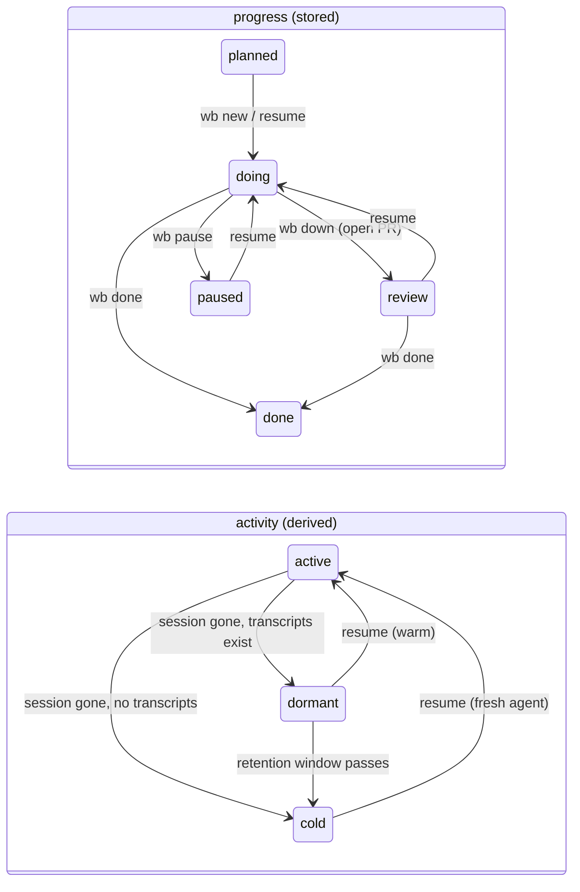

# wb picker session lifecycle - Plan

**Target repo:** dotfiles (this worktree), plus one file in the task store repo `~/code/tasks` (`TEMPLATE.md`). All dotfiles paths repo-relative.

Product Contract preservation: N/A. Solo plan bootstrapped from the task file and three rounds of the decision buffer, then a doc-review triage round (both filed under `~/code/tasks/dossiers/dotfiles--feat-workflow-strategy-and-picker-ux/decision-records/`). Background brief with system diff: `~/code/tasks/dossiers/dotfiles--feat-workflow-strategy-and-picker-ux/brief-2026-09-10.html`.

---

## Goal Capsule

**Objective.** Make a wb session cheap to put away and cheap to bring back at the exact point it stopped: close the tmux session at the PR (or lose it to a crash), keep the worktree, and reopen later from the picker with the agent's conversation warm.

**Authority.** This plan, then the decision records it folds in, then the task file. Repo conventions (`AGENTS.md`/`CLAUDE.md`, locked `wb` verbs for every task-store write) override the plan where they conflict.

**Stop conditions.** Stop and surface rather than guess if: `claude --resume <id>` or `claude --continue` is rejected by the installed Claude Code build (2.1.267 accepts both today); the transcript directory naming (`~/.claude/projects/<cwd with / as ->`) turns out not to hold for some worktree; or the rebase onto `origin/development` conflicts in `wb.sh` beyond mechanical resolution.

---

## Product Contract

### Summary

Two axes replace today's conflated `status:`. **Progress** stays in `status:` (`planned | doing | paused | review | done`), written only by explicit verbs. **Activity** (active / dormant / cold) is derived at read time from "is there a live tmux session" and "does the worktree have Claude transcripts on disk", never written. A new `wb down` verb closes a session and keeps the worktree; `wb pause` now means "shelve on purpose" and also closes. The picker becomes a single view (live rows, then dormant rows) with `n` to create and `p` to put away, and `/close-out` offers the put-away exit when a PR is open.

### Requirements

**Capture and record**

- R1. The set of Claude conversations that belong to a task is derived from Claude Code's own transcript store for the task's worktree; nothing wb writes is required for a conversation to be resumable.
- R2. `wb down` snapshots the conversation ids it finds (with last-active time and a primary marker) into the task file's `claude_sessions:` field for the board and the record, kills the tmux session, and never removes the worktree.
- R3. `wb down` sets `status: review` only when the branch has an open PR; on no PR, offline, or `gh` failure it leaves `status:` untouched.

**Progress axis**

- R4. `wb pause` sets `status: paused` and then performs `wb down`. A paused task never has a live session.
- R5. Resume (picker accept or `wb resume`) flips `paused → doing`, mirroring the existing `planned → doing` flip.
- R6. `wb done` clears `claude_sessions:` when it removes the worktree.

**Activity axis**

- R7. Activity is derived: live tmux session → active; no session and at least one transcript for the worktree → dormant; neither → cold. Nothing writes an activity value.
- R8. After a tmux crash, every task with a transcript on disk reads as dormant with no verb run. Once Claude's retention window deletes the transcripts, the task reads as cold.

**Resume**

- R9. Resume rebuilds the standard layout and pre-types `claude --resume <id>` into the agent window without pressing Enter, choosing the primary conversation when one is marked and its transcript exists, else the newest transcript; `claude --continue` when the task has history but no transcript can be named; nothing for a brand-new task.

**Picker**

- R10. The picker has one view: live session rows (as today, with agent sub-rows) followed by dormant task rows (`status` in `doing|review`, no live session, transcripts present, non-empty `worktree:`), each showing status and dormant age.
- R11. Entering search (`/` or `i`) widens the row pool to include `paused` tasks so a shelved task can be found and resumed; leaving search restores the default pool. `planned` tasks stay out of the picker.
- R12. `n` prompts for repo and slug and runs `wb new`; an empty slug opens a plain repo session.
- R13. `p` runs `wb down` on the row's session. ctrl-x keeps its `wb done` meaning. `r` rename, `b` break-out, `/` and `i` search, ctrl-r, the preview pane, and auto-refresh stay. Tab modes and `x` interrupt are removed.
- R14. Auto-refresh never interrupts typing in search mode, and search-mode renders still widen the pool.
- R15. The picker launches with `-c "$HOME"` so `wb done`'s worktree removal can't yank the picker pane's cwd.

**Skills and docs**

- R16. `/close-out` step 6 offers `wb down` instead of `wb done` when `wb pr-open` reports an open PR, after the sweep and fill-in steps have run.
- R17. `docs/wb-guide.md` (schema block, picker key table, verbs) and the board reflect the new model; the board gains a derived Dormant filter and keeps its Paused tab.

### Scope Boundaries

**In scope:** everything above, in one PR against `development`, after rebasing this worktree onto `origin/development`.

**Deferred to follow-up work**

- Picker key usage log (offered, not ticked in the buffer).
- A "what changed since you left" first message injected on warm resume (PR comments, new commits).
- GitHub polling that notifies when review lands and offers the resume row.
- Bulk `wb up` / `wb down --all` (day-bookends doc); this plan ships the single-task `wb down` that it composes.
- Board: Dormant as a first-class tab with age sorting beyond a filter.
- A manual "mark this agent as primary" verb; the agent-window heuristic ships first and a verb is added only if it misfires.
- `wb pause <task>` on a store-only target (task with no live session), and `wb done`'s store-only path clearing `claude_sessions:`.
- Raising `cleanupPeriodDays` in `~/.claude/settings.json` so shelved tasks stay warm longer than 30 days (user setting, not code).
- The stress-test-against-user-flows technique becoming a skill (routed to the parent task as its fourth item).

**Not doing**

- Storing an `active:` field (rejected: drifts on crash).
- A hook-maintained sidecar of session ids (rejected in review: Claude's transcript store already holds the same data, and stored ids outlive the transcripts they point at).
- Listing `planned` tasks in the picker's default view (the July presence-only decision stands).
- Automatic `wb down` when a PR URL appears (offer only).

---

## Planning Contract

### Key Technical Decisions

- KTD1. **Activity is derived, progress is stored.** A live tmux session is the truth for "active"; Claude's transcript directory for the worktree is the truth for "warm". Writing `active:` would lie after every crash; storing ids would lie after Claude's retention window. Consequence: `wb pause` must not leave a session running, or the axes cross again.
- KTD2. **Transcript directory as the source.** Claude Code stores every conversation at `~/.claude/projects/<encoded cwd>/<session-id>.jsonl`, where the encoded cwd is the absolute path with `/` replaced by `-`. Helper `wb_transcript_dir <worktree_abs>` builds the path; `wb_transcripts <worktree_abs>` lists `id\tmtime` newest first. Dormant = non-empty list; age = newest mtime; resume id = per R9. Transcripts are purged after `cleanupPeriodDays` (default 30, not overridden), so warmth expires on its own. The `claude_sessions:` field is a **snapshot for the board and the record only**; nothing reads it to decide activity or to resume, except as the primary-preference hint in KTD4.
- KTD3. **Primary-agent hint.** The notify hook already sets `@claude_session_id` on the pane per prompt; it additionally sets `@claude_window` to the pane's window name. `wb down` marks the id from the `agent` window as primary in the snapshot (`id@ts@primary`). Resume prefers a primary id whose transcript still exists; otherwise the newest transcript, which is exactly what `claude --continue` would pick. No files, one extra `tmux set -p` per prompt.
- KTD4. **`claude_sessions:` format** is a comma-separated list of `id@iso-timestamp[@primary]`, newest last. `wb_set_frontmatter` already inserts a missing key, so old task files need no migration. `wb_read_task`'s one-pass reader gains the column for the board.
- KTD5. **`wb down` is the activity verb; `wb pause` composes it.** Names pair with the existing `wb resume` and the future `wb up`. `cmd_pause` writes `paused` and its Handoffs line under the task lock, **releases the lock**, then calls `cmd_down`, which acquires it again: `wb_task_lock_acquire` is a per-fd `flock -w 1` with no re-entrancy, so a nested acquire from the same process times out (exit 75). The picker's self-target guard from `_ctrl_x` is reused: downing the session the picker runs in still writes everything, then prints the "run it yourself" notice instead of killing its own pane.
- KTD6. **PR probe as a verb.** `wb_branch_has_open_pr <repo_dir> <branch>` extracts `wb_pr_merge_status`'s `gh` → personal-PAT fallback with `--state open`, and is exposed as `wb pr-open [<session>]` (exit 0 open, 1 otherwise) so skills can call it: the agent's Bash tool can't see the zsh `pgh` function, so plain `gh` fails on every non-Sportable repo, dotfiles included. Any failure degrades to "no PR" silently, with one stderr line. Runs once per `wb down`, never in the picker render loop.
- KTD7. **Lazy relaunch through the layout function.** `wb_layout_session` gains a fourth argument `agent_cmd` (`claude --resume <id>`, `claude --continue`, or empty). It sends that instead of the hard-coded `claude`, pressing Enter only when `start_agent=1`; empty plus `start_agent=0` sends nothing. `cmd_new` computes `agent_cmd` before calling layout. The zsh `claude()` wrapper passes `"$@"` through to `systemd-run`, so cgroup isolation is kept.
- KTD8. **Dormant rows come from the store plus one tmux snapshot.** `collect_dormant_rows` takes one `tmux list-sessions -F '#S'` snapshot, resolves each live session to its task file via `wb_session_task_file` (option-based, so `r` renames don't matter), then walks `wb_task_files`, keeping `status` in `doing|review` (plus `paused` in search mode), non-empty `worktree:`, not in the live set, and with a non-empty transcript list. Rows reuse the 12-field TSV shape with `kind=task`, empty `session`/`target`, so the accept branch that calls `cmd_new` needs no change. The board's live-session pre-pass already uses this pattern (`wb_board_live_session_for`).
- KTD9. **Search widens the pool via the mode file.** `/` and `i` write `search` and trigger `reload-sync`; `esc` writes `normal` and reloads. `render_rows` always renders the pool the mode asks for. `_cycle_mode` and the Tab modes are deleted.
- KTD10. **Auto-refresh respects search at the bind, not the renderer.** The `load:` bind calls `_maybe_refresh <mode_file>`, which exits without output when the mode is `search` and otherwise renders; fzf's `reload` with empty output is avoided by having the bind be `reload(...)` only when the helper prints, i.e. the helper prints the current list in normal mode and nothing else happens in search mode.
- KTD11. **Rebase first.** This worktree is two commits behind `origin/development` (#46/#47); `wb.sh` changed only in the breakdown/unsafe-rewind regions and the close-out skill file is unchanged. First action in `ce-work`: `git rebase origin/development`.

### High-Level Technical Design



```mermaid
sequenceDiagram
    participant C as claude (any pane)
    participant X as ~/.claude/projects/<encoded worktree>/
    participant D as wb down
    participant T as task file
    participant K as picker
    participant N as cmd_new (resume)
    C->>X: <id>.jsonl written by Claude itself
    D->>X: list ids + mtimes
    D->>T: claude_sessions: snapshot (primary marked); status review if wb pr-open
    D->>D: tmux kill-session (worktree kept)
    K->>X: dormant = no live session + transcripts present (KTD8)
    K->>N: Enter on dormant row
    N->>T: paused→doing
    N->>N: layout(agent_cmd = claude --resume <id>) (KTD7)
```

### Assumptions

- Claude Code 2.1.267 accepts `claude --resume <session-id>` and `claude --continue`; both verified present in `claude --help`. Behaviour when a transcript's directory does not match the cwd is not needed: resume always runs in the worktree the transcripts belong to.
- `cleanupPeriodDays` is unset in `~/.claude/settings.json`, so the default 30-day purge applies; a task shelved longer than that resumes cold, by design.
- Old `paused` files in the store keep their meaning under the new model (shelved), so no migration is needed.
- `tmux show -v -t "$TMUX_PANE" @task` resolves a session-scoped option from a pane target on the installed tmux 3.7c (verified in review).

---

## Implementation Units

### U2. Schema and transcript helpers

**Goal:** the task file can carry the id snapshot and every caller can ask "which transcripts belong to this worktree" through one helper (R1, R2, R6, R17).
**Requirements:** R1, R2, R6, R17. **Dependencies:** none.
**Files:** `~/code/tasks/TEMPLATE.md` (task store repo, separate commit there); `scripts/.config/scripts/tmux/wb.sh` (`wb_read_task`, new `wb_transcript_dir`, `wb_transcripts`, `wb_sessions_snapshot`, `wb_resume_id`); `scripts/.config/scripts/tmux/tests/wb-schema.test.sh`; `docs/wb-guide.md` schema block.
**Approach:** add `claude_sessions:` after `reviewed:` in the template. `wb_transcript_dir` encodes the absolute worktree path (`tr '/' '-'`) under `${CLAUDE_PROJECTS_DIR:-$HOME/.claude/projects}` so tests can point it at a fixture. `wb_transcripts` prints `id\tepoch` newest first from `*.jsonl` there (ignore the per-session subdirectory of the same name). `wb_resume_id <task_file> <worktree_abs>` implements R9's preference order. Extend `wb_read_task`'s awk to emit the new column and update its callers to tolerate it.
**Patterns to follow:** how `reviewed:` and `size:` were added; `TASKS_DIR` as the test-override precedent for `CLAUDE_PROJECTS_DIR`.
**Test scenarios:**
- `wb_set_frontmatter` on a pre-existing file without the key inserts it before the closing `---`.
- `wb_read_task` on a file with and without the key returns the same column count.
- `wb_transcript_dir /home/x/code/r/.worktrees/a` → `<projects>/-home-x-code-r--worktrees-a`.
- `wb_transcripts` on a fixture dir with two `.jsonl` files of different mtimes → newest first; empty dir → no output, exit 0.
- `wb_resume_id`: primary id in field with transcript present → primary; primary present but transcript gone → newest transcript; no field, transcripts present → newest; no transcripts → empty.
**Verification:** schema test passes; `wb board` renders unchanged on the real store.

### U3. `wb down`, `wb pr-open`, and the `wb pause` rework

**Goal:** one verb closes a session and keeps the worktree; pause shelves on purpose; skills can ask about the PR (R2, R3, R4, R16).
**Requirements:** R2, R3, R4, R16. **Dependencies:** U2.
**Files:** `scripts/.config/scripts/tmux/wb.sh` (new `cmd_down`, `cmd_pr_open`, `wb_branch_has_open_pr`, `cmd_pause` body, CLI dispatch, usage header); `scripts/.config/scripts/tmux/claude-notify-hook.sh` (`@claude_window` per KTD3); `scripts/.config/scripts/tmux/tests/wb-pause.test.sh` (update); new `scripts/.config/scripts/tmux/tests/wb-down.test.sh`.
**Approach:** `cmd_down [<session>]` resolves the session as `cmd_pause` does today, builds the snapshot from `wb_transcripts` plus pane options (`@claude_session_id`, `@claude_window`; the `agent` window's id gets `@primary`), takes the task lock, writes `claude_sessions:`, probes `wb_branch_has_open_pr` and sets `review` only on success, appends a Handoffs line naming the verb, releases, then kills the session unless it is the caller's own (KTD5). `cmd_pause` sets `paused` and appends its own Handoffs line under the lock, releases, then calls `cmd_down`. `cmd_pr_open` is a thin CLI over the probe. Make `wb_pr_merge_status`'s fallback a shared internal used by both probes.
**Execution note:** test-first on `cmd_down`'s status logic with the probe stubbed; the existing pause test's "session still alive" assertion flips to "session killed".
**Test scenarios:**
- Down on a task session whose worktree fixture has two transcripts and whose `agent` pane carries the newer id → field holds both, newer marked primary; session gone; worktree dir untouched; status unchanged (probe stubbed to no PR).
- Down with probe stubbed to open PR → `status: review`.
- Down with probe stubbed to fail (non-zero) → status unchanged, exit 0, one Handoffs entry, one stderr line.
- Down from inside the target session → everything written, notice printed, session survives.
- Down on a non-wb session → non-zero, nothing written.
- Pause → `status: paused`, session killed, lock acquired and released twice (assert via the lock tracing the locks test already uses), Handoffs shows pause then down.
- `wb pr-open` exit codes for stubbed open / none / failure.
- Idempotence: down twice → second run reports no session, snapshot unchanged.
**Verification:** test files pass; live: `wb down` on a scratch task leaves `.worktrees/<slug>` present and the picker row moves to dormant.

### U4. Resume: `paused → doing` and warm relaunch

**Goal:** bringing a task back lands you one Enter from the conversation (R5, R9).
**Requirements:** R5, R9. **Dependencies:** U2.
**Files:** `scripts/.config/scripts/tmux/wb.sh` (`cmd_new` status flip and `agent_cmd` computation, `wb_layout_session` fourth argument); `scripts/.config/scripts/tmux/tests/wb-resume.test.sh`, `scripts/.config/scripts/tmux/tests/wb-new.test.sh`.
**Approach:** where `cmd_new` promotes `planned → doing`, also promote `paused → doing`. Before `wb_layout_session` runs for a new session, compute `agent_cmd`: `claude --resume <id>` when `wb_resume_id` returns one; `claude --continue` when it returns nothing but the task file has a Handoffs history; empty for a brand-new task. Pass it as the fourth argument (KTD7).
**Test scenarios:**
- Resume a `paused` fixture → status `doing`.
- Resume with a transcript fixture → agent window's pending input is `claude --resume <newest-id>` (assert via `tmux capture-pane`), no claude process started.
- Resume with a primary id in the field and its transcript present → that id, not the newest.
- Resume with Handoffs history and no transcripts → `claude --continue`.
- `wb new` on a brand-new slug → agent window empty as today.
- `--agent` plus a transcript → the resume command is sent with Enter, and nothing else is typed after it.
**Verification:** tests pass; manual: down then resume a real task, press Enter, conversation continues.

### U5. Picker: single view, dormant rows, `n` and `p`, search widening

**Goal:** the picker is the one place to jump, put away, and bring back (R7, R10–R15).
**Requirements:** R7, R10, R11, R12, R13, R14, R15. **Dependencies:** U2, U3, U4.
**Files:** `scripts/.config/scripts/tmux/wb.sh` (`render_rows`, new `collect_dormant_rows`, `_maybe_refresh`, `_new`, `_down`, `picker()` binds and hints, removal of `_cycle_mode`, `_interrupt`, and `collect_agent_rows`, which has no other caller); `tmux/.config/tmux/tmux.conf` (`bind m`/`bind a` with `-c "$HOME"`); new `scripts/.config/scripts/tmux/tests/wb-picker-rows.test.sh`.
**Approach:** `render_rows` emits the column header, live combined rows, a legend row `── dormant ──` (only when there is at least one), then `collect_dormant_rows` (KTD8) sorted status-rank then newest transcript first. Status column for dormant rows reads `review · 2d` / `doing · 52d` / `paused · 9d` (age from newest transcript mtime). Mode file values become `normal|search` (KTD9). `n` → `become("$SELF" _new)` like ctrl-x: `read -p` repo (default per the pending Finding 6 answer, see Open Questions) and slug; empty slug → `tmux_attach_or_create`. `p` → `_down {8}` with the hold-on-failure convention of the old `_pause`. Drop `x`, Tab, `_cycle_mode`; update `wb_status_line` hints. Auto-refresh per KTD10.
**Test scenarios:**
- Fixture store with: a `doing` task with live session, a `doing` task with transcripts and no session, a `review` task with transcripts, a `paused` task with transcripts, a `planned` task, a `doing` task with no transcripts, a `doing` task with transcripts but blank `worktree:` → default render lists the live one first, then exactly the two dormant (`doing`, `review`); the rest absent.
- Mode file `search` → the `paused` row appears; `planned` still absent.
- A live session renamed away from its stem (`tmux rename-session`) still suppresses its dormant row.
- Dormant row TSV has `kind=task`, empty session and target, slug populated.
- Age rendering: newest transcript mtime 2 days old → `2d`.
- `_maybe_refresh` with mode `search` prints nothing; with mode `normal` prints the render.
- tmux.conf binds contain `-c "$HOME"` (grep assertion).
**Verification:** test passes; manual: `prefix+m` shows the dormant section, `p` on a live row moves it down, Enter on it brings it back, typing in search is never interrupted.

### U6. Board and `wb done`: dormant filter, snapshot clearing

**Goal:** the board reflects both axes and `wb done` cleans up (R6, R7, R17).
**Requirements:** R6, R7, R17. **Dependencies:** U2, U3.
**Files:** `scripts/.config/scripts/tmux/wb.sh` (`cmd_done` near the `status done` write; board pre-pass and filter dropdowns); `scripts/.config/scripts/tmux/tests/wb-done.test.sh`, `scripts/.config/scripts/tmux/tests/wb-board-html.test.sh`.
**Approach:** `cmd_done` blanks `claude_sessions:`. Board: compute activity per row from the existing live-session pre-pass plus `wb_transcripts`, expose it as an `activity` attribute and a "Dormant" filter entry alongside repo/family; Paused tab unchanged. Plain-text `wb board` gains an `ACT` column only if it fits the current width.
**Test scenarios:**
- `wb done` on a task with a snapshot → field blank, status `done`.
- Board HTML for a fixture with one dormant task (transcript fixture present) → row carries the dormant marker; filter option present.
- Board with no tmux server → every row cold or dormant, no error.
**Verification:** both tests pass; `wb board --html` on the real store shows dormant rows for the currently closed sessions.

### U7. `/close-out` third exit, docs, and store hygiene

**Goal:** the PR moment offers the right exit, and the docs describe the model (R16, R17).
**Requirements:** R16, R17. **Dependencies:** U3, U5 (and KTD11 rebase before touching the skill file).
**Files:** `claude/.claude/skills/close-out/SKILL.md` (step 6); `docs/wb-guide.md` (schema block, picker section and key table, `wb down`/`wb pause`/`wb pr-open` verbs, "presence not inventory" note amended for dormant rows); `docs/roadmap-day-bookends.md` (single-task `wb down` shipped, bulk deferred); task store: `dotfiles--wb-tooling-quickwins.md` item 2 marked done via `wb append`.
**Approach:** in step 6, before deciding `--close`, run `wb pr-open`; on exit 0 ask one line in chat: down (keep worktree, warm resume) or done. Route the answer to the existing background `wb-done` mechanism or to `wb down` (foreground is fine; it opens no buffer). Regenerate docs with `docs/docgen.sh all` so the pre-commit hook passes.
**Test scenarios:** `Test expectation: none -- skill prose and docs; verified by reading the rendered guide and running /close-out once on a branch with an open PR.`
**Verification:** docgen passes in pre-commit; `/close-out` on this very worktree after its PR is opened offers the down exit.

---

## Open Questions

- **Deferred (non-blocking).** `n`'s default repo: the picker will launch from `$HOME`, so the current directory no longer says which repo you are in. Proposed default is the repo of the tmux session you pressed `prefix+m` from, read from its `@wb_repo` option; no default outside a wb session. Awaiting the user's answer from the triage buffer; until then U5 implements "no default".

---

## Verification Contract

- Unit tests: `bash scripts/.config/scripts/tmux/tests/<name>.test.sh` for each file touched or added above; every new test uses a fixture store (`TASKS_DIR`), a fixture transcript root (`CLAUDE_PROJECTS_DIR`), and a throwaway tmux session named with `$$`, as `wb-pause.test.sh` does.
- Full suite: the Docker runner under `scripts/.config/scripts/tmux/tests/`; compare failing-file sets against the known 5-file environment-dependent floor rather than reading exit 1 as regression.
- Docs: `docs/docgen.sh all` regenerates and the pre-commit hook passes (this worktree has `logs/decisions` symlinked, so the hook can run).
- Live smoke, in order: `wb down` on a scratch task; picker shows the row dormant with an age; Enter; press Enter on the pre-typed command; conversation resumes at its last turn.

---

## Definition of Done

- All six units (U2–U7) landed on one branch rebased on `origin/development`, tests above green, docgen clean.
- The four sequence-diagram arrows in the brief each map to one keypress or verb in the shipped tool.
- Task store: `TEMPLATE.md` updated and pushed; quick-wins item 2 marked done; parent task's Plan carries a pointer to this plan and the stress-test-skill follow-up.
- `docs/wb-guide.md` describes progress vs activity, `wb down`, `wb pause`, `wb pr-open`, the single picker view, `n`, `p`, and search widening.
- Follow-ups from Scope Boundaries recorded in the task file's `## Follow-ups` via `wb append`.
