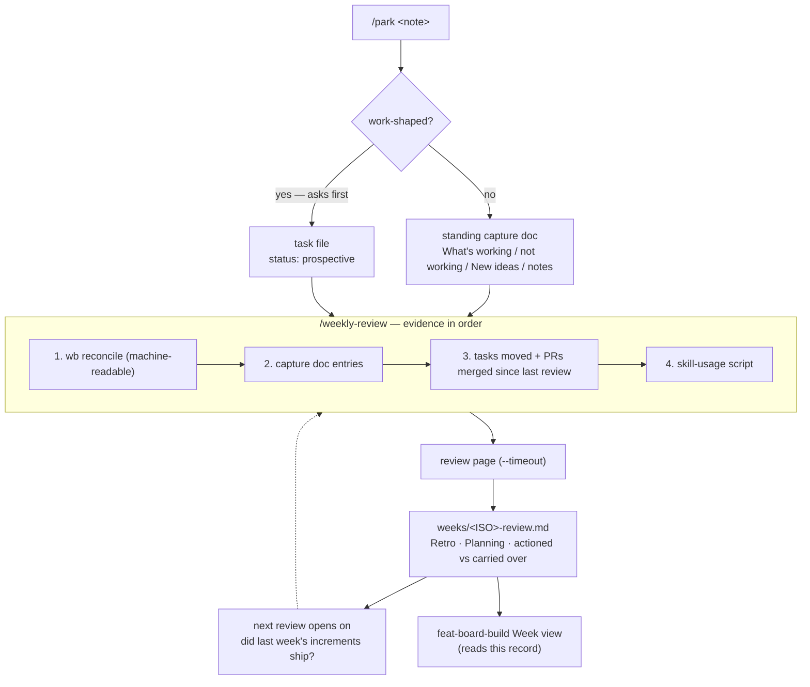
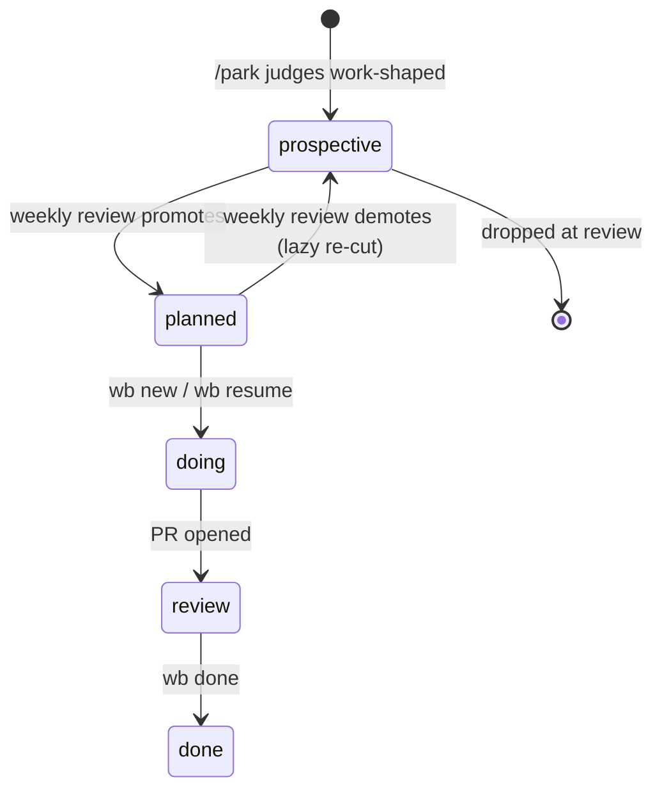

# Weekly review loop — week file, /park capture, review-page ceremony - Plan

## Goal Capsule

- **Objective:** ship the weekly ceremony that replaces the three lapsed dated clocks — a standing capture doc that `/park` writes into, a per-week review served on the review page, and accepted suggestions seeded as tasks through locked `wb` verbs.
- **Product authority:** the parent contract (`docs/plans/2026-09-14-001-feat-workflow-strategy-and-weekly-review-plan.md`, requirements R1–R7) plus the seven design decisions settled 2026-09-15 and recorded in the task file's `## Decisions`.
- **Scope:** child 2 of the parent's five. Siblings own the strategy doc (R8–R12), doing-task triage (R13–R14), the board build (R15–R24) and the ceremonies-doc refresh.
- **Open blockers:** none. All five plan-time call-outs were resolved in chat on 2026-09-15.

**Product Contract preservation:** changed — R1 and R3. R1's "under this task's dossier area" becomes `$TASKS_DIR/weeks/`; R3's "findings-review decision buffer" becomes the review page. Both overrides come from live use recorded in the parent's own Follow-ups ("nvim buffers are the wrong surface for 50+-row reviews") and were re-confirmed 2026-09-15. The parent decision they sit under — task store, not notes store — is preserved unchanged.

---

## Problem Frame

Three dated clocks in `docs/ceremonies.md` lapsed for seven weeks because a date in a document has no trigger. The `/park` ledger has run the other way: capture worked, the review half never closed, and 58 entries accumulated of which 12 were never triaged by *either* of the two reviews that ran — each scoped to a window that missed them. The ledger is invisible to `wb board`, the picker, and everything else, which is why rot there is structural rather than a discipline failure.

The same pattern shows up one level up. Three separate skill-idea batches were created on 2026-07-19, 2026-08-23 and 2026-09-14, each without checking the previous one, producing two genuine duplicate skills. Nothing was watching the store as a whole. That is what this ceremony is for.

---

## Key Technical Decisions

- **KTD1. The week file splits into a standing input doc and a per-week output record.** One long-lived capture surface with four authored sections (`What's working`, `What's not working`, `New ideas`, general notes), never cleared. **Every entry carries a machine-checkable reviewed-state stamp** — the doc is never cleared, so without per-entry state the review either re-offers settled items forever or windows by date and strands anything a skipped week passes over, which is precisely how two `/parked-items` runs stranded 12 of 58 ledger entries. The old JSONL at least stamped each line `status:"open"`; markdown under a heading has no equivalent unless one is written. The review parses it and emits `$TASKS_DIR/weeks/<ISO>-review.md` stating Retro and Sprint-planning findings plus what was actioned vs what carries over. The output record — not the input doc — is the contract `feat-board-build`'s Week view reads.
- **KTD2. `$TASKS_DIR/weeks/` is invisible to the board and picker by construction.** The row source globs `"$TASKS_DIR"/*.md` (`scripts/.config/scripts/tmux/wb.sh:311`) — non-recursive, the same reason `dossiers/` has never appeared as a task row. No exclusion logic is needed.
- **KTD2a. Invisible-by-construction is only safe if something else nudges.** U8 deletes the picker's parked count and `wb done`'s reminder — the only ambient signals that a review was owed — and the `prospective` shelf that would replace them belongs to a sibling. Reproducing the ledger's structural cause is the one failure this plan cannot afford, so `wb_pending_counts` is repointed at the capture doc in U1 rather than waiting on the board.
- **KTD3. Week-file writes go through a new locked `wb week` verb, not `wb append`.** `wb append` resolves its argument against task files; a week file is not one. `wb week` composes the existing `_wb_append_under_heading` and per-task lock rather than introducing a second writer.
- **KTD4. `prospective` is a new status; `umbrella` stays a tag.** The test is mutual exclusivity, not "readers filter on it" — readers filter on tags too (R27 exists for exactly that). A property earns enum membership when it is mutually exclusive with the other statuses and the task moves in and out of it: `prospective` is a lifecycle position, as the state diagram's `planned <-> prospective` transitions show. Umbrella-ness co-occurs with any status — an umbrella task still has a lifecycle — so it is a tag.
- **KTD5. `wb reconcile` grows a public machine-readable mode.** The parseable TSV exists only inside `wb_reconcile_collect`, a shell function. Having the weekly review call it directly would couple a long-lived skill to wb.sh's internals with no test to catch a refactor.
- **KTD6. Skill-usage counting becomes a checked-in script.** The 2026-09-14 inventory was run ad hoc and is not reproducible. Two children need the same numbers (this task's R3, the strategy doc's R9), and the method has real caveats — it cannot see a skill invoked by natural-language match rather than `/name` or a Skill-tool call — which belong recorded in one place.
- **KTD7. `/park` asks before writing a task, not before writing the week file.** A task is a store write and deserves a confirmation; a week-file append is one cheap reversible line. This keeps capture one-line for the common non-work case, which is the property that determines whether anything gets captured at all.

---

## Requirements

Carried from the parent contract (see origin):

- **R1.** A week file is minted once per ISO week, named by week, carrying a recap of the previous review. *Amended:* the recap lives in the per-week output record; the capture surface is standing (KTD1).
- **R2.** Capture during the week appends a dated entry via `/park`, which writes to the week file instead of its standalone ledger. *Amended:* a work-shaped capture instead proposes a `prospective` task and asks first (KTD7); the week file is the fallback when declined.
- **R3.** The review gathers the week's evidence — capture entries, tasks moved and PRs merged since the last review, skill invocations — and presents it **on the review page, never an nvim buffer**.
- **R4.** The review produces at most a handful of suggestions; accepted ones are seeded as tasks tagged `weekly-review` via locked `wb` verbs.
- **R5.** The next review opens by checking whether last week's accepted increments shipped.
- **R6.** `/parked-items` is retired; its reconciliation runs as the review's first evidence step.
- **R7.** Existing ledger entries are migrated or explicitly closed.

Added by this plan (parent numbering stops at R24, so these continue from R25):

- **R25.** `status: prospective` is a valid task status meaning "captured, not yet judged as work", accepted by the status verb and the creation path, and rendered distinctly by the board. **Every existing `status:` reader states its prospective behaviour**: the board's bucket mapping gains a `prospective` arm rather than letting it fall into the `unclassified` catch-all, and `/quick-wins` and the autorun loop declare whether prospective rows are in backlog scope. A demotion must not silently shrink the backlog every other tool shows.
- **R26.** `tags:` is canonically a YAML list; `wb set tags` emits that form, and existing bare-scalar files are migrated.
- **R27.** Tasks touching auth/access-gating carry `data-access`; tasks touching `grid_iron.go`, `match_mode.go` or the session-info flows carry `state-management`. Existing tasks are backfilled.
- **R28.** `wb reconcile` offers a machine-readable output mode suitable for a caller to parse.
- **R29.** Skill-usage counts are produced by a checked-in script that states its own under-count caveats.

---

## High-Level Technical Design

The loop, and where each piece writes:

The status ladder this introduces, and what moves between tiers:

---

## Implementation Units

### U1. `wb week` verb and the week-file contract

**Goal:** one locked verb owning every week-file write, and the published format `feat-board-build` will read.
**Requirements:** R1, R2, R3 (partially), KTD1–KTD3.
**Dependencies:** none.
**Files:**
- `scripts/.config/scripts/tmux/wb.sh` — `cmd_week`, the header usage block, the verb dispatch
- `scripts/.config/scripts/tmux/tests/wb-week.test.sh` (new)
- `scripts/.config/scripts/tmux/tests/wb-help.test.sh` — the new verb must appear in the help screen

**Approach:** three sub-verbs. `wb week path` prints the standing capture doc, creating it from a four-section template when absent. `wb week append <section> <body>` inserts under one of the four sections, reusing `_wb_append_under_heading` and the per-task lock. `wb week record [<iso>]` mints `$TASKS_DIR/weeks/<ISO>-review.md` if absent and prints its path. Reject an unknown section name fail-loud rather than creating it — a typo must not silently invent a fifth section the review will never read.

**Each appended entry is stamped with the ISO date, the capturing repo and the branch** — the same `{ts, cwd, branch}` the ledger carried, and for the same stated reason: the review routes a follow-up task to the right repo, and `wb new` needs a repo argument. Prose under a heading loses that field unless the verb writes it.

**Each entry also carries a reviewed-state marker**, written unset by `append` and flipped by `record`. This is what makes evidence step 2 "every entry not yet reviewed" rather than a date window (KTD1).

**Also in this unit:** repoint `wb_pending_counts` from the ledger's open count to unreviewed capture entries plus days since the last week record, so the picker status line and `wb done` carry a review-due signal (KTD2a). U8 removes the old readers; this replaces them in the same plan rather than leaving a gap.

**Patterns to follow:** `cmd_set`'s resolve → validate → lock → write → confirm shape; `wb_append_handoff` as the thin-composer-over-`_wb_append_under_heading` precedent.

**Gotcha:** `wb help` prints wb.sh's own header block, and `wb-help.test.sh` scrapes the dispatch for public verbs and asserts each appears in help. A new verb fails that test until the header block documents it.

**Test scenarios:**
- `wb week path` on an empty store creates the doc with exactly the four sections and prints its path.
- `wb week path` a second time is idempotent — same path, no second template, no duplicated sections.
- `wb week append "What's not working" "<text>"` inserts under that heading and leaves the other three untouched.
- An unknown section name exits non-zero, names the four valid sections, and writes nothing.
- A body containing double quotes and a `#` round-trips intact (the PR #52 quoting failure).
- `wb week record` mints `weeks/<ISO>-review.md` and is idempotent on a second call.
- Covers R1. A minted record carries the ISO week and a link to the previous week's record when one exists.
- An appended entry round-trips its date, repo and branch stamp intact.
- An entry marked reviewed is not re-offered; an unmarked three-week-old entry still is (the stranding case, asserted directly).
- `wb_pending_counts` reports unreviewed capture entries and days since the last record, and does not read `ledger.jsonl`.
- The new verb appears in `wb help` (guards the header/dispatch drift the help test exists to catch).

### U2. `prospective` status

**Goal:** a status for captured-but-unjudged work, and the four pending assignments applied.
**Requirements:** R25.
**Dependencies:** none.
**Files:**
- `scripts/.config/scripts/tmux/wb.sh` — status enum in `cmd_status`, `wb new --prospective`, `wb_board_bucket_for_status`, the board's status hues, header usage
- `claude/.claude/skills/quick-wins/SKILL.md` — declare whether prospective rows are in backlog scope
- `scripts/.config/scripts/tmux/tests/wb-status.test.sh`, `tests/wb-help.test.sh`
- `$TASKS_DIR/README.md` — status vocabulary

**Approach:** extend the enum rather than re-point `planned`; add `--prospective` to the creation path so `/park` seeds directly without a two-step.

**Board rendering, stated precisely** — "excluded from the default views" is the end state `feat-board-build` delivers, not what happens here. Until its shelf lands, an unrecognised status falls through `wb_board_bucket_for_status`'s catch-all into the **Unclassified tab**, alongside untracked worktrees. So U2 ships a real `prospective` case in that function plus a `.pill.prospective` rule — hues are consumed via `.pill.<status>`, so adding a `--prospective` custom property on its own paints nothing.

**Gotcha:** unlike U1's new verb, this is not only a header-block change — `wb-help.test.sh` asserts the status enum as a **literal string**, so that assertion must be updated the moment `prospective` enters the enum. This exact break happened on 2026-09-15 when `wb set`'s usage line changed.

**Execution note:** apply the four recorded assignments (`notes-dir-concurrency-safety-twin`, `board-next-week-planned-date`, `loop-scope-planned-tasks`, `tasks--task-note-convergence`) only after the enum lands — they are blocked on it today and are the unit's own acceptance evidence.

**Test scenarios:**
- `wb status <task> prospective` sets the field and is accepted by the enum.
- An invalid status is still refused, naming the full valid set including the new value.
- `wb new --prospective <repo> <slug>` creates a task whose status is `prospective` and which has no worktree or session.
- `wb status` still refuses a task with a live session's `@task` pointing at it (regression on the existing guard).
- `tasks--task-note-convergence` moves from the invalid `open` to `prospective` — proving the migration path for a drifted value.
- Board render includes a `--prospective` hue token and does not crash on a task carrying the new status.
- `wb_board_bucket_for_status prospective` returns its own bucket, NOT `unclassified` — the catch-all would hide every demoted task.
- A demoted task's visibility in `/quick-wins` matches whatever the declared scope says, so a lazy re-cut cannot silently shrink the backlog.

### U3. Machine-readable `wb reconcile`

**Goal:** a parseable drift report the weekly review can consume without reaching into wb.sh internals.
**Requirements:** R28, R6.
**Dependencies:** none.
**Files:**
- `scripts/.config/scripts/tmux/wb.sh` — `cmd_reconcile`
- `scripts/.config/scripts/tmux/tests/wb-reconcile.test.sh` — the suite that already owns `cmd_reconcile`'s plain output, and so the home for both the new mode and the human-output regression
- `scripts/.config/scripts/tmux/tests/wb-reconcile-review.test.sh` — covers `--review`/`--apply` only; it never exercises plain `cmd_reconcile`

**Approach:** expose `wb_reconcile_collect`'s existing TSV through a flag on the public verb. Do not reshape it — publish what exists. **The fifth field is not one thing**, and the verb's help text must say so or KTD5's whole purpose fails:
- `orphan<TAB>repo<TAB>branch<TAB>worktree<TAB>merge-status`
- `missing<TAB>repo<TAB>branch<TAB>worktree<TAB>task-file-path`

A caller that assumes a single field-five meaning reads an absolute path where it expects a merge status.

**Test scenarios:**
- With no drift, the machine-readable mode prints nothing and exits 0 (distinct from the human mode's "no drift found" line).
- An orphan row's fifth field is a merge status.
- A missing row's fifth field is a task-file path — asserted separately, because the two kinds do not share a field-five meaning.
- The mode is read-only: the store and worktrees are byte-identical afterwards.
- The human-readable output is unchanged by this work (regression — it is what the existing test asserts).

### U4. Skill-usage counting script

**Goal:** reproducible per-skill usage counts, with the method's blind spots stated in the tool rather than rediscovered.
**Requirements:** R29, R3.
**Dependencies:** none.
**Files:**
- `scripts/.config/scripts/skill-usage.sh` (new)
- `scripts/.config/scripts/tmux/tests/skill-usage.test.sh` (new)

**Approach:** count two textual patterns over the transcript store — the slash-command tag and the Skill-tool invocation block, normalising plugin-prefixed names to bare — scoped by a `--since` window, and emit a per-skill count. Print the under-count caveat as part of the output, not only in a comment: a skill reached by natural-language description surfaces neither pattern, so a zero is "not detected", never "unused". Date each skill's first/last sighting from the transcript file rather than claiming per-line precision the method does not have.

**Test scenarios:**
- Against a fixture transcript containing both invocation forms, each is counted once.
- A plugin-prefixed name normalises to its bare name and merges with a bare-form hit for the same skill.
- A skill mentioned only in prose (no tag, no tool block) is reported as zero, and the output carries the not-detected caveat.
- `--since` excludes a transcript outside the window.
- A malformed / truncated JSONL line does not abort the run — the script skips it and continues.
- Exit code is 0 when the transcript directory exists but matches nothing.

### U5. Canonical `tags:` — emit and migrate

**Goal:** one tag form, and the existing drift repaired.
**Requirements:** R26.
**Dependencies:** none.
**Gates:** U9 — R4 seeds tasks tagged `weekly-review`, so the canonical writer must exist before the first live run.
**Files:**
- `scripts/.config/scripts/tmux/wb.sh` — the `tags` branch of `cmd_set`
- `scripts/.config/scripts/tmux/tests/wb-set.test.sh`
- `$TASKS_DIR/*.md` via `wb set` only — never a direct edit

**Approach:** normalise whatever `wb set tags` is handed (`a,b`, `a, b`, `[a, b]`) into the documented list form, then migrate the bare-scalar files — **5 as of 2026-09-15, all reading `tags: action-live`**. (The figure was 13 earlier that day; the other 8 were normalised to list form while tagging the skill tasks in the same session, so a stale count would send the implementer hunting for files that no longer exist.) The domain-tag backfill is U10 — split out because nothing in the ceremony consumes it.

**Test scenarios:**
- `wb set tags "a,b"` writes `[a, b]`; `"a, b"` and `"[a, b]"` produce the identical result (idempotent across input shapes).
- Setting tags on a file that already has a list merges rather than clobbers, and does not duplicate an existing tag.
- `wb set tags --unset` still clears the field (regression on the just-shipped behaviour).
- A tag value containing whitespace-then-`#` is still refused by the shared frontmatter validator.
- Post-migration, no task file in the store carries a bare-scalar `tags:` value.

### U6. `/park` rewritten thin

**Goal:** one-line capture that proposes a destination and asks only when it would write a task.
**Requirements:** R2, KTD7.
**Dependencies:** U1, U2.
**Files:**
- `claude/.claude/skills/park/SKILL.md`
- `docs/guides/park.md`

**Approach:** the skill judges work-shaped vs not, states its judgement in one line, and acts. Non-work appends to the capture doc via `wb week append` and reports what it did. Work-shaped proposes a `prospective` task and **asks before creating it**, offering the week file as the alternative. Every value reaches `wb` as argv, never interpolated into a composed string — the PR #52 finding. Drop the ledger-writing recipe entirely.

**Test scenarios:** *Prose skill — no shell suite.* Proven by the first live run (U9): one non-work capture lands in the right section without a prompt; one work-shaped capture asks first and, on approval, produces a `prospective` task; a note containing quotes survives the round trip.

### U7. `/weekly-review` skill

**Goal:** the ceremony itself — evidence, review page, output record, seeded tasks.
**Requirements:** R3, R4, R5, R6.
**Dependencies:** U1, U2, U3, U4.
**Files:**
- `claude/.claude/skills/weekly-review/SKILL.md` (new)
- `docs/guides/weekly-review.md` (new)

**Approach:** evidence in a fixed order — machine-readable `wb reconcile` first (R6), then the capture doc's entries, then tasks moved and PRs merged since the last record, then skill-usage counts. Classify each capture (task idea / skill idea / grievance / workflow improvement), route grievances and workflow observations to Retro and ideas to Planning, and serve the batch on the review page **with `--timeout`**, documenting the `--reattach` recovery path. Emit `weeks/<ISO>-review.md` with the two roll-ups plus actioned-vs-carried-over. Seed accepted suggestions in two steps — `wb new --prospective`/`--planned`, then `wb set <task> tags weekly-review`. **`wb new` has no `--tags` flag**; its parser accepts only `--agent --planned --jira --title --parent --path --depends-on --size` and pushes anything else into the positional args, so a single combined call fails as a usage error. Values pass as argv throughout.

Open the review by checking last week's accepted increments against merged PRs and `done` tasks (R5). Reuse `/parked-items`' reconciliation rule rather than inventing one: an item is already covered if a matching task exists for that repo or it was handled in the same session — read the store and check, do not trust the capture text.

**Test scenarios:** *Prose skill.* Proven by U9 against the 2026-09-14 fixture: the reconcile block appears first; each of the fixture's 8 skill ideas, 2 loop ideas and the ceremonies requirement is classified and routed; at most five suggestions reach the page; the emitted record names what was actioned and what carries over.

### U8. Retire `/parked-items` and archive the ledger

**Goal:** the old ritual gone, its history preserved somewhere with a remote.
**Requirements:** R6, R7.
**Dependencies:** U7 (the replacement must exist first).
**Files:**
- `claude/.claude/skills/parked-items/` — deleted
- `docs/guides/parked-items.md` — deleted
- `docs/docgen.json` — only if a `guideOverrides` entry is needed for the new skill
- `$TASKS_DIR/dossiers/dotfiles--feat-weekly-review/ledger-archive-2026-09-15.md` (new)
- `scripts/.config/scripts/tmux/wb.sh` — `wb_parked_count`, `wb_board_ledger_matches`, and `cmd_done`'s "consider running /parked-items" nudge
- `claude/.claude/skills/close-out/SKILL.md` — it currently writes ledger lines "reconciled weekly by /parked-items"
- `claude/.claude/skills/quick-wins/SKILL.md` — reads the ledger as one of its three backlog sources
- `docs/wb-guide.md`, `docs/glossary.md` — both describe the ledger and the retired review
- `docs/guides/parked-items.html` — deleted by hand; **docgen only generates, it never prunes**, so deleting the source `.md` leaves its rendered twin behind

**Execution note:** re-run `stow -R --no-folding -t "$HOME" claude` after deleting the skill directory. Stow does not un-link on source deletion, so `~/.claude/skills/parked-items/SKILL.md` would otherwise be left as a dangling symlink into a path that no longer exists.

**The deletion is not the hard part — the live readers are.** Five of them still read `ledger.jsonl` or name `/parked-items`. Left alone, the picker silently reports zero parked items, `wb done` recommends a skill that no longer exists, and — worst — `/close-out` keeps writing ledger lines, **recreating the deleted file as an invisible store nothing reviews**. That is the rot this plan exists to end, reintroduced by omission. Repoint each reader at the capture doc and `/weekly-review`.

**Approach:** render all 58 ledger entries to a markdown archive in the task dossier and commit it — the tasks repo has a remote, `~/.claude/` does not, which is the whole reason for the move. Then delete `ledger.jsonl`. Close R7's remaining payload in the same pass — the twelve untriaged entries break down as eight needing only a status stamp, three superseded, and one genuinely live, already seeded as `dotfiles--gnome-tiling-wm-migration`. The third superseded entry is the wb-board local server: it had a task when this plan was drafted, and that task was dropped the same day as superseded by `feat-board-build`, so it closes as superseded rather than stamped.

**Gotcha:** removing a guide page, or adding the new skill without one, produces a *non-fatal* `docgen: warn: skill "<name>" has no guide page`. It will not block the commit, so it is easy to leave nagging — U7 adds `docs/guides/weekly-review.md` precisely to avoid it.

**Test scenarios:**
- After the archive, every one of the 58 entries is present in the markdown record with its timestamp, repo and note.
- `docgen.sh all` emits no `has no guide page` warning for `park` or `weekly-review`, and none for `parked-items` (the skill is gone, so it is no longer enumerated).
- No task file references the deleted skill in a `parent:` or `depends_on:` field.
- **No file anywhere in the repo still references `ledger.jsonl` or `/parked-items`** — a single repo-wide grep, asserted to be empty. This is the test that would have caught all five readers.

### U9. First live run — the done-definition

**Goal:** prove the ceremony by running it, not by shipping it.
**Requirements:** R3, R4, R5 — and the task's own acceptance criterion.
**Dependencies:** U1–U8. Explicitly NOT U10 — the backfill is unrelated to the ceremony running.
**Files:** `$TASKS_DIR/weeks/` (the first records), `$TASKS_DIR/dotfiles--feat-weekly-review.md` via `wb append`.

**Approach:** run `/weekly-review` against this week's real data with the 2026-09-14 live-feedback capture as seeded input.

**Execution note — the live run cannot happen from this worktree.** The repo deploys by stow: `~/.config/scripts/tmux/wb.sh` and `~/.claude/skills/*` symlink into `~/code/dotfiles` (the main checkout), never into `.worktrees/`. Invoking `wb week` or `/weekly-review` here would silently exercise the main checkout's copies or fail with `unknown verb 'week'`. So U9 runs **after the branch merges and `stow --no-folding -t "$HOME" claude` has been re-run**. Since U9 is the Definition of Done, this task closes after the merge, not before it. Machinery that has never been run once is the exact failure mode — 4a capture measured unused, three clocks lapsed — that this family exists to correct, which is why this is a unit rather than a follow-up.

**Verification:** a week record exists carrying both roll-ups; at most five suggestions were offered; accepted ones exist as tagged tasks; and `wb reconcile` output appears as the first evidence block.

**Two numbers, recorded in every week record** — replacing "surfaced something the author had not already written down", which no run can fail when the author wrote the input the day before and judges the output in the same session:
1. suggestions accepted vs dropped;
2. suggestions already covered by an existing task (the review's duplicate rate).

**Seed a dated week-3 re-evaluation task** that reads those numbers across the first three records against a stated cut threshold. The named decay risk lands around week three while the only observation happens in week one — without an owner and a date, "cut it if it stops earning its keep" has nobody to act on it.

### U10. Required domain-tag backfill

**Goal:** apply `data-access` and `state-management` to the existing tasks that should already carry them.
**Requirements:** R27.
**Dependencies:** U5 (the canonical writer).
**Does NOT gate:** U9 or the Definition of Done. Nothing in the ceremony reads these tags — they exist so a later sweep can find every task touching those surfaces. Split out of U5 on the 2026-09-15 scope review, which found the backfill gating a working ceremony's completion.
**Files:** `$TASKS_DIR/*.md` via `wb set` only.

**Approach:** `data-access` on auth/access-gating/org-scoping/visibility tasks — the `club-half-projection` family, `competition-*`, `unify-single-session-read-auth`, `match-tracker-enforce-org-access`. `state-management` on `session-tree-fidelity`, `sessioninfo-sync-and-session-start-clobber`, `metrics-server-state-management` and the rest of the `grid_iron.go` / `match_mode.go` / session-info-flow set.

**Execution note:** per-task judgement, not a regex sweep — read each candidate's body before tagging. Additive only: merge into an existing tag list, never replace it.

**Test scenarios:**
- A tagged task's pre-existing tags survive the backfill (additive, verified per file).
- A task that merely mentions auth in prose but does not touch an access path is NOT tagged — the rule is about the surface the work touches.
- After the pass, every task matching the README's stated surfaces carries its required tag.

---

## Verification Contract

- `bash scripts/.config/scripts/tmux/tests/wb-week.test.sh`, `wb-set.test.sh`, `wb-status.test.sh`, `wb-help.test.sh`, `wb-reconcile.test.sh`, `wb-reconcile-review.test.sh`, `skill-usage.test.sh` all pass.
- The full Docker suite is compared against the known-failing baseline — five env-dependent files are the floor on a clean tree, so a raw exit 1 is not itself a regression.
- No task file under `$TASKS_DIR` was modified by anything other than a `wb` verb.
- `docgen.sh all` succeeds with no `has no guide page` warning for a skill this plan ships or keeps.

## Definition of Done

U1–U9 complete, the first live review has run and produced a week record, `/parked-items` and the JSONL ledger are gone with the history archived under a remote, and the four blocked `prospective` assignments are applied. U10 (the domain-tag backfill) ships in this plan but is deliberately outside the done-definition — it has no consumer in the ceremony, and gating a proven loop on unrelated cross-repo tagging is how working things stay unfinished.

---

## Scope Boundaries

- **The `prospective` shelf's board rendering** — `feat-board-build` owns every view; this plan ships the status, the hue token and the convention.
- **Umbrella filtering in the board/picker** — same owner. Umbrella-ness is a tag, documented in the store README; nothing here filters on it.
- **The skills-group audit's held rows** — ten rows (the three skill-idea batches' merges) are unapplied pending that audit's outcome; unrelated to this loop.
- **The strategy doc, doing-task triage, board build, ceremonies refresh** — the four sibling children.
- **Calendar or hook-based triggering** — the review stays manually invoked until it has proven itself, per the parent's own decision.

### Deferred to Follow-Up Work

- Migrating the remaining `planned` pile to `prospective` — settled as a lazy re-cut each review touches, not a bulk pass.
- `wb set` gaining a rename/retitle verb — surfaced when the date-named umbrella could not be repurposed in place.

---

## Risks

- **The review is a chore after three weeks.** Mitigated by capping suggestions at five and by U9 proving the first run produces something the author did not already know. If it does not, that is the signal to cut the ceremony, not to automate it harder.
- **Classification at capture time is wrong often enough to annoy.** The one-line "here's what I did" makes a correction cheap, and the fallback — two explicit verbs — is a small change if it proves necessary.
- **The transcript method's blind spot misleads.** A natural-language-invoked skill reads as zero. The script prints the caveat with the numbers so a zero is never read as "unused" — the same mistake the 2026-09-14 inventory flagged against `/park` itself.

## Notes for the implementer

- **The capture doc's template must put a blank line before every `## ` heading.** `_wb_append_under_heading`'s heading detector only treats `## ` as a heading when it follows a blank line or is line 1 — otherwise `wb week append` silently falls through to its append-at-EOF branch and the section routing quietly stops working.
- **This plan lands two commits in two repos.** The dotfiles branch carries the code, skills and docs; `$TASKS_DIR` separately receives the README status/tag vocabulary (U2, U5) and the ledger archive under `dossiers/` (U8). Neither is a task file, so the "only `wb` verbs touch the store" contract still holds — but the second repo needs its own commit and push.

## Open Questions (execution-time)

- The exact four section headings in the capture doc — settled in spirit, worth one pass in the real file before the format is published as a contract.
- Whether the output record needs a machine-readable block for `feat-board-build`, or whether heading-scoped markdown is enough. Decide with that sibling rather than guessing.

## Sources

- Parent contract: `docs/plans/2026-09-14-001-feat-workflow-strategy-and-weekly-review-plan.md`
- Settled decisions D1–D7 and the two 2026-09-15 audits: `$TASKS_DIR/dotfiles--feat-weekly-review.md` `## Decisions`
- Live-use requirements and the acceptance fixture: `$TASKS_DIR/dossiers/dotfiles--workflow-strategy-and-ceremonies/feedback-2026-09-14-live-week-input.md`
- Grounding on `/park`, the notes store and task-store conventions: `$TASKS_DIR/dossiers/dotfiles--workflow-strategy-and-ceremonies/grounding-weekly-file-2026-09-14.md`
- Review-page close contract: `claude/.claude/skills/review-page/references/spec-and-close-contract.md`
