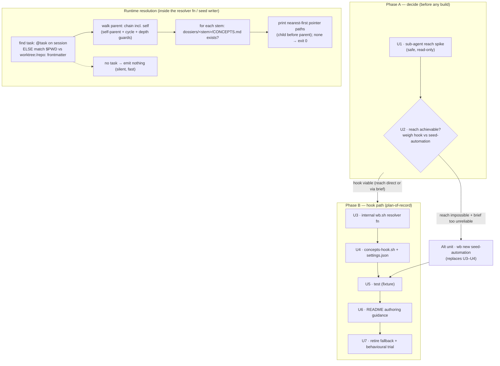

# feat: task-family CONCEPTS.md resolved for every worktree agent

**Target repo:** `dotfiles` (worktree `feat/task-family-concepts-hook`). Files under
`scripts/.config/scripts/tmux/` are repo-relative and stow to `~/.config/scripts/tmux/`.
Two locations are **outside** this repo and are named absolutely on purpose: `~/.claude/settings.json`
(home) and the task store `~/code/tasks/**`. The wb hub for this work is
`~/code/tasks/dotfiles--feat-task-family-concepts-hook.md` (`## Plan` + `## Decisions`); this file is
the detailed implementation plan it points to.

---

## Summary

Give every Claude agent working in any worktree of a task family one shared source of settled facts —
the family's `CONCEPTS.md` — without copying content or hand-seeding worktrees. The motivating incident
(2026-09-21): a wrong "how is the post-processor triggered" claim propagated through five planning docs,
plausibly via sub-agents. A working manual fallback already exists (an untracked `CLAUDE.local.md` with an
`@…/CONCEPTS.md` import, git-excluded in two worktrees) but must be hand-seeded per worktree and misses
worktrees created by other means.

This plan is **fork-shaped by design** (Decision D2): it does not assume the hook is the right mechanism.
Phase A runs a safe, read-only spike to answer the one load-bearing unknown — does injected context reach
Task-tool **sub-agents**? — then weighs a per-prompt **hook** against automating the **proven seeded file**
at `wb new` time, and commits. Phase B builds the chosen mechanism. The gating spike comes *before* build so
we never retire a working fallback for an unproven replacement.

Full triage provenance: `~/code/tasks/dossiers/dotfiles--feat-task-family-concepts-hook/decision-records/ce-doc-review-triage-2026-09-21.md`.

---

## Problem Frame

- **Need.** Per-family settled facts, authored once, treated like `AGENTS.md` by every agent in every related
  worktree — and actually *honoured*, not merely visible.
- **Weakness of the current manual fallback.** Needs seeding/backfill per worktree; misses worktrees created by
  other means; writes into the repo working tree. (It does two things right that any replacement must not
  regress: it **auto-inlines** the content, and it **reaches sub-agents** because they load the cwd's
  instruction files.)
- **Scope boundary.** This delivers the *mechanism*. Whether the CONCEPTS convention itself earns its keep is
  judged by the weekly review (capture entry already exists, 2026-09-21). Do not touch the sibling task
  `dotfiles--wb-hooks-parent-task-roadmap-upkeep` (related concern, different mechanism); note any shared
  helper as a follow-up there rather than merging scope.

---

## Key Technical Decisions

Settled inputs D1–D12 come from the `ce-doc-review` triage folded into the origin task file's `## Decisions`.
The decisions below restate the ones that shape implementation and add the KTDs planning resolved.

- **KTD1 — Prove sub-agent reach before building anything (D1).** The single load-bearing unknown. Claude Code
  hooks (`UserPromptSubmit`, `SessionStart`) are documented for the top-level session; it is unverified whether
  their injected context reaches Task-tool sub-agents (which receive no user prompt). Because the original
  drift plausibly happened *in* sub-agents, a mechanism that doesn't reach them fails at its actual job. U1
  answers this empirically with a **safe, non-destructive, read-only** probe (Jet's constraint) before any wb
  or settings.json change.
- **KTD2 — Weigh hook vs. seed-automation, don't assume (D2).** Two viable mechanisms; U2 chooses between them
  using U1's result. See Alternatives Considered for the full pros/cons. Plan-of-record below assumes the hook
  wins *iff* U1 shows reach is achievable (directly or via the delegation-brief convention); if U1 shows reach
  is impossible and the brief convention is judged too unreliable, U2 pivots to seed-automation and U3–U4 are
  replaced by the alternative unit (still using U5–U7 largely unchanged).
- **KTD3 — Delegation-brief is the primary sub-agent mechanism, not a fallback (D1).** Regardless of hook vs
  seed, the top-level agent passing the resolved CONCEPTS path in every sub-agent delegation brief is the
  *primary* way sub-agents get the facts. The "SessionStart-hook-that-fires-for-sub-agents" idea is a
  hypothesis U1 tests, not a plan-of-record fallback.
- **KTD4 — Pointer, never inlined (D6).** Emit a pointer block naming the resolved path(s) nearest-first; never
  inline file contents; no size threshold. (This is the one property the hook loses vs the `@import` fallback —
  called out in Alternatives.)
- **KTD5 — Internal `wb.sh` function, not a public verb (D5).** The hook is the sole caller, so the parent-walk
  resolver is an internal `wb.sh` function the hook sources/calls — no `wb concepts-path` CLI verb, no dispatch
  arm, no `cmd_help` line. Removed from the "still open" list. (Revisit only if a manual/debug use case appears.)
- **KTD6 — Hook event stays open, decided with U1 (D4).** Do not hard-commit `UserPromptSubmit`. The event
  (`UserPromptSubmit` every turn vs `SessionStart` once/session — cheaper, closer to how `AGENTS.md` loads) is
  decided in U2 alongside the reach result, since reach may differ by event. U4 must not bake the event in
  before U2.
- **KTD7 — Done = adoption, not visibility (D3/D8).** "Injected" is not "done". Completion requires a
  behavioural check (an agent asked a settled-fact question actually consults the CONCEPTS.md) and the seeded
  fallback is retired only after **sub-agent** honouring is verified, with the 5-line pointer format preserved
  for reconstruction.
- **KTD8 — settings.json is safe to edit directly (D9/D10).** Verified: `cmd_install_hooks`
  (`scripts/.config/scripts/tmux/wb.sh:4189`) manages only the PreToolUse `pretooluse-guard.sh` entry — it does
  **not** own `UserPromptSubmit` wiring. So U4 edits `~/.claude/settings.json` directly; drop the "first confirm
  cmd_install_hooks doesn't own it" precondition. The live `UserPromptSubmit` entry is a single object with a
  `hooks` array and **no `matcher` key**.

---

## High-Level Technical Design

The fork gate and the runtime resolution chain:

Prose is authoritative where it and the diagram disagree.

---

## Implementation Units

### U1. Sub-agent reach spike (safe, read-only)
- **Requirements:** KTD1, KTD3. Gates all build work.
- **Dependencies:** none.
- **Files:** none committed to `wb.sh`/settings during the spike. Record the finding in the origin task file's
  `## Decisions` (append a D1-result line) and in the dossier
  `~/code/tasks/dossiers/dotfiles--feat-task-family-concepts-hook/`.
- **Approach:** Empirically answer three questions **without any destructive action** (Jet's constraint —
  read-only probes, a throwaught test hook that only *emits a marker string*, no `rm`, no store writes, no
  worktree mutation): (1) Does a `UserPromptSubmit` hook's `additionalContext` marker appear in a Task-tool
  sub-agent's context? (2) Does `SessionStart` fire at all for sub-agent sessions, and if so does its context
  reach them? (3) Is the delegation-brief path (parent includes the marker in a sub-agent brief) reliable in
  practice? Use a temporary hook that injects a unique sentinel and a trivial sub-agent that echoes whether it
  saw the sentinel. Remove the temporary hook afterward.
- **Execution note:** This is a spike — the deliverable is a documented finding, not code. Prefer the smallest
  probe that answers the three questions; do not build the real hook here.
- **Test scenarios:** `Test expectation: none -- spike/finding unit, no shipped behavior.`
- **Verification:** A written D1-result in the task file stating, for each of the three questions, observed
  yes/no with the evidence (what the sub-agent saw). No files left mutated; temporary hook removed.

### U2. Approach decision — hook vs. seed-automation (D2 gate)
- **Requirements:** KTD2, KTD6.
- **Dependencies:** U1.
- **Files:** append the decision to the origin task file's `## Decisions` (resolve D2 and D4).
- **Approach:** Using U1's result, decide (a) hook vs `wb new` seed-automation and (b) if hook, which event
  (`UserPromptSubmit` vs `SessionStart`). Record pros/cons actually weighed (see Alternatives Considered) and
  the chosen path. If reach is achievable (directly, or the brief convention is judged reliable enough) → hook
  path (U3–U7). If reach is impossible **and** the brief convention is judged too unreliable → seed-automation
  (Alt unit + U5–U7).
- **Test scenarios:** `Test expectation: none -- decision unit.`
- **Verification:** `## Decisions` names the chosen mechanism + event with one-line rationale grounded in U1.

### U3. Internal `wb.sh` CONCEPTS resolver function
- **Requirements:** KTD4, KTD5. Resolution chain R1/R3/R4/R5 above.
- **Dependencies:** U2 (hook chosen).
- **Files:** `scripts/.config/scripts/tmux/wb.sh` (new internal function, e.g. `_wb_concepts_paths`; **no** CLI
  dispatch arm, **no** `cmd_help` line).
- **Approach:** Read-only internal function. Resolve the start task: `wb_session_task_file "$session"`
  (`wb.sh:548`) **and**, when that yields nothing, the `$PWD`-against-`worktree:`/`repo:`-frontmatter fallback
  the resolution chain promises (D7) — so sessions not created by `wb new` are covered, not silently dropped.
  Walk the `parent:` chain (including the task itself) via `wb_get_frontmatter` (`wb.sh:131`) →
  `$TASKS_DIR/<stem>.md`, guarding self-parent with `wb_task_own_parent` (`wb.sh:509`) and cycles with a
  seen-set + depth cap. For each stem, if `$TASKS_DIR/dossiers/<stem>/CONCEPTS.md` exists, print its path —
  **nearest-first** (child before parent). Print nothing and return non-error when none exist anywhere. Reuse
  existing helpers only; add no new frontmatter parsing.
- **Patterns to follow:** the `$TASKS_DIR/dossiers/<stem>` construction at `wb.sh:2823` and `wb.sh:6502`; the
  `wb_task_own_parent` guard usage at `wb.sh:1296`/`wb.sh:6824`.
- **Test scenarios (implemented in U5):**
  - 3-level family (umbrella + child + grandchild) with `CONCEPTS.md` at two levels → paths printed nearest-first.
  - Task with no dossier `CONCEPTS.md` anywhere in the chain → prints nothing, exit 0.
  - Session resolves to no task (neither `@task` nor `$PWD` match) → prints nothing.
  - `$PWD`-only resolution (no `@task`) in a worktree matching a task's `worktree:`/`repo:` frontmatter → resolves.
  - Cycle in `parent:` chain → terminates (seen-set/depth cap), no infinite loop.
  - Self-parent (`parent:` == own stem) → ignored, no double-count.
- **Verification:** invoked against this task's own family, prints the family `CONCEPTS.md` path(s) nearest-first;
  a task with none prints nothing and exits 0.

### U4. `concepts-hook.sh` + `~/.claude/settings.json` wiring
- **Requirements:** KTD3, KTD4, KTD6, KTD8.
- **Dependencies:** U2 (hook + event chosen), U3.
- **Files:** new `scripts/.config/scripts/tmux/concepts-hook.sh` (stows to `~/.config/scripts/tmux/`); edit
  `~/.claude/settings.json` (home, outside repo — allowed).
- **Approach:** Mirror `claude-notify-hook.sh` conventions (`set -uo pipefail`, guard stdin when not a tty,
  always `exit 0`, no-op outside tmux). Call the U3 resolver; if it prints ≥1 path, emit the event's
  `additionalContext` JSON with a **pointer** block (never inlined — KTD4) that: names each path nearest-first;
  instructs "treat as part of `AGENTS.md`; overrides older dossier docs on conflict; add newly-settled facts
  here"; and **instructs the agent to pass the resolved CONCEPTS path(s) in every sub-agent delegation brief**
  (KTD3 — the primary sub-agent mechanism). Emit nothing (exit 0, no stdout) when the resolver is empty or
  errors — silent + fast for non-wb sessions; never writes a file.
- **Wiring (KTD8):** append a second command to the existing `UserPromptSubmit` hooks-array entry (which has
  **no `matcher` key**), alongside `claude-notify-hook.sh start`, each with its own `timeout: 5`. If U2 chose
  `SessionStart`, wire under that event instead. No `cmd_install_hooks` precondition — it doesn't own this wiring.
- **Execution note:** mostly script + config; prefer a runtime smoke check (open a session, see the pointer)
  over unit coverage for the wiring itself.
- **Test scenarios:** resolver-empty → hook emits nothing (covered in U5 by invoking the hook with a
  no-CONCEPTS fixture); resolver-non-empty → hook emits well-formed `additionalContext` JSON containing the
  pointer + the delegation-brief instruction. Malformed/empty stdin outside tmux → exit 0, no output.
- **Verification:** in a seeded worktree the first prompt shows the pointer; outside any wb task nothing is
  injected; cost is one resolver call.

### U5. Test — `tests/tasks-concepts-hook.test.sh`
- **Requirements:** exercises U3 (+ U4 emit shape).
- **Dependencies:** U3 (and U4 for the emit-shape assertions).
- **Files:** new `scripts/.config/scripts/tmux/tests/tasks-concepts-hook.test.sh`; register in the suite runner.
- **Approach:** Fixture `TASKS_DIR` with a 3-level family (umbrella + child + grandchild) and
  `dossiers/<stem>/CONCEPTS.md` at two levels (kept at 3 levels per D11 — guards/fixture unchanged). Invoke the
  resolver and the hook as subprocesses with `TASKS_DIR=<fixture>`, same fixture-dir + assert-helper convention
  as `tests/tasks-agent-hook.test.sh` and `tests/tasks-git-hook.test.sh`. Assert all U3 scenarios (ordering,
  empty, no-task, `$PWD`-only, cycle, self-parent) and U4's emit shape (pointer + delegation-brief instruction
  present; empty→no output).
- **Verification:** test passes; full wb suite still at its known env-dependent floor — **re-baseline via
  clean-room compare** (see the wb-test-sandbox memory), do not read a raw exit 1 as a regression; INDEX regen
  drift is benign.

### U6. README authoring guidance
- **Requirements:** the "what belongs where" convention.
- **Dependencies:** none (can land any time after U2).
- **Files:** `~/code/tasks/README.md` (task store, outside repo — store write, allowed).
- **Approach:** Add a terse "## What goes where (CONCEPTS vs task vs dossier)" section — the four-doc division
  (CONCEPTS = current-state settled facts / decisions log = immutable ADR-style / dossier = reasoning / task
  file = status + handoffs) + the rule-of-thumb (behaves → fact; argument → reasoning; progress → task). Lift
  from the umbrella source, named explicitly (D12):
  `~/code/tasks/dossiers/be--monorepo--spike-port-post-processor-to-metric-server/CONCEPTS.md`.
- **Test scenarios:** `Test expectation: none -- docs.`
- **Verification:** section present and consistent with the umbrella + the family's `living-task-store-plan.html`.

### U7. Retire seeded fallback + live behavioural trial
- **Requirements:** KTD7 (D3 adoption + D8 gate/rollback).
- **Dependencies:** U4 (+ U5) verified live in both seeded worktrees.
- **Files (delete, only after the gate below passes):**
  `~/code/be--monorepo/.worktrees/spike-port-post-processor-to-metric-server/CLAUDE.local.md` and
  `~/code/lib--algorithms/.worktrees/feat/post-processor-manifest-schema/CLAUDE.local.md`, plus their
  `.git/info/exclude` lines in each repo. **First** preserve the working 5-line pointer format verbatim in this
  plan's dossier (`decision-records/` or a `seed-format.md`) so the fallback is reconstructable if the hook
  later regresses (D8).
- **Gate (KTD7):** delete **only after** (a) the hook is confirmed injecting the pointer in both seeded
  worktrees at top level, **and** (b) the **sub-agent** honouring question is verified (a delegated sub-agent,
  asked a settled-fact question, correctly consults the CONCEPTS.md — the D3 behavioural check), not merely that
  the pointer is visible. If (b) fails, do not delete; keep the fallback and record the gap for the weekly review.
- **Execution note:** destructive (deletes files + exclude lines) — confirm with Jet before the deletions per
  his standing "confirm before deletes" rule; the reconstruction copy must exist first.
- **Test scenarios:** `Test expectation: none -- live trial + retirement; the behavioural check is manual.`
- **Verification (done-when):** seeded worktree shows the pointer on first prompt with seeded files gone; a
  sub-agent honours a settled fact; a non-wb session shows nothing; README carries the guidance; both seeded
  files + exclude lines removed; 5-line format preserved in the dossier.

---

## Alternatives Considered

- **`wb new` seed-automation (the D2 alternative to the hook).** Have `wb new` write the `CLAUDE.local.md`
  pointer + `@import` (and add the `.git/info/exclude` line, reusing `wb_ensure_repo_ignore`, `wb.sh:813`) at
  worktree-creation time.
  - *Pros:* keeps the two properties the hook loses — **auto-inline** (content in context, not a pointer an
    agent can skip) and **proven sub-agent reach** (cwd instruction files load for sub-agents); fixes the manual
    fallback's real weaknesses (backfill toil, per-worktree seeding); no per-prompt cost.
  - *Cons:* writes into the repo working tree (mitigated by the existing exclude pattern); not runtime —
    reparenting or adding a `CONCEPTS.md` later needs a re-seed; misses worktrees created outside `wb new`
    (though the `$PWD` resolver in U3 is a hook-path answer to the same gap).
  - *Chosen iff:* U1 shows hook context cannot reach sub-agents **and** the delegation-brief convention is
    judged too unreliable. Then this replaces U3–U4; U5–U7 adapt (U5 tests the seed writer; U7's behavioural
    trial and 5-line-format preservation still apply).
- **Public `wb concepts-path` verb** (original draft) — rejected (KTD5): one consumer, unnecessary CLI surface.
- **Inline CONCEPTS contents in the hook** — rejected (KTD4/D6): pointer-only is settled.
- **`SessionStart`-hook-that-fires-for-sub-agents as a reliable fallback** — demoted to a U1 hypothesis
  (KTD3); Claude Code's hook model likely doesn't fire session hooks for Task-tool sub-agents.

---

## Scope Boundaries

- **In scope:** the reach spike, the approach decision, the chosen mechanism (hook plan-of-record), its test,
  README guidance, and gated retirement of the manual fallback.
- **Out of scope / deferred:** the sibling task `dotfiles--wb-hooks-parent-task-roadmap-upkeep` (different
  mechanism — note any shared helper there, don't merge); whether the CONCEPTS convention itself is worth
  keeping (weekly-review judgment, capture entry exists).

---

## Open Questions

- **Resolved by U1/U2 at execution time (not now):** does injected context reach sub-agents; hook vs
  seed-automation; `UserPromptSubmit` vs `SessionStart`. These are deliberately gated to the spike, not guessed
  here.

---

## Definition of Done

The chosen mechanism injects the family `CONCEPTS.md` **pointer** on the first prompt in both seeded worktrees
(seeded files removed); a delegated sub-agent, asked a settled-fact question, correctly consults the
`CONCEPTS.md` (adoption, not just visibility); a session outside any wb task injects nothing; `~/code/tasks/README.md`
carries the authoring guidance; the two hand-seeded `CLAUDE.local.md` files + `.git/info/exclude` lines are
removed **only after** that sub-agent verification, with the 5-line pointer format preserved in the dossier;
`tests/tasks-concepts-hook.test.sh` passes and is registered; the wb suite is at its known clean-room floor.

---

## Sources & Research

- Origin + settled decisions: `~/code/tasks/dotfiles--feat-task-family-concepts-hook.md` (`## Plan`, `## Decisions`).
- ce-doc-review triage (5 reviewers): `~/code/tasks/dossiers/dotfiles--feat-task-family-concepts-hook/decision-records/ce-doc-review-triage-2026-09-21.{md,html}`.
- `wb.sh` anchors (verified this run): `wb_get_frontmatter:131`, `wb_task_own_parent:509`, `wb_session_task_file:548`,
  `wb_ensure_repo_ignore:813`, `cmd_install_hooks:4189` (PreToolUse-only), `TASKS_DIR:90`, dossiers path `:2823/:6502`.
- Test convention: `scripts/.config/scripts/tmux/tests/tasks-agent-hook.test.sh`, `tasks-git-hook.test.sh`.
