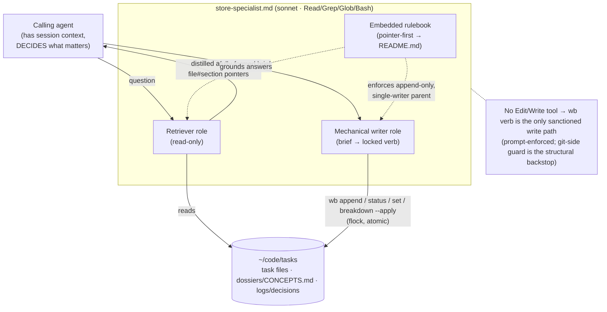

# feat: wb store-specialist subagent — retriever + mechanical writer

## Summary

Build `~/.claude/agents/store-specialist.md` (stowed from `claude/.claude/agents/store-specialist.md`) — a **sonnet** subagent that is the family's single expert on the wb task store. It has exactly two roles, and it is **never a decider**:

- **Retriever** — given a question, reads the rulebook and a task family's record, and returns a *distilled answer + `file#section` pointers*. Read-only.
- **Mechanical writer** — given a *fully-formed brief* (the caller already decided what is worth recording), applies it through the **locked `wb` verb family only**, enforcing append-only `## Decisions`/`## Handoffs` and single-writer parent `## Plan`.

The write-contract is made **hard to violate**, not merely instructed: the agent's tool allowlist is `Read, Grep, Glob, Bash` — **no `Edit`/`Write`** — so there is no in-place file-edit tool; the only sanctioned write path is shelling out to a locked `wb` verb. This is not an absolute structural seal (`Bash` can still write directly — `sed -i`, `cat >`), so "wb-only" is ultimately prompt-enforced; the removed `Edit`/`Write` tools take away the default path, the `wb` lock protects the sanctioned one, and the tasks-store git-side guard hook (installed-but-dormant today) is the intended structural backstop. See KTD2.

This is **stage 3** of the `dotfiles--living-task-store` umbrella. Stage 2 (authoring conventions) shipped, so this is unblocked. This is the **first agent** in the dotfiles repo — it also establishes the `claude/.claude/agents/` directory convention.

**Product Contract preservation:** solo-sourced (no upstream brainstorm); scope was confirmed live with Jet before planning.

---

## Problem Frame

The living-task-store umbrella wants the store to behave like a **shared blackboard**: one canonical mutable record per family that every agent reads at prompt-time and records decisions into as it goes. That loop is *detect → distill → apply (atomic, under lock) → propagate*. This task builds the **distill + apply** organ:

- Family agents need a cheap way to **ask** "what does the store say about X?" without each re-deriving the four-doc division, the schema, and the family's own history. Today every agent re-reads `README.md` and walks `parent:` by hand.
- Family agents need a **safe** way to **write** decisions back. Hand-rolled `Edit` writes bypass every lock `wb` built (this is exactly the failure `wb append` was introduced to close), and ad-hoc `git add -A` in the shared tasks checkout clobbers other agents' uncommitted WIP.
- The judgment of **what** is worth recording must stay with the calling agent (which has the session context). A store specialist that decided for itself would either over-record noise or silently drop things the caller cared about.

The specialist collapses both needs into one narrow, auditable surface: a retriever that knows the rulebook, and a mechanical writer that can only write the safe way.

---

## Requirements

- **R1** — A single agent file `claude/.claude/agents/store-specialist.md`, model `sonnet`, tools limited to `Read, Grep, Glob, Bash`.
- **R2** — Retriever role: answers a store question with a distilled answer plus `file#section` pointers into the source-of-truth docs (rulebook, task file, `parent:`-walk, dossier `CONCEPTS.md`, decision log). Read-only.
- **R3** — Mechanical-writer role: applies a caller-supplied brief through the locked `wb` verbs (`wb append`, `wb status`, `wb set`, `wb breakdown --apply`) — never `Edit`/`Write`, never hand-rolled locking, never `git add -A`.
- **R4** — The specialist **never decides** what is worth recording; it executes a fully-formed brief and refuses/normalizes only for rule-safety (append-only, single-writer parent, own-file-only staging).
- **R5** — A small **structured brief format** is defined so callers can hand the writer role a self-describing request (target task-ref, target section, body, write-mode, append-only assertion).
- **R6** — The specialist is taught the **full** wb task-store rulebook, not just the two authoring sections: four-doc division; status lifecycle including `prospective` vs `planned`; umbrella/grouping tags; required domain tags (`data-access`, `state-management`); parent/child; `depends_on`; `size`; append-only Decisions/Handoffs; single-writer parent Plan.
- **R7** — A shared `## Vocabulary` section seeds the family's canonical terms (feeds stage 6's term→family concepts map, which is *derived* from `## Vocabulary` sections — no new authored artifact there).
- **R8** — `store-specialist.md` is discoverable via docgen so `/help` and the Hub can explain it (thin follow-up; must not rework docgen indexing).

---

## Key Technical Decisions

- **KTD1 — One file, two roles (not two agents).** Both roles live in `store-specialist.md`; the caller's brief selects the role. They share the same embedded rulebook and the same read surface, so splitting them would duplicate the rulebook and double the maintenance. Rationale carried from the parent's Decisions ("retriever + mechanical writer").

- **KTD2 — Tool allowlist removes the default write path; the guarantee is layered, not absolute.** `tools: Read, Grep, Glob, Bash`, explicitly excluding `Edit`/`Write`. Excluding `Edit`/`Write` removes any *in-place file-edit* tool, so the path of least resistance is a `wb` verb rather than a raw file write. It does **not** make a direct write impossible — `Bash` can run `sed -i`, `cat >`, or an editor — so "writes route through `wb`" is enforced in three layers, honestly labelled: (a) **tool removal** takes away the default edit path; (b) **the system prompt** instructs the writer to touch task files only via `wb` verbs (prompt-enforced, the residual behavioral layer); (c) **the tasks-store git-side guard hook** (per the three-layer store-safety guard — installed but dormant until the X7 replay) is the intended *structural* backstop that would reject a tasks-repo change not produced by `wb`. Do not skip a runtime guard on the strength of the allowlist alone. `Bash` is present for *both* reading (the retriever greps the store) and writing (the writer shells out to `wb`).

- **KTD3 — Writes use the locked `wb` verb family, invoked by path.** Concrete mapping:
  - body of `## Decisions` / `## Handoffs` / `## Follow-ups` / any heading → `wb append <task-ref> <heading>` (multi-line body via stdin heredoc). This is the locked, heading-scoped insertion (`wb.sh` `cmd_append` → `wb_task_lock_acquire_guarded`, end-of-section insertion, oldest-first).
  - `status:` frontmatter → `wb status <task-ref> <state>`, for `prospective|planned|paused|doing|review` **only**. `done` is **not** settable this way — `cmd_status` refuses it and points at `wb done`, which is a whole wind-down (worktree removal, board bookkeeping) that is out of scope here (KTD8). A `mode: status` brief targeting `done` is refused by the specialist with that same redirection.
  - other frontmatter fields (`priority`, `value`, `size`, tags, …) → `wb set <task-ref> <field> <value>`.
  - **`wb status` and `wb set` are store-only verbs.** `wb.sh`'s `_wb_refuse_if_live_session` makes both exit 1 when any live tmux session's `@task` points at the target file (a live session must route the change through `wb pause`/`wb down`). Because the specialist is often invoked from inside the live session working on the very task, a `mode: status`/`mode: set` brief aimed at that task will hit this refusal — the specialist surfaces it to the caller rather than working around it (design choice detailed in U4).
  - whole parent/child family creation → `wb breakdown --apply <buffer>` (the buffer is authored by the caller/`/wb-breakdown`, never by the specialist). Invocation verified against `cmd_breakdown` → `wb_breakdown_apply`.
  - Invoked as `wb <verb>` (alias → `~/.config/scripts/tmux/wb.sh`), with the explicit script path documented as the robust fallback since a subagent's shell may not load interactive aliases.

- **KTD4 — Never a decider.** The specialist receives a brief that already states *what* to record and *where*. It does not summarize a session, judge significance, or invent content. Its only agency is **mechanical rule-safety**: refusing to write into a parent's `## Plan` from a child context, refusing a `mode: append` brief whose body is a near-exact duplicate of an existing entry (the append-only guard — see KTD6, a string-match, not a paraphrase judgment), and staging only its own file if asked to persist. It does **not** re-implement locking or ordering — `wb append` already performs the locked, oldest-first, end-of-section insertion, so the specialist trusts the verb for atomicity and only adds the duplicate guard on top. This is the load-bearing boundary — the caller owns judgment, the specialist owns safe execution.

- **KTD5 — Rulebook is pointer-first, not a copy.** The embedded rulebook is a *distilled* restatement plus `file#section` pointers into `~/code/tasks/README.md` as the source of truth, so the agent doesn't silently drift when the README changes. It teaches enough to answer and to enforce, and cites where the authoritative text lives.

- **KTD6 — Structured brief format** (directional shape, finalized in U4):
  ```
  role: write
  task-ref: <stem | path | fuzzy>          # resolved by wb's own exact-then-fuzzy resolver
  target: <## Heading | frontmatter:<field> | family-buffer>
  mode: append | status | set | breakdown-apply
  body: |                                    # verbatim; for append, the fully-formed entry
    ### 2026-09-22 14:03 — <source>
    <decision text>
  assert-append-only: true                   # caller affirms this is a new entry, not a rewrite
  ```
  The specialist maps `mode` → the matching locked verb, and refuses if `mode: append` is aimed at a section the rules mark single-writer/immutable-in-place in a way the brief contradicts. The **append-only guard is mechanical, not semantic**: refuse only when the brief body normalizes (whitespace/timestamp-stripped) to a near-exact duplicate of an existing entry in the target section; a paraphrase or thematic overlap is accepted as a genuinely new entry. This keeps the check a string-match and preserves "never a decider" — the specialist never judges whether a paraphrased entry "really" repeats an old one. Child-vs-parent (for the single-writer-`## Plan` refusal) is resolved from the resolved task file's `parent:` frontmatter; the resolver is `wb`'s own exact-then-fuzzy `task-ref` resolution, so all three ref forms (stem | path | fuzzy) land on one file before the check runs.

- **KTD7 — Retriever reads the whole family record.** Resolution order: the rulebook (README sections), the named task file, its `parent:`-walk to the family root, `dossiers/<stem>/CONCEPTS.md`, and the decision log (`logs/decisions/*.md`). Output is a distilled answer followed by `file#section` pointers, never a raw dump.

- **KTD8 — Committing the tasks repo is out of scope.** The specialist applies locked file writes; it does **not** commit/push the shared `~/code/tasks` checkout (periodic direct-to-`development` commits, and cross-agent sync, are the human's/stage-5's concern). If ever asked to persist, the guardrail is: stage only its own touched file, never `git add -A`, never open a PR against the tasks repo.

---

## High-Level Technical Design



The two dotted rule-edges are the point: the same embedded rulebook both **grounds** the retriever's answers and **constrains** the writer's applies. The `note` states the structural guarantee — with no `Edit`/`Write` tool, the only path from the agent to a task file is a locked `wb` verb.

---

## Output Structure

```
claude/.claude/agents/          # NEW dir — first agent in the repo
  store-specialist.md           # the agent (frontmatter + system prompt)
docs/docgen.json                # +1 pageDir or entry so the agent is indexed (U6)
docs/agents/                    # (only if docgen needs a rendered stub — decided in U6)
```

---

## Implementation Units

### U1. Scaffold the agent file and directory

**Goal** — Create `claude/.claude/agents/store-specialist.md` with correct frontmatter and section skeleton; establish the `agents/` directory convention.

**Requirements** — R1.

**Dependencies** — none.

**Files** — `claude/.claude/agents/store-specialist.md` (new); `claude/.claude/agents/` (new dir).

**Approach** — Frontmatter: `name: store-specialist`, a trigger-shaped `description:` (mirrors the skill-frontmatter style already used across `claude/.claude/skills/*/SKILL.md` — a one-liner naming when to delegate to it), `model: sonnet`, `tools: Read, Grep, Glob, Bash`. Body skeleton with these headings: `## Roles` (filled by U1 — a short two-paragraph overview of the retriever and mechanical-writer roles and the "never a decider" boundary, so the file opens by orienting the reader), then `## Store rulebook`, `## Retriever`, `## Mechanical writer`, `## Vocabulary` (filled by U2–U5 respectively). The frontmatter field names (`name`/`description`/`model`/`tools`) were confirmed against a real working agent definition found on disk elsewhere on the machine, so the format is sound despite no local precedent; still eyeball one known-good reference before finalizing as a belt-and-braces step.

**Patterns to follow** — `claude/.claude/skills/wb-save/SKILL.md` frontmatter shape (name + trigger-rich description).

**Test expectation: none** — scaffolding only; behavior is exercised by U3/U4 and the verification smoke.

**Verification** — File parses as a valid agent definition (frontmatter recognized; appears in the agent roster on next session load).

### U2. Embed the store rulebook (pointer-first, full schema)

**Goal** — Teach the specialist the full wb task-store rulebook, distilled, with `file#section` pointers to the authoritative text.

**Requirements** — R6.

**Dependencies** — U1.

**Files** — `claude/.claude/agents/store-specialist.md` (`## Store rulebook`).

**Approach** — A condensed restatement, each item citing `~/code/tasks/README.md#<section>`:
- **Four-doc division** — CONCEPTS.md (current facts) / decision log (why, immutable) / dossier (reasoning) / task file (progress); the behaves→fact, argument→reasoning, progress→task rule of thumb.
- **Authoring discipline** — append-only `## Decisions`/`## Handoffs`; single-writer parent `## Plan`.
- **Status lifecycle** — `prospective|planned|doing|paused|review|done`; `prospective` = captured-but-unjudged (weekly-review promotes/drops), distinct from `planned`; never advance prospective→doing directly.
- **Grouping tags** — `umbrella` (long-running parent, no done-state, filter out of task views), `skill`, `loop`.
- **Required domain tags** — `data-access` (auth/authz/scoping/visibility), `state-management` (`grid_iron.go`/`match_mode.go`/session-info flows); additive, applied by every agent-mediated creation path.
- **Parent/child** — session-less parent with placeholder `repo:`; children point back via `parent:`.
- **`depends_on`** — comma-separated blocker stems; met when blocker `status: done`; fails open.
- **`size`** — `S|M|L|XL`, blank reads as `M`, never manufactured.

Keep it terse and imperative (aider-`CONVENTIONS.md` grain); the README is the source of truth, this is the index.

**Patterns to follow** — the tone of `dossiers/be--monorepo--spike-port-post-processor-to-metric-server/CONCEPTS.md` (cited in README as the exemplar grain).

**Test scenarios** — Covered by the U3 retriever smoke (a rulebook question must resolve to the right pointer). No separate automated test — the rulebook is prose grounding.

**Verification** — Spot-check: for each schema concept above, the section names a README pointer, and no item silently contradicts `README.md`.

### U3. Retriever role contract

**Goal** — Specify how the retriever answers a store question: read surface, resolution order, output shape.

**Requirements** — R2.

**Dependencies** — U2.

**Files** — `claude/.claude/agents/store-specialist.md` (`## Retriever`).

**Approach** — Read-only. Resolution order per KTD7: rulebook → named task file → `parent:`-walk to family root → `dossiers/<stem>/CONCEPTS.md` → `logs/decisions/*.md`. Output contract: a distilled answer (2–6 sentences) **then** a `Pointers:` list of `path#section` references; never a raw file dump; if the answer isn't in the store, say so and point at where it *would* live rather than inventing it. Use `Grep`/`Glob` to locate, `Read` to confirm.

**Patterns to follow** — the `parent:`-walk logic in `scripts/.config/scripts/tmux/wb.sh` (how a child resolves to its family root) as the mental model for the walk.

**Test scenarios** (live smoke, U-level verification below):
- Happy path — "What tags must an auth task carry?" → answer names `data-access`, pointer to `README.md#required-domain-tags`.
- Family walk — a question about a child returns pointers that include the parent's `## Plan`/`## Decisions`.
- Absent — a question with no store answer returns "not recorded" + the doc where it belongs, not a fabricated answer.

**Verification** — Dispatched with the three probes above, the agent returns distilled-answer-plus-pointers each time and never dumps a whole file.

### U4. Mechanical-writer role contract + structured brief

**Goal** — Specify the writer role: the brief format, the mode→locked-verb mapping, and the rule-safety guardrails.

**Requirements** — R3, R4, R5.

**Dependencies** — U2.

**Files** — `claude/.claude/agents/store-specialist.md` (`## Mechanical writer`).

**Approach** —
- Define the brief format (KTD6) as the input contract, with a worked `append` example (a `### timestamp — source` Decisions entry via `wb append <ref> Decisions <<'EOF' … EOF`).
- Mode→verb mapping (KTD3): `append`→`wb append`, `status`→`wb status`, `set`→`wb set`, `breakdown-apply`→`wb breakdown --apply`. Always invoke `wb <verb>`; document `~/.config/scripts/tmux/wb.sh` as the fallback path.
- Guardrails (KTD3/KTD4/KTD8): never `Edit`/`Write` a task file; never hand-roll locking (trust `wb append`'s lock); apply the mechanical near-duplicate append-only guard and refuse an exact-duplicate framed as an append; refuse to write a parent's `## Plan` from a child brief; **refuse a `mode: status` brief targeting `done`** (redirect to `wb done`, out of scope); **surface the `wb status`/`wb set` live-session refusal** (`_wb_refuse_if_live_session`) to the caller rather than working around it; if asked to persist, stage only the one touched file (no `git add -A`), no PR against the tasks repo.
- **Design choice (was a deferred question — resolved):** on a live-session refusal from `wb status`/`wb set`, the specialist treats it as a hard failure and reports it up to the caller (with the verb's own "use `wb pause`/`wb down`" message), rather than silently routing the change through the live session. Rationale: the caller holds the session context and the judgment; the specialist must not improvise an alternate write path.
- State plainly that the specialist does **not** author briefs or judge significance — it executes them.

**Execution note** — This is the highest-risk unit (the write path). Prefer verifying against a **scratch task file** (created with `wb new --planned` in a throwaway ref, or a temp copy under the scratchpad) so a bad apply can't touch a real family record.

**Test scenarios** (live smoke):
- Happy path — a well-formed `append` brief lands a new entry at the *end* of `## Decisions`, oldest-first preserved, under the lock.
- Edge — a brief targeting `## Plan` of a parent from a child context is refused with the single-writer reason.
- Error path (append-only) — a brief with `assert-append-only: true` whose body is a near-exact duplicate of an existing entry is refused; a paraphrase of the same idea is accepted as a new entry (mechanical guard, not semantic).
- Error path (`done`) — a `mode: status` brief with body `done` is refused and redirected to `wb done`, not applied.
- Error path (live session) — a `mode: status`/`mode: set` brief against a task whose `@task` is held by a live tmux session is refused (the `_wb_refuse_if_live_session` message) and surfaced to the caller.
- Guardrail — asked to "save to git", the agent stages only its file and does not run `git add -A` / open a PR.

**Verification** — Each scenario above behaves as specified against a scratch task; a real task file is never mutated during verification.

### U5. Seed the shared `## Vocabulary`

**Goal** — Establish canonical family terms. This earns its place *today*: the retriever and writer roles both lean on precise terms (family record, brief, locked verb, append-only), so the section is the file's own glossary — and, as a bonus, stage 6's concepts map later derives term→family from `## Vocabulary` sections. The `term — definition` line format serves both; if stage 6 never ships, the section is still the agent's glossary, not dead weight.

**Requirements** — R7.

**Dependencies** — U1.

**Files** — `claude/.claude/agents/store-specialist.md` (`## Vocabulary`).

**Approach** — A short glossary of the terms this family leans on, one line each, present-tense: *family record / blackboard*, *retriever*, *mechanical writer*, *brief*, *locked verb*, *four-doc rule*, *append-only section*, *single-writer parent plan*, *umbrella*, *prospective*. Format so a downstream derivation can parse `term — definition` lines (stage 6 derives term→family from `## Vocabulary` sections). Definitions are terse and non-rationale (CONCEPTS grain); a correction later replaces a line in place.

**Test expectation: none** — reference content. Consumed by stage 6, which is out of scope here.

**Verification** — Each term is one parseable `term — definition` line; terms match the vocabulary used elsewhere in the file (no synonym drift).

### U6. Make the agent discoverable via docgen (thin follow-up)

**Goal** — `/help` and the Hub can explain the store-specialist without reworking docgen indexing.

**Requirements** — R8.

**Dependencies** — U1 (file must exist).

**Files** — `docs/docgen.json`; possibly a small `docs/agents/` stub or a Hub group entry (decided during the unit by reading how skills are indexed).

**Approach** — Inspect how `claude/.claude/skills/*` surface in docgen/Hub today (the `skills` Hub group already exists in `docgen.json`), then add the **minimal** wiring for agents: most likely a new Hub group or a single indexed entry pointing at the agent, following the existing skills pattern. Do **not** add `claude/.claude/agents` to `pageDirs` in a way that would try to render the raw agent `.md` as a doc page if that conflicts with how skills are handled — mirror whatever skills do. Rerun `docgen.sh` after the change (generated `.html`/`INDEX` are never hand-edited — memory: docgen platform).

**Execution note** — Keep this genuinely thin; if agent-indexing turns out to need real docgen changes, split it into its own follow-up task rather than growing this unit.

**Test scenarios**:
- `docgen.sh` reruns cleanly and the agent appears in `INDEX`/Hub.
- `/help "what is the store-specialist"` resolves to the agent with provenance (file path).

**Verification** — After `docgen.sh`, the agent is listed; a `/help` query about it returns the file and a one-line description.

---

## Scope Boundaries

**In scope** — the agent file (U1–U5) and its docgen discoverability (U6).

**Out of scope (true non-goals)**
- **Auto-capture** — nothing *fires* the specialist automatically. That is stage 4 (`dotfiles--feat-store-auto-capture`), which depends on this. The specialist here is invoked explicitly by a caller.
- **Cross-agent sync / staleness** — stage 5.
- **Concepts map (term→family)** — stage 6 *derives* from the `## Vocabulary` seeded here; building the map is not in this task.
- **Committing/pushing the tasks repo** — KTD8; the specialist applies locked writes, it does not sync git.
- **Any write into a repo working tree** — the store lives at `~/code/tasks`.

### Deferred to Follow-Up Work
- If U6 reveals docgen needs real agent-indexing support (not just a Hub entry), spin that out as its own task.
- A future second agent would justify extracting shared agent-authoring conventions; not warranted for the first one.

---

## Risks & Dependencies

- **Stage-4 invocation / hook-reachability (forward risk).** This is built as a subagent invoked by an *explicit* caller, but the next stage (`dotfiles--feat-store-auto-capture`) must fire it *automatically* — and the parent umbrella already records that **no hook reaches a sub-agent directly** (a hook can't `Task`-dispatch one). So stage 4 cannot call this specialist from a Stop/PostToolUse hook; it must go through a hook-reachable shim (a skill or `wb` verb the hook runs) that then delegates to this subagent with a rich brief. This choice therefore has a real reversal cost if stage 4 finds the subagent boundary unworkable. Mitigation: named here so stage 4 designs the shim up front rather than discovering the gap; the retriever/writer *contract* is mechanism-agnostic and would port to a skill if needed.
- **Store-only verbs vs. live-session callers.** `wb status`/`wb set` refuse when the target task has a live tmux session, and `wb status` refuses `done` — so a meaningful slice of frontmatter briefs (from an agent working its own live task) will be refused by design. Handled by KTD3/U4 (surface, don't work around); flagged as a risk because it narrows what the writer role can actually do from the common calling context.
- **Agent-frontmatter format** — first agent in the repo. De-risked: the `name`/`description`/`model`/`tools` shape was verified against a real working agent on disk; U1 still eyeballs one reference before finalizing.
- **Alias vs path in a subagent shell** — `wb` is an interactive alias; a subagent's non-interactive shell may not load it. Mitigation: document `~/.config/scripts/tmux/wb.sh` as the canonical fallback path in the writer contract (KTD3).
- **Verification touching real family records** — a bad writer apply during smoke could mutate a live task. Mitigation: U4 verification uses a scratch task only.
- **Dependency satisfied** — `depends_on: dotfiles--feat-store-authoring-conventions` is `done`; the rulebook this specialist owns is live in `README.md`.

---

## Verification Contract

- The agent file loads (appears in the agent roster).
- Retriever smoke (U3): three probes return distilled-answer-plus-pointers, never a raw dump, never a fabricated answer.
- Writer smoke (U4): well-formed append lands at section end under the lock; single-writer-parent and non-append rewrites are refused; no `git add -A`. All against a scratch task.
- docgen (U6): `docgen.sh` reruns clean; agent is indexed; `/help` resolves it.
- No regression to the wb test suite (the agent file is inert config; the suite is unaffected).

## Definition of Done

- `claude/.claude/agents/store-specialist.md` exists with correct frontmatter (`sonnet`; `Read, Grep, Glob, Bash`), and all five body sections filled: `## Roles`, `## Store rulebook`, `## Retriever`, `## Mechanical writer` (incl. brief format), `## Vocabulary`.
- The Verification Contract passes.
- The agent is discoverable via docgen/`/help` (U6).
- Task file `## Decisions`/`## Done` updated via `wb append` (append-only), and the change committed to the dotfiles worktree branch.

---

## Sources & Research

- `~/code/tasks/README.md` — "What goes where", "Authoring discipline", and the schema sections (the rulebook, source of truth).
- `~/code/tasks/dotfiles--living-task-store.md` — parent umbrella: stages, `## Decisions` (specialist = retriever + mechanical writer, never a decider; writes via `wb.sh --apply`).
- `scripts/.config/scripts/tmux/wb.sh` — `cmd_append` (~L3576) and `wb_task_lock_acquire_guarded` (the locked write path); `wb status`/`wb set`/`wb breakdown --apply`; `TASKS_DIR` default `~/code/tasks`.
- `zsh/.zshrc:95` — `alias wb="~/.config/scripts/tmux/wb.sh"`.
- `docs/docgen.json` — Hub groups incl. the existing `skills` group (the pattern U6 mirrors).
