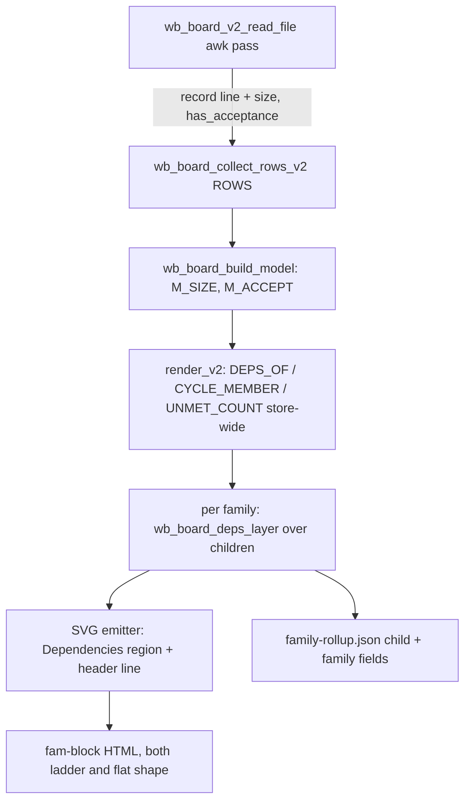

# Family DAG view - Plan

**Target repos:** this dotfiles repo (code, tests, skill, guide) plus the task store at `~/code/tasks` (its own git repo — `README.md` "Size" section only). Store paths below are written `tasks:README.md`.

---

## Goal Capsule

- **Objective:** Each family block on the `wb board --html` Family tab shows a zero-JS inline-SVG dependency graph of its children — columns by dependency depth, critical path and startable-now highlighted, node size from `size:`, solid/dashed border from definedness — plus a critical-path header line and matching fields in `family-rollup.json`.
- **Authority:** this plan's Product Contract, then the task file's `## Decisions` (2026-09-23 entry supersedes the 2026-07-20 placement/ASCII/rollup items), then the parent task's `## Decisions` for visual encodings, then the chosen mockup `~/code/tasks/dossiers/dotfiles--feat-family-dag-view/mockup-3-graph.html` for look.
- **Execution profile:** bash only, inside the existing single-pass render; no new process forks per family member (R15 perf rule).
- **Stop conditions:** stop and surface if the board render regresses past the rebuild plan's 10s ceiling on the real store, or if adding model fields breaks the TSV trailing-empty-field handling in a way that needs a parser redesign.
- **Tail ownership:** implementer opens the PR (personal repo → `pgh`), runs `/ce-code-review` then `wb reviewed`.

---

## Product Contract

### Summary

Add a "Dependencies" region to every Family-tab family block that has at least one dependency edge between its children, drawn as a hand-built inline SVG node-link DAG. Extend the `size:` enum with `XS` and teach the board model to read `size:` and an acceptance-criteria signal so the graph can scale nodes, compute a size-weighted critical path, and mark under-defined tasks.

### Problem Frame

The Family tab (shipped in #60/#62) answers "what is this family and what was decided", but not "where are we, what's next, what can run in parallel". The dependency data now exists — 79 of 322 tasks carry `depends_on:`, 60 carry `size:`, and about ten families have 3–12 intra-family edges — yet the board only uses it for per-task blocked chips. This task's own family sat startable for a week unnoticed because nothing visualised its graph. The original v1 spec predates the board rebuild; its placement (`fp-*` filter, parent `<details>` card), rollup target (CHILDREN rollup), and ASCII fallback no longer map onto anything, and were re-decided on 2026-09-23.

### Requirements

**Size data**

- R1. `size:` accepts `XS|S|M|L|XL` everywhere it is validated (`wb new --size`, `wb set size`, `wb breakdown --apply` child bullets); blank still reads as `M`.
- R2. The board model carries each task's raw `size:` value and whether its file contains acceptance criteria or a definition of done.

**Graph computation**

- R3. Nodes are the family root's direct children; the root is not a node. Only edges between two children of the same family are drawn.
- R4. Each node gets a column equal to its longest unweighted dependency chain within the family (roots of the graph are column 0).
- R5. The critical path is the maximum size-weighted chain of remaining work, with weights XS=0.5, S=1, M=2, L=3, XL=5, blank=M, and done=0; ties break deterministically by stem.
- R6. A node is startable-now when its status is `planned`, it is not in a dependency cycle, and it has zero unmet blockers store-wide (external blockers still count).
- R7. Cycle members still render: they go in a final column and the edges closing the loop are drawn as flagged back-edges.

**Rendering**

- R8. The region renders in both ladder- and flat-shape family blocks when the family has ≥1 intra-family edge; flat-shape families with zero edges show an empty-state pointing at `depends_on:`; ladder-shape families with zero edges show nothing.
- R9. Nodes encode status (colour), size (node scale), definedness (solid vs dashed border), critical path (highlighted spine), startable-now (highlight), and in-progress (pulsing ring, suppressed under reduced motion); done nodes stay in place, muted.
- R10. A vertical "you are here" frontier line sits before the first column containing a non-done node.
- R11. The region header states the critical path, its remaining weight in size points, and the startable-now count.
- R12. Zero JavaScript: every node links to its task file and carries a native tooltip with stem, status, and size.

**Machine-readable output**

- R13. `family-rollup.json` child entries gain `size`, `layer`, `critical`, and `startable`; each family entry gains the critical-path stem list and remaining weight.

### Scope Boundaries

- Not building: ASCII/terminal fallback, hover/cone highlighting (any JS), slack/float per node, date or calendar ETAs, a store-wide or dependency-cone graph view, inferred edges.
- `wb_board_deps_layer` takes an arbitrary node set so a dependency-cone view later is a caller change, not a rewrite.

#### Deferred to Follow-Up Work

- Hover cone highlighting via a small scoped script (the board already ships JS, so this is cheap).
- Slack/float per node and a "near-critical" treatment.
- Dummy-node routing so long edges spanning several columns don't cross intermediate nodes.
- An automated render-time perf test (the R15 budget is only checked manually today).

---

## Planning Contract

### Key Technical Decisions

- KTD1. **Weights are stored doubled as integers** (XS=1, S=2, M=4, L=6, XL=10) because bash arithmetic is integer-only; display divides by two and prints a trailing `.5` when odd.
- KTD2. **Graph keys are stems.** `wb_board_render_v2` already feeds the deps helpers an identity stem→stem map (`DG_KEY`), so `DEPS_OF`, `CYCLE_MEMBER`, and `UNMET_COUNT` are all stem-keyed in the v2 path. The new function stays stem-keyed and only the SVG uses anchors, for DOM ids.
- KTD3. **The layering function is pure and node-set-agnostic**: it takes a node-list array name plus the existing `DEPS_OF`/`CYCLE_MEMBER`/`UNMET_COUNT`/status/size maps and writes out-arrays (layer, in-column order, critical flag, startable flag, back-edge list, critical-path list, remaining weight). It filters edges to the given node set itself, so it never mutates the store-wide graph.
- KTD4. **Cycle handling reuses `CYCLE_MEMBER`, not a second detector.** Kahn's algorithm runs over non-cycle nodes; cycle members go in column max+1, and any in-set edge whose both ends are cycle members is a back-edge. Critical-path computation skips back-edges.
- KTD5. **Column ordering is one barycenter pass**, left to right: nodes in column k sort by the mean order of their in-set predecessors, ties by stem. Deterministic output keeps render tests stable.
- KTD6. **Definedness is a 4-signal score**: non-empty Plan section, acceptance/definition-of-done text anywhere in the file, `size:` explicitly set, status past `planned`. Fewer than 3 signals renders a dashed border; done nodes are always solid.
- KTD7. **The acceptance signal is detected in the existing per-file awk pass** (one new flag field), matching case-insensitive "acceptance criteria", "definition of done", or a `DoD` heading. This adds no second read of any file.
- KTD8. **New model fields are appended at the end** of both TSV layers (the read-file record line and the collected row), to avoid renumbering every existing column consumer. The trailing-empty-field hazard in `wb_tsv_split` (flagged in the size-capture task) is covered by tests with blank values in the last positions.
- KTD9. **The dashed-border convention is introduced fresh.** The old board's "provisional = dashed" convention did not survive the rebuild. Existing dashes mean empty-state boxes (`.scope-empty`, grey) and stale warnings (red). Definedness dashes use a neutral colour so they don't read as warnings. Cycle back-edges use the red dashed treatment on purpose, because they are warnings.
- KTD10. **Status colours reuse the ladder palette** (`.rung-node` done/active/planned classes: green/mauve/blue) rather than a new palette, so a task reads the same colour on both surfaces.
- KTD11. **The SVG follows the Plan-ring precedent**: geometry computed in bash and interpolated into a literal SVG string with CSS classes (no inline colours), built by string accumulation with the out-var escaping helpers.

### High-Level Technical Design

Data flow through the existing single render pass:



Layering and critical path, directional sketch:

```text
in-set edges  = { (d -> v) : v in nodes, d in DEPS_OF[v], d in nodes }
kahn over non-cycle nodes:
  layer[v]    = 0 if no in-set preds else 1 + max(layer[p])
  ef[v]       = w(v) + max(ef[p])          # w: doubled weight, done = 0
  best_pred[v]= argmax ef[p], tie -> smallest stem
cycle members: layer = maxLayer + 1; edges between two cycle members -> back-edges
critical path = walk best_pred back from argmax ef (tie -> smallest stem)
remaining     = max ef / 2
startable[v]  = status==planned && !CYCLE_MEMBER[v] && UNMET_COUNT[v]==0
order in col  = barycenter of in-set preds' order in earlier cols, tie -> stem
```

Geometry: x = column × column width; y = in-column order × row height; SVG height follows the tallest column, width follows the column count, in a horizontally scrollable container. Edges are cubic Béziers from the source node's right edge to the target's left edge.

### Assumptions

- Direct children are the node set. Grandchildren appear in their own parent's family block, as the Family tab already treats them.
- The board stays dark-theme only (Catppuccin Mocha tokens), so no light-mode SVG variants are needed.

---

## Implementation Units

### U1. Extend the `size:` enum to XS

- **Goal:** `XS` is a legal `size:` value on every creation and edit path.
- **Requirements:** R1.
- **Dependencies:** none.
- **Files:** `scripts/.config/scripts/tmux/wb.sh`, `claude/.claude/skills/wb-breakdown/SKILL.md`, `docs/wb-guide.md`, `tasks:README.md`, `scripts/.config/scripts/tmux/tests/wb-new.test.sh`, `scripts/.config/scripts/tmux/tests/wb-set.test.sh`, `scripts/.config/scripts/tmux/tests/wb-breakdown.test.sh`.
- **Approach:** change the single `WB_SIZE_VALUES` literal; every consumer (`wb new --size`, `wb set size`, breakdown validator) already interpolates it into both its regex and its error text. Update the enum prose in the skill grammar line, the store README "Size" section (add the weights table from R5), and the guide's `--size` mention.
- **Patterns to follow:** the `WB_SIZE_VALUES` / `_wb_valid_size` comment block in `wb.sh`: authored once, never duplicated.
- **Test scenarios:**
  - `wb new --size XS` writes `size: XS`.
  - `wb set <task> size XS` succeeds, and `wb set <task> size xs` is rejected with a message listing `XS|S|M|L|XL`.
  - A breakdown child bullet `- size: XS` applies; `- size: XXS` fails with the enum in the error.
  - Blank size remains accepted on all three paths.
- **Verification:** the three test files pass in the Docker container, and no other file hard-codes the old four-value list.

### U2. Board model carries size and the acceptance signal

- **Goal:** `wb_board_build_model` exposes `M_SIZE` (raw value) and `M_ACCEPT` (0/1) per stem, threaded into `wb_board_render_v2`.
- **Requirements:** R2.
- **Dependencies:** none (U1 only widens the values the model will see).
- **Files:** `scripts/.config/scripts/tmux/wb-board.sh`, `scripts/.config/scripts/tmux/wb.sh` (the three `cmd_board` calls), `scripts/.config/scripts/tmux/tests/wb-board-model.test.sh`, `scripts/.config/scripts/tmux/tests/wb-board-render.test.sh`.
- **Approach:** in the read-file awk pass, capture frontmatter `size:` and set an acceptance flag on a case-insensitive match (KTD7). Append both at the end of the record line and the collected row (KTD8). Add two nameref args to `wb_board_build_model` and `wb_board_render_v2`, and update their argument-list comment blocks. Count the real `local -n` lines, not the header comments, which are already off by two. Append the new names at every enumerated call site: `cmd_board` plus the model and render test harness calls.
- **Execution note:** add the blank-trailing-field model test before changing the TSV layout.
- **Patterns to follow:** how `depends_on` flows from record column → row column 13 → `_deps[stem]`; `plan_checked`/`plan_total` for an awk-derived field.
- **Test scenarios:**
  - A fixture with `size: L` and an `## Acceptance criteria` heading yields `M_SIZE=L`, `M_ACCEPT=1`.
  - A fixture with blank `size:` and no acceptance text yields empty `M_SIZE` and `M_ACCEPT=0`, and every earlier field (tags, plan counts, title) still parses correctly. This covers the trailing-empty-field hazard.
  - "Definition of Done" appearing in a Follow-ups bullet (not the Plan section) still sets `M_ACCEPT=1`.
  - Lowercase `definition of done` matches; the word "acceptance" alone does not.
  - Existing model and render tests pass unchanged apart from the extra call-site names.
- **Verification:** `wb board --html` on the real store renders byte-identically apart from the generated timestamp, before any render unit lands.

### U3. `wb_board_deps_layer` — layering, critical path, startable

- **Goal:** a pure function computing per-node layer, in-column order, critical flag, and startable flag, plus the family's back-edges, critical-path list, and remaining weight, for any node set.
- **Requirements:** R3–R7.
- **Dependencies:** U2 (needs `M_SIZE`).
- **Files:** `scripts/.config/scripts/tmux/wb-board.sh` (next to `wb_board_deps_validate`/`_cycles`/`_blocking`), `scripts/.config/scripts/tmux/tests/wb-board-deps.test.sh`.
- **Approach:** see the HTD sketch plus KTD1–KTD5. Array names come in as string args, bound with `local -n`. Use a distinct local prefix (not `pp_`, not `_m_`) to avoid the circular-nameref trap noted near render_v2's dependency block. No subshells.
- **Execution note:** implement test-first; this is the load-bearing logic and is fully unit-testable with hand-built arrays.
- **Patterns to follow:** `wb_board_deps_cycles` (flat iteration, no recursion, nameref out-arrays) and the fixture style of `tests/wb-board-deps.test.sh`.
- **Test scenarios:**
  - Chain A→B→C (all M, planned): layers 0/1/2; critical path A,B,C; remaining 6; only A startable.
  - Diamond A→{B,C}→D with B=XL, C=S: critical path A,B,D; C not critical; B and C share layer 1.
  - Done nodes weigh 0: in chain A(done)→B(M)→C(L), remaining is 5 and B is startable.
  - XS weight: a lone XS node gives remaining 0.5 (doubled internal value 1).
  - Blank size is weighted as M.
  - Edge to a node outside the set (including the family root) is ignored for layering, but an unmet external blocker still makes the node not startable.
  - Two-node cycle A⇄B plus C→A: A and B go in the final column; the A↔B edges are listed as back-edges; the function terminates and C still has a layer.
  - Ties: two equal-weight parallel branches pick the lexicographically smaller stem, and repeated runs give identical output.
  - Barycenter: in-column order follows predecessor order, not input order.
  - An empty node set or a set with no in-set edges reports zero edges and emits no layers beyond 0.
- **Verification:** `tests/wb-board-deps.test.sh` passes, and existing deps tests are untouched.

### U4. SVG emitter for the Dependencies region

- **Goal:** turn U3's output plus model data into the region's HTML: the header line and the inline SVG.
- **Requirements:** R9–R12.
- **Dependencies:** U3.
- **Files:** `scripts/.config/scripts/tmux/wb-board.sh` (emitter function plus CSS in the VIEW 4 Family block), `scripts/.config/scripts/tmux/tests/wb-board-render.test.sh`.
- **Approach:**
  - Nodes are rounded rects scaled by size, with status classes per KTD10 and a dashed class per KTD6/KTD9. Critical nodes and edges get a highlight class; startable nodes get a ring class. In-progress (`doing`/`review`) nodes get a CSS keyframe pulse wrapped in `prefers-reduced-motion: no-preference`.
  - Each node is an SVG `<a>` using the same task-file href as `wb_board_v2_task_open_html`, with a `<title>` child (stem · status · size) and the display title truncated to fit, escaped via the out-var helpers.
  - The frontier line goes before the first column holding a non-done node, omitted when every node is done.
  - Edges are Bézier paths with arrow markers; back-edges get the warning class. Marker ids are suffixed by family anchor, so multiple SVGs on one page don't collide.
- **Patterns to follow:** the Plan-ring SVG in the Active deck card (geometry in bash, literal SVG string); `wb_board_html_escape` out-var form in loops.
- **Test scenarios:**
  - A three-node chain renders three node groups, two edge paths, and a header naming the path and "3 pts remaining" (all S).
  - An under-defined planned node carries the dashed class; a done node never does.
  - A `doing` node carries the pulse class, and the CSS gates the animation behind reduced-motion.
  - A title containing `<`, `&`, and quotes is escaped in both the label and the tooltip.
  - Two families on one page produce distinct marker ids.
  - An all-done family omits the frontier line and reports "0 pts remaining".
  - The page contains no new `<script>` content.
- **Verification:** render tests pass, and one real family (`dotfiles--feat-family-dag-view`) looks right in a browser against the mockup's encodings.

### U5. Wire the region into the Family tab and rollup JSON

- **Goal:** every family block gets the region (or the empty-state) per R8, and `family-rollup.json` gains the R13 fields.
- **Requirements:** R8, R13.
- **Dependencies:** U3, U4.
- **Files:** `scripts/.config/scripts/tmux/wb-board.sh` (Family view loop), `scripts/.config/scripts/tmux/tests/wb-board-render.test.sh`.
- **Approach:**
  - Build the child node list from `fr_members` minus the root, call U3 once per family, and emit the region right after the `fam-summary` div, before the ladder/flat branch, so both shapes share it.
  - Emit the empty-state only in the flat branch when the edge count is zero.
  - Extend the child JSON objects and the family object with the U3 outputs via `wb_board_v2_json_escape`. The parent entry gets `layer: null` and false flags. Remaining weight is a bare JSON number, e.g. `7.5`.
- **Patterns to follow:** the existing `fr_json_children` string build, and the Family view's summary-first block comment.
- **Test scenarios:**
  - A flat family with edges shows the region above "Family tree".
  - A flat family without edges shows the empty-state mentioning `depends_on:`.
  - A ladder family with edges shows the region above "Version ladder".
  - A ladder family without edges shows neither.
  - The generated `family-rollup.json` parses with `jq`; a child carries `size`, `layer`, `critical`, and `startable`; the family carries the critical-path array and remaining number; the parent entry has `layer: null`.
  - A family whose root is a phantom stem (dangling `parent:`) still renders its children's graph.
- **Verification:** render tests pass; `jq` validates the real store's rollup; the real board shows the region for the ~10 families with edges.

### U6. Guide, store docs, and perf gate

- **Goal:** users can find and read the new region, and the render stays inside budget.
- **Requirements:** R11 and R12 (documented behaviour); the board rebuild plan's render-time budget.
- **Dependencies:** U5.
- **Files:** `docs/wb-guide.md` (board section: Dependencies region, encodings legend, XS), regenerated docgen outputs (`docs/wb-guide.html`, `docs/INDEX.md`), `tasks:README.md` (if U1 didn't already add the weights).
- **Approach:** document the encodings as a short legend, rerun docgen, and time the real-store render before U2 and after U5.
- **Test expectation:** none — docs and a manual timing gate.
- **Verification:** the docgen pre-commit hook passes; the after-render time is within 10% of the pre-U2 baseline and under 10s.

---

## Verification Contract

| Gate | Command / action | Applies to | Done signal |
|---|---|---|---|
| Unit tests (per file) | `docker build -t wb-tests -f scripts/.config/scripts/tmux/tests/Dockerfile .` then `docker run --rm -v "$(pwd)":/repo:ro -w /repo wb-tests bash scripts/.config/scripts/tmux/tests/<file>.test.sh` | U1–U5 test files | exit 0 |
| Full suite, clean-room compare | the same image with no trailing command, run on a `git archive` export of `origin/development` and of the branch; compare failing-file sets; put the exports under `$HOME`, since snap docker can't bind-mount `/tmp`; the suite takes ~15–20 min | whole branch | failing-file set identical to baseline (the floor is env-dependent and drifts, so re-baseline; never trust a static list) |
| Rollup validity | `jq . ~/code/tasks/.board-cache/family-rollup.json` after a real render | U5 | parses; new fields present |
| Perf | `time wb board --html` on the real store, before U2 and after U5 | U2–U5 | ≤10% slower and <10s |
| Visual | open the generated board, Family tab, on 2–3 families with edges plus one without | U4, U5 | encodings match R9–R11, no layout overflow |

---

## Definition of Done

- R1–R13 are each covered by a passing test or a checked visual gate.
- The full suite's failing-file set matches a fresh clean-room baseline.
- The perf gate is met, with before/after timings recorded in the task file's `## Done`.
- Manual visual checks are handed off as a tickable HTML verification checklist at a durable path (task dossier), not inline prose.
- The store `README.md` change is committed in the `~/code/tasks` repo; the dotfiles changes are committed with docgen outputs regenerated.
- No abandoned-attempt code (alternative layouts, debug output) remains in the diff.
- PR opened against `development` via `pgh`; `/ce-code-review` run and `wb reviewed` stamped.

---

## Risks & Dependencies

- **Positional-arg fragility:** render_v2 will take 33 positional namerefs. A missed call site misaligns every later array silently. Mitigation: U2 updates every enumerated call site in one commit, and the model test asserts a late field (PR URL) still lands after the insertion.
- **Long edges crossing nodes** in wide families (the 12-edge `club-half-projection` family). Accepted for v1; dummy-node routing is deferred.
- **Page weight:** ~10 SVGs of ≤15 nodes each is small next to the ~650KB page, but the perf gate catches surprises.
- **Concurrent sessions:** `feat-store-auto-capture` is live and may touch `wb.sh`. U1/U2 edits there are small and localised, so rebase before PR.

---

## Sources & Research

- Board pipeline: `scripts/.config/scripts/tmux/wb-board.sh` — record/row TSV layouts (comment blocks above `wb_board_v2_read_file` and `wb_board_collect_rows_v2`), deps helpers (`wb_board_parse_deps` … `wb_board_deps_blocking`), render_v2's stem-keyed `DG_KEY` graph block, Family view loop and `family-rollup.json` build, Plan-ring SVG in the Active deck, `.rung-node` status palette in the VIEW 4 CSS.
- Size enum: `WB_SIZE_VALUES` / `_wb_valid_size` in `scripts/.config/scripts/tmux/wb.sh`; consumers at `wb new --size`, the breakdown validator, and `wb set size`.
- Prior plans: `docs/plans/2026-09-21-001-feat-wb-board-rebuild-plan.md` (R15 perf budget, Family view), `docs/plans/2026-08-26-001-feat-wb-size-depends-capture-plan.md` (size capture, TSV trailing-field hazard).
- Ideation: `docs/ideation/2026-07-20-family-dag-view-build-approach-ideation.html`.
- Test harness: `scripts/.config/scripts/tmux/tests/Dockerfile` header (invocation, why no `~/code` in the container).
