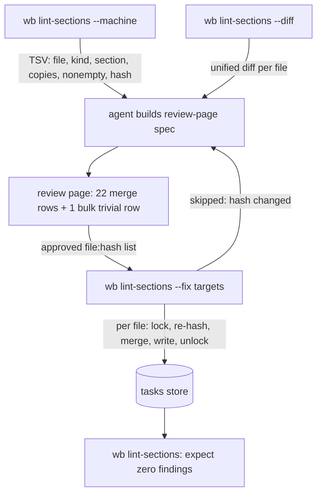

# Tasks store section-heading dedupe - Plan

## Goal Capsule

- **Objective:** every task file in `~/code/tasks` has at most one copy of each canonical section (`## Plan`, `## Handoffs`, `## Decisions`, `## Done`, `## Follow-ups`), with no content lost, and no `wb` writer left that manufactures new duplicates.
- **Authority:** the task file's `## Decisions` entry of 2026-09-23 (ratified by Jet) overrides the task's older `## Plan` text where they disagree — notably the heading rule (KTD2).
- **Stop conditions:** stop and surface if the dry run shows any file where the merge would drop a non-blank line, or if a canonical heading turns up inside a fenced block (the store had none on 2026-09-23). Never write to the store outside `wb lint-sections --fix`.
- **Execution profile:** U1–U4 are code in this repo, tested in the Docker sandbox. U5 is an operational run against the live store, gated on Jet's review-page approval.
- **Tail ownership:** PR against `development` for U1–U4; the store commit in U5 touches only the files `--fix` rewrote.

---

## Product Contract

### Summary

Fix `wb breakdown --apply` so its Plan rewrite stops leaving the next heading flush against prose, then add a `wb lint-sections` verb that detects duplicated or flush canonical headings and, on `--fix`, merges duplicates under the per-task lock. Run it once over the store through a review page.

### Problem Frame

On 2026-09-23, 68 of 325 task files carried a duplicated canonical heading: Follow-ups 63, Done 15, Handoffs 7, Decisions 1.

- Done/Follow-ups duplicates come from the `_wb_append_under_heading` fallback bug fixed in PR #68; every one sits above `## Decisions`.
- Handoffs duplicates come from a second, still-live bug. `_wb_breakdown_replace_section` drops the blank line between the rewritten Plan body and the next heading. `_wb_append_under_heading`'s blank-line guard (`isHeadingLine`) then treats the now-flush `## Handoffs` as prose, and the breakdown's auto-handoff splices a fresh `## Handoffs` before `## Decisions`. Evidence: tasks-store commits `9c4627c`, `7fb8230`, `fdbee6f`.
- The single Decisions duplicate (`be--monorepo--unify-single-session-read-auth.md`) is a 2026-09-21 hand edit that added a section above Handoffs and left the empty template copy.

Duplicates split readers: `/wb-resume` and the board read one copy and miss the other, and every later `wb append` lands in whichever copy the guard happens to see.

### Requirements

**Stop new duplicates**

- R1. After `wb breakdown --apply` rewrites a parent's `## Plan`, the following heading is preceded by a blank line.

**Detect**

- R2. `wb lint-sections` reports, per task file, each canonical section that appears more than once and each canonical heading flush against a non-blank line. It is read-only by default.
- R3. A `--machine` mode emits the same findings as stable TSV, including a content hash per file, for the review page and scripts.

**Merge**

- R4. `--fix` rewrites only files that have a finding; files whose unique sections are merely out of canonical order are untouched.
- R5. A merged section holds every non-blank line from every copy, in file order; blank-only copies are dropped.
- R6. A rewritten file places canonical sections in canonical order, keeps non-canonical sections (e.g. `## Sweep`) and the preamble (frontmatter, title, first-action line) intact, and puts exactly one blank line before every canonical heading.
- R7. `--fix` holds the per-task lock around each file and skips a file whose content changed since the reviewed dry run.
- R8. `--fix` is idempotent: a second run, and `wb lint-sections` afterwards, report nothing for the fixed files.

**Clean the store**

- R9. The 68 current files are fixed through a review page (each multi-content merge reviewed individually, trivial ones in one bulk row), and the store commit contains only the files `--fix` rewrote.

### Scope Boundaries

- `_wb_append_under_heading` keeps its blank-line guard unchanged; the looser heading rule lives only in the lint/merge reader.
- No reordering of files that have no duplicate or flush heading.
- No change to non-canonical sections' content or relative placement.

#### Deferred to Follow-Up Work

- Wiring `wb lint-sections` into `wb reconcile` or the `/weekly-review` drift gather.
- A pre-commit or `PreToolUse` check that blocks hand edits introducing a second canonical heading.

---

## Planning Contract

### Key Technical Decisions

- KTD1. **Fix the writer, not the reader.** `_wb_breakdown_replace_section` re-emits a blank line when it leaves the replaced section; this removes the flush-heading precondition at its source. Loosening `isHeadingLine` instead would reopen the mid-paragraph splice bug the guard exists for.
- KTD2. **Lint/merge heading rule: exact canonical name, outside fences, ignoring the preceding line.** The blank-line guard cannot see the 7 flush Handoffs originals, so a guard-based merger would leave them as orphan stray headings. A 2026-09-23 sweep found no canonical heading inside a fence, indented, or quoted anywhere in the store, and every flush canonical line was a real heading. Non-canonical `## ` lines still need the blank-line guard to count as section boundaries, so heading-shaped prose inside a section body is not split. "Exact" means whole-line string equality after trimming trailing whitespace, never a prefix or regex match: the store holds at least 11 near-miss headings such as `## Follow-ups (superseded — see ## Decisions)`, `## Plan — original framing, demoted 2026-08-04` and `## Done when`, which are deliberate non-canonical sections and must never be merged into a canonical one.
- KTD3. **A `wb` verb inside `wb.sh`, not a standalone script.** It reuses `wb_task_files`, `wb_task_lock_acquire_guarded`, and the `cmd_help` usage block; a standalone script would need to `source wb.sh`, the pattern behind the 2026-07-10 `CODE_DIR` deletion.
- KTD4. **Stale-content guard via content hash.** `--machine` prints a hash per file; `--fix` accepts `<file>:<hash>` targets and skips (with a message) any file whose current hash differs. The store has concurrent writers, and a file edited between review and apply must be re-reviewed, not merged blind.
- KTD5. **Merged section position = canonical slot.** A rewritten file emits the preamble, then canonical sections in canonical order; each non-canonical section stays attached after the section it originally followed. This matches the task's original merge rule and keeps the bug-inserted copies above `## Decisions` from surviving as the merged location.
- KTD6. **POSIX awk only, proven under mawk.** The live `wb` runs on mawk 1.3.4; the Docker test image installs gawk, which would hide gawk-only constructs (`ENDFILE`, `gensub`, arrays of arrays). The new test forces mawk via a PATH shim; `/usr/bin/mawk` ships with the ubuntu:24.04 base and is present in the `wb-tests` image (verified 2026-09-23), and the shim fails the test loudly rather than silently skipping if it ever goes missing. Bodies are never passed through `awk -v` (backslash mangling, per the existing `_wb_breakdown_replace_section` comment).
- KTD7. **Review page drives the apply; the verb stays page-agnostic.** The agent builds the review-page spec from `--machine` and `--diff` output, then calls `--fix` with the approved `<file>:<hash>` list. `wb.sh` does not learn the review-page JSON schema.

### High-Level Technical Design



Section model the parser builds per file (directional):

```text
preamble      = everything before the first section heading
section       = heading line + body lines up to the next section heading
heading line  = exact "## <canonical>" outside a fence (any preceding line)
              | "## <other>" outside a fence AND preceded by a blank line / line 1
merge         = group canonical sections by name, concat non-blank-trimmed bodies in file order
emit          = preamble, then canonical sections in order, each followed by its attached non-canonical sections
```

### Sequencing

U1 is independent and lands first so the live `wb` stops producing Handoffs duplicates. U2 → U3 → U4 build the verb. U5 runs only after U1–U4 are merged to `development` and the main checkout is fast-forwarded, so the live `wb` used on the store is the reviewed one.

---

## Implementation Units

### U1. Breakdown Plan rewrite keeps the heading gap

- **Goal:** `_wb_breakdown_replace_section` leaves exactly one blank line between the replaced body and the next `## ` heading.
- **Requirements:** R1
- **Dependencies:** none
- **Files:** `scripts/.config/scripts/tmux/wb.sh` (`_wb_breakdown_replace_section`), `scripts/.config/scripts/tmux/tests/wb-breakdown.test.sh`
- **Approach:** when the awk program leaves the replaced section on reaching the next heading, print a blank line before that heading. Keep the tmpfile/`getline` body path. Section-at-EOF behavior is unchanged.
- **Patterns to follow:** the blank-line hygiene in `_wb_append_under_heading`; fixture style in `tests/wb-append.test.sh` (real TEMPLATE-order file).
- **Test scenarios:**
  - Plan rewrite on a TEMPLATE-shaped parent → the line before `## Handoffs` is blank.
  - Rewrite followed by the breakdown's auto-handoff append → the file has exactly one `## Handoffs` and the entry lands under it.
  - Plan is the last section (no following heading) → output ends with the body, no extra heading or stray blank block.
  - Body containing backslashes (`\t`, `\K`) and a line that reads `## Decisions` mid-paragraph → body is preserved byte-for-byte.
  - Re-apply with identical body → file is byte-identical to the first apply (content-idempotent, as the caller relies on).
- **Verification:** `wb-breakdown.test.sh` passes in the Docker sandbox, including the new scenarios.

### U2. `wb lint-sections` detection and `--machine`

- **Goal:** a read-only verb that reports duplicate and flush canonical headings across the store or for named task refs.
- **Requirements:** R2, R3
- **Dependencies:** none (U1 can land in parallel)
- **Files:** `scripts/.config/scripts/tmux/wb.sh` (new `cmd_lint_sections` + parser helper, usage block, dispatch arm), `scripts/.config/scripts/tmux/tests/wb-lint-sections.test.sh` (new)
- **Approach:** iterate `wb_task_files` (or resolved task refs). One awk parser implements the KTD2 heading rule and fence tracking and emits one record per section; bash aggregates findings. Default output is a human table; `--machine` is TSV with a stable column order and a per-file content hash (`sha256sum`). Exit 0 whether or not findings exist; nonzero only on errors.
- **Execution note:** write the fixtures first from real shapes in the store: bug-signature Follow-ups above Decisions, flush Handoffs original, hand-edited Decisions above Handoffs, heading-shaped prose inside Plan.
- **Patterns to follow:** `cmd_reconcile`'s human vs `--machine` split and its "one stable TSV contract" comment; `wb_task_files` skip list.
- **Test scenarios:**
  - Clean TEMPLATE-shaped file → no findings.
  - Follow-ups copy above Decisions plus template copy below → one `dup` finding, copies=2, correct nonempty count.
  - `## Handoffs` flush against Plan prose plus a second `## Handoffs` → `dup` (copies=2) and `flush` findings.
  - `## Decisions` inside a fenced code block in Plan → not counted.
  - A flush `## Notes` line inside a section body → not a boundary and not a finding.
  - Near-miss headings from the live store (`## Follow-ups (superseded — see ## Decisions)`, `## Done when`, `## Plan — original framing, demoted 2026-08-04`) alongside a real `## Follow-ups` / `## Done` / `## Plan` → no `dup` finding, and the near-miss section is treated as non-canonical.
  - `--machine` output columns are stable and the hash changes when one byte of the file changes.
  - The whole suite runs with `awk` resolved to mawk through a PATH shim, and results match the default awk.
- **Verification:** run read-only against a copy of the live store and get 68 files and the Follow-ups 63 / Done 15 / Handoffs 7 / Decisions 1 split (or the current recount, if the store moved).

### U3. `--diff` and `--fix` merge writer

- **Goal:** compute the merged form of a file and either print it as a unified diff or write it under the lock.
- **Requirements:** R4, R5, R6, R7, R8
- **Dependencies:** U2
- **Files:** `scripts/.config/scripts/tmux/wb.sh` (merge helper, `--diff`/`--fix` in `cmd_lint_sections`), `scripts/.config/scripts/tmux/tests/wb-lint-sections.test.sh`
- **Approach:** the merge helper reuses U2's section records and applies the KTD5 layout, writing to a temp file. `--diff` prints `diff -u` of original vs merged per finding file. `--fix <file>:<hash>…` (or `--fix --all`) takes `wb_task_lock_acquire_guarded` per file, re-hashes, skips on a hash mismatch, writes via temp-then-`mv`, and releases. The EXIT-trap release idiom matches the other locked verbs. A post-merge self-check refuses the write if the multiset of non-blank lines differs from the original's (minus the removed duplicate heading lines).
- **Patterns to follow:** the lock idiom in `cmd_append` (`_wb_lock_trap_append_if_top_level wb_task_lock_release_all`, then acquire, write, release); the temp-file `mv` pattern used by every section writer.
- **Test scenarios:**
  - Follow-ups bug file where both copies have content → one `## Follow-ups` in the canonical slot, upper copy's lines then lower copy's.
  - Flush Handoffs file → one `## Handoffs` preceded by a blank line, holding the breakdown entry.
  - Decisions hand-edit file (content above Handoffs, empty copy below) → one `## Decisions` after Handoffs, content kept.
  - File with `## Sweep` after Follow-ups → Sweep kept, still after Follow-ups, content unchanged.
  - File with a duplicate `## Follow-ups` plus a `## Follow-ups (superseded — see ## Decisions)` section → only the two exact copies merge; the superseded section and its content are untouched.
  - Preamble (frontmatter, title, first-action paragraph) byte-identical after fix.
  - `--fix` with a stale hash → file untouched, message names it, exit status reports skips.
  - Lock held by a background holder → `--fix` waits/fails per the guarded-acquire contract and never writes unlocked.
  - Self-check trips when the merge would drop a line (inject by fixture) → no write.
  - Second `--fix` run and a follow-up lint → no findings, no writes.
  - File with no findings passed to `--fix` → untouched.
- **Verification:** all scenarios pass in Docker and under the mawk shim; `--diff` over a copy of the live store drops no non-blank lines.

### U4. Help and docs

- **Goal:** the verb is discoverable and documented.
- **Requirements:** R2, R3
- **Dependencies:** U2, U3
- **Files:** `scripts/.config/scripts/tmux/wb.sh` (usage comment block), `docs/wb-guide.md` (verb table under "Keeping the task store safe"), generated docs via `scripts/.config/scripts/docgen.sh`
- **Approach:** add `#   wb lint-sections …` usage lines so `cmd_help` picks them up; add a table row to the guide; rerun docgen so INDEX and HTML regenerate (never hand-edit the generated files).
- **Test scenarios:** `wb-help.test.sh` still passes and lists `lint-sections`.
- **Verification:** `wb help` shows the verb; docgen output diff includes only the new entry.

### U5. Store cleanup run

- **Goal:** apply the merge to the live store through Jet's review.
- **Requirements:** R9
- **Dependencies:** U1–U4 merged; main checkout fast-forwarded
- **Files:** `~/code/tasks/*.md` (the files `--fix` rewrites), review artifacts under `~/code/tasks/dossiers/dotfiles--fix-tasks-store-dedupe-headings/`
- **Approach:** run `--machine` and `--diff` against the working tree (not HEAD), build a review-page spec with one row per multi-content merge (diff as evidence, suggested verdict "merge") and one grouped row for the trivial files, and serve it with the `review-page` skill. Apply the approved `<file>:<hash>` list with `--fix`. Re-review any skipped (stale) files. Stage and commit only the rewritten files. Re-run lint and confirm zero findings.
- **Test expectation:** none — operational run; correctness proven by U2/U3 tests plus the post-run lint.
- **Verification:** `wb lint-sections` reports zero findings; `git -C ~/code/tasks show --stat HEAD` lists only rewritten files; other sessions' uncommitted changes are still uncommitted.

---

## Risks & Dependencies

| Risk | Mitigation |
|---|---|
| gawk-only awk passes Docker tests but breaks the live mawk `wb` | KTD6 PATH-shim mawk run in the new test file |
| A concurrent writer edits a file between review and apply | KTD4 hash guard; the lock covers the write itself |
| The merge silently drops content | Post-merge line-multiset self-check refuses the write; the review page shows every multi-content diff |
| Store commit sweeps up other sessions' uncommitted edits | Stage by explicit path from the `--fix` output only |
| Running tests on the host touches the real `~/code` | Tests run only in the read-only Docker sandbox, with per-test `HOME`/`CODE_DIR`/`TASKS_DIR` isolation |

---

## Verification Contract

| Gate | Command / check | Applies to |
|---|---|---|
| Unit tests | `docker build -t wb-tests -f scripts/.config/scripts/tmux/tests/Dockerfile .` then `docker run --rm -v "$(pwd)":/repo:ro -w /repo wb-tests bash scripts/.config/scripts/tmux/tests/<file>.test.sh` for `wb-breakdown`, `wb-lint-sections`, `wb-append`, `wb-help` | U1–U4 |
| mawk compatibility | `wb-lint-sections.test.sh` includes the PATH-shim mawk pass | U2, U3 |
| Full-suite regression | Full Docker suite compared against a clean-room `development` baseline (the suite has a known, drifting floor of env-dependent failures) | before PR |
| Docs | docgen rerun leaves only intended diffs | U4 |
| Store | post-run `wb lint-sections` shows zero findings; commit touches only rewritten files | U5 |

---

## Definition of Done

- U1–U4 merged to `development` with all listed tests passing in Docker, and no new failures against the clean-room baseline.
- `wb help` and `docs/wb-guide.md` list `wb lint-sections`; generated docs refreshed.
- The live store has zero lint findings, and the store commit contains only files `--fix` rewrote, approved on the review page.
- The task file's `## Done` records the PR and the store commit; deferred items are in `## Follow-ups`.
- No leftover experimental code, debug output, or scratch fixtures in the diff.

---

## Sources & Research

- `scripts/.config/scripts/tmux/wb.sh`: `_wb_breakdown_replace_section` (root cause), `_wb_append_under_heading` (`isHeadingLine` guard), `wb_task_files` (store iterator), `wb_task_lock_acquire_guarded` (lock), `cmd_reconcile` (`--machine` precedent), `cmd_help` (usage-block parsing).
- `scripts/.config/scripts/tmux/tests/wb-append.test.sh`, `wb-breakdown.test.sh`, `wb-lock-integration.test.sh` (fixture, isolation, and lock-holder patterns); `tests/Dockerfile` (sandbox, gawk installed).
- `claude/.claude/skills/review-page/SKILL.md` and its `references/spec-and-close-contract.md` (row schema: `id`, `evidence`, `suggested`, `group`).
- `~/code/tasks/TEMPLATE.md` (canonical order and blank-line layout).
- Tasks-store commits `9c4627c`, `7fb8230`, `fdbee6f` (duplicate introduction evidence).
